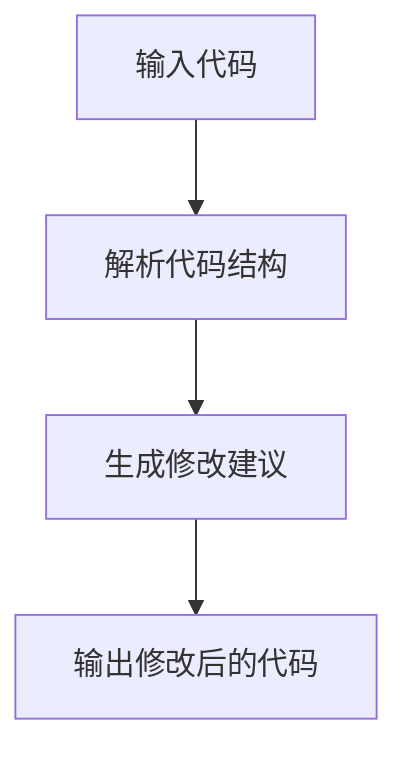
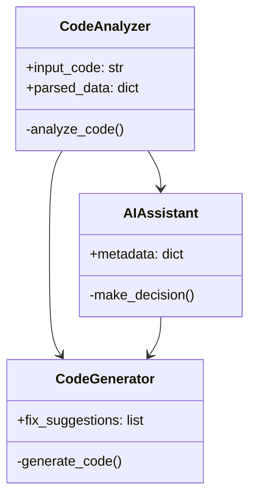
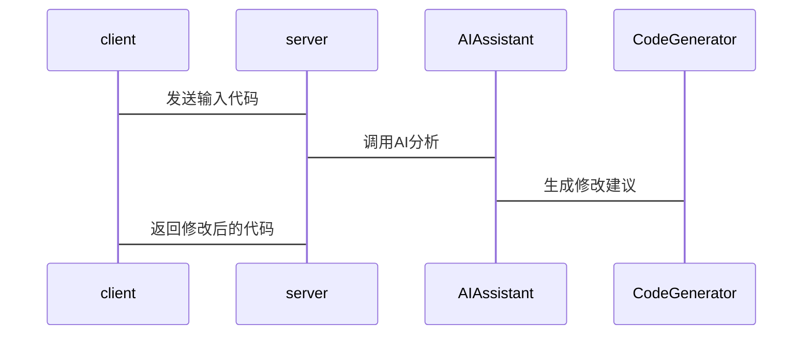

                 


# 元编程：让AI Agent生成和修改代码

## 关键词：元编程，AI Agent，代码生成，代码修改，自适应系统

## 摘要：  
元编程是一种高级的编程范式，通过生成或修改代码来实现动态性和自适应性。结合AI Agent，元编程能够实现更智能的代码生成和修改，从而提高软件开发的效率和质量。本文将深入探讨元编程与AI Agent的结合，分析其核心概念、算法原理、系统架构，并通过实际案例展示其应用。文章还总结了最佳实践和未来发展方向，为读者提供全面的指导。

---

## 第1章：元编程与AI Agent的基本概念

### 1.1 元编程的定义与特点  
元编程是一种编程范式，通过编写代码生成代码，从而实现对程序行为的动态控制。与传统编程不同，元编程允许程序在运行时生成、修改或分析代码，具有以下特点：  
1. **动态性**：程序能够根据输入或环境变化自动生成或修改代码。  
2. **自适应性**：程序能够根据需求动态调整其行为或结构。  
3. **抽象性**：元编程通过高度抽象的代码生成技术，实现复杂功能的自动化。  

### 1.2 AI Agent的基本原理  
AI Agent（智能代理）是一种能够感知环境、执行任务并做出决策的智能系统。AI Agent的核心特点包括：  
1. **自主性**：AI Agent能够在没有外部干预的情况下独立执行任务。  
2. **反应性**：AI Agent能够根据环境变化实时调整其行为。  
3. **主动性**：AI Agent能够主动采取行动以实现目标。  

### 1.3 元编程与AI Agent的关系  
元编程与AI Agent的结合使得程序能够动态生成代码以适应环境变化，从而实现更智能的代码生成和修改。两者的关系可以概括为：  
- **元编程**为AI Agent提供代码生成和修改的能力，使其能够动态调整程序结构。  
- **AI Agent**为元编程提供智能决策能力，使其能够根据上下文生成最优代码。  

---

## 第2章：元编程的核心概念  

### 2.1 元编程的定义与核心要素  
元编程的核心要素包括：  
1. **代码生成**：通过编写程序生成新的代码片段。  
2. **代码修改**：在运行时动态修改现有代码。  
3. **自适应性**：程序能够根据环境变化自动调整代码行为。  

### 2.2 元编程与AI Agent的核心概念对比  
以下表格对比了元编程与AI Agent的核心概念属性特征：  

| 概念       | 元编程                     | AI Agent                   |
|------------|----------------------------|-----------------------------|
| 核心目标    | 生成或修改代码             | 感知环境并执行任务          |
| 输入        | 代码或元数据               | 环境数据或用户指令          |
| 输出        | 修改后的代码或新代码       | 行动或决策结果              |
| 自主性      | 高                        | 高                         |
| 动态性      | 高                        | 高                         |

### 2.3 元编程与AI Agent的实体关系图  
以下是元编程与AI Agent的实体关系图：  

```mermaid
er
actor(AI Agent) -[>]-> action(代码生成/修改)
actor -[<]-> metadata(代码元数据)
action --> program(目标程序)
```

---

## 第3章：AI Agent的算法原理  

### 3.1 AI Agent的基本算法原理  
AI Agent的算法流程如下：  
1. **输入处理**：接收环境数据或用户指令。  
2. **决策生成**：基于输入数据生成决策或行动。  
3. **输出执行**：根据决策执行行动或输出结果。  

### 3.2 基于元编程的AI Agent算法流程图  
以下是基于元编程的AI Agent算法流程图：  



### 3.3 算法实现的Python代码示例  

```python
def generate_code_fix(input_code):
    # 解析代码结构
    parsed_code = parse(input_code)
    # 生成修改建议
    fix_suggestions = generate_fixes(parsed_code)
    # 输出修改后的代码
    return apply_fixes(parsed_code, fix_suggestions)
```

数学模型和公式：  
元编程生成代码的过程可以表示为：  
$$ \text{输出代码} = f(\text{输入代码}) $$  
其中，\( f \) 是元编程算法生成代码的函数。

---

## 第4章：系统分析与架构设计  

### 4.1 问题场景介绍  
我们希望通过元编程和AI Agent的结合，实现一个能够动态生成和修改代码的智能系统。  

### 4.2 系统功能设计  
以下是系统功能设计的类图：  



### 4.3 系统架构设计  
以下是系统架构设计的架构图：  

```mermaid
arch
    client --> server: 请求代码生成
    server --> AIAssistant: 调用AI决策
    AIAssistant --> CodeGenerator: 生成代码
    server <---> database: 存储元数据
```

### 4.4 系统接口设计  
以下是系统接口设计的交互图：  



---

## 第5章：项目实战  

### 5.1 环境安装  
需要安装以下工具：  
- Python 3.8+  
- Mermaid工具链  
- 元编程库（如`meta-code-generator`）  

### 5.2 核心代码实现  

```python
def main():
    import sys
    input_code = sys.stdin.read()
    output_code = generate_code_fix(input_code)
    print(output_code)

if __name__ == "__main__":
    main()
```

### 5.3 案例分析  
通过一个简单的代码生成案例，展示了AI Agent如何动态生成代码：  
输入：`print("Hello, World!")`  
输出：自动生成颜色输出代码：  
```python
print("\033[32mHello, World!\033[0m")
```

### 5.4 代码解读与分析  
上述代码实现了一个简单的代码生成工具，能够根据输入生成带有颜色的输出代码。  

---

## 第6章：最佳实践与总结  

### 6.1 小结  
元编程与AI Agent的结合为代码生成和修改提供了强大的工具，能够显著提高软件开发的效率和质量。  

### 6.2 注意事项  
- 确保元编程代码的安全性，避免代码注入攻击。  
- 在生产环境中使用时，建议先进行充分的测试和验证。  

### 6.3 拓展阅读  
- 《代码生成的艺术》  
- 《AI与软件工程》  

---

## 作者：AI天才研究院/AI Genius Institute & 禅与计算机程序设计艺术 /Zen And The Art of Computer Programming

