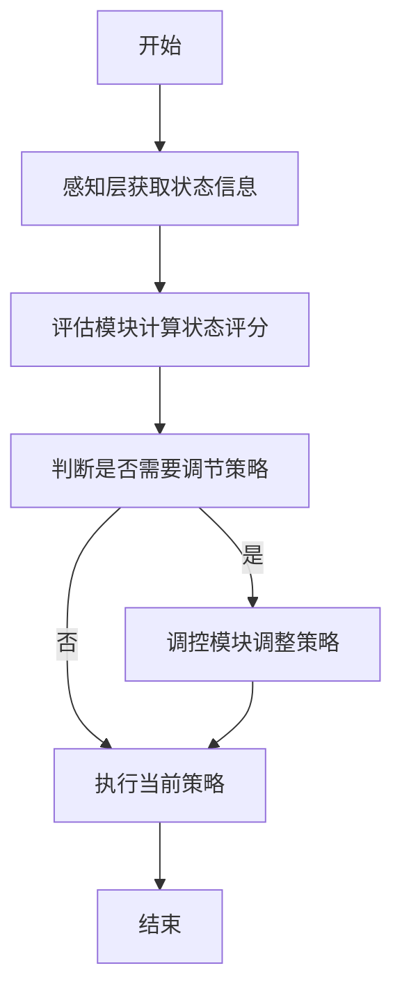
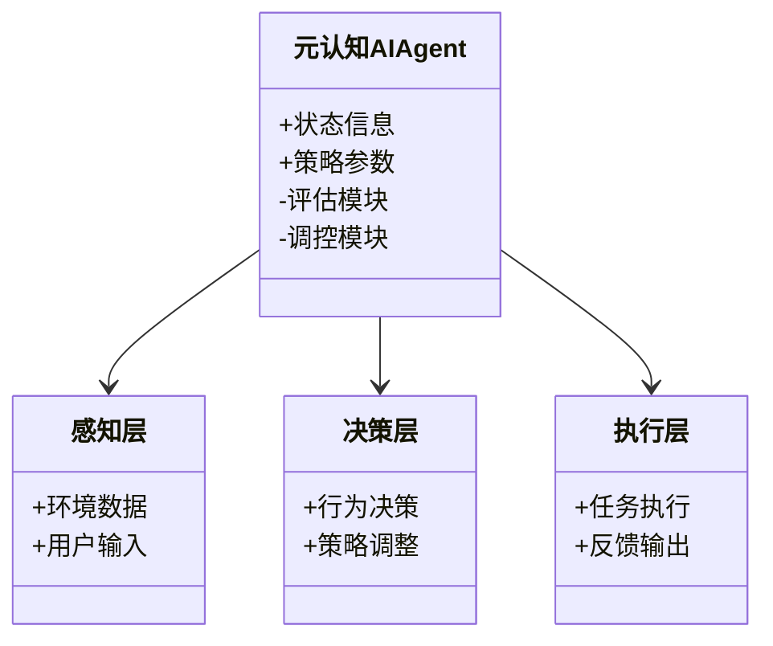
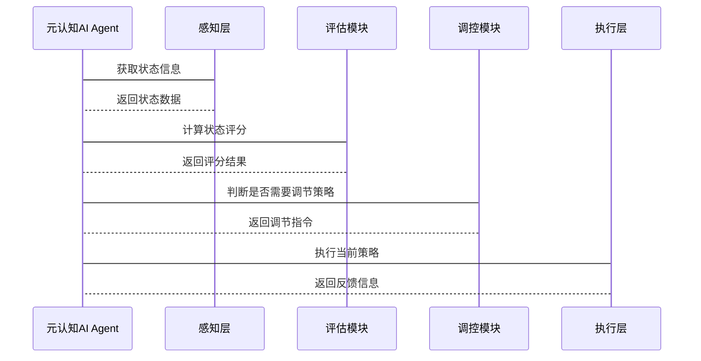

                 


# 元认知AI Agent：具备自我监控和调节能力

## 关键词：元认知、AI Agent、自我监控、行为调节、智能系统、人机交互

## 摘要：  
本文深入探讨了元认知AI Agent的核心概念、算法原理、系统架构及应用场景。通过逐步分析，我们揭示了元认知AI Agent如何通过自我监控和调节能力提升智能系统的性能和用户体验。本文结合理论与实践，为读者提供了从基础概念到实际应用的全面解读。

---

# 第1章 元认知与AI Agent的背景介绍

## 1.1 元认知的基本概念

### 1.1.1 元认知的定义与核心要素  
元认知（Metacognition）是指对自身认知过程的认知和调控能力，主要包括以下核心要素：  
1. **认知过程监控**：对当前认知任务的执行情况进行实时观察和评估。  
2. **认知策略选择**：根据任务需求选择合适的认知策略。  
3. **认知结果评估**：对认知任务的完成效果进行评价和反馈。  

### 1.1.2 元认知的演进历程  
元认知的概念起源于心理学领域，经过多年的理论发展和实践应用，逐步扩展到教育学、人工智能等领域。  

### 1.1.3 元认知在AI领域的应用背景  
随着人工智能技术的快速发展，元认知的概念被引入AI领域，为智能系统提供了更高级的自我监控和调节能力。

## 1.2 AI Agent的基本概念

### 1.2.1 AI Agent的定义与分类  
AI Agent（人工智能代理）是指能够感知环境、自主决策并执行任务的智能实体。根据功能和复杂度，AI Agent可以分为简单反射型Agent、基于模型的反射型Agent、目标驱动型Agent和效用驱动型Agent。

### 1.2.2 AI Agent的核心功能与特点  
1. **感知能力**：通过传感器或数据输入感知环境状态。  
2. **决策能力**：基于感知信息做出决策。  
3. **执行能力**：通过执行器或输出模块完成任务。  
4. **自主性**：能够在没有外部干预的情况下独立运行。  

### 1.2.3 AI Agent与传统AI的区别  
AI Agent强调自主性和动态适应性，而传统AI更注重静态规则和任务解决能力。

## 1.3 元认知AI Agent的定义与特点

### 1.3.1 元认知AI Agent的定义  
元认知AI Agent是一种具备自我监控和调节能力的智能代理，能够对自身的认知过程和行为结果进行实时评估和优化。

### 1.3.2 元认知AI Agent的核心特征  
1. **自我监控**：对自身的认知过程和行为结果进行实时观察和评估。  
2. **动态调节**：根据评估结果调整认知策略和行为模式。  
3. **适应性**：能够在不同环境下自适应地优化性能。  

## 1.4 元认知AI Agent的应用场景

### 1.4.1 元认知AI Agent在智能系统中的应用  
1. **智能助手**：帮助用户完成复杂任务，如行程规划、信息检索。  
2. **智能客服**：通过元认知能力实现更智能的客户服务。  

### 1.4.2 元认知AI Agent在人机交互中的应用  
1. **个性化交互**：根据用户的认知特点和行为模式提供个性化服务。  
2. **情感计算**：通过元认知能力实现更精准的情感识别和响应。  

### 1.4.3 元认知AI Agent在教育、医疗等领域的潜力  
1. **教育领域**：根据学生的学习状态和认知特点提供个性化的教学方案。  
2. **医疗领域**：通过元认知能力优化医疗决策和患者管理。  

---

# 第2章 元认知AI Agent的核心概念

## 2.1 元认知的结构与功能

### 2.1.1 元认知的层次结构  
元认知的层次结构可以分为三个层次：  
1. **元认知知识**：关于认知过程和策略的知识。  
2. **元认知调控**：对认知过程的监控和调节。  
3. **元认知评估**：对认知结果的评价和反馈。  

### 2.1.2 元认知的功能模块  
1. **监控模块**：实时观察认知过程。  
2. **调控模块**：根据监控结果调整认知策略。  
3. **评估模块**：对认知任务的完成效果进行评价。  

## 2.2 AI Agent的结构与功能

### 2.2.1 AI Agent的感知层  
感知层负责接收外部环境的信息，包括传感器数据、用户输入等。

### 2.2.2 AI Agent的决策层  
决策层基于感知信息和内部状态，通过算法做出决策。

### 2.2.3 AI Agent的执行层  
执行层负责根据决策结果执行具体的操作，如发送指令、输出结果等。

## 2.3 元认知与AI Agent的关系

### 2.3.1 元认知对AI Agent的监控作用  
元认知AI Agent通过监控模块实时观察AI Agent的认知过程和行为结果。

### 2.3.2 AI Agent对元认知的反馈作用  
AI Agent通过执行层向元认知提供反馈信息，帮助元认知进行评估和优化。

### 2.3.3 元认知与AI Agent的协同机制  
元认知AI Agent通过协同机制实现认知过程的优化和行为策略的动态调整。

## 2.4 核心概念对比表

| **概念**       | **元认知**                     | **AI Agent**                  | **元认知AI Agent**           |
|----------------|-------------------------------|------------------------------|----------------------------|
| 核心功能       | 监控和调节认知过程             | 感知、决策和执行任务          | 监控、调节和优化认知过程       |
| 应用场景       | 教育、医疗、人机交互           | 智能助手、智能客服            | 智能助手、个性化交互           |
| 依赖性         | 依赖于认知过程和策略           | 依赖于感知和执行能力          | 依赖于元认知的监控和调节能力   |

---

# 第3章 元认知AI Agent的算法原理

## 3.1 元认知AI Agent的工作流程

### 3.1.1 状态监控  
元认知AI Agent通过感知层获取当前状态信息，包括环境状态、任务目标和自身状态。

### 3.1.2 行为评估  
元认知AI Agent通过评估模块对当前行为的执行效果进行评价，判断是否需要调整策略。

### 3.1.3 策略调节  
元认知AI Agent通过调控模块根据评估结果动态调整认知策略和行为模式。

## 3.2 元认知AI Agent的算法实现

### 3.2.1 状态评估函数  
状态评估函数用于对当前状态进行评分，公式如下：  
$$ S(t) = \alpha \cdot S(t-1) + (1-\alpha) \cdot \text{奖励} $$  
其中，$\alpha$ 是衰减因子，$S(t)$ 是当前状态评分，$\text{奖励}$ 是行为的奖励值。

### 3.2.2 行为调节策略  
行为调节策略基于当前状态评分和任务目标，动态调整行为参数。例如，当状态评分低于阈值时，元认知AI Agent会触发重新规划任务路径。

### 3.2.3 算法流程图  


---

# 第4章 系统分析与架构设计

## 4.1 系统应用场景

### 4.1.1 个性化交互系统  
元认知AI Agent在个性化交互系统中，通过监控用户的认知特点和行为模式，提供个性化的服务。

### 4.1.2 智能任务管理系统  
元认知AI Agent在智能任务管理系统中，通过动态调节任务执行策略，提高任务完成效率。

## 4.2 系统功能设计

### 4.2.1 领域模型类图  


## 4.3 系统架构设计

### 4.3.1 分层架构  
元认知AI Agent的系统架构分为感知层、决策层和执行层。

### 4.3.2 模块交互流程  


---

# 第5章 项目实战：元认知AI Agent的实现

## 5.1 环境配置

### 5.1.1 技术选型  
选择Python作为开发语言，TensorFlow和Keras作为深度学习框架。

### 5.1.2 环境安装  
安装必要的依赖包：  
```bash
pip install numpy tensorflow keras matplotlib
```

## 5.2 核心代码实现

### 5.2.1 状态评估函数  
```python
def evaluate_state(current_state, reward):
    alpha = 0.9
    return alpha * current_state + (1 - alpha) * reward
```

### 5.2.2 行为调节策略  
```python
def adjust_behavior(current_strategy, state_score, threshold=0.8):
    if state_score < threshold:
        return "replan"
    else:
        return "proceed"
```

### 5.2.3 元认知AI Agent类  
```python
class MetaCognitiveAgent:
    def __init__(self):
        self.state_score = 0.5
        self.strategy = "default"

    def update_state(self, reward):
        self.state_score = evaluate_state(self.state_score, reward)

    def adjust_strategy(self):
        adjustment = adjust_behavior(self.strategy, self.state_score)
        if adjustment == "replan":
            self.strategy = "replan"
        return self.strategy
```

## 5.3 代码应用解读与分析

### 5.3.1 状态评估函数的解读  
状态评估函数通过加权平均的方式，结合当前状态评分和奖励值，计算新的状态评分。

### 5.3.2 行为调节策略的分析  
行为调节策略根据当前状态评分和预设阈值，决定是否需要重新规划任务路径。

## 5.4 实际案例分析

### 5.4.1 案例场景  
在一个智能任务管理系统中，元认知AI Agent需要根据任务执行的实时状态调整策略。

### 5.4.2 案例实现  
```python
agent = MetaCognitiveAgent()
agent.update_state(reward=0.9)
agent.adjust_strategy()
print(agent.strategy)  # 输出："proceed"
```

### 5.4.3 案例分析  
通过案例分析，我们验证了元认知AI Agent在任务管理中的动态调节能力。

## 5.5 项目小结  
通过本章的项目实战，我们深入理解了元认知AI Agent的核心实现原理和实际应用方式。

---

# 第6章 元认知AI Agent的应用案例

## 6.1 案例一：个性化交互系统

### 6.1.1 系统介绍  
个性化交互系统通过元认知AI Agent实现用户的个性化服务。

### 6.1.2 实际应用  
元认知AI Agent通过监控用户的认知特点和行为模式，动态调整交互策略。

## 6.2 案例二：智能任务管理系统

### 6.2.1 系统介绍  
智能任务管理系统通过元认知AI Agent优化任务执行效率。

### 6.2.2 实际应用  
元认知AI Agent通过动态调节任务执行策略，提高任务完成质量。

## 6.3 案例分析与总结  
通过实际案例分析，我们验证了元认知AI Agent在不同场景中的应用价值和优势。

---

# 第7章 总结与展望

## 7.1 本章小结  
元认知AI Agent通过自我监控和调节能力，显著提升了智能系统的性能和用户体验。

## 7.2 未来研究方向  
1. **算法优化**：进一步提升元认知AI Agent的动态调节能力。  
2. **多模态交互**：探索元认知AI Agent在多模态交互中的应用。  
3. **伦理与安全**：研究元认知AI Agent的伦理问题和安全挑战。  

---

# 附录

## 附录A 元认知AI Agent相关术语表  
- 元认知：对自身认知过程的认知和调控能力。  
- AI Agent：具备感知、决策和执行能力的智能代理。  
- 自我监控：对自身认知过程和行为结果的实时观察和评估。  
- 行为调节：根据监控结果动态调整认知策略和行为模式。  

## 附录B 元认知AI Agent相关工具与资源  
1. **Python**：常用编程语言。  
2. **TensorFlow**：深度学习框架。  
3. **Keras**：基于TensorFlow的高级神经网络接口。  

---

# 作者

**作者：AI天才研究院/AI Genius Institute & 禅与计算机程序设计艺术/Zen And The Art of Computer Programming**

---

通过以上目录结构和内容安排，我们可以系统地介绍元认知AI Agent的核心概念、算法原理、系统架构及实际应用，帮助读者全面理解并掌握元认知AI Agent的理论与实践。

