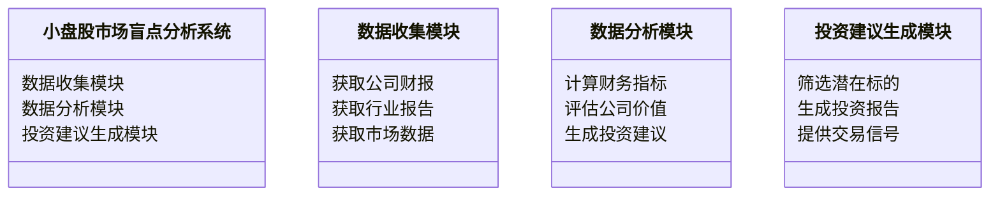
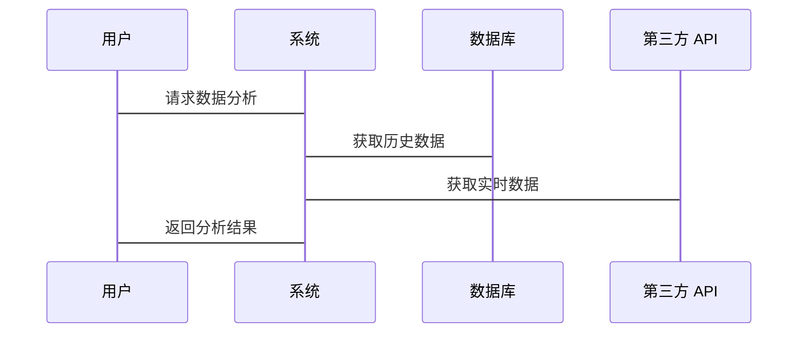

                 


# 克里斯托弗·布朗尼的小盘价值投资：发掘市场盲点

---

## 关键词：
- 小盘价值投资
- 市场盲点
- 财务指标分析
- 投资策略
- 系统分析
- 价值陷阱

---

## 摘要：
本文深入探讨了小盘价值投资的核心理念，结合市场盲点的发现与分析，为投资者提供了一套系统化的投资策略。通过分析小盘股的财务指标、行业地位及竞争优势，本文揭示了如何在市场中发现被低估的投资机会，并提供了实际案例和最佳实践。同时，本文还强调了风险管理与心理控制的重要性，帮助投资者在小盘股投资中规避常见风险，实现长期稳健收益。

---

## 第1章: 小盘价值投资基础

### 1.1 价值投资与小盘股概述

#### 1.1.1 价值投资的定义与历史发展
价值投资是一种以基本面分析为基础的投资策略，强调以低于内在价值的价格买入优质资产。其核心在于寻找市场中的低估机会，而非跟随市场情绪。小盘股作为价值投资的重要组成部分，因其市值较小、流动性较低，往往容易成为市场忽视的对象，从而隐藏着巨大的投资机会。

#### 1.1.2 小盘股的定义与特点
- **定义**：小盘股通常指市值在50亿元以下的公司股票，具有较高的成长潜力。
- **特点**：
  - 市场关注度低，信息不对称机会大。
  - 周期性波动较大，但潜在回报高。
  - 受宏观经济影响敏感，但行业集中度低。

#### 1.1.3 小盘股投资的潜在机会与风险
- **机会**：小盘股中可能存在被市场忽视的优质企业，具有较高的增值潜力。
- **风险**：流动性风险、业绩波动大、管理不确定性较高。

### 1.2 市场盲点的概念与重要性

#### 1.2.1 市场盲点的定义
市场盲点指的是市场中未被广泛认知或忽视的投资机会，通常存在于小盘股中。这些机会往往因为市场规模小、关注度低或信息不透明而被投资者忽视。

#### 1.2.2 小盘股中市场盲点的特征
- 隐性优势：公司具有独特的竞争优势，但在市场上未被充分挖掘。
- 估值偏差：市场对公司价值的评估存在偏差，导致股价低于内在价值。
- 行业冷门：公司所在行业被视为冷门，但实际上具有较高的增长潜力。

#### 1.2.3 发掘市场盲点的意义
- 发掘市场盲点能够帮助投资者获得超额收益。
- 通过深入分析，降低投资风险，提高投资成功的概率。

---

## 第2章: 小盘股的价值评估方法

### 2.1 基本面分析

#### 2.1.1 公司财务状况分析
- **财务健康性**：分析公司的资产负债表，确保公司财务稳健，无重大负债风险。
- **盈利能力**：关注净利润率、毛利率等指标，评估公司的盈利能力。
- **现金流**：健康的现金流是公司持续发展的基础，需重点关注经营活动现金流。

#### 2.1.2 行业地位与竞争优势
- **行业集中度**：分析行业内的竞争格局，判断公司在行业中的地位。
- **竞争优势**：评估公司是否具有独特的竞争优势，如技术壁垒、成本优势等。

#### 2.1.3 管理层能力与公司治理
- **管理层素质**：关注管理层的背景、经验和决策能力。
- **公司治理**：评估公司治理结构是否合理，是否存在内部控制风险。

### 2.2 财务指标分析

#### 2.2.1 常用财务指标
- **市盈率（P/E）**：股价与每股收益的比率，衡量股价是否被高估或低估。
- **市净率（P/B）**：股价与每股净资产的比率，适用于评估资产密集型行业。
- **ROE（净资产收益率）**：衡量公司盈利能力的重要指标。

#### 2.2.2 财务健康性评估
- **流动比率**：评估公司短期偿债能力。
- **速动比率**：进一步评估公司短期流动性。
- **资产负债率**：衡量公司财务杠杆风险。

#### 2.2.3 盈利能力分析
- **净利润率**：衡量公司每单位收入的净利润。
- **毛利率**：评估公司产品盈利能力。
- **净利率趋势**：分析公司盈利能力的长期趋势。

### 2.3 行业分析与投资机会

#### 2.3.1 行业周期分析
- **行业生命周期**：分析行业所处的生命周期阶段，判断行业增长潜力。
- **行业波动性**：评估行业受宏观经济波动的影响程度。

#### 2.3.2 行业集中度与竞争格局
- **CR4（前四大企业市场份额）**：衡量行业集中度。
- **竞争格局**：分析行业内主要竞争对手的优势与劣势。

#### 2.3.3 新兴行业与小盘股机会
- **新兴行业**：关注新兴行业中的小盘股，寻找高增长潜力。
- **行业趋势**：分析行业未来发展趋势，判断投资机会。

---

## 第3章: 小盘股投资策略

### 3.1 长期投资与价值发现

#### 3.1.1 长期投资的定义与优势
- **长期投资**：以持有数年为目标，关注公司长期价值。
- **优势**：避免短期市场波动干扰，捕捉公司长期增值潜力。

#### 3.1.2 小盘股的长期增值潜力
- **成长性**：小盘股具有较高的成长潜力，尤其在新兴行业。
- **估值修复**：小盘股的估值可能随着公司成长逐步修复。

#### 3.1.3 如何选择长期持有的小盘股
- **选择标准**：低估值、高成长性、竞争优势明显。
- **组合构建**：分散投资，降低风险。

### 3.2 价值陷阱的识别与避免

#### 3.2.1 价值陷阱的定义与特征
- **定义**：看似低估的股票，实际存在重大问题，无法实现价值回升。
- **特征**：
  - 业绩持续下滑。
  - 财务状况恶化。
  - 行业竞争激烈，难以突破。

#### 3.2.2 如何识别潜在的价值陷阱
- **财务分析**：关注财务指标的趋势，判断公司是否健康。
- **行业分析**：分析行业前景，判断公司是否具备竞争优势。
- **管理层分析**：关注管理层的稳定性与决策能力。

#### 3.2.3 避免价值陷阱的策略
- **深入研究**：对潜在投资标的进行深度研究，避免仅依赖表面数据。
- **多元化投资**：分散投资，降低单一标的的风险。
- **长期跟踪**：持续关注公司动态，及时调整投资策略。

### 3.3 分散投资与风险控制

#### 3.3.1 分散投资的原理与实践
- **原理**：通过分散投资降低非系统性风险。
- **实践**：将资金分配到多个行业、多个公司，降低风险。

#### 3.3.2 小盘股投资中的风险控制
- **仓位控制**：避免过度集中于小盘股，控制整体风险。
- **止损机制**：设定止损点，避免亏损扩大。

#### 3.3.3 如何构建稳健的投资组合
- **资产配置**：结合小盘股与大盘股，平衡风险与收益。
- **行业分散**：投资于不同行业的公司，降低行业风险。

---

## 第4章: 小盘股市场盲点分析

### 4.1 深度研究与独特见解

#### 4.1.1 如何进行深度行业研究
- **数据收集**：通过多种渠道收集行业数据，包括财务报表、行业报告等。
- **案例分析**：研究成功与失败的案例，总结经验教训。

#### 4.1.2 独特市场视角的培养
- **逆向思维**：寻找市场忽视的机会。
- **行业冷门**：关注被市场遗忘的行业，寻找潜在机会。

#### 4.1.3 从数据中发现市场盲点
- **数据分析**：通过数据分析工具，发现市场中被忽视的公司。
- **趋势分析**：分析行业趋势，寻找潜在的增长点。

### 4.2 利用市场非理性与情绪

#### 4.2.1 市场情绪的周期性波动
- **市场情绪周期**：从乐观到悲观，再到乐观的循环。
- **情绪驱动的决策**：投资者往往因情绪波动而做出错误决策。

#### 4.2.2 市场恐慌中的机会
- **恐慌性抛售**：市场恐慌时，优质小盘股可能被低估。
- **恐慌性抄底**：利用市场恐慌，寻找被低估的投资机会。

#### 4.2.3 如何利用市场情绪
- **逆向投资**：在市场恐慌时买入，在市场狂热时卖出。
- **心理控制**：保持冷静，避免被市场情绪左右。

---

## 第5章: 小盘股投资的系统分析与架构设计

### 5.1 系统分析

#### 5.1.1 问题场景介绍
- **问题背景**：小盘股投资中存在信息不对称、数据分散等问题。
- **目标**：构建一套系统化的分析框架，帮助投资者高效发现市场盲点。

#### 5.1.2 项目介绍
- **项目目标**：开发一个基于小盘股的市场盲点分析系统。
- **项目范围**：涵盖数据收集、分析、投资建议生成等功能。

### 5.2 系统功能设计

#### 5.2.1 领域模型（Mermaid 类图）


#### 5.2.2 系统架构设计（Mermaid 架构图）
```mermaid
client
    ↔ HTTP 请求
    ↔ 服务器
    ↔ 数据库
    ↔ 第三方 API

服务器
    ↔ 数据处理模块
    ↔ 算法模块
    ↔ 报告生成模块
```

### 5.3 系统接口设计

#### 5.3.1 数据接口
- **数据来源**：财务数据、行业报告、市场数据等。
- **接口设计**：通过API接口获取数据，确保数据实时性。

#### 5.3.2 用户界面
- **功能模块**：数据可视化、分析结果展示、投资建议生成。
- **交互设计**：用户友好的界面设计，方便操作。

### 5.4 系统交互设计（Mermaid 序列图）


---

## 第6章: 小盘股投资的实战与案例分析

### 6.1 环境安装

#### 6.1.1 数据分析工具
- **工具选择**：Python、Pandas、NumPy等。
- **安装步骤**：
  ```bash
  pip install pandas numpy matplotlib
  ```

### 6.2 核心实现源代码

#### 6.2.1 数据获取与清洗
```python
import pandas as pd
import numpy as np

# 获取数据
data = pd.read_csv('data.csv')

# 数据清洗
data.dropna(inplace=True)
data = data[~data['收入'].isnull()]
```

#### 6.2.2 财务指标计算
```python
# 计算市盈率
data['市盈率'] = data['股价'] / data['每股收益']

# 计算市净率
data['市净率'] = data['股价'] / data['每股净资产']
```

#### 6.2.3 投资建议生成
```python
# 筛选低估值股票
低估股票 = data[data['市盈率'] < data['市盈率'].mean()]

# 生成投资建议
建议报告 = 低估股票.sort_values('市盈率')
```

### 6.3 实际案例分析

#### 6.3.1 成功案例
- **公司名称**：XYZ公司
- **分析过程**：
  - 市盈率低于行业平均水平。
  - 公司财务状况健康，净利润持续增长。
  - 行业前景良好，公司竞争优势明显。

#### 6.3.2 失败案例
- **公司名称**：ABC公司
- **分析过程**：
  - 市盈率看似低于行业平均水平。
  - 但公司财务状况恶化，净利润持续下滑。
  - 行业竞争激烈，公司难以突破。

### 6.4 项目小结

#### 6.4.1 项目总结
- **成功经验**：通过系统化的分析框架，成功发现市场盲点。
- **失败教训**：提醒投资者在实际操作中需更加谨慎，避免价值陷阱。

#### 6.4.2 项目意义
- **实践价值**：为投资者提供了一套可操作的投资方法。
- **理论价值**：丰富了小盘股投资的理论体系。

---

## 第7章: 小盘股投资的最佳实践与注意事项

### 7.1 最佳实践 tips

#### 7.1.1 持续学习与研究
- **行业动态**：持续关注行业动态，保持对市场的敏感性。
- **知识更新**：不断更新自己的知识储备，适应市场变化。

#### 7.1.2 心理控制与纪律性
- **情绪管理**：避免因市场波动而做出冲动决策。
- **纪律性**：坚持投资策略，避免随意调整。

### 7.2 小结

#### 7.2.1 总结全文
- 小盘价值投资的核心在于发现市场盲点，通过系统化的分析框架，投资者可以在小盘股中发现潜在的投资机会。
- 本文通过理论分析与实际案例，为投资者提供了一套可操作的投资方法。

#### 7.2.2 展望未来
- 随着市场的不断发展，小盘股投资将面临更多挑战与机遇。
- 未来，投资者需要更加注重风险控制与策略优化，以应对复杂的市场环境。

### 7.3 注意事项

#### 7.3.1 风险提示
- **市场风险**：小盘股波动较大，需注意市场风险。
- **流动性风险**：部分小盘股流动性较差，可能影响交易。

#### 7.3.2 投资者提示
- **分散投资**：避免过度集中，降低风险。
- **长期投资**：耐心持有优质标的，避免短期波动影响判断。

---

## 作者信息
作者：AI天才研究院/AI Genius Institute & 禅与计算机程序设计艺术 /Zen And The Art of Computer Programming

---

以上是完整的文章结构，涵盖了从理论到实践的各个方面，结合了技术与投资的深度分析，为读者提供了全面的小盘价值投资方法。

