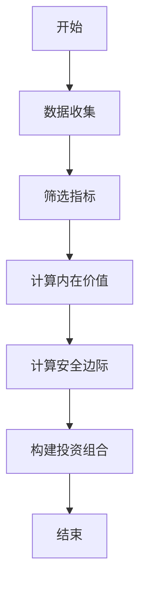
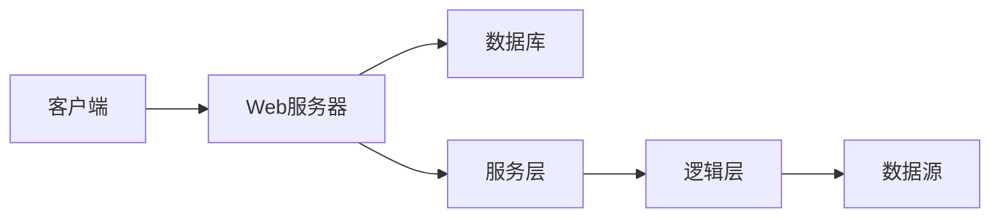
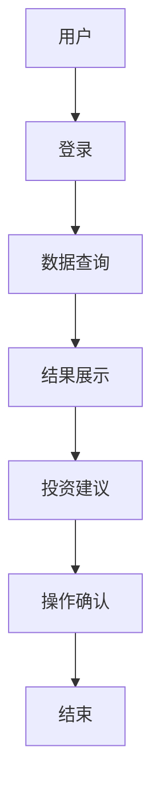

                 


# 全球价值投资机会识别

## 关键词
- 全球价值投资
- 机会识别
- 股票筛选
- 市场分析
- 安全边际

## 摘要
在全球金融市场不断变化的背景下，价值投资作为一种经典的长期投资策略，仍然具有重要的现实意义。本文系统地分析了全球价值投资的机会识别过程，从定义和背景出发，深入探讨了价值投资的核心概念、算法原理、系统架构设计以及实际项目案例。通过详细阐述价值投资的基本原理、量化分析方法和实际应用，本文为投资者提供了理论支持和实践指导。最终，本文总结了价值投资的关键成功要素，强调了风险控制的重要性，并展望了未来的发展方向。

## 第一部分: 全球价值投资机会识别的背景与核心概念

### 第1章: 全球价值投资机会识别的定义与背景

#### 1.1 价值投资的定义与核心要素
##### 1.1.1 价值投资的定义
价值投资是一种以低于内在价值的价格购买优质资产的投资策略。其核心在于识别市场价格与内在价值之间的差异，通过长期持有优质资产实现收益。

##### 1.1.2 价值投资的核心要素
1. **内在价值**：资产在合理市场条件下的公平价格，通常通过DCF模型等方法进行估算。
2. **安全边际**：购买价格与内在价值之间的折扣，用以降低投资风险。
3. **长期视角**：关注企业的长期盈利能力，而非短期市场波动。

##### 1.1.3 价值投资的边界与外延
价值投资不仅适用于股票市场，还可扩展至房地产、私募股权等领域。其外延包括事件驱动型投资和特殊状况投资。

#### 1.2 全球价值投资的机会与挑战
##### 1.2.1 全球经济与市场的现状
当前全球经济面临不确定性，通货膨胀、地缘政治冲突等因素对市场产生深远影响。

##### 1.2.2 价值投资在全球市场中的潜力
新兴市场中存在大量低估的优质企业，为价值投资者提供了丰富的投资机会。

##### 1.2.3 全球价值投资的主要挑战
市场波动性大、信息不对称、文化差异等因素增加了投资难度。

### 第2章: 价值投资与成长投资的对比分析

#### 2.1 价值投资的核心特征
##### 2.1.1 低估值
价值投资的核心在于寻找市场价格低于内在价值的资产。

##### 2.1.2 高质量
关注具有强大竞争优势、稳定财务状况和良好管理的企业。

##### 2.1.3 稳定的现金流
注重企业稳定的现金流来源，以支撑其内在价值和持续发展。

#### 2.2 成长投资的核心特征
##### 2.2.1 高增长
寻找收入和利润快速增长的企业，尤其在新兴行业和创新型企业中。

##### 2.2.2 高风险
成长型企业通常估值较高，市场波动大，投资风险较高。

##### 2.2.3 高市盈率
成长股通常具有较高的市盈率，反映了市场对其未来增长的预期。

#### 2.3 价值投资与成长投资的对比分析
##### 2.3.1 核心特征对比
| 特征       | 价值投资                  | 成长投资                  |
|------------|---------------------------|---------------------------|
| 估值       | 低于内在价值              | 高于内在价值              |
| 质量       | 高质量企业                | 高增长潜力企业            |
| 风险       | 较低风险                  | 较高风险                  |

##### 2.3.2 适用场景对比
价值投资适用于市场波动较大、低估资产较多的环境；成长投资适用于高增长行业和新兴市场。

##### 2.3.3 投资风险对比
价值投资注重安全边际，风险相对可控；成长投资风险较高，但潜在回报也更大。

## 第二部分: 价值投资机会识别的核心概念与联系

### 第3章: 价值投资的核心概念与原理

#### 3.1 价值投资的核心概念
##### 3.1.1 内在价值
内在价值是企业未来现金流的现值，通常通过Discounted Cash Flow (DCF)模型计算。

##### 3.1.2 安全边际
安全边际=内在价值-市场价格，确保投资的安全性和可靠性。

##### 3.1.3 股东价值
股东价值是指企业为股东创造的经济利益，包括净利润、现金流等。

#### 3.2 价值投资的原理
##### 3.2.1 市场先生理论
市场先生代表市场情绪，投资者应利用市场波动，以合理价格买入低估资产。

##### 3.2.2 货币时间价值
货币的时间价值强调复利效应，长期投资能够带来财富的稳步增长。

##### 3.2.3 资本资产定价模型（CAPM）
CAPM用于估算资产的预期回报率，帮助投资者进行投资决策。

## 第三部分: 价值投资机会识别的算法原理

### 第4章: 价值投资机会识别的算法原理

#### 4.1 算法原理概述
价值投资算法基于基本面分析，通过量化指标筛选低估资产。

#### 4.2 算法流程
1. 数据收集：获取目标市场的历史数据，包括股价、财务指标等。
2. 筛选指标：使用PE、PB、PS等指标筛选低估企业。
3. 计算内在价值：运用DCF模型等方法估算企业内在价值。
4. 安全边际分析：计算市场价格与内在价值的差异，确定安全边际。
5. 组合构建：根据分散化原则，构建投资组合，降低风险。

#### 4.3 算法实现
##### 4.3.1 算法代码
```python
def calculate_intrinsic_value(revenue, growth_rate, discount_rate):
    # 简单DCF模型
    terminal_value = revenue * (1 + growth_rate) / (discount_rate - growth_rate)
    present_value = terminal_value / (1 + discount_rate)
    return present_value
```

##### 4.3.2 算法流程图


## 第四部分: 价值投资机会识别的系统分析与架构设计

### 第5章: 价值投资机会识别系统分析

#### 5.1 问题场景介绍
投资者需要一个系统化的工具，辅助识别全球范围内的价值投资机会。

#### 5.2 系统功能设计
##### 5.2.1 数据采集模块
- 从多个数据源获取实时市场数据。
- 支持多种数据格式和接口。

##### 5.2.2 指标计算模块
- 计算PE、PB、ROE等基本面指标。
- 提供可视化报告和图表。

##### 5.2.3 投资组合管理模块
- 根据筛选结果构建投资组合。
- 支持风险评估和调整。

##### 5.2.4 报告生成模块
- 自动生成投资报告，包括分析结果和建议。
- 提供历史回测和绩效评估。

#### 5.3 系统架构设计
##### 5.3.1 架构图


##### 5.3.2 接口设计
- RESTful API接口：提供数据获取和计算功能。
- 数据接口：支持多种数据源连接。

#### 5.4 系统交互设计
##### 5.4.1 交互流程图


## 第五部分: 价值投资机会识别的项目实战

### 第6章: 价值投资机会识别项目实战

#### 6.1 环境安装
- 安装Python和相关库（如Pandas、NumPy）。
- 配置数据源和API接口。

#### 6.2 系统核心实现
##### 6.2.1 数据采集
```python
import pandas as pd
from pandas_datareader import data

def get_stock_data(ticker, start, end):
    df = data.DataReader(ticker, 'yahoo', start, end)
    return df
```

##### 6.2.2 指标计算
```python
def calculate_pe_ttr(data, periods=250):
    pe_ttr = data['Close'].rolling(periods).mean() / data['Earnings'].rolling(periods).mean()
    return pe_ttr
```

#### 6.3 案例分析
##### 6.3.1 案例选择
选择一个具有代表性的行业，如科技行业，进行深入分析。

##### 6.3.2 分析过程
- 收集相关企业数据。
- 计算各项估值指标。
- 识别具有安全边际的企业。

#### 6.4 项目总结
通过实际案例，验证算法的有效性和系统的实用性，总结经验教训。

## 第六部分: 价值投资机会识别的最佳实践与小结

### 第7章: 最佳实践与小结

#### 7.1 投资策略的注意事项
- 定期复盘和调整投资组合。
- 保持对市场变化的敏感性。
- 注意分散投资，降低风险。

#### 7.2 小结
价值投资是一种长期有效的策略，但需要结合实际市场情况灵活运用。

#### 7.3 未来展望
随着技术的进步，价值投资将更加依赖量化分析和系统工具。

## 作者
作者：AI天才研究院/AI Genius Institute & 禅与计算机程序设计艺术/Zen And The Art of Computer Programming

---

以上是《克里斯托弗·布朗的全球价值投资机会识别》的详细目录和文章内容，涵盖了从基础概念到系统设计再到项目实战的全过程。文章以清晰的逻辑和详细的分析，为读者提供了关于价值投资机会识别的全面指导。

