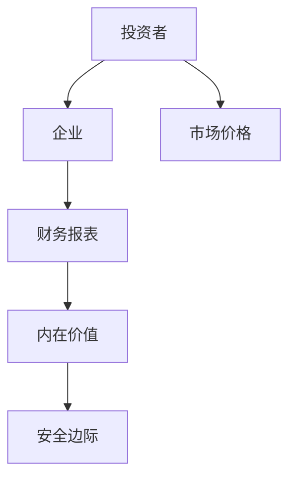
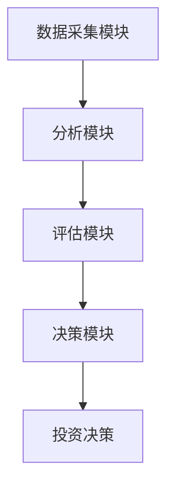

                 


# 克里斯托弗·布朗的深度价值投资方法

> 关键词：深度价值投资，克里斯托弗·布朗，内在价值，安全边际，投资策略，现金流折现模型

> 摘要：深度价值投资是一种以基本面分析为核心的长期投资策略，旨在通过寻找市场低估的股票实现超额收益。本文系统地介绍了克里斯托弗·布朗的深度价值投资方法，包括其核心概念、算法原理、系统架构设计以及项目实战案例。通过本文的学习，读者将能够掌握深度价值投资的核心要义，并能够在实际投资中应用这些方法。

---

## 第一部分: 深度价值投资的背景与核心概念

### 第1章: 深度价值投资的起源与核心理念

#### 1.1 价值投资的定义与历史发展
价值投资是一种以基本面分析为核心的长期投资策略，起源于20世纪初。它强调以低于内在价值的价格买入优质资产，从而在长期实现资本增值。价值投资的鼻祖是本杰明·格雷厄姆，他提出了“安全边际”概念，并通过计算内在价值来寻找低估的股票。

克里斯托弗·布朗作为现代价值投资的重要代表人物之一，继承并发展了格雷厄姆的理念，提出了深度价值投资方法。这种方法强调对企业的内在价值进行深入分析，并结合市场环境和企业基本面，寻找具有持续竞争优势的企业进行投资。

#### 1.2 克里斯托弗·布朗的贡献与投资哲学
克里斯托弗·布朗的投资哲学可以总结为以下几点：
1. **长期导向**：投资的目的是通过长期持有优质资产实现资本增值，而非短期价格波动。
2. **基本面驱动**：内在价值是投资决策的核心，必须通过对企业财务状况、盈利能力、竞争优势等基本面因素的深入分析来确定。
3. **安全边际**：在买入股票时，必须留有足够的安全边际（即内在价值与市场价格的差额），以应对市场的不确定性和短期波动。

#### 1.3 深度价值投资的核心理念
深度价值投资的核心理念在于“买便宜的”。具体来说，就是通过对企业内在价值的估算，找到市场价格低于内在价值的股票，并长期持有，直到价格回归其真实价值。

---

### 第2章: 深度价值投资的核心概念与联系

#### 2.1 核心概念
1. **价值与价格**：
   - **价值**：指企业未来现金流的现值，即内在价值。
   - **价格**：指股票在市场上的交易价格。
   - 区别在于，价值是内在的，价格是外在的。价值是价格的基础，价格受市场情绪和外部因素影响，可能短期偏离内在价值。

2. **安全边际**：
   - 安全边际 = 内在价值 - 市场价格
   - 安全边际越大，投资的风险越小，回报的确定性越高。

3. **市场先生**：
   - 比喻市场的波动性。投资者应该忽视市场先生的情绪，专注于企业的内在价值。

#### 2.2 核心概念对比表
| 概念     | 定义                                                                 | 重要性    |
|----------|----------------------------------------------------------------------|------------|
| 价值     | 企业未来现金流的现值，即内在价值。                                  | 核心       |
| 价格     | 市场上股票的交易价格，受情绪和外部因素影响。                        | 外在       |
| 安全边际 | 内在价值与市场价格的差额，衡量投资的安全性。                        | 高风险控制|

#### 2.3 实体关系图


---

## 第二部分: 深度价值投资的算法原理

### 第3章: 价值评估算法

#### 3.1 现金流折现模型
现金流折现模型（DCF模型）是评估企业内在价值的核心工具。其基本思路是将企业未来现金流折现，以确定其现值。

1. **自由现金流（FCF）公式**：
   $$FCF = \text{净利润} + \text{非现金费用} - \text{资本支出}$$

2. **DCF模型公式**：
   $$\text{企业价值} = \sum_{t=1}^{n} \frac{\text{FCF}_t}{(1 + r)^t} + \frac{\text{终值}}{(1 + r)^n}$$
   其中，r为折现率，n为预测期数，FCF_t为第t年的自由现金流。

3. **案例分析**：
   假设某企业未来5年的自由现金流分别为100、120、140、160、180万元，折现率为10%。计算企业价值：
   $$
   \text{企业价值} = \frac{100}{1.1} + \frac{120}{1.1^2} + \frac{140}{1.1^3} + \frac{160}{1.1^4} + \frac{180}{1.1^5}
   $$

### 第4章: 安全边际计算算法

#### 4.1 安全边际公式
$$\text{安全边际} = \text{内在价值} - \text{市场价格}$$

1. **计算步骤**：
   - 计算企业的内在价值。
   - 确定当前市场价格。
   - 计算安全边际。

2. **案例分析**：
   假设某企业内在价值为100元，市场价格为80元，则安全边际为20元。此时投资风险较低，回报确定性较高。

---

## 第三部分: 深度价值投资的系统分析与架构设计

### 第5章: 深度价值投资的系统架构设计

#### 5.1 问题场景介绍
深度价值投资需要构建一个系统，用于数据采集、分析、评估和决策。系统需要处理大量的财务数据、市场数据，并进行复杂的计算。

#### 5.2 系统功能设计
1. **数据采集模块**：
   - 从财务报表中提取收入、利润、现金流等数据。
2. **分析模块**：
   - 计算自由现金流、折现率、终值等。
3. **评估模块**：
   - 计算内在价值和安全边际。
4. **决策模块**：
   - 根据安全边际和其它因素做出投资决策。

#### 5.3 系统架构设计


---

## 第四部分: 项目实战

### 第6章: 深度价值投资的实战应用

#### 6.1 环境安装
需要安装Python、Pandas、NumPy等工具。

#### 6.2 核心代码实现
```python
def calculate_intrinsic_value(fcf, discount_rate, terminal_value):
    """
    计算企业内在价值
    :param fcf: 自由现金流
    :param discount_rate: 折现率
    :param terminal_value: 终值
    :return: 内在价值
    """
    pv_flows = sum(fcf / (1 + discount_rate) ** t for t in range(len(fcf)))
    total_value = pv_flows + terminal_value / (1 + discount_rate) ** len(fcf)
    return total_value

# 示例数据
fcf = [100, 120, 140, 160, 180]
discount_rate = 0.1
terminal_value = 2000
intrinsic_value = calculate_intrinsic_value(fcf, discount_rate, terminal_value)
print(f"内在价值为：{intrinsic_value:.2f}元")
```

#### 6.3 实际案例分析
以某企业为例，分析其内在价值和安全边际，做出投资决策。

---

## 第五部分: 总结与展望

### 7.1 最佳实践 Tips
1. **长期持有**：深度价值投资需要耐心，长期持有优质资产。
2. **持续学习**：市场变化快，需不断学习和调整策略。
3. **风险管理**：合理控制仓位，分散投资。

### 7.2 小结
深度价值投资是一种科学且艺术的投资方法，需要投资者具备扎实的基本面分析能力和长期的耐心。通过系统的分析和严格的纪律，投资者可以在市场中实现稳定的投资回报。

### 7.3 注意事项
1. **数据准确性**：确保数据来源可靠。
2. **模型假设**：DCF模型的假设会影响结果，需谨慎处理。
3. **市场风险**：市场波动可能会影响短期收益，但长期来看，价值投资是可靠的策略。

### 7.4 拓展阅读
- 本杰明·格雷厄姆的《投资的艺术》
- 巴菲特的股东信
- 克里斯托弗·布朗的相关投资论文

---

作者：AI天才研究院 & 禅与计算机程序设计艺术

