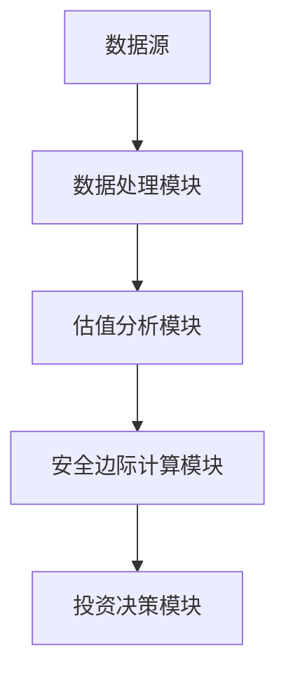
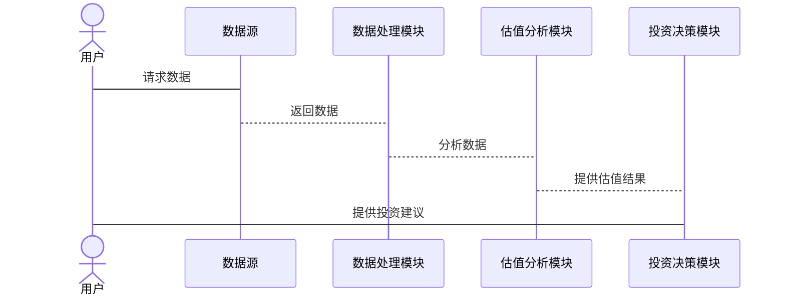

                 


# 克里斯托弗·布朗的深度价值投资：寻找严重低估的股票

> 关键词：深度价值投资、内在价值、安全边际、股票估值、投资策略、克里斯托弗·布朗、低估股票

> 摘要：深度价值投资是一种专注于寻找市场中被低估的股票的投资策略，旨在通过分析公司的基本面，识别其内在价值，并在市场价格低于内在价值时进行投资。本文将详细探讨深度价值投资的核心概念、分析方法、系统设计和实际案例，帮助读者掌握这种投资策略。

---

# 目录大纲

## 第一章：深度价值投资的背景与核心概念

### 1.1 深度价值投资的背景
- 1.1.1 价值投资的起源与发展
- 1.1.2 深度价值投资的定义与特征
- 1.1.3 深度价值投资与其他投资策略的对比

### 1.2 深度价值投资的核心概念
- 1.2.1 内在价值的计算公式
- 1.2.2 安全边际的定义与作用
- 1.2.3 市场情绪与市场估值的关系

## 第二章：深度价值投资的分析方法

### 2.1 财务报表分析方法
- 2.1.1 资产负债表分析
- 2.1.2 利润表分析
- 2.1.3 现金流量表分析

### 2.2 估值指标的筛选与应用
- 2.2.1 市盈率（P/E）的计算与应用
- 2.2.2 市净率（P/B）的计算与应用
- 2.2.3 股息率的计算与应用

### 2.3 股票筛选策略
- 2.3.1 低市盈率策略
- 2.3.2 低市净率策略
- 2.3.3 高股息率策略

## 第三章：深度价值投资的系统设计

### 3.1 系统功能设计
- 3.1.1 问题场景介绍
- 3.1.2 系统功能模块划分
- 3.1.3 系统架构设计

### 3.2 系统架构图


### 3.3 系统交互流程图


## 第四章：深度价值投资的项目实战

### 4.1 环境安装与数据准备
- 4.1.1 Python环境的安装与配置
- 4.1.2 数据源的获取与处理

### 4.2 核心代码实现
```python
import pandas as pd
import numpy as np

def calculate_intrinsic_value(revenue, net_income, growth_rate, discount_rate):
    # 现金流折现模型（DCF）
    present_value = net_income / (1 + discount_rate)
    while revenue > 0:
        revenue *= (1 + growth_rate)
        present_value += revenue / (1 + discount_rate)
    return present_value
```

### 4.3 实际案例分析
- 4.3.1 某公司财务数据的分析与解读
- 4.3.2 内在价值的计算与安全边际的确定
- 4.3.3 投资决策的制定与实施

## 第五章：深度价值投资的总结与展望

### 5.1 最佳实践与注意事项
- 5.1.1 投资策略的灵活性调整
- 5.1.2 风险控制与组合管理
- 5.1.3 持续学习与市场变化的应对

### 5.2 未来展望
- 5.2.1 深度价值投资的演变趋势
- 5.2.2 技术进步对投资策略的影响
- 5.2.3 全球化市场的机遇与挑战

## 第六章：附录与参考文献

### 6.1 术语表
- 内在价值
- 安全边际
- 现金流折现模型（DCF）

### 6.2 工具推荐
- Python与Pandas库
- 数据分析工具（如Excel、Tableau）

### 6.3 参考文献
- 克里斯托弗·布朗的相关著作
- 价值投资的经典文献

---

作者：AI天才研究院/AI Genius Institute & 禅与计算机程序设计艺术 /Zen And The Art of Computer Programming

---

### 本文的目录结构示例
- **摘要**：简要概述文章的核心内容和主题思想。
- **关键词**：列出文章的核心关键词，便于读者快速理解文章的核心内容。
- **目录大纲**：详细列出文章的章节和子章节，展示文章的逻辑结构和内容安排。

通过以上目录结构，您可以按照逻辑逐步展开每个部分的内容，确保文章的完整性和深度。

