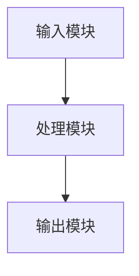

                 


# 创意写作 AI Agent：LLM 辅助内容创作与文案生成

**关键词：** 创意写作, AI Agent, LLM, 大语言模型, 内容创作, 文案生成

**摘要：**  
随着人工智能技术的飞速发展，大语言模型（LLM）在创意写作中的应用日益广泛。本文将深入探讨AI Agent在创意写作中的角色与功能，分析LLM的核心算法原理，并通过实际案例展示如何利用这些技术实现高效的内容创作与文案生成。文章从背景介绍、核心概念、算法原理、系统架构到项目实战，层层递进，为读者提供全面的视角和实用的指导。

---

## 引言

创意写作是人类表达思想、传递信息的重要方式。然而，对于许多人来说，创意写作是一项挑战，尤其是在面对创作瓶颈或时间压力时。近年来，人工智能（AI）技术的迅速发展为创意写作提供了新的可能性。大语言模型（LLM）作为AI技术的核心，能够通过自然语言处理（NLP）技术辅助生成高质量的内容，从而提升创作效率和质量。

本文将聚焦于AI Agent在创意写作中的应用，探讨其工作原理、技术优势以及实际案例。通过本文，读者将深入了解如何利用AI技术优化创意写作过程，从而在文案生成、内容创作等领域取得更好的成果。

---

## 第一部分：AI Agent与LLM的核心概念

### 1.1 AI Agent的定义与功能

AI Agent（人工智能代理）是一种能够感知环境、执行任务并做出决策的智能系统。在创意写作中，AI Agent主要充当辅助工具的角色，帮助用户生成文本、优化内容并提供创作建议。其核心功能包括：

1. **文本生成**：根据用户输入生成高质量的文案。
2. **内容优化**：通过分析文本结构，提出改进建议。
3. **创意启发**：提供灵感和创作方向。

### 1.2 大语言模型（LLM）的工作原理

大语言模型（LLM）是AI Agent的核心技术之一。LLM基于深度学习算法，通过大量数据的训练，能够理解并生成人类语言。其主要工作原理包括：

1. **数据预处理**：对大规模文本数据进行清洗和整理。
2. **模型训练**：利用神经网络模型（如Transformer）进行参数优化。
3. **文本生成**：通过解码算法生成符合上下文的文本。

### 1.3 LLM在创意写作中的应用

在创意写作中，LLM能够协助作者完成多种任务，例如：

1. **自动补全**：根据输入的关键词生成相关文本。
2. **风格调整**：根据需求调整文本的语气和风格。
3. **内容扩展**：将简短的思路扩展成完整的文章。

---

## 第二部分：创意写作 AI Agent的算法原理

### 2.1 LLM的训练过程

LLM的训练过程分为以下几个步骤：

1. **数据预处理**：对原始数据进行清洗、分词和格式化处理。
2. **模型构建**：选择合适的神经网络架构（如Transformer）并初始化参数。
3. **模型训练**：通过反向传播算法优化模型参数，使其能够预测下一个词。
4. **模型评估**：通过验证集评估模型的性能并进行调整。

### 2.2 LLM的文本生成算法

文本生成主要采用生成式模型，例如：

1. **贪心算法**：逐词生成最可能的下一个词。
2. **蒙特卡洛方法**：通过随机采样生成多样化的内容。
3. **束搜索**：生成多个候选答案并选择最优解。

### 2.3 算法实现的数学模型

文本生成的数学模型通常基于概率分布。例如，假设我们有一个词序列 \( x_1, x_2, ..., x_n \)，模型的目标是计算每个词的条件概率 \( P(x_i | x_{i-1}, ..., x_1) \)。通过最大化条件概率的乘积，我们可以生成最可能的文本序列。

---

## 第三部分：创意写作 AI Agent的系统架构设计

### 3.1 系统模块划分

创意写作 AI Agent的系统架构主要包括以下几个模块：

1. **输入模块**：接收用户的输入并解析需求。
2. **处理模块**：根据需求调用LLM进行文本生成。
3. **输出模块**：将生成的文本呈现给用户。

### 3.2 系统交互流程

系统交互流程如下：

1. **用户输入**：用户输入关键词或初步想法。
2. **需求解析**：系统解析用户需求并生成对应的创作任务。
3. **文本生成**：调用LLM生成初稿。
4. **结果输出**：将生成的文本反馈给用户。

### 3.3 系统架构图



---

## 第四部分：项目实战

### 4.1 环境安装

要实现创意写作 AI Agent，首先需要安装必要的工具和库，例如：

- Python 3.x
- transformers库（用于调用LLM）

安装命令：
```bash
pip install transformers
```

### 4.2 核心代码实现

以下是创意写作 AI Agent的核心代码示例：

```python
from transformers import pipeline

# 初始化LLM模型
text_generator = pipeline('text-generation', model='gpt2')

# 用户输入
input_text = input("请输入你的创意想法：")

# 生成文本
response = text_generator(input_text, max_length=500, num_return_sequences=1)

# 输出结果
print("生成的文本：")
print(response[0]['generated_text'])
```

### 4.3 代码解读与分析

上述代码通过调用预训练的GPT-2模型，根据用户的输入生成相应的文本。代码主要包括以下步骤：

1. **导入库**：引入transformers库中的text-generation模块。
2. **初始化模型**：加载GPT-2模型并准备好生成文本。
3. **用户输入**：接收用户的创意想法。
4. **文本生成**：根据输入生成长度为500的文本。
5. **输出结果**：将生成的文本打印出来。

---

## 第五部分：最佳实践与总结

### 5.1 最佳实践

1. **选择合适的模型**：根据具体需求选择适合的LLM模型。
2. **优化参数设置**：通过调整模型参数（如生成长度、温度）来优化生成效果。
3. **结合人工审核**：生成的内容需要人工审核以确保质量和准确性。

### 5.2 小结

通过本文的介绍，我们深入探讨了创意写作 AI Agent的核心概念、算法原理和系统架构，并通过具体案例展示了其实现过程。LLM技术为创意写作提供了强大的工具支持，能够显著提升创作效率和质量。未来，随着AI技术的不断发展，创意写作 AI Agent将变得更加智能化和个性化。

---

## 参考文献

1. "Introduction to Large Language Models"，作者：Andrej Karpathy。
2. "The Transformer Architecture"，作者：Vaswani et al.
3. "Generating Text with GPT-2"，作者：OpenAI。

---

## 作者信息

作者：AI天才研究院/AI Genius Institute & 禅与计算机程序设计艺术/Zen And The Art of Computer Programming

---

通过以上步骤，我们系统地介绍了创意写作 AI Agent的背景、核心概念、算法原理、系统架构以及项目实战。希望本文能够为读者提供有价值的参考和启发。

