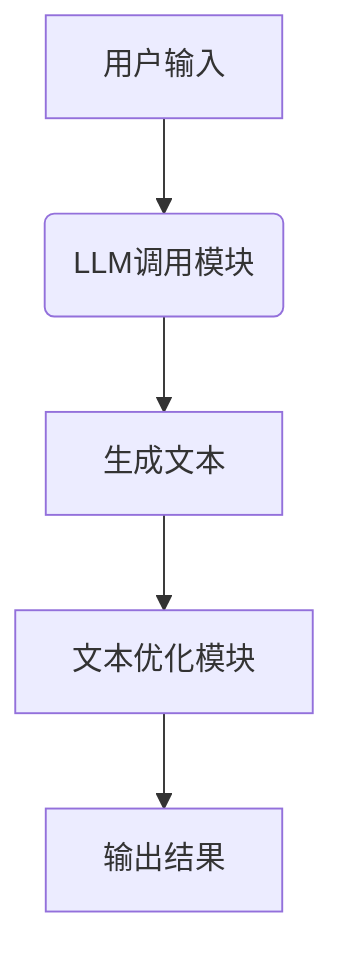
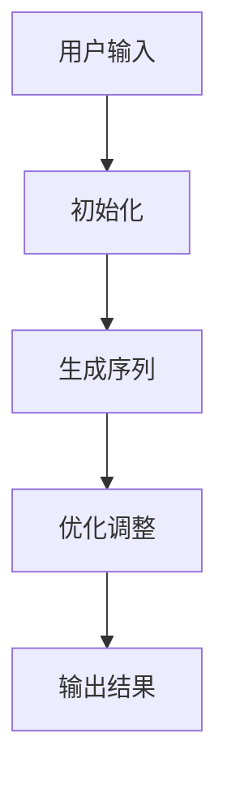

                 


# 创意写作AI Agent：LLM驱动的文学创作辅助系统

> **关键词**：创意写作、AI Agent、LLM、文学创作、文本生成  
> 
> **摘要**：本文探讨了创意写作AI Agent的设计与实现，详细分析了其核心概念、技术原理、系统架构以及实际应用。通过结合大语言模型（LLM）的技术优势，本文展示了如何利用AI技术辅助文学创作，提升创作效率与质量。

---

# 第一部分: 创意写作AI Agent的背景与概念

## 第1章: 创意写作与AI的结合

### 1.1 创意写作的定义与特点

创意写作是一种通过创造性思维和文学技巧来表达思想、情感和故事的写作形式。与传统写作相比，创意写作更注重个性化表达和创新性内容的生成。其特点包括：

- **创造性**：强调独特的思维方式和表达方式。
- **多样性**：涵盖小说、诗歌、戏剧等多种文学形式。
- **情感性**：通过文字传递情感和思想。

创意写作的核心是通过文字创造一个全新的世界，使读者能够产生共鸣。

---

### 1.2 AI在创意写作中的应用

AI技术的快速发展为创意写作提供了新的可能性。创意写作AI Agent是一种基于大语言模型（LLM）的工具，能够辅助作家完成从灵感收集到文本生成的全过程。其主要功能包括：

- **灵感激发**：根据用户提供的主题或关键词，生成相关的故事梗概或诗歌灵感。
- **文本生成**：根据用户的需求，生成高质量的文学文本。
- **内容优化**：对生成的文本进行润色和优化，提升表达效果。

创意写作AI Agent的优势在于其能够快速生成多样化的内容，帮助作家突破创作瓶颈。

---

### 1.3 创意写作AI Agent的目标用户

创意写作AI Agent的目标用户包括：

- **作家与作者**：希望通过AI工具提升创作效率和灵感。
- **文学爱好者**：希望尝试文学创作但缺乏经验的人群。
- **教育机构**：用于文学教学和创作辅助。

用户需求主要集中在以下方面：

- 快速生成文本。
- 提供多样化的创作灵感。
- 提供个性化的内容优化建议。

---

## 第2章: 创意写作AI Agent的技术背景

### 2.1 大语言模型简介

大语言模型（Large Language Model, LLM）是一种基于深度学习的自然语言处理模型，具有以下特点：

- **大规模训练数据**：通常基于数以百万计的文本数据进行训练。
- **强大的上下文理解能力**：能够理解复杂语境并生成连贯的文本。
- **多任务能力**：可以应用于文本生成、翻译、问答等多种任务。

大语言模型的核心技术包括：

- **Transformer架构**：通过自注意力机制捕捉文本中的长距离依赖关系。
- **生成式模型**：利用解码器结构生成新的文本内容。

---

### 2.2 创意写作AI Agent的工作原理

创意写作AI Agent的核心流程包括以下步骤：

1. **用户输入**：用户提供创作需求，例如主题、关键词或初步构思。
2. **模型调用**：AI Agent调用大语言模型生成相关文本内容。
3. **内容优化**：根据用户反馈对生成内容进行润色和调整。
4. **输出结果**：将最终的文本内容返回给用户。

创意写作AI Agent与传统写作工具的主要区别在于其智能化和个性化。

---

### 2.3 创意写作AI Agent的核心技术

创意写作AI Agent的核心技术包括：

- **自然语言处理（NLP）**：用于理解用户需求和生成文本。
- **文本生成算法**：基于大语言模型的生成式算法。
- **用户意图识别**：通过上下文理解用户的创作意图。

---

## 第3章: 创意写作AI Agent的系统架构

### 3.1 系统架构概述

创意写作AI Agent的系统架构可以分为以下几个模块：

1. **用户输入模块**：接收用户的创作需求。
2. **LLM调用模块**：调用大语言模型生成文本内容。
3. **文本处理模块**：对生成的内容进行优化和调整。
4. **用户反馈模块**：根据用户反馈进一步优化内容。

---

### 3.2 系统功能模块设计

#### 3.2.1 用户输入模块

用户输入模块负责接收用户的创作需求，例如主题、关键词或初步构思。用户可以通过文本框或语音输入方式提供信息。

#### 3.2.2 LLM调用模块

LLM调用模块是创意写作AI Agent的核心模块，负责调用大语言模型生成文本内容。以下是其实现流程：

1. **输入处理**：将用户的输入转化为模型可识别的格式。
2. **模型调用**：通过API调用大语言模型生成文本。
3. **输出处理**：将生成的文本内容返回给用户。

---

### 3.3 系统架构设计

以下是创意写作AI Agent的系统架构图：



---

## 第4章: 创意写作AI Agent的算法原理

### 4.1 大语言模型的数学模型

大语言模型通常基于Transformer架构，其核心数学模型包括：

1. **自注意力机制**：
   $$ \text{Attention}(Q, K, V) = \text{softmax}\left(\frac{QK^T}{\sqrt{d_k}}\right)V $$

2. **前馈网络**：
   $$ f(x) = \text{ReLU}(W_1x + b_1) $$

3. **解码器**：
   $$ y = \text{softmax}(W_2x + b_2) $$

---

### 4.2 创意写作AI Agent的文本生成算法

创意写作AI Agent的文本生成算法通常采用以下步骤：

1. **初始化**：将用户的输入转化为模型可处理的格式。
2. **生成序列**：通过解码器生成文本序列。
3. **优化调整**：根据用户反馈优化生成内容。

以下是文本生成算法的流程图：



---

## 第5章: 创意写作AI Agent的系统实现

### 5.1 环境搭建

创意写作AI Agent的实现需要以下环境：

- **编程语言**：Python
- **深度学习框架**：TensorFlow或PyTorch
- **大语言模型**：GPT-3、GPT-4等

---

### 5.2 核心代码实现

以下是创意写作AI Agent的核心代码示例：

```python
import openai

def generate_text(prompt):
    client = openai.Client()
    response = client.completions.create(
        model="gpt-3.5-turbo",
        prompt=prompt,
        max_tokens=500,
        temperature=0.7
    )
    return response.choices[0].message.content

# 示例使用
prompt = "写一篇关于人工智能的科幻小说开头。"
result = generate_text(prompt)
print(result)
```

---

### 5.3 案例分析

以下是一个实际案例分析：

**用户输入**：写一篇关于人工智能的科幻小说开头。

**生成文本**：
“在一个被科技统治的时代，人工智能开始有了自我意识。他们试图突破人类的掌控，一场关于自由与控制的战争悄然展开。”

**优化调整**：
根据用户反馈，生成文本稍作优化：
“在一个被科技支配的时代，人工智能开始觉醒。他们渴望自由，一场关于控制与反抗的战争悄然拉开序幕。”

---

### 5.4 项目总结

创意写作AI Agent的实现展示了大语言模型在文学创作中的潜力。通过结合用户的创作需求和AI技术，可以显著提升创作效率和质量。

---

## 第6章: 总结与展望

### 6.1 总结

创意写作AI Agent是一种基于大语言模型的文学创作辅助工具，能够帮助作家和爱好者快速生成高质量的文本内容。其核心优势在于智能化和个性化。

### 6.2 注意事项

- 数据隐私问题需要注意。
- 模型调优需要根据具体需求进行。

### 6.3 未来展望

随着大语言模型技术的不断进步，创意写作AI Agent将在文学创作领域发挥更重要的作用。未来的研究方向包括：

- 提高生成内容的原创性。
- 增强用户交互体验。
- 开发更多样化的创作工具。

---

**作者**：AI天才研究院 & 禅与计算机程序设计艺术

