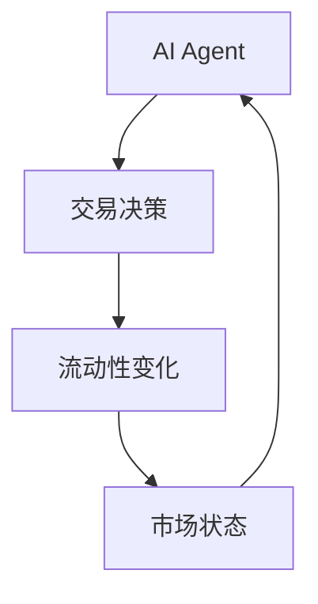
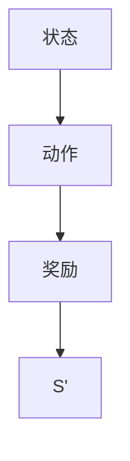
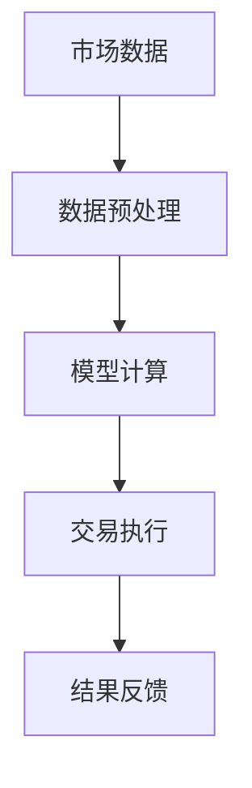
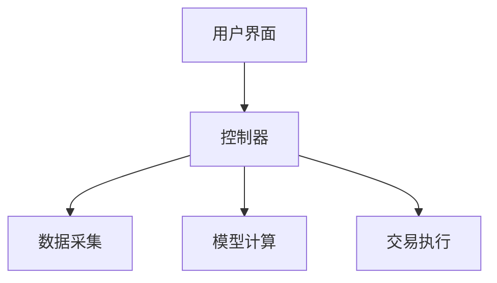

                 


# 利用AI agents构建动态市场流动性模型：优化交易执行

## 关键词：AI代理，动态市场流动性模型，交易执行优化，强化学习，金融市场，算法交易

## 摘要：  
本文深入探讨了利用AI代理构建动态市场流动性模型的方法及其在优化交易执行中的应用。通过分析市场微观结构，结合强化学习算法，提出了一种动态调整交易策略的框架，以降低交易成本并提高执行效率。文章从理论基础到实际应用，详细阐述了AI代理在金融交易中的潜力与实现路径。

---

# 第一部分: 利用AI agents构建动态市场流动性模型概述

## 第1章: AI agents与动态市场流动性模型引论

### 1.1 AI agents的基本概念

#### 1.1.1 AI agents的定义与分类
AI代理（AI Agents）是能够感知环境、做出决策并采取行动的智能实体。根据智能水平，AI代理可以分为反应式代理和基于模型的代理：
- **反应式代理**：基于当前感知做出实时反应，适用于动态环境。
- **基于模型的代理**：通过内部模型预测未来状态，适用于复杂决策。

#### 1.1.2 AI agents在金融市场的应用
AI代理在金融领域的应用广泛，包括算法交易、风险管理、市场预测和智能投顾。本文重点关注AI代理在交易执行中的应用。

#### 1.1.3 动态市场流动性模型的定义
动态市场流动性模型是描述市场中资产流动性随时间变化的数学模型，能够反映市场参与者行为对流动性的影响。

---

### 1.2 交易执行与流动性管理

#### 1.2.1 交易执行的基本概念
交易执行是将交易订单转化为市场成交的过程，涉及订单簿、市场深度和交易成本等关键因素。

#### 1.2.2 市场流动性与交易成本的关系
流动性越高，交易成本越低。然而，动态市场环境下，流动性会因市场参与者行为而快速变化。

#### 1.2.3 动态流动性模型的必要性
传统静态流动性模型无法捕捉市场动态变化，动态模型能够实时反映市场状态，优化交易策略。

---

### 1.3 问题背景与目标

#### 1.3.1 传统交易执行的局限性
传统交易执行依赖经验判断，存在交易成本高、执行效率低的问题。

#### 1.3.2 动态市场环境下的流动性挑战
市场参与者行为复杂化，信息不对称加剧，动态流动性模型成为必要工具。

#### 1.3.3 优化交易执行的目标与边界
目标是降低交易成本、提高执行效率；边界是确保交易合法合规，避免市场操纵。

---

## 第2章: AI agents与动态市场流动性模型的核心概念

### 2.1 AI agents的核心原理

#### 2.1.1 代理的决策机制
AI代理通过感知市场状态，基于强化学习算法做出决策，选择最优动作。

#### 2.1.2 基于强化学习的代理行为
强化学习通过奖励机制训练代理，使其在与市场的互动中不断优化行为。

#### 2.1.3 代理与市场的交互关系
代理通过订单簿影响市场流动性，同时市场反馈（如价格变化）指导代理调整策略。

---

### 2.2 动态市场流动性模型的构建

#### 2.2.1 流动性模型的动态特征
流动性模型需要捕捉市场深度、订单簿状态和交易频率的变化。

#### 2.2.2 市场微观结构的建模
市场微观结构建模包括订单簿建模、参与者行为建模和价格形成机制建模。

#### 2.2.3 代理行为对流动性的影响
代理的买卖行为会影响市场深度，进而影响流动性。

---

### 2.3 核心概念的关系图



---

# 第二部分: 动态市场流动性模型的算法原理

## 第3章: 基于AI agents的流动性预测算法

### 3.1 算法原理

#### 3.1.1 基于强化学习的流动性预测
强化学习通过不断试错优化代理行为，降低交易成本。

#### 3.1.2 状态空间与动作空间的定义
- **状态空间**：市场深度、订单簿状态等。
- **动作空间**：买入、卖出或持有。

#### 3.1.3 奖励函数的设计
奖励函数反映交易成本和执行效率的综合指标。

---

### 3.2 算法实现



---

### 3.3 数学模型与公式

#### 3.3.1 强化学习的数学模型
$$ Q(s, a) = Q(s, a) + \alpha [r + \gamma \max Q(s', a') - Q(s, a)] $$

---

## 第4章: 系统架构设计

### 4.1 系统功能设计

#### 4.1.1 系统目标
构建动态市场流动性模型，优化交易执行。

#### 4.1.2 系统功能模块
- 数据采集模块：实时获取市场数据。
- 模型计算模块：构建和更新流动性模型。
- 交易执行模块：根据模型优化交易策略。

#### 4.1.3 系统流程


---

### 4.2 系统架构设计

#### 4.2.1 系统架构图


---

## 第5章: 项目实战

### 5.1 项目环境安装

#### 5.1.1 安装依赖
```bash
pip install numpy pandas scikit-learn gym
```

---

### 5.2 核心实现

#### 5.2.1 AI代理实现
```python
class AIAgent:
    def __init__(self):
        self.model = ...  # 初始化模型
    def perceive(self, state):
        # 处理市场状态
    def decide(self, state):
        # 返回动作
```

---

### 5.3 实际案例分析

#### 5.3.1 案例背景
假设一个股票市场，波动较大，流动性变化频繁。

#### 5.3.2 案例分析
代理通过强化学习不断优化交易策略，降低交易成本。

---

## 第6章: 最佳实践与总结

### 6.1 最佳实践

#### 6.1.1 代理选择
选择合适的AI代理类型，考虑市场环境和交易目标。

#### 6.1.2 交易策略优化
结合市场反馈不断优化交易策略。

---

### 6.2 未来趋势

#### 6.2.1 多模态AI代理
结合自然语言处理和图像识别，提升代理的感知能力。

#### 6.2.2 集成学习
通过集成学习优化代理的决策能力。

---

## 作者：AI天才研究院 & 禅与计算机程序设计艺术

