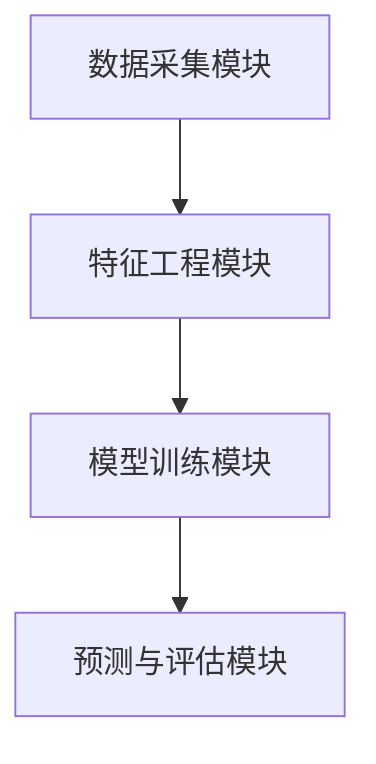

                 


# 利用AI构建动态市场微观结构模型：优化交易策略

> 关键词：动态市场微观结构模型，人工智能，交易策略优化，高频交易，智能选股，强化学习

> 摘要：本文详细探讨了如何利用人工智能技术构建动态市场微观结构模型，优化交易策略。通过分析市场数据流、特征工程、算法原理、系统架构设计和项目实战，结合具体案例，展示了AI在金融交易中的强大能力。本文适合对AI和金融建模感兴趣的读者，帮助其理解动态市场微观结构模型的核心概念和应用方法。

---

## 第一部分: 利用AI构建动态市场微观结构模型的背景与核心概念

### 第1章: 动态市场微观结构模型概述

#### 1.1 问题背景与定义
##### 1.1.1 传统市场微观结构模型的局限性
传统金融市场微观结构模型主要依赖于统计分析和基于规则的交易策略。这些方法在处理高频交易、复杂市场动态和非线性关系时显得力不从心。例如，基于统计的交易策略（如均值回归）在市场剧烈波动时表现不佳，而基于规则的策略则难以适应市场环境的快速变化。

##### 1.1.2 动态市场微观结构模型的定义
动态市场微观结构模型是一种能够实时捕捉和分析市场动态的模型，它能够根据市场环境的变化自适应地调整交易策略。这种模型的核心在于其动态性和自适应性，能够应对市场的不确定性。

##### 1.1.3 AI在动态模型中的作用
人工智能技术（如机器学习和深度学习）能够处理大量非结构化数据，发现复杂模式，并实时调整策略。AI技术的引入使得动态市场微观结构模型更加智能化和高效。

#### 1.2 核心概念与属性
##### 1.2.1 市场微观结构的核心要素
市场微观结构的核心要素包括订单流、价格波动、交易量、市场参与者的行为等。这些要素构成了市场的动态特征。

##### 1.2.2 动态模型的关键属性
动态模型的关键属性包括实时性、自适应性、可解释性和可扩展性。这些属性使得模型能够快速响应市场变化，并在不同市场环境下保持稳定。

##### 1.2.3 AI技术与市场微观结构的结合点
AI技术与市场微观结构的结合点主要体现在数据处理、特征提取、模型训练和预测机制等方面。AI能够帮助模型更好地捕捉市场动态，优化交易策略。

---

### 第2章: AI在交易策略优化中的应用

#### 2.1 传统交易策略的局限性
##### 2.1.1 基于规则的交易策略
基于规则的交易策略依赖于预定义的规则，难以应对市场的复杂性和不确定性。

##### 2.1.2 基于统计的交易策略
基于统计的交易策略依赖于历史数据的统计规律，难以应对市场的结构性变化。

##### 2.1.3 传统策略的不足
传统交易策略在高频交易、复杂市场动态和非线性关系方面的表现有限，难以满足现代金融市场的需求。

#### 2.2 AI驱动的交易策略优势
##### 2.2.1 高频交易的优势
AI驱动的交易策略能够在毫秒级别完成交易决策，显著提高交易效率。

##### 2.2.2 智能选股的潜力
AI能够通过分析大量数据，发现潜在的投资机会，优化投资组合。

##### 2.2.3 动态调整的能力
AI驱动的交易策略能够根据市场变化实时调整策略，提高适应性。

---

## 第二部分: 动态市场微观结构模型的核心概念与联系

### 第3章: 数据流与特征工程

#### 3.1 市场数据流的构成
##### 3.1.1 市场数据的多维度特征
市场数据包括订单簿、交易量、价格、市场参与者行为等多个维度。

##### 3.1.2 时间序列数据的处理
时间序列数据的处理需要考虑数据的连续性、周期性和趋势性。

##### 3.1.3 市场微观结构的动态特征
动态特征包括价格波动、订单流变化、市场参与者的互动等。

#### 3.2 特征工程的关键步骤
##### 3.2.1 数据清洗与预处理
数据清洗包括去除噪声数据、填补缺失值等。

##### 3.2.2 特征选择与提取
特征选择需要考虑特征的重要性、相关性和冗余性。

##### 3.2.3 特征工程的优化
通过特征变换、特征组合等方法优化特征表示。

---

### 第4章: 核心概念与联系

#### 4.1 核心概念的原理
##### 4.1.1 数据流的处理流程
数据流的处理流程包括数据采集、数据清洗、特征提取等。

##### 4.1.2 市场微观结构的建模
市场微观结构的建模需要考虑市场的动态特征和参与者行为。

##### 4.1.3 AI技术的应用
AI技术的应用包括特征工程、模型训练和预测等。

#### 4.2 核心概念的属性对比
##### 4.2.1 数据流与特征工程的对比
数据流关注数据的流动和处理，特征工程关注特征的提取和优化。

##### 4.2.2 模型与算法的对比
模型关注整体结构，算法关注具体实现步骤。

#### 4.3 ER实体关系图架构
```mermaid
er
actor: 交易员
Market Data: 市场数据
Feature Engineering: 特征工程
Model Training: 模型训练
Prediction: 预测
actor --> Market Data
Market Data --> Feature Engineering
Feature Engineering --> Model Training
Model Training --> Prediction
Prediction --> actor
```

---

## 第三部分: 动态市场微观结构模型的算法原理

### 第5章: 时间序列分析

#### 5.1 时间序列分析的原理
时间序列分析是一种基于历史数据预测未来趋势的方法。

##### 5.1.1 ARIMA模型
ARIMA（自回归积分滑动平均模型）是一种常用的时间序列分析模型。

##### 5.1.2 LSTM网络
LSTM（长短期记忆网络）能够捕捉时间序列中的长期依赖关系。

#### 5.2 时间序列分析的实现
##### 5.2.1 数据预处理
数据预处理包括去除趋势和季节性因素。

##### 5.2.2 模型训练
模型训练需要选择合适的参数并进行超参数调优。

##### 5.2.3 预测与评估
预测结果需要通过均方误差（MSE）等指标进行评估。

---

### 第6章: 强化学习

#### 6.1 强化学习的原理
强化学习是一种基于奖励机制的机器学习方法。

##### 6.1.1 状态空间
状态空间包括市场数据、交易量、价格等。

##### 6.1.2 动作空间
动作空间包括买入、卖出、持有等交易动作。

##### 6.1.3 奖励机制
奖励机制用于衡量交易策略的收益和风险。

#### 6.2 强化学习的实现
##### 6.2.1 环境构建
环境构建需要模拟真实的市场环境。

##### 6.2.2 策略网络
策略网络用于选择最优动作。

##### 6.2.3 网络训练
网络训练需要通过梯度下降优化参数。

---

### 第7章: 神经网络

#### 7.1 神经网络的原理
神经网络是一种模拟人脑神经网络的计算模型。

##### 7.1.1 卷积神经网络（CNN）
CNN适用于处理图像数据，但在金融时间序列数据中也有应用。

##### 7.1.2 循序神经网络（RNN）
RNN适用于处理序列数据，如时间序列。

##### 7.1.3 深度神经网络（DNN）
DNN是一种多层的神经网络，能够处理复杂的非线性关系。

#### 7.2 神经网络的实现
##### 7.2.1 模型构建
模型构建需要选择合适的网络结构和激活函数。

##### 7.2.2 数据输入
数据输入需要符合神经网络的输入格式。

##### 7.2.3 模型训练
模型训练需要通过反向传播算法优化参数。

---

## 第四部分: 动态市场微观结构模型的系统架构设计

### 第8章: 项目介绍与系统功能设计

#### 8.1 项目介绍
本项目旨在利用AI技术构建动态市场微观结构模型，优化交易策略。

#### 8.2 系统功能设计
##### 8.2.1 数据采集模块
数据采集模块负责采集市场数据，如订单簿、交易量等。

##### 8.2.2 特征工程模块
特征工程模块负责对数据进行清洗、特征提取和优化。

##### 8.2.3 模型训练模块
模型训练模块负责训练AI模型，优化交易策略。

##### 8.2.4 预测与评估模块
预测与评估模块负责模型预测和结果评估。

---

### 第9章: 系统架构设计

#### 9.1 系统架构图


#### 9.2 接口设计
##### 9.2.1 数据接口
数据接口负责与数据源进行交互，获取市场数据。

##### 9.2.2 模型接口
模型接口负责与AI模型进行交互，获取预测结果。

#### 9.3 交互流程
##### 9.3.1 数据采集
数据采集模块定期从数据源获取市场数据。

##### 9.3.2 特征提取
特征工程模块对数据进行清洗和特征提取。

##### 9.3.3 模型训练
模型训练模块利用特征数据训练AI模型。

##### 9.3.4 预测与评估
预测与评估模块根据模型预测结果进行评估。

---

## 第五部分: 项目实战

### 第10章: 环境安装与代码实现

#### 10.1 环境安装
##### 10.1.1 安装Python
安装Python 3.8或更高版本。

##### 10.1.2 安装库
安装必要的库，如TensorFlow、Keras、Pandas等。

#### 10.2 核心代码实现
##### 10.2.1 数据采集
使用API获取市场数据。

##### 10.2.2 特征工程
对数据进行清洗和特征提取。

##### 10.2.3 模型训练
训练AI模型，优化交易策略。

##### 10.2.4 预测与评估
根据模型预测结果进行评估。

---

### 第11章: 代码解读与案例分析

#### 11.1 代码解读
##### 11.1.1 数据采集代码
```python
import pandas as pd
import requests

def get_market_data(symbol):
    url = f"https://api.example.com/{symbol}"
    response = requests.get(url)
    data = response.json()
    return pd.DataFrame(data)
```

##### 11.1.2 特征工程代码
```python
def preprocess_data(data):
    data = data.dropna()
    data = data.fillna(method='ffill')
    return data
```

##### 11.1.3 模型训练代码
```python
from tensorflow.keras import layers

def build_model(input_shape):
    model = layers.Sequential()
    model.add(layers.LSTM(64, input_shape=input_shape))
    model.add(layers.Dense(1, activation='sigmoid'))
    model.compile(loss='binary_crossentropy', optimizer='adam')
    return model
```

#### 11.2 案例分析
##### 11.2.1 数据分析
分析市场数据的分布和趋势。

##### 11.2.2 模型评估
评估模型的准确率、召回率和F1分数。

##### 11.2.3 交易策略优化
根据模型预测结果优化交易策略。

---

### 第12章: 项目小结

#### 12.1 项目总结
本项目成功利用AI技术构建了动态市场微观结构模型，优化了交易策略。

#### 12.2 经验与教训
在项目过程中，需要注意数据质量和模型调优。

#### 12.3 未来展望
未来可以进一步研究更复杂的模型和更高效的数据处理方法。

---

## 第六部分: 最佳实践

### 第13章: 小结与注意事项

#### 13.1 小结
AI技术在动态市场微观结构模型中的应用前景广阔。

#### 13.2 注意事项
在实际应用中，需要注意模型的实时性和可解释性。

### 第14章: 拓展阅读

#### 14.1 推荐书籍
推荐《深度学习》（Deep Learning）、《机器学习实战》（Machine Learning in Action）等书籍。

#### 14.2 在线资源
推荐Kaggle、GitHub等平台的相关资源。

---

## 作者信息

作者：AI天才研究院/AI Genius Institute & 禅与计算机程序设计艺术 /Zen And The Art of Computer Programming

---

以上是《利用AI构建动态市场微观结构模型：优化交易策略》的技术博客文章的完整目录和内容框架。

