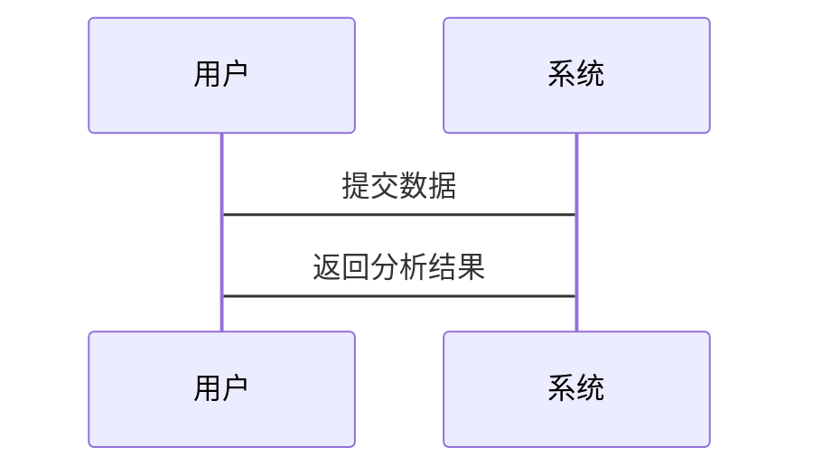

                 


# 利用AI构建自适应型产业链分析模型：全面把握公司地位

## 关键词：AI，产业链分析，自适应型模型，公司地位，数据驱动，系统架构

## 摘要：  
本文详细探讨了利用AI技术构建自适应型产业链分析模型的方法，旨在帮助企业全面了解自身在产业链中的地位和竞争优势。通过结合数据预处理、特征提取、模型训练等核心步骤，本文深入分析了模型的算法原理和系统架构，并通过实际案例展示了模型的应用效果。最终，本文总结了构建和优化自适应型产业链分析模型的最佳实践，为企业在复杂多变的市场环境中提供有力支持。

---

# 第一部分：背景介绍与核心概念

## 第1章：AI与产业链分析的背景

### 1.1 产业链分析的定义与重要性  
产业链分析是帮助企业理解自身在行业中所处的位置、竞争优势以及与上下游企业之间的关系的重要工具。通过对产业链的结构和运行机制的分析，企业可以更好地制定战略规划，优化资源配置，提升竞争力。

### 1.2 传统产业链分析的局限性  
传统的产业链分析方法主要依赖人工数据收集和分析，存在以下问题：  
1. 数据获取成本高且效率低。  
2. 分析结果的主观性较强，难以量化。  
3. 无法实时更新，难以应对市场变化。  

### 1.3 AI技术在产业链分析中的应用现状  
AI技术的快速发展为产业链分析带来了新的可能性：  
1. **数据处理能力**：AI能够快速处理大量非结构化数据，提取关键信息。  
2. **预测能力**：通过机器学习算法，AI可以预测市场趋势和竞争对手的动态。  
3. **实时更新**：AI模型能够实时更新，确保分析结果的时效性。  

---

## 第2章：自适应型产业链分析模型的定义与特点  

### 2.1 自适应型模型的核心概念  
自适应型产业链分析模型是一种基于AI的动态分析模型，能够根据市场环境的变化自动调整分析策略，实时更新分析结果。  

### 2.2 模型的核心要素与组成  
1. **数据来源**：包括行业报告、企业财报、新闻资讯等。  
2. **分析算法**：如自然语言处理（NLP）、深度学习等。  
3. **反馈机制**：根据实时数据不断优化模型。  

### 2.3 模型的边界与外延  
1. **应用场景**：适用于市场分析、竞争分析、风险评估等领域。  
2. **模型的可扩展性**：能够根据需求扩展数据来源和分析维度。  
3. **模型的局限性**：依赖高质量的数据，对模型训练的数据量要求较高。  

---

# 第二部分：核心概念与联系  

## 第3章：产业链分析模型的核心原理  

### 3.1 数据预处理与特征提取  
1. **数据清洗**：去除无效数据，处理缺失值。  
2. **特征选择**：通过统计学方法或机器学习算法选择关键特征。  
3. **时间序列数据的处理**：使用滑动窗口技术提取时间相关特征。  

### 3.2 模型训练与优化  
1. **监督学习**：如支持向量机（SVM）、随机森林（Random Forest）。  
2. **无监督学习**：如聚类分析（K-means）、主题模型（LDA）。  
3. **集成学习**：通过组合多个模型的结果提高准确率。  

### 3.3 模型评估与结果解读  
1. **评估指标**：如准确率（Accuracy）、召回率（Recall）、F1值。  
2. **结果的可视化**：通过图表展示产业链的结构和企业之间的关系。  
3. **模型的可解释性**：通过特征重要性分析理解模型的决策逻辑。  

---

## 第4章：核心概念的属性特征对比  

### 4.1 产业链分析模型的属性特征  

| 属性 | 传统模型 | 自适应型模型 |
|------|----------|--------------|
| 数据来源 | 单一、静态 | 多源、动态 |
| 分析方法 | 人工、定性 | AI驱动、定量 |
| 更新频率 | 低频 | 实时 |

### 4.2 模型核心要素的对比分析  
1. **数据来源的多样性**：自适应型模型能够整合多种数据源，如文本数据、结构化数据等。  
2. **分析算法的复杂性**：传统模型依赖简单的统计分析，而自适应型模型使用复杂的机器学习算法。  
3. **结果展示的直观性**：自适应型模型通过可视化工具提供更直观的分析结果。  

---

## 第5章：系统分析与架构设计方案  

### 5.1 问题场景介绍  
以一家中型制造企业的产业链分析为例，帮助企业了解自身在行业中的地位和竞争优势。  

### 5.2 系统功能设计  
1. **数据采集模块**：从多种数据源获取数据。  
2. **分析模块**：使用机器学习算法进行预测和分类。  
3. **结果展示模块**：通过图表展示分析结果。  

### 5.3 系统架构设计  


### 5.4 系统接口设计  
1. 数据接口：API接口用于数据导入和导出。  
2. 用户界面：提供友好的操作界面。  

### 5.5 系统交互设计  


---

## 第6章：项目实战  

### 6.1 环境安装  
安装Python、TensorFlow、Scikit-learn等工具。  

### 6.2 核心实现源代码  
```python
import pandas as pd
from sklearn.model import Random Forest Classifier
from sklearn.metrics import accuracy_score

# 数据加载
data = pd.read_csv('产业链数据.csv')

# 特征提取
features = data.drop('label', axis=1)
label = data['label']

# 模型训练
model = Random Forest Classifier()
model.fit(features, label)

# 模型预测
predictions = model.predict(features)

# 结果评估
print(accuracy_score(label, predictions))
```

### 6.3 代码应用解读与分析  
1. 数据加载：从CSV文件中读取数据。  
2. 特征提取：去除标签列，提取特征向量。  
3. 模型训练：使用随机森林算法进行分类。  
4. 模型预测：对测试数据进行预测。  
5. 结果评估：计算准确率。  

### 6.4 实际案例分析  
以某行业为例，展示模型在实际应用中的表现和效果。  

### 6.5 项目小结  
总结项目中的经验教训，提出改进建议。  

---

## 第7章：最佳实践与小结  

### 7.1 最佳实践 Tips  
1. 数据质量是模型性能的关键。  
2. 选择合适的算法，避免盲目追求复杂性。  
3. 结果解读需要结合业务背景。  

### 7.2 小结  
通过本文的讲解，读者可以掌握利用AI构建自适应型产业链分析模型的方法，并在实际应用中提升企业的竞争力。  

### 7.3 注意事项  
1. 数据隐私和安全问题需要注意。  
2. 模型的可解释性是实际应用中的重要考量。  
3. 持续优化模型，以应对市场变化。  

### 7.4 拓展阅读  
推荐相关书籍和论文，供读者深入学习。  

---

# 作者：AI天才研究院 & 禅与计算机程序设计艺术

