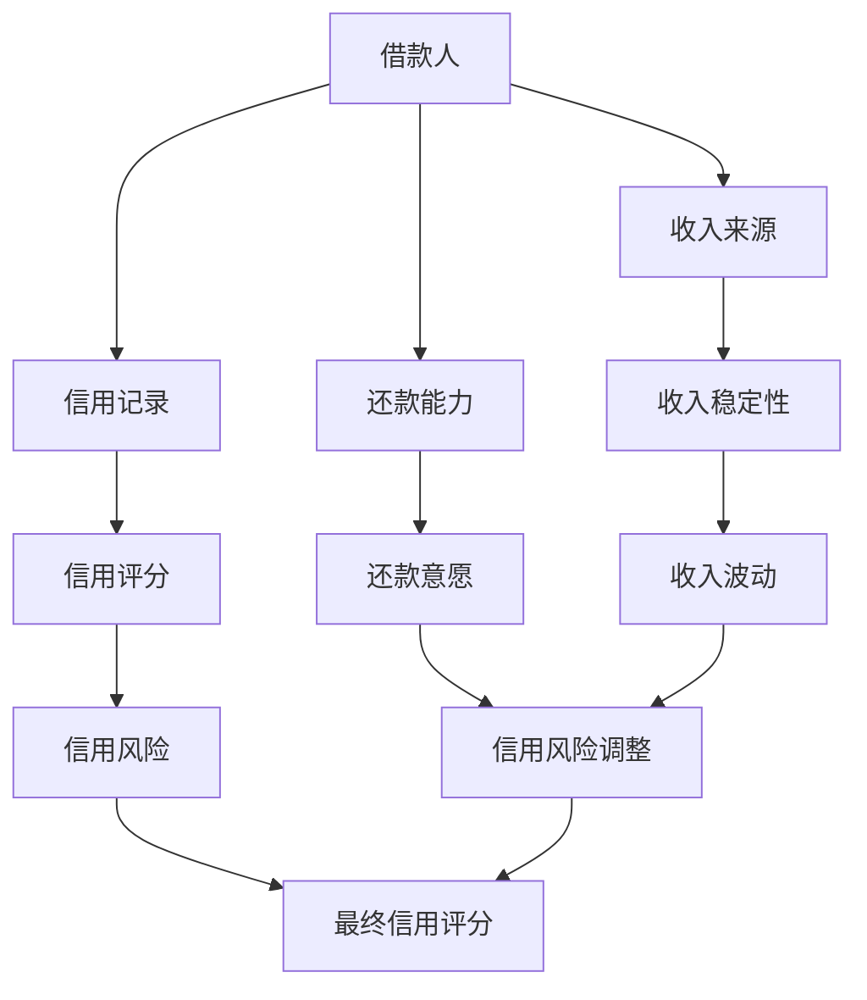
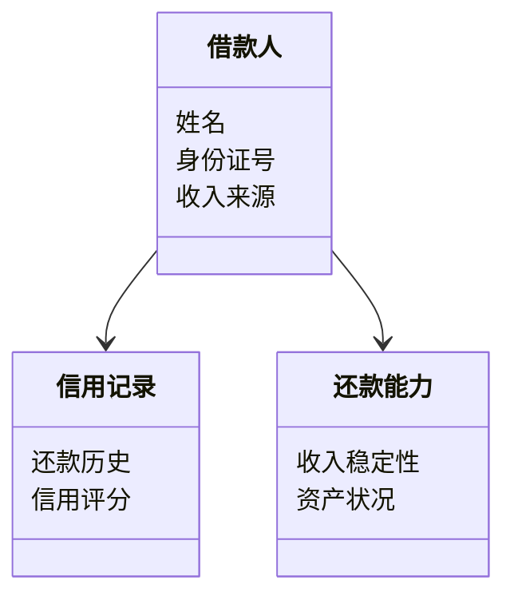
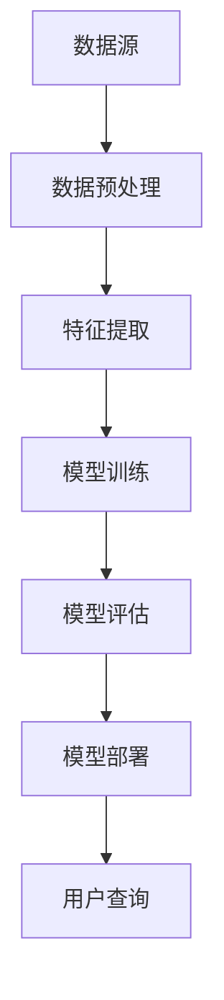

                 


# 利用AI构建自适应型信用风险评估模型：增强投资安全性

> 关键词：AI，信用风险评估，自适应模型，金融投资，风险管理，机器学习

> 摘要：本文探讨如何利用人工智能技术构建自适应型信用风险评估模型，以增强金融投资的安全性。通过分析信用风险评估的核心概念、AI算法的原理、系统架构设计以及实际案例，本文提供了一套完整的解决方案，帮助读者理解如何利用AI技术提升信用风险评估的准确性和实时性。文章内容涵盖背景介绍、算法实现、系统设计、项目实战等多个方面，旨在为金融从业者、数据科学家及相关技术爱好者提供实用的指导和启发。

---

## 第1章：信用风险评估的背景与概述

### 1.1 信用风险评估的基本概念

#### 1.1.1 信用风险的定义与特征
信用风险是指借款人或交易对手未能履行其合同义务，导致资金损失的可能性。其主要特征包括动态性、复杂性和可预测性。

#### 1.1.2 信用风险评估的重要性
在金融投资中，信用风险评估是确保资金安全的核心环节，直接关系到投资决策的准确性和收益的实现。

#### 1.1.3 信用风险评估的常见方法
传统方法包括信用评分模型（如5C法）、Z-score模型等，但这些方法往往静态且不够灵活。

### 1.2 AI在信用风险评估中的应用

#### 1.2.1 AI技术的基本概念
人工智能（AI）通过机器学习、深度学习等技术，能够从海量数据中提取复杂特征，发现传统方法难以察觉的模式。

#### 1.2.2 AI在金融领域的应用现状
AI已广泛应用于股票预测、欺诈检测等领域，但在信用风险评估中的应用仍处于快速发展阶段。

#### 1.2.3 为什么需要自适应型信用风险评估模型
传统模型难以应对市场环境的动态变化，而自适应型模型能够实时更新，适应市场波动。

### 1.3 本书的目标与结构

#### 1.3.1 本书的核心目标
通过AI技术构建自适应型信用风险评估模型，提升信用风险评估的准确性和实时性。

#### 1.3.2 本书的主要内容
涵盖背景介绍、算法原理、系统设计、项目实战等多个方面，提供完整的解决方案。

#### 1.3.3 本书的读者群体
适合金融从业者、数据科学家、技术爱好者及相关领域的读者。

---

## 第2章：自适应型信用风险评估模型的核心概念

### 2.1 信用风险评估模型的关键要素

#### 2.1.1 借款人的信用状况
包括信用历史、还款能力、收入来源等因素。

#### 2.1.2 还款能力与意愿
通过数据分析借款人的真实还款意愿和能力。

#### 2.1.3 风险因素的动态变化
市场环境、经济周期等因素的动态变化会影响信用风险。

### 2.2 自适应型模型的特点与优势

#### 2.2.1 自适应性定义
能够根据市场变化实时更新模型参数和特征。

#### 2.2.2 实时更新机制
通过持续的数据输入和模型训练，保持模型的最新性。

#### 2.2.3 多维度数据处理能力
能够整合结构化数据和非结构化数据，提升模型的泛化能力。

### 2.3 核心概念对比分析

#### 2.3.1 传统信用模型与AI模型的对比
| 特性            | 传统模型       | AI模型         |
|-----------------|----------------|----------------|
| 数据需求        | 结构化数据为主   | 结构化+非结构化 |
| 模型复杂度      | 较低           | 较高           |
| 更新频率        | 定期更新       | 实时更新       |

#### 2.3.2 自适应模型与其他AI模型的对比
| 特性            | 自适应模型      | 其他AI模型      |
|-----------------|----------------|----------------|
| 更新能力        | 实时更新        | 定期更新或静态   |
| 适应性          | 高             | 中或低          |

### 2.4 实体关系图（ER图）



---

## 第3章：自适应型信用风险评估模型的算法原理

### 3.1 常见算法概述

#### 3.1.1 逻辑回归
逻辑回归通过sigmoid函数将线性回归结果映射到概率空间，适用于二分类问题。

公式：
$$ P(y=1|x) = \frac{e^{\beta_0 + \beta_1x}}{1 + e^{\beta_0 + \beta_1x}} $$

#### 3.1.2 随机森林
随机森林通过集成学习提升模型的准确性和鲁棒性，适用于特征较多的场景。

#### 3.1.3 神经网络
神经网络能够处理复杂的非线性关系，通过多层网络结构提取深层次特征。

### 3.2 算法实现与对比

#### 3.2.1 逻辑回归的实现

```python
import numpy as np
from sklearn.linear_model import LogisticRegression

# 数据预处理
X_train = ...
y_train = ...

# 模型训练
model = LogisticRegression()
model.fit(X_train, y_train)

# 预测与评估
y_pred = model.predict(X_test)
print("Accuracy:", model.score(X_test, y_test))
```

#### 3.2.2 神经网络的实现

```python
import tensorflow as tf
from tensorflow.keras import layers

# 模型构建
model = tf.keras.Sequential([
    layers.Dense(64, activation='relu'),
    layers.Dense(1, activation='sigmoid')
])

# 编译模型
model.compile(optimizer='adam', loss='binary_crossentropy', metrics=['accuracy'])

# 训练模型
model.fit(X_train, y_train, epochs=10, batch_size=32)
```

---

## 第4章：系统分析与架构设计

### 4.1 问题场景介绍

#### 4.1.1 业务背景
在金融投资中，信用风险评估是确保资金安全的核心环节。

#### 4.1.2 技术背景
随着大数据和AI技术的发展，信用风险评估模型需要更加智能化和动态化。

### 4.2 系统功能设计

#### 4.2.1 领域模型


#### 4.2.2 系统架构


---

## 第5章：项目实战

### 5.1 环境安装

```bash
pip install numpy scikit-learn tensorflow pandas
```

### 5.2 系统核心实现

#### 5.2.1 数据预处理

```python
import pandas as pd
from sklearn.preprocessing import StandardScaler

# 加载数据
data = pd.read_csv('credit_data.csv')

# 特征提取
features = data[['income', 'assets', 'credit_history']]
target = data['default']

# 数据标准化
scaler = StandardScaler()
features_scaled = scaler.fit_transform(features)
```

#### 5.2.2 模型训练

```python
from sklearn.linear_model import LogisticRegression
from sklearn.metrics import accuracy_score

# 训练模型
model = LogisticRegression()
model.fit(features_scaled, target)

# 预测与评估
y_pred = model.predict(features_scaled)
print("Accuracy:", accuracy_score(target, y_pred))
```

### 5.3 实际案例分析

#### 5.3.1 案例背景
分析某借款人的信用记录、收入来源和资产状况，评估其信用风险。

#### 5.3.2 模型预测
通过模型预测该借款人的信用评分，为投资决策提供依据。

---

## 第6章：高级主题与最佳实践

### 6.1 高级主题

#### 6.1.1 模型的实时更新
通过流数据处理技术，实时更新模型参数。

#### 6.1.2 多模型集成
结合多种算法，提升模型的准确性和鲁棒性。

### 6.2 最佳实践

#### 6.2.1 数据质量管理
确保数据的准确性和完整性，避免模型偏差。

#### 6.2.2 模型解释性
通过可解释性模型（如XGBoost）提升模型的透明度。

---

## 附录

### A. 术语表

- 信用评分：衡量借款人信用状况的指标。
- 自适应模型：能够实时更新的模型。

### B. 数据来源

- 数据集：公开金融数据集。

### C. 工具安装指南

- 安装Python和相关库（如numpy、pandas、scikit-learn）。

---

## 作者：AI天才研究院 & 禅与计算机程序设计艺术

---

通过以上大纲，我们可以系统地构建一个基于AI的自适应型信用风险评估模型，为金融投资提供更安全的保障。

