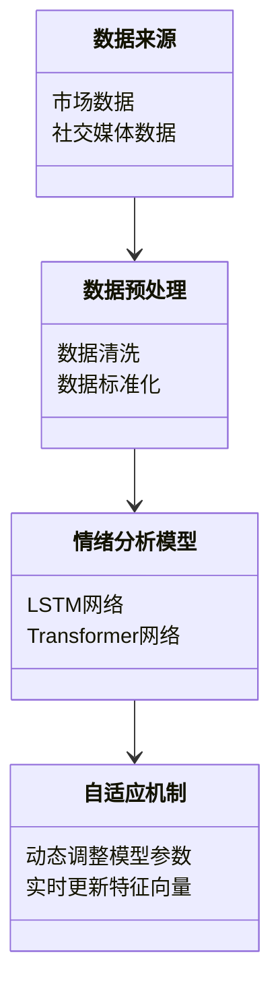

                 


# 利用AI构建自适应型市场情绪指标：把握投资时机

> 关键词：AI，市场情绪指标，自适应模型，投资时机，情绪分析，时间序列分析，深度学习

> 摘要：本文将探讨如何利用人工智能技术构建自适应型市场情绪指标，帮助投资者准确把握市场波动，制定科学的投资策略。文章从背景介绍、核心概念、算法原理、系统架构、项目实战等多方面展开，深入分析自适应型市场情绪指标的构建过程与实际应用，最后总结经验和未来发展方向。

---

## 第1章：市场情绪指标与投资时机

### 1.1 问题背景与描述

#### 1.1.1 传统市场情绪指标的局限性
传统的市场情绪指标，如恐慌指数（VIX）、投资者信心指数等，虽然在一定程度上能够反映市场的波动性和投资者情绪，但存在以下局限性：
- 数据采集范围有限：传统指标通常基于有限的市场数据（如价格和交易量），难以捕捉市场参与者的实时情绪。
- 静态性：传统指标缺乏动态调整能力，无法根据市场环境的变化实时优化情绪分析模型。
- 主观性：传统指标的计算方法通常基于固定的规则，难以捕捉市场参与者情绪的细微变化。

#### 1.1.2 问题解决与目标设定
利用人工智能技术构建自适应型市场情绪指标的目标如下：
- 实时捕捉市场参与者的复杂情绪变化。
- 根据市场环境动态调整情绪分析模型。
- 提供更精准的投资决策参考。

#### 1.1.3 边界与外延
- 自适应型市场情绪指标的适用范围：适用于股票、债券、期货等金融市场的实时情绪分析。
- 指标的边界条件：需要考虑数据来源的多样性和数据质量。
- 与其他市场分析工具的协同作用：可以与技术分析、基本面分析等方法结合使用。

#### 1.1.4 核心概念结构与要素
- 数据来源：市场新闻、社交媒体、交易数据等。
- AI算法：自然语言处理（NLP）、时间序列分析等。
- 自适应机制：动态调整模型参数、实时更新特征向量等。

### 1.2 核心概念与联系

#### 1.2.1 市场情绪指标的核心原理
- 情绪指标的基本原理：通过分析市场数据和参与者行为，量化市场情绪。
- AI在情绪分析中的作用：利用NLP和深度学习技术，从非结构化数据中提取情绪特征。
- 自适应机制的工作原理：根据市场环境的变化，动态调整情绪分析模型。

#### 1.2.2 核心概念属性对比

| 对比维度         | 传统指标             | AI驱动指标           |
|------------------|----------------------|----------------------|
| 数据来源         | 价格、交易量         | 文本、社交媒体、交易数据 |
| 数据处理方式     | 静态规则             | 动态模型             |
| 情绪捕捉能力     | 有限                | 高度精准             |
| 调整能力         | 无                   | 自适应               |

#### 1.2.3 ER实体关系图

```mermaid
er
actor: 投资者
|------|
指标: 情绪指标
|------|
数据: 市场数据
|------|
模型: AI情绪分析模型
```

---

## 第2章：数据来源与特征提取

### 2.1 数据来源

#### 2.1.1 市场数据的收集
- 股票价格数据：包括开盘价、收盘价、最高价、最低价等。
- 交易量数据：包括成交量、换手率等。
- 市场新闻与评论：包括新闻标题、新闻内容、评论文本等。
- 社交媒体数据：包括社交媒体帖子、用户评论、情感标签等。

#### 2.1.2 非结构化数据的处理
- 文本数据的预处理：包括分词、去停用词、词干提取等。
- 图片与视频数据的处理：包括图像识别、视频摘要生成等。
- 其他非结构化数据的处理：包括语音识别、数据清洗等。

### 2.2 数据预处理

#### 2.2.1 数据清洗
- 重复数据的处理：去除重复的市场数据或评论。
- 异常值的处理：识别并剔除异常交易数据或异常评论。
- 缺失值的处理：使用均值、中位数或插值法填补缺失数据。

#### 2.2.2 数据标准化与归一化
- 数据标准化方法：Z-score标准化、Min-Max归一化等。
- 数据归一化方法：对数据进行比例缩放，使其在0-1范围内。
- 数据分箱处理：将连续数据离散化，便于后续分析。

### 2.3 特征提取

#### 2.3.1 文本特征提取
- 词袋模型：将文本表示为词汇表中词语的出现频率。
- 词嵌入模型：使用Word2Vec、GloVe等模型生成词向量。
- 主题模型：使用LDA（隐性主题模型）提取文本主题。

#### 2.3.2 时间序列特征提取
- 坐标时间序列特征：提取均值、方差、自相关系数等。
- 频率域特征：提取傅里叶变换后的频谱特征。
- 统计特征：提取最大值、最小值、中位数等。

---

## 第3章：算法原理

### 3.1 自然语言处理（NLP）算法

#### 3.1.1 LSTM（长短期记忆网络）
- LSTM的结构：包括输入门、遗忘门、输出门。
- LSTM的数学模型：
  $$ f_t = \sigma(W_f \cdot [h_{t-1}, x_t] + b_f) $$
  $$ i_t = \sigma(W_i \cdot [h_{t-1}, x_t] + b_i) $$
  $$ o_t = \sigma(W_o \cdot [h_{t-1}, x_t] + b_o) $$
  $$ h_t = f_t \cdot c_{t-1} + i_t \cdot x_t $$

#### 3.1.2 Transformer
- Transformer的结构：包括编码器和解码器。
- Transformer的数学模型：
  $$ \text{多头注意力机制} $$

### 3.2 时间序列分析算法

#### 3.2.1 LSTM在时间序列分析中的应用
- LSTM用于时间序列预测的原理：
  - LSTM能够捕捉时间序列的长期依赖关系。
  - 适用于非线性时间序列数据的预测。

#### 3.2.2 Transformer在时间序列分析中的应用
- Transformer用于时间序列分析的原理：
  - 通过自注意力机制捕捉时间序列的全局依赖关系。
  - 适用于高维时间序列数据的预测。

---

## 第4章：系统架构设计

### 4.1 问题场景介绍
- 系统目标：构建自适应型市场情绪指标。
- 使用场景：实时监控市场情绪变化，辅助投资决策。
- 核心问题：如何实现模型的自适应调整。

### 4.2 系统功能设计

#### 4.2.1 领域模型


---

## 第5章：项目实战

### 5.1 环境安装
- Python版本：Python 3.8以上。
- 库的安装：TensorFlow、Keras、NLTK、pandas等。

### 5.2 系统核心实现源代码

#### 5.2.1 LSTM模型实现

```python
import numpy as np
from tensorflow.keras.models import Sequential
from tensorflow.keras.layers import LSTM, Dense, Dropout

model = Sequential()
model.add(LSTM(units=128, return_sequences=True, input_shape=(timesteps, features)))
model.add(Dropout(0.2))
model.add(LSTM(units=64, return_sequences=False))
model.add(Dense(1))
model.compile(loss='mean_squared_error', optimizer='adam')
```

#### 5.2.2 Transformer模型实现

```python
import tensorflow as tf
from tensorflow.keras.layers import MultiHeadAttention

inputs = tf.keras.Input(shape=(None, d_model))
attention_output = MultiHeadAttention(heads, d_model)(inputs, inputs)
```

### 5.3 代码应用解读与分析
- LSTM模型用于捕捉时间序列的长-term依赖关系。
- Transformer模型用于捕捉全局依赖关系。
- 自适应机制通过动态调整模型参数实现。

### 5.4 实际案例分析
- 数据来源：股票价格和社交媒体评论。
- 模型训练：使用历史数据训练情绪分析模型。
- 模型应用：实时预测市场情绪，辅助投资决策。

---

## 第6章：总结与展望

### 6.1 最佳实践 tips
- 数据预处理是关键：确保数据的准确性和完整性。
- 模型选择要谨慎：根据具体场景选择合适的模型。
- 自适应机制要实时更新：确保模型能够捕捉最新的市场情绪。

### 6.2 小结
- 本文详细介绍了自适应型市场情绪指标的构建过程。
- 通过AI技术实现市场情绪的实时捕捉和动态调整。
- 为投资者提供了更精准的投资决策参考。

### 6.3 注意事项
- 数据隐私问题：确保数据的合法性和合规性。
- 模型的可解释性：避免“黑箱”模型对投资决策的影响。
- 模型的泛化能力：确保模型在不同市场环境下的适用性。

### 6.4 拓展阅读
- 深度学习在金融领域的应用。
- 自然语言处理在市场情绪分析中的应用。
- 时间序列分析的最新进展。

---

## 作者

作者：AI天才研究院/AI Genius Institute & 禅与计算机程序设计艺术 /Zen And The Art of Computer Programming

---

# END

