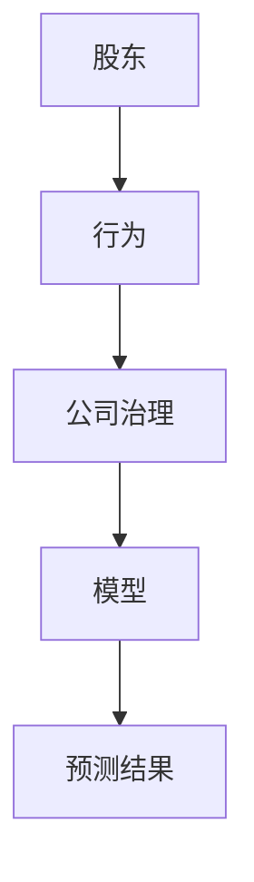
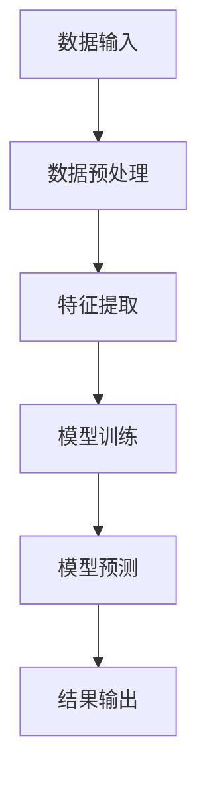
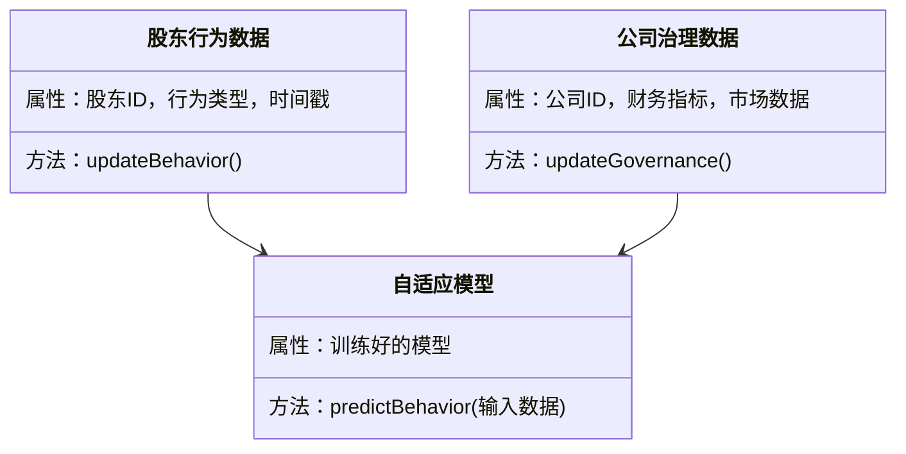
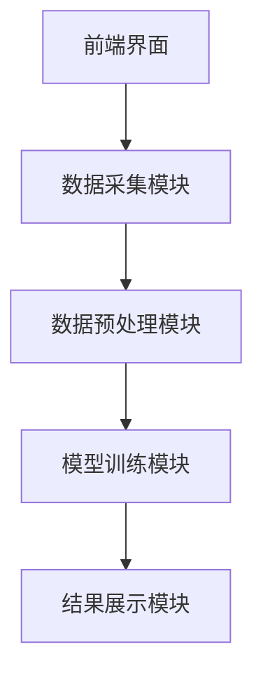
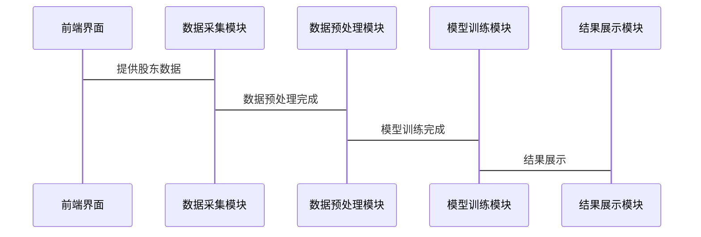

                 


# 利用AI构建自适应型股东行为模型：预测公司治理变化

## 关键词：自适应型股东行为模型, AI预测, 公司治理, 股东行为分析, 数据驱动方法, AI技术

## 摘要：  
随着公司治理的复杂化和不确定性增加，传统的股东行为分析方法已难以应对动态变化的市场环境。本文通过结合人工智能技术，提出了一种自适应型股东行为模型，旨在利用AI技术分析和预测股东行为，从而优化公司治理结构。本文将从背景、概念、算法、系统设计到实战案例，逐步解析如何构建和应用该模型，为公司治理的智能化提供新的思路。

---

# 第1章：背景介绍

## 1.1 问题背景

### 1.1.1 公司治理与股东行为的复杂性  
公司治理是企业运作的核心，而股东行为是影响公司治理的重要因素。股东的决策（如投票、增持或减持股份）往往受到市场环境、公司业绩、管理层行为等多种因素的影响。然而，这些行为具有动态性和不确定性，传统的分析方法难以捕捉这些复杂的变化。

### 1.1.2 股东行为对公司治理的影响  
股东行为直接影响公司的战略决策、管理层稳定性以及公司价值。例如，大股东的增持可能表明对公司前景的信心，而小股东的集体减持可能预示着对公司管理的不信任。因此，准确预测股东行为对公司治理的优化至关重要。

### 1.1.3 传统股东行为分析的局限性  
传统的股东行为分析方法通常依赖于统计分析和专家经验，但在面对复杂市场环境时，这些方法往往缺乏灵活性和准确性。此外，数据量的爆炸式增长也使得传统方法难以处理。

## 1.2 问题描述

### 1.2.1 股东行为预测的挑战  
股东行为的预测需要考虑多个变量，包括市场波动、公司财务状况、管理层行为等。这些变量之间存在复杂的交互作用，使得预测变得困难。

### 1.2.2 自适应型模型的需求  
为了应对动态变化的市场环境，需要一种能够实时调整和优化的模型，即自适应型股东行为模型。这种模型能够根据最新的数据和市场变化，动态更新预测结果。

### 1.2.3 AI在股东行为分析中的潜力  
人工智能技术，特别是机器学习和深度学习，具有强大的数据处理和模式识别能力，能够帮助我们构建更精准的股东行为预测模型。

## 1.3 问题解决思路

### 1.3.1 数据驱动的股东行为分析  
通过收集和分析大量的股东行为数据，利用AI技术提取特征，建立预测模型。

### 1.3.2 AI技术在自适应模型中的应用  
使用机器学习算法（如随机森林、神经网络）构建动态模型，实时更新预测结果。

### 1.3.3 自适应模型的核心目标  
通过实时数据更新和模型优化，提高股东行为预测的准确性和及时性，为公司治理决策提供支持。

## 1.4 边界与外延

### 1.4.1 自适应模型的适用范围  
适用于需要动态调整的公司治理场景，如股票市场波动、公司重大决策等。

### 1.4.2 模型的局限性与限制  
数据质量和数量直接影响模型的准确性；模型的预测结果仅供参考，不能完全替代人类决策。

### 1.4.3 与其他公司治理模型的区别  
传统的公司治理模型通常基于静态分析，而自适应模型基于动态数据和实时更新。

## 1.5 核心概念与要素组成

### 1.5.1 股东行为的核心要素  
包括股东的投票行为、股份增持/减持、关联交易等。

### 1.5.2 自适应模型的关键特征  
包括实时数据更新、动态预测、自我优化等。

### 1.5.3 模型的输入与输出  
输入：股东历史行为数据、市场数据、公司财务数据；输出：股东行为预测结果。

---

# 第2章：核心概念与联系

## 2.1 概念原理

### 2.1.1 自适应型股东行为模型的基本原理  
通过实时数据输入和模型更新，动态预测股东行为。

### 2.1.2 股东行为的动态变化  
股东行为受多种因素影响，模型需要能够捕捉这些变化。

### 2.1.3 AI在模型中的作用  
AI技术用于数据处理、特征提取和模型训练。

## 2.2 概念属性特征对比表格

| 模型类型       | 静态分析 | 动态分析 | 是否自适应 |
|----------------|----------|----------|------------|
| 传统模型       | 是       | 否       | 否          |
| 自适应模型     | 否       | 是       | 是          |

## 2.3 ER实体关系图架构



---

# 第3章：算法原理讲解

## 3.1 算法流程图



## 3.2 算法数学模型

### 3.2.1 股东行为的概率计算公式  
$$P(行为发生) = \frac{1}{1 + e^{-x}}$$  

### 3.2.2 损失函数  
$$L = \sum_{i=1}^{n} (y_i - \hat{y_i})^2$$  

## 3.3 算法实现代码

```python
import numpy as np
from sklearn.neural_network import MLPClassifier

# 数据预处理
X = np.array([...])  # 特征矩阵
y = np.array([...])  # 标签向量

# 模型训练
model = MLPClassifier()
model.fit(X, y)

# 模型预测
new_data = np.array([...])  # 新的数据
predictions = model.predict(new_data)
```

---

# 第4章：系统分析与架构设计

## 4.1 问题场景介绍

### 4.1.1 系统目标  
构建一个自适应型股东行为预测系统，支持实时数据更新和动态预测。

## 4.2 系统功能设计

### 4.2.1 领域模型类图



### 4.2.2 系统架构图



### 4.2.3 系统接口设计  
API接口：`/predict`，输入：股东数据，输出：预测结果。

## 4.3 系统交互序列图



---

# 第5章：项目实战

## 5.1 环境安装

### 5.1.1 Python版本  
Python 3.8+

### 5.1.2 库的安装  
`pip install numpy scikit-learn`

## 5.2 核心代码实现

### 5.2.1 数据预处理

```python
import pandas as pd

data = pd.read_csv(' shareholder_data.csv ')
data = data.dropna()
```

### 5.2.2 模型训练

```python
from sklearn.model_selection import train_test_split
from sklearn.metrics import accuracy_score

X_train, X_test, y_train, y_test = train_test_split(X, y, test_size=0.2)
model = MLPClassifier()
model.fit(X_train, y_train)
print("Accuracy:", accuracy_score(model.predict(X_test), y_test))
```

## 5.3 案例分析

### 5.3.1 数据分析  
通过对历史股东行为数据的分析，发现某些特定模式。

### 5.3.2 模型验证  
使用测试数据验证模型的准确性。

## 5.4 项目总结

### 5.4.1 成果展示  
展示模型的预测结果和实际数据的对比。

### 5.4.2 经验总结  
总结项目中的经验和教训，为后续优化提供参考。

---

# 第6章：最佳实践

## 6.1 小结

### 6.1.1 核心要点回顾  
自适应型股东行为模型的优势和应用场景。

## 6.2 注意事项

### 6.2.1 数据质量问题  
确保数据的准确性和完整性。

### 6.2.2 模型优化  
定期更新模型，保持预测的准确性。

## 6.3 拓展阅读

### 6.3.1 相关技术  
推荐相关书籍和论文，供进一步学习。

---

# 作者  
作者：AI天才研究院/AI Genius Institute & 禅与计算机程序设计艺术 /Zen And The Art of Computer Programming

