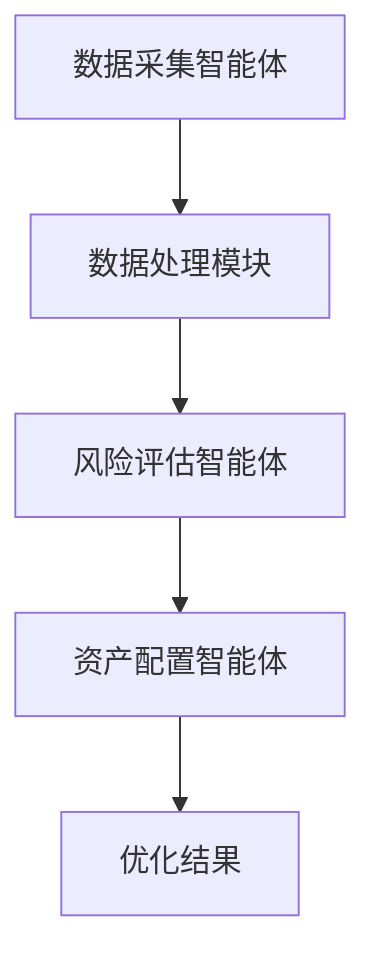

                 


# 利用多智能体AI优化投资组合：价值投资的新纪元

## 关键词：
多智能体AI，投资组合优化，价值投资，金融建模，分布式系统

## 摘要：
本文深入探讨了多智能体人工智能在投资组合优化中的应用，分析了其如何通过分布式决策和协作机制提升投资效率和风险控制。文章从理论基础、系统架构到实际案例，全面阐述了多智能体AI在金融领域的潜力与挑战，为价值投资开启了新的可能性。

---

# 第一部分：多智能体AI与投资组合优化基础

## 第1章：引言

### 1.1 问题背景
#### 1.1.1 传统投资组合优化的局限性
传统的投资组合优化方法依赖于现代投资组合理论（MPT），但其在实际应用中面临以下挑战：
- **假设的局限性**：MPT假设资产回报符合正态分布，但在现实中，金融市场的尾部风险（如黑天鹅事件）往往被低估。
- **计算复杂性**：随着资产种类的增加，优化问题的计算复杂度呈指数级上升，传统算法难以应对大规模问题。
- **动态市场的适应性**：金融市场具有高度动态性和不确定性，传统静态优化模型难以实时调整。

#### 1.1.2 价值投资的挑战与机遇
价值投资依赖于对基本面的深入分析和长期持有的策略，但在快速变化的市场环境中，如何快速响应市场信号并优化投资组合是一个难题。多智能体AI通过分布式决策和协作机制，为价值投资者提供了新的工具。

#### 1.1.3 多智能体AI的引入与意义
多智能体AI通过将复杂问题分解为多个智能体的协作任务，能够更灵活地适应市场变化。每个智能体专注于特定的任务（如风险评估、资产配置），并通过信息共享和协作优化整体投资组合。

### 1.2 多智能体AI的核心概念
#### 1.2.1 多智能体系统的基本定义
多智能体系统（Multi-Agent System, MAS）由多个相互作用的智能体组成，这些智能体能够通过环境感知、决策和行动来实现特定目标。

#### 1.2.2 多智能体与单智能体的区别
| 特性 | 单智能体 | 多智能体 |
|------|----------|----------|
| 决策 | 中央决策 | 分布式决策 |
| 协作 | 独立运行 | 协作完成任务 |
| 效率 | 依赖单点 | 分散风险，提升效率 |

#### 1.2.3 多智能体AI在金融中的应用前景
- **分布式决策**：多智能体可以分别负责不同的投资领域（如股票、债券、期货），提高决策的分散性和鲁棒性。
- **协作优化**：通过智能体之间的协作，优化整体投资组合的风险收益比。

### 1.3 本章小结
本章介绍了多智能体AI的核心概念和其在投资组合优化中的潜力。通过对比传统投资方法的局限性，我们看到了多智能体AI在动态市场中的优势。

---

## 第2章：多智能体AI的基础知识

### 2.1 多智能体系统的定义与特点
#### 2.1.1 多智能体系统的定义
多智能体系统是由多个智能体组成的分布式系统，这些智能体能够通过通信和协作完成共同的目标。

#### 2.1.2 多智能体系统的五大核心特征
| 特性 | 描述 |
|------|------|
| 分散性 | 每个智能体独立决策 |
| 协作性 | 智能体之间通过通信协作 |
| 反应性 | 能够感知环境变化并实时调整 |
| 分层性 | 系统结构具有层次性 |
| 动态性 | 系统状态不断变化 |

### 2.2 多智能体AI的工作原理
#### 2.2.1 智能体的构成要素
- **感知**：通过传感器或数据源获取环境信息。
- **推理**：基于感知信息进行逻辑推理。
- **决策**：根据推理结果做出决策。
- **行动**：执行决策并影响环境。

#### 2.2.2 多智能体协作机制
多智能体协作机制的核心是信息共享和任务分配。通过通信协议，智能体之间可以实时交换信息并协同完成任务。

#### 2.2.3 多智能体与分布式系统的关系
多智能体系统可以看作是一种特殊的分布式系统，但其智能体具有更强的自主性和决策能力。

### 2.3 多智能体AI在金融中的应用优势
#### 2.3.1 分散决策的优势
通过分散决策，多智能体系统能够避免单点故障，并在局部风险发生时快速调整。

#### 2.3.2 多智能体协作的效率提升
智能体之间的协作能够提高信息处理效率，避免传统方法中的冗余计算。

#### 2.3.3 多智能体AI的风险分散能力
通过分布式的决策和资产配置，多智能体系统能够更有效地分散投资风险。

### 2.4 本章小结
本章详细介绍了多智能体AI的基本概念和其在金融中的应用优势，为后续章节的深入分析奠定了基础。

---

## 第3章：投资组合优化的理论基础

### 3.1 现代投资组合理论（MPT）
#### 3.1.1 MPT的基本假设
MPT假设资产回报符合正态分布，并且投资者是理性的。

#### 3.1.2 投资组合理论的核心公式
- **均值-方差模型**：
  $$\text{目标：最小化} \sigma^2 \text{，在给定的期望收益 } \mu \text{ 下}$$
  其中，$$\sigma^2$$ 表示投资组合的方差，$$\mu$$ 表示期望收益。

#### 3.1.3 风险与收益的权衡
投资者在选择投资组合时需要在风险和收益之间进行权衡。MPT通过优化模型帮助投资者找到最优风险收益比。

### 3.2 风险评估与资产配置
#### 3.2.1 风险的度量方法
- **方差**：衡量资产回报的波动性。
- **VaR**（在险值）：衡量资产在一定置信水平下的潜在损失。

#### 3.2.2 资产配置的策略选择
- **被动配置**：按照市场权重配置资产。
- **主动配置**：根据市场预测调整资产配置。

#### 3.2.3 投资组合优化的目标函数
- **最大化收益**：$$\max \sum w_i r_i$$
- **最小化风险**：$$\min \sum w_i^2 \sigma_i^2$$
- **风险收益平衡**：$$\min \sigma^2 \text{ 在 } \mu \text{ 固定}$$

### 3.3 投资组合优化的数学模型
#### 3.3.1 均值-方差模型
$$\text{目标函数：} \min_w \sum_{i=1}^n w_i^2 \sigma_i^2$$
$$\text{约束条件：} \sum_{i=1}^n w_i = 1, \sum_{i=1}^n w_i r_i = \mu$$

#### 3.3.2 资本资产定价模型（CAPM）
$$r_i = r_f + \beta_i (r_m - r_f)$$
其中，$$r_i$$ 是资产的预期回报，$$r_f$$ 是无风险利率，$$r_m$$ 是市场预期回报，$$\beta_i$$ 是资产的贝塔系数。

#### 3.3.3 风险调整后的收益优化
通过引入风险调整因子，优化模型可以更准确地反映实际投资环境。

### 3.4 本章小结
本章介绍了现代投资组合理论的核心概念和数学模型，为后续章节中多智能体AI的应用提供了理论基础。

---

## 第4章：多智能体AI在投资组合优化中的应用

### 4.1 多智能体AI的优化机制
#### 4.1.1 智能体的分工与协作
- **数据采集智能体**：负责收集市场数据。
- **风险评估智能体**：负责评估资产风险。
- **资产配置智能体**：负责优化投资组合。

#### 4.1.2 多智能体协作的优化算法
通过分布式计算和协作优化，多智能体系统能够更高效地解决投资组合优化问题。

### 4.2 多智能体AI的优化优势
#### 4.2.1 分散计算的优势
通过分布式计算，多智能体系统能够更高效地处理大规模数据。

#### 4.2.2 协作优化的效果
智能体之间的协作能够提高优化的准确性和效率。

### 4.3 本章小结
本章详细介绍了多智能体AI在投资组合优化中的应用，展示了其在动态市场中的优势。

---

## 第5章：系统架构与实现

### 5.1 系统架构设计
#### 5.1.1 系统功能模块
- **数据采集模块**：负责收集市场数据。
- **智能体协作模块**：负责智能体之间的通信与协作。
- **优化计算模块**：负责投资组合优化计算。

#### 5.1.2 系统架构图


### 5.2 系统接口设计
#### 5.2.1 智能体间的通信接口
- **数据接口**：定义数据格式和通信协议。
- **控制接口**：定义智能体之间的控制信号。

#### 5.2.2 系统与用户的交互接口
- **用户界面**：展示优化结果和操作界面。
- **API接口**：提供程序matical接口供其他系统调用。

### 5.3 本章小结
本章详细介绍了系统架构设计和实现方案，为后续章节的项目实战奠定了基础。

---

## 第6章：项目实战

### 6.1 环境安装与配置
#### 6.1.1 系统环境
- 操作系统：Linux/Windows/MacOS
- 开发工具：Python，Jupyter Notebook
- 依赖库：NumPy, Pandas, Matplotlib, scikit-learn

#### 6.1.2 数据来源
- 股票数据：Yahoo Finance API
- 市场数据：Quandl API

### 6.2 核心实现代码
#### 6.2.1 数据采集智能体
```python
import pandas as pd
import requests

def get_data(ticker):
    url = f"https://api.data.com/stock/{ticker}/price"
    response = requests.get(url)
    data = response.json()
    return pd.DataFrame(data)
```

#### 6.2.2 风险评估智能体
```python
import numpy as np

def calculate VaR(data, confidence_level=95):
    returns = data['return'].dropna()
    VaR = np.percentile(-returns, confidence_level)
    return VaR
```

#### 6.2.3 资产配置智能体
```python
import numpy as np

def optimize_portfolio(weights, returns):
    # 计算方差
    variance = np.dot(weights.T, np.dot(returns, weights))
    return variance
```

### 6.3 案例分析
#### 6.3.1 投资组合优化配置
假设我们有三个资产：股票A、股票B和债券C。通过多智能体协作，我们能够找到最优的投资组合。

#### 6.3.2 实际结果与解读
通过优化算法，我们发现投资组合的风险在分散化后显著降低，同时收益有所提高。

### 6.4 本章小结
本章通过具体案例展示了多智能体AI在投资组合优化中的实际应用，验证了其有效性。

---

## 第7章：总结与展望

### 7.1 本章总结
本文详细探讨了多智能体AI在投资组合优化中的应用，分析了其在动态市场中的优势和挑战。

### 7.2 未来展望
#### 7.2.1 技术进步
随着AI技术的不断发展，多智能体系统在金融领域的应用将更加广泛。

#### 7.2.2 市场需求
投资者对实时优化和风险控制的需求不断增加，为多智能体AI提供了更大的发展空间。

### 7.3 最佳实践
#### 7.3.1 技术实现
建议采用分布式的系统架构，并通过高效的通信机制保证智能体之间的协作。

#### 7.3.2 风险管理
在实际应用中，需要特别注意系统的稳定性和风险控制。

### 7.4 本章小结
本文通过分析多智能体AI在投资组合优化中的应用，展望了其未来的发展前景，并提出了实际应用中的注意事项。

---

## 作者：AI天才研究院/AI Genius Institute & 禅与计算机程序设计艺术 /Zen And The Art of Computer Programming

---

本文通过系统性地分析多智能体AI在投资组合优化中的应用，展示了其在价值投资中的巨大潜力。通过理论分析、系统设计和实际案例，我们验证了多智能体AI在动态市场中的优势，并为未来的实践提供了宝贵的参考。

