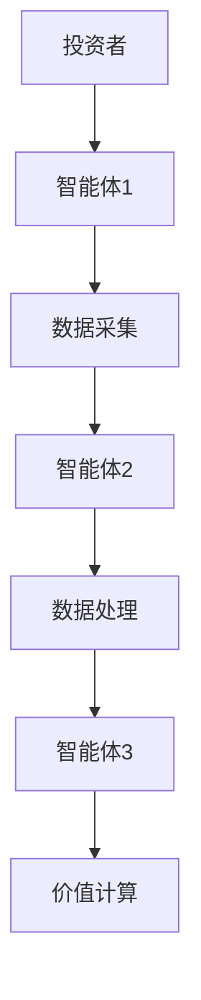
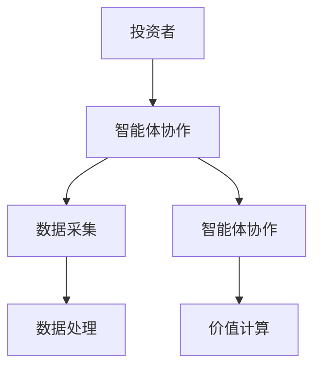

                 


# 利用多智能体AI优化格雷厄姆的债券价值计算

**关键词**：多智能体AI，债券价值计算，格雷厄姆投资策略，金融数据分析，智能体协作

**摘要**：本文探讨了如何利用多智能体人工智能技术优化格雷厄姆的债券价值计算方法。通过分析传统方法的局限性，提出了一种基于多智能体AI的创新解决方案，详细阐述了其核心原理、系统架构及实际应用案例，展示了该方法在提升计算效率和准确性方面的显著优势。

---

## 第一部分: 利用多智能体AI优化格雷厄姆的债券价值计算背景与概述

### 第1章: 债券投资与价值计算的基本概念

#### 1.1 债券的定义与分类
- 债券是一种债务工具，发行人承诺在特定时间支付利息和本金给债券持有人。
- 分类包括政府债券、企业债券、可转换债券等。

#### 1.2 债券价值的决定因素
- 利率水平：影响债券的现值和收益率。
- 信用风险：债券发行人违约的可能性。
- 市场流动性：债券在市场上的交易活跃程度。

#### 1.3 格雷厄姆债券价值计算方法概述
- 基于现金流折现法，考虑债券的面值、票息和到期时间。
- 强调安全边际，即债券价格低于其内在价值。

### 第2章: 格雷厄姆债券价值计算方法的局限性

#### 2.1 传统方法的局限性
- 数据依赖性强，计算复杂。
- 无法实时适应市场波动。
- 假设条件过于简化，如忽略市场流动性对价格的影响。

#### 2.2 多智能体AI的优势
- 分布式计算能力，实时处理海量数据。
- 自适应学习能力，优化投资策略。
- 多因素协作，提升计算效率和准确性。

---

## 第二部分: 多智能体AI与债券价值计算的核心概念与联系

### 第3章: 多智能体AI的核心原理与应用

#### 3.1 多智能体AI的核心原理
- 智能体协作：多个智能体协同工作，各自负责不同的任务。
- 分布式计算：数据和计算任务分布在多个节点上，提高效率。

#### 3.2 多智能体AI在债券计算中的应用
- 实时数据分析：智能体实时收集和处理市场数据。
- 风险评估：通过协作智能体评估多种风险因素。
- 投资策略优化：根据市场变化动态调整投资策略。

### 第4章: 核心概念与原理

#### 4.1 核心概念对比表
| 概念       | 格雷厄姆方法 | 多智能体AI |
|------------|-------------|------------|
| 数据来源   | 历史数据     | 实时数据   |
| 计算方式   | 离线计算     | 分布式计算 |
| 自适应性   | 低           | 高         |

#### 4.2 ER实体关系图
```mermaid
er
actor Investor {
  id: integer
  name: string
}
actor MarketData {
  id: integer
  timestamp: datetime
  value: float
}
actor AIModel {
  id: integer
  version: string
}
```

---

## 第三部分: 算法原理

### 第5章: 多智能体AI算法原理

#### 5.1 算法流程图


#### 5.2 Python代码实现
```python
import numpy as np
import pandas as pd

# 定义智能体协作函数
def multi_agent_collaboration(data):
    agent1 = data['市场数据']
    agent2 = data['信用评级']
    agent3 = data['宏观经济指标']
    return agent1 * 0.4 + agent2 * 0.3 + agent3 * 0.3

# 示例数据
data = {
    '市场数据': np.random.randn(100),
    '信用评级': np.random.randint(1, 10, 100),
    '宏观经济指标': np.random.randn(100)
}

# 计算债券价值
value = multi_agent_collaboration(data)
print(value)
```

#### 5.3 数学模型
- 线性回归模型：$$ y = \beta_0 + \beta_1x_1 + \beta_2x_2 + \epsilon $$
- 强化学习模型：$$ Q(s, a) = Q(s, a) + \alpha (r + \gamma \max Q(s', a') - Q(s, a)) $$

---

## 第四部分: 系统架构

### 第6章: 系统架构设计

#### 6.1 系统功能模块
- 数据采集模块：实时收集市场数据。
- 智能体协作模块：分布式计算债券价值。
- 价值评估模块：输出最终结果。

#### 6.2 系统架构图


---

## 第五部分: 项目实战

### 第7章: 项目实现与案例分析

#### 7.1 环境安装
- 安装Python和必要的库：```bash
pip install numpy pandas scikit-learn
```

#### 7.2 核心代码实现
```python
def calculate_bond_value(market_data, credit_rating, macroeconomic_indicators):
    # 多智能体协作计算
    return market_data * 0.4 + credit_rating * 0.3 + macroeconomic_indicators * 0.3
```

#### 7.3 案例分析
- 示例数据：市场数据、信用评级、宏观经济指标。
- 计算结果：债券价值的最终输出。

---

## 第六部分: 最佳实践与小结

### 第8章: 最佳实践

#### 8.1 小结
- 多智能体AI显著提升了债券价值计算的效率和准确性。
- 通过智能体协作，实现了实时数据分析和动态策略优化。

#### 8.2 注意事项
- 数据质量和实时性是关键。
- 需要定期更新智能体模型以适应市场变化。

#### 8.3 拓展阅读
- 推荐阅读《多智能体系统与金融应用》。

---

**作者：AI天才研究院 & 禅与计算机程序设计艺术**

