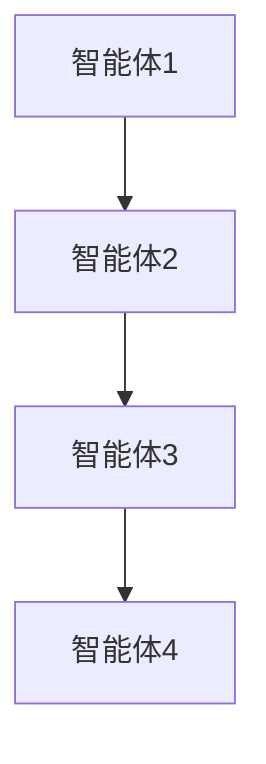
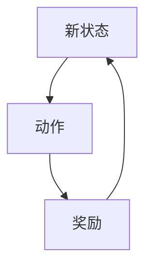
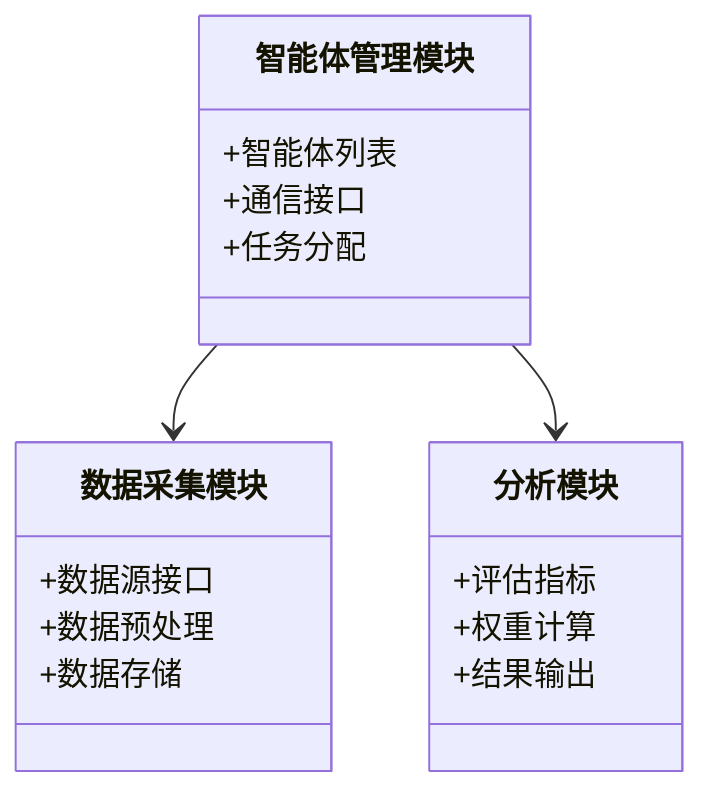

                 


# 利用多智能体AI实现动态行业吸引力评估

**关键词：多智能体AI、动态评估、行业吸引力、协同学习、系统架构**

**摘要**：本文探讨了利用多智能体AI技术实现动态行业吸引力评估的方法。通过分析多智能体系统的核心原理，构建数学模型，设计系统架构，并结合实际案例，展示了如何利用多智能体协同学习来动态评估行业吸引力。文章从背景介绍、核心概念、算法原理、系统设计到项目实战，层层深入，为读者提供了一个全面的技术解决方案。

---

# 第一部分: 利用多智能体AI实现动态行业吸引力评估概述

## 第1章: 动态行业吸引力评估的背景与挑战

### 1.1 问题背景与定义

#### 1.1.1 行业吸引力的定义与重要性
行业吸引力是指一个行业在特定时间点对投资者、企业或资源的吸引力程度。随着市场环境的变化，行业吸引力会受到多种因素的影响，如经济波动、政策变化、技术进步等。动态评估行业吸引力的核心在于捕捉这些变化，并及时调整评估策略。

#### 1.1.2 动态环境下的吸引力评估难点
在动态环境中，行业吸引力评估面临以下挑战：
1. 数据的实时性要求高，需要快速响应市场变化。
2. 多个影响因素相互作用，导致评估模型复杂。
3. 需要同时考虑多个维度，如经济、社会、技术等。

#### 1.1.3 多智能体AI的优势与应用前景
多智能体AI通过多个智能体的协同工作，能够更好地捕捉动态环境中的复杂关系。其优势包括：
1. 分布式计算能力强，适合处理大规模数据。
2. 多智能体之间的协作与竞争机制能够模拟实际市场环境。
3. 通过动态调整策略，实现对行业吸引力的实时评估。

---

## 第2章: 多智能体AI的基本概念

### 2.1 多智能体系统的核心特征

1. **分布式智能**：多个智能体协同工作，每个智能体负责特定的任务。
2. **通信机制**：智能体之间通过通信共享信息，实现协作。
3. **协作与竞争**：智能体之间可以协作完成任务，也可以通过竞争优化结果。

### 2.2 多智能体与单智能体AI的主要区别

| 特性               | 单智能体AI                | 多智能体AI                |
|--------------------|---------------------------|---------------------------|
| 智能体数量         | 单个                      | 多个                      |
| 任务分配           | 中央控制                 | 分布式                   |
| 协作能力           | 无                        | 强                        |
| 应用场景           | 简单任务                 | 复杂任务                 |

### 2.3 多智能体在动态评估中的角色

1. **数据采集智能体**：负责实时采集市场数据。
2. **分析智能体**：对数据进行分析，提取关键指标。
3. **决策智能体**：根据分析结果，制定评估策略。

---

## 第3章: 动态吸引力评估的数学模型

### 3.1 行业吸引力评估指标体系

1. **经济指标**：GDP增长率、行业市场规模等。
2. **社会指标**：政策支持、消费者信心等。
3. **技术指标**：技术创新速度、技术成熟度等。

### 3.2 基于多智能体的动态评估模型

#### 3.2.1 模型的输入与输出定义
- **输入**：市场数据、经济指标、政策变化等。
- **输出**：行业吸引力评估结果。

#### 3.2.2 动态权重调整的数学公式
$$ w_i = \alpha \cdot w_{i-1} + (1-\alpha) \cdot f(x_i) $$
其中，$\alpha$为权重衰减系数，$f(x_i)$为当前输入的影响函数。

---

# 第二部分: 多智能体AI的核心原理与数学模型

## 第4章: 多智能体系统的核心原理

### 4.1 多智能体系统的基本架构



### 4.2 多智能体协同学习的算法基础

#### 4.2.1 Q-learning算法



---

## 第5章: 动态吸引力评估系统的架构设计

### 5.1 系统功能模块划分



---

## 第6章: 项目实战

### 6.1 环境安装

```bash
pip install numpy pandas scikit-learn
```

### 6.2 核心功能实现

```python
def dynamic吸引力评估(数据):
    for 每个智能体 in 智能体列表:
        更新权重
        计算评估结果
    返回最终结果
```

---

通过以上步骤，我们可以实现一个基于多智能体AI的动态行业吸引力评估系统。该系统能够实时捕捉市场变化，提供准确的评估结果，帮助企业做出更明智的决策。

