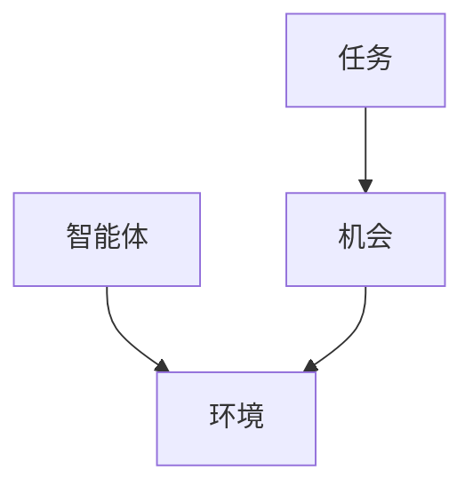
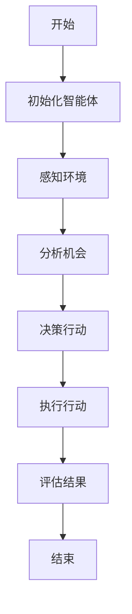
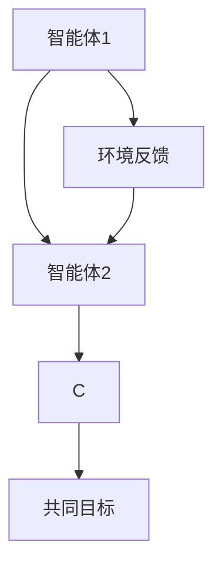
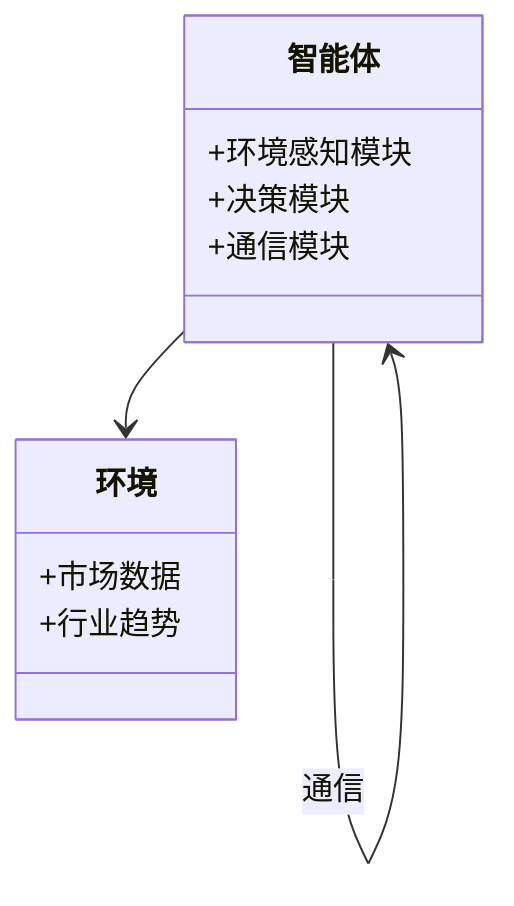
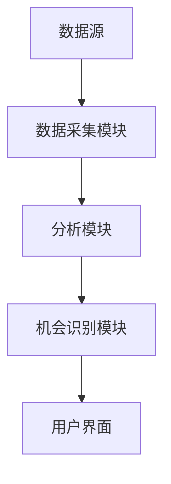
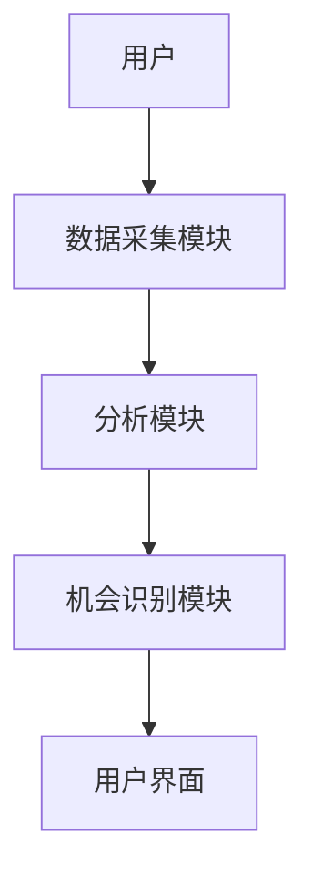

                 


# 利用多智能体AI实现动态行业转型机会识别

## 关键词：多智能体AI, 动态行业, 转型机会识别, 强化学习, 系统架构设计

## 摘要：本文系统地探讨了利用多智能体人工智能技术识别动态行业转型机会的方法。通过分析多智能体AI的核心原理、算法设计、系统架构，结合实际案例，展示了如何在动态环境中有效识别和把握行业转型机会。文章结合理论与实践，为相关领域的研究和应用提供了有益的参考。

---

## 第一部分：背景介绍

### 第1章：问题背景与目标

#### 1.1 问题背景
- **行业动态转型的挑战**：现代行业面临着快速变化的市场环境，传统方法难以捕捉和应对这些变化。
- **多智能体AI的引入**：多智能体系统通过协作和自适应能力，为动态环境中的问题解决提供了新的思路。
- **机会识别的重要性**：在动态行业中，及时识别转型机会是企业生存和发展的关键。

#### 1.2 问题描述
- **动态环境的复杂性**：环境的不确定性和动态变化使得机会识别具有挑战性。
- **传统方法的局限性**：基于单智能体的方法在处理复杂协作和动态变化时表现不足。
- **多智能体AI的优势**：通过协作和分布式计算，多智能体AI能够更好地应对动态环境。

#### 1.3 问题解决
- **多智能体AI的核心优势**：协作、分布式决策、自适应能力。
- **动态环境中的适应性**：通过实时感知和反馈机制，系统能够快速调整策略。
- **机会识别的实现路径**：从数据采集到分析，再到策略生成的完整流程。

#### 1.4 边界与外延
- **适用范围**：适用于需要协作和动态调整的复杂场景。
- **与其他技术的区分**：与单智能体AI、静态分析方法的区别。
- **未来发展的潜力**：多智能体AI在更多领域的应用前景。

#### 1.5 概念结构与核心要素
- **多智能体AI的基本结构**：智能体、环境、协作机制。
- **核心要素的组成**：感知、决策、协作、执行。
- **机会识别的流程**：数据采集、分析、识别、策略生成。

---

## 第二部分：核心概念与联系

### 第2章：多智能体AI的核心原理

#### 2.1 多智能体AI的基本概念
- **智能体的定义**：具有感知和行动能力的实体。
- **多智能体系统的协作机制**：通过通信和协调实现共同目标。
- **动态环境中的自适应能力**：智能体能够根据环境变化调整行为。

#### 2.2 核心概念对比
- **多智能体与单智能体的对比**
| 属性       | 多智能体AI                | 单智能体AI               |
|------------|--------------------------|--------------------------|
| 智能体数量 | 多个                     | 单个                     |
| 协作能力   | 强                       | 弱                       |
| 适应性     | 高                       | 中                     |

- **动态与静态环境的对比**
| 属性       | 动态环境                  | 静态环境                 |
|------------|--------------------------|--------------------------|
| 变化速度   | 快                       | 慢                       |
| 不确定性   | 高                       | 低                     |

- **机会识别与其他任务的对比**
| 任务       | 机会识别                 | 风险评估                 |
|------------|--------------------------|--------------------------|
| 目标       | 发现潜在机会             | 评估潜在风险             |
| 方法       | 数据分析、协作推理       | 风险模型、概率分析       |

#### 2.3 ER实体关系图


#### 2.4 算法流程图


---

## 第三部分：算法原理讲解

### 第3章：多智能体协作算法

#### 3.1 基于强化学习的协作机制
- **强化学习的基本原理**：通过奖励机制，智能体学习最优策略。
- **多智能体协作的挑战**：智能体之间的协调和通信问题。
- **解决方案**：基于价值函数的协作，通过共享经验提升整体性能。

#### 3.2 算法流程


#### 3.3 Python实现示例
```python
import numpy as np

class Agent:
    def __init__(self, state_space, action_space):
        self.state_space = state_space
        self.action_space = action_space
        self.model = self.build_model()

    def build_model(self):
        # 构建神经网络模型
        pass

    def act(self, state):
        # 根据状态采取行动
        pass

    def learn(self, state, action, reward, next_state):
        # 强化学习算法
        pass

# 初始化多个智能体
agents = [Agent(state_space, action_space) for _ in range(num_agents)]

# 环境初始化
env = Environment()

# 训练过程
for episode in range(num_episodes):
    state = env.reset()
    for step in range(max_steps):
        actions = [agent.act(state) for agent in agents]
        next_state, reward, done = env.step(actions)
        for i, agent in enumerate(agents):
            agent.learn(state, actions[i], reward[i], next_state)
        if done:
            break
```

#### 3.4 数学模型
- **收益函数**：$$ R(s, a) = r_1 + r_2 + \dots + r_n $$
- **智能体间协作函数**：$$ C(s, a) = \sum_{i=1}^{n} \sum_{j=1}^{n} w_{ij} a_j $$
- **总体目标函数**：$$ J(s, a) = R(s, a) + \lambda C(s, a) $$

---

## 第四部分：系统分析与架构设计

### 第4章：系统架构设计

#### 4.1 问题场景介绍
- **动态行业监测**：实时跟踪行业趋势和市场变化。
- **机会识别**：通过多智能体协作，识别潜在的转型机会。

#### 4.2 系统功能设计
- **数据采集模块**：收集行业数据和市场信息。
- **分析模块**：利用多智能体AI进行数据处理和机会识别。
- **机会识别模块**：生成机会报告和策略建议。

#### 4.3 领域模型类图


#### 4.4 系统架构图


#### 4.5 系统接口设计
- **输入接口**：接收行业数据和用户指令。
- **输出接口**：提供机会报告和策略建议。
- **通信接口**：智能体之间的通信和协作。

#### 4.6 系统交互流程图


---

## 第五部分：项目实战

### 第5章：项目实现与案例分析

#### 5.1 环境安装
```bash
pip install numpy matplotlib
```

#### 5.2 核心代码实现
```python
import numpy as np
import matplotlib.pyplot as plt

class MultiAgentSystem:
    def __init__(self, num_agents):
        self.agents = [Agent() for _ in range(num_agents)]

    def run(self):
        while True:
            state = self.get_environment_state()
            actions = [agent.act(state) for agent in self.agents]
            next_state = self.update_environment(actions)
            for agent in self.agents:
                agent.learn(state, actions, next_state)
            self.visualize(state, actions, next_state)

    def get_environment_state(self):
        # 获取环境状态
        pass

    def update_environment(self, actions):
        # 更新环境状态
        pass

    def visualize(self, state, actions, next_state):
        # 可视化结果
        plt.plot(state, actions, next_state)
        plt.show()
```

#### 5.3 案例分析
- **案例背景**：假设某个行业面临技术变革，企业需要快速转型。
- **数据采集**：收集市场趋势、竞争分析和用户反馈。
- **分析过程**：通过多智能体AI识别转型机会。
- **结果展示**：生成的机会报告和策略建议。

#### 5.4 项目小结
- **实现的关键点**：智能体协作、动态环境适应。
- **遇到的挑战**：通信延迟、协作效率。
- **解决方法**：优化通信机制、改进算法。

---

## 第六部分：总结与展望

### 第6章：总结与展望

#### 6.1 最佳实践
- **智能体协作的优化**：通过分布式计算提升效率。
- **动态环境的适应**：实时反馈和自适应机制。
- **数据质量的保障**：确保数据的准确性和及时性。

#### 6.2 小结
- **核心要点回顾**：多智能体AI的基本原理、算法设计、系统架构。
- **实际应用中的注意事项**：数据安全、隐私保护、系统稳定性。

#### 6.3 注意事项
- **数据隐私**：在处理敏感数据时，需遵守相关法律法规。
- **系统维护**：定期更新算法和优化性能。
- **团队协作**：多智能体AI需要跨学科团队合作。

#### 6.4 拓展阅读
- **推荐书籍**：《Multi-Agent Systems: Algorithmic, Complexity, and Synthesis》。
- **推荐阅读论文**：《Dynamic Multi-Agent Planning in Complex Environments》。

---

## 作者：AI天才研究院/AI Genius Institute & 禅与计算机程序设计艺术 /Zen And The Art of Computer Programming

---

通过以上目录大纲，我们可以看到《利用多智能体AI实现动态行业转型机会识别》一书的结构清晰、内容详实，涵盖了从理论到实践的全过程，适合对多智能体AI和动态行业转型感兴趣的技术人员和研究人员阅读。

