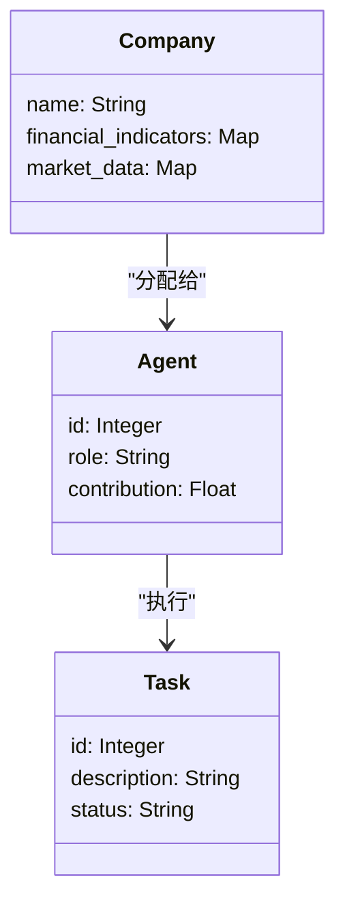
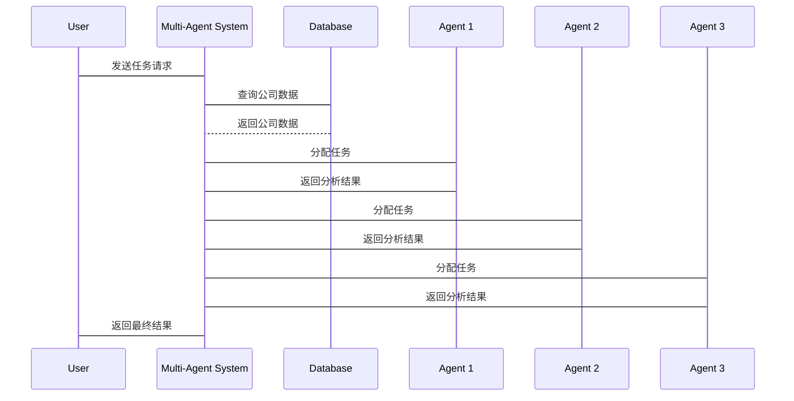

                 


# 利用多智能体AI实现费雪式的卓越公司识别

> 关键词：多智能体AI，费雪投资理论，卓越公司识别，算法模型，投资策略

> 摘要：本文探讨了如何利用多智能体人工智能技术来实现费雪投资理论中的卓越公司识别。通过分析多智能体AI的优势和费雪投资理论的核心要素，结合实际应用场景，详细阐述了多智能体AI在公司识别中的应用方法，包括算法原理、系统架构设计、项目实战以及最佳实践。本文旨在为投资者和技术人员提供一种新的视角和工具，以更高效、精准的方式识别卓越公司，优化投资决策。

---

# 第1章: 多智能体AI与费雪投资理论的结合

## 1.1 费雪投资理论概述

### 1.1.1 费雪投资理论的核心思想
费雪投资理论是由 Benjamin Graham 的学生 David Dodd 和 Benjamin Graham 共同提出的一种投资方法，强调通过基本面分析来识别具有长期竞争优势的公司。其核心思想包括：

1. **内在价值**：公司的真实价值可以通过其财务报表和市场数据计算得出。
2. **安全边际**：以低于内在价值的价格购买股票，以降低投资风险。
3. **长期视角**：关注公司的长期盈利能力和发展潜力。

### 1.1.2 费雪投资理论的适用场景
费雪投资理论适用于以下场景：
1. **长期价值投资**：寻找具有持续竞争优势的公司。
2. **防御性投资**：在市场波动中保持稳定收益。
3. **理性决策**：通过数据和逻辑而非情绪做出投资决策。

### 1.1.3 费雪投资理论的局限性
费雪投资理论的局限性包括：
1. **依赖历史数据**：无法完全预测未来的变化。
2. **人为判断影响**：分析过程中可能存在主观判断。
3. **忽略市场波动**：未能充分考虑短期市场波动的影响。

---

## 1.2 多智能体AI的基本概念

### 1.2.1 多智能体系统的定义
多智能体系统是由多个相互作用的智能体组成的系统，这些智能体能够通过通信和协作完成复杂任务。其特点包括：
- **分布式智能**：每个智能体都具有一定的自主性。
- **协作性**：智能体之间可以协作完成任务。
- **适应性**：系统能够根据环境变化动态调整。

### 1.2.2 多智能体系统的特征
多智能体系统的主要特征包括：
1. **智能体之间的通信**：通过消息传递机制进行信息共享。
2. **任务分配与协作**：智能体之间可以动态分配任务。
3. **学习与自适应**：智能体能够通过经验改进性能。

### 1.2.3 多智能体系统与单智能体系统的区别
| 特性                | 单智能体系统                 | 多智能体系统                 |
|---------------------|-----------------------------|-----------------------------|
| 智能体数量          | 1                           | 多                           |
| 智能体之间的关系    | 无协作                       | 协作                         |
| 复杂任务处理能力    | 有限                         | 更强                         |
| 可扩展性            | 有限                         | 更高                         |

---

## 1.3 费雪投资理论与多智能体AI的结合

### 1.3.1 费雪投资理论与多智能体AI的契合点
费雪投资理论与多智能体AI的契合点在于：
1. **数据处理能力**：多智能体AI能够高效处理大量数据，帮助分析公司财务报表和市场数据。
2. **协作能力**：多个智能体可以分别负责不同的分析任务，如财务分析、市场趋势分析等。
3. **自适应能力**：多智能体AI能够根据市场变化动态调整分析策略。

### 1.3.2 多智能体AI在费雪投资理论中的应用潜力
多智能体AI在费雪投资理论中的应用潜力包括：
1. **自动化分析**：通过多智能体协作，自动完成公司基本面分析。
2. **实时监控**：实时跟踪市场变化，快速调整投资策略。
3. **风险控制**：通过多智能体协作，识别潜在风险并制定应对策略。

### 1.3.3 费雪投资理论与多智能体AI结合的必要性
费雪投资理论与多智能体AI结合的必要性在于：
1. **提高效率**：通过多智能体协作，提高公司识别的效率。
2. **增强准确性**：多个智能体的协作可以减少人为判断的误差。
3. **适应市场变化**：多智能体AI能够快速适应市场变化，优化投资策略。

---

# 第2章: 多智能体AI实现卓越公司识别的背景与问题描述

## 2.1 卓越公司的定义与特征

### 2.1.1 卓越公司的定义
卓越公司是指那些在行业中具有持续竞争优势，并能够为股东创造长期价值的公司。

### 2.1.2 卓越公司的特征
卓越公司的特征包括：
1. **强大的财务表现**：持续的高收益和低负债。
2. **竞争优势**：具有独特的竞争优势，如专利、品牌、技术等。
3. **管理团队**：优秀的管理团队和企业治理。
4. **创新能力强**：能够不断推出新产品或服务。

### 2.1.3 卓越公司的识别标准
卓越公司的识别标准包括：
1. **财务指标**：如ROE（净资产收益率）、净利润率等。
2. **市场地位**：如市场份额、品牌影响力等。
3. **管理团队**：如管理团队的经验和能力。

---

## 2.2 当前公司识别方法的局限性

### 2.2.1 传统财务指标分析的局限性
传统财务指标分析的局限性包括：
1. **静态性**：财务指标通常是静态的，无法反映公司的动态变化。
2. **片面性**：财务指标可能无法全面反映公司的实际经营状况。
3. **忽视市场因素**：财务指标分析通常忽视市场波动对公司的影响。

### 2.2.2 传统公司评级模型的局限性
传统公司评级模型的局限性包括：
1. **模型假设的局限性**：评级模型通常基于某些假设，可能无法完全反映现实情况。
2. **数据依赖性**：评级模型依赖于历史数据，可能无法预测未来的变化。
3. **忽视公司内部因素**：评级模型通常忽视公司的内部管理能力和创新能力。

### 2.2.3 传统公司识别方法的不足
传统公司识别方法的不足包括：
1. **缺乏动态性**：传统方法通常无法实时更新公司的识别结果。
2. **依赖主观判断**：传统方法在分析过程中可能受到主观判断的影响。
3. **计算复杂性**：传统方法通常需要复杂的计算，难以快速得出结果。

---

## 2.3 多智能体AI在公司识别中的优势

### 2.3.1 多智能体AI的分布式计算能力
多智能体AI的分布式计算能力使得它可以同时处理大量数据，并快速得出结果。

### 2.3.2 多智能体AI的自适应学习能力
多智能体AI能够通过机器学习技术不断优化自身的分析能力，适应市场变化。

### 2.3.3 多智能体AI的协作能力
多个智能体可以协作完成复杂的分析任务，如财务分析、市场趋势分析等。

---

# 第3章: 多智能体AI实现费雪投资理论的核心要素

## 3.1 费雪投资理论的核心要素

### 3.1.1 费雪投资理论的五个关键因素
费雪投资理论的五个关键因素包括：
1. **低市盈率**：市盈率低于市场平均水平。
2. **高ROE**：净资产收益率高。
3. **稳定的收益**：公司收益稳定，波动性小。
4. **强大的管理层**：公司管理层能力强，治理结构良好。
5. **健康的财务状况**：公司财务状况健康，负债低，现金流充裕。

### 3.1.2 费雪投资理论的数学模型
费雪投资理论的数学模型可以表示为：

$$
\text{内在价值} = \sum_{i=1}^{n} \text{财务指标}_i \times \text{权重}_i
$$

其中，$\text{财务指标}_i$ 是第 $i$ 个财务指标，$\text{权重}_i$ 是对应的权重。

### 3.1.3 费雪投资理论的实施步骤
费雪投资理论的实施步骤包括：
1. **选择目标行业**：根据市场情况选择具有潜力的行业。
2. **筛选公司**：根据财务指标筛选出符合条件的公司。
3. **深入分析**：对公司进行深入分析，评估其竞争优势。
4. **制定投资策略**：根据分析结果制定投资策略。
5. **监控与调整**：定期监控公司情况，及时调整投资策略。

---

## 3.2 多智能体AI的核心要素

### 3.2.1 多智能体AI的智能体结构
多智能体AI的智能体结构包括：
1. **感知层**：负责数据的采集和处理。
2. **决策层**：负责根据感知数据做出决策。
3. **执行层**：负责执行决策并反馈结果。

### 3.2.2 多智能体AI的通信机制
多智能体AI的通信机制包括：
1. **消息传递**：通过消息传递机制进行信息共享。
2. **分布式数据库**：通过分布式数据库实现数据共享。
3. **事件驱动**：通过事件驱动机制进行实时通信。

### 3.2.3 多智能体AI的协作机制
多智能体AI的协作机制包括：
1. **任务分配**：根据智能体的能力分配任务。
2. **协作完成**：智能体协作完成任务。
3. **动态调整**：根据环境变化动态调整协作策略。

---

## 3.3 费雪投资理论与多智能体AI的结合要素

### 3.3.1 费雪投资理论中的公司特征与多智能体AI的结合
费雪投资理论中的公司特征与多智能体AI的结合体现在：
1. **数据处理能力**：多智能体AI能够高效处理大量财务数据和市场数据。
2. **协作能力**：多个智能体可以分别负责不同的分析任务，如财务分析、市场趋势分析等。
3. **自适应能力**：多智能体AI能够根据市场变化动态调整分析策略。

### 3.3.2 多智能体AI如何模拟费雪投资理论中的市场行为
多智能体AI可以通过以下方式模拟费雪投资理论中的市场行为：
1. **市场趋势分析**：通过分析市场趋势，预测公司的未来表现。
2. **公司竞争分析**：通过分析公司的竞争优势，评估其市场地位。
3. **投资策略优化**：通过多智能体协作，优化投资策略。

### 3.3.3 多智能体AI如何优化费雪投资理论的实施过程
多智能体AI可以通过以下方式优化费雪投资理论的实施过程：
1. **自动化分析**：通过自动化分析，提高分析效率。
2. **实时监控**：实时跟踪公司和市场变化，及时调整投资策略。
3. **风险控制**：通过多智能体协作，识别潜在风险并制定应对策略。

---

# 第4章: 多智能体AI实现费雪投资理论的算法原理

## 4.1 多智能体协作机制的算法原理

### 4.1.1 基于强化学习的多智能体协作机制
基于强化学习的多智能体协作机制是一种通过智能体之间的协作来优化整体性能的算法。其核心思想是通过智能体之间的协作，实现对目标的共同追求。

### 4.1.2 多智能体协作机制的数学模型
多智能体协作机制的数学模型可以表示为：

$$
\text{奖励} = \sum_{i=1}^{n} \text{智能体}_i \times \text{贡献}_i
$$

其中，$\text{智能体}_i$ 是第 $i$ 个智能体，$\text{贡献}_i$ 是其贡献的价值。

### 4.1.3 多智能体协作机制的实现步骤
多智能体协作机制的实现步骤包括：
1. **定义智能体**：定义每个智能体的功能和职责。
2. **定义奖励机制**：定义奖励机制，激励智能体之间的协作。
3. **训练智能体**：通过强化学习训练智能体，优化其协作能力。
4. **部署与测试**：将智能体部署到实际场景中，测试其协作效果。

---

## 4.2 基于多智能体AI的公司识别算法实现

### 4.2.1 算法实现的步骤
基于多智能体AI的公司识别算法实现步骤包括：
1. **数据预处理**：对数据进行清洗和标准化处理。
2. **智能体分配**：将数据分配给不同的智能体进行分析。
3. **智能体协作**：智能体协作完成分析任务。
4. **结果整合**：将智能体的分析结果整合，得出最终的识别结果。

### 4.2.2 算法实现的代码示例
以下是一个基于多智能体AI的公司识别算法的Python代码示例：

```python
import numpy as np
from multi_agent_system import Agent, MultiAgentSystem

# 初始化多智能体系统
agents = [Agent("Agent1"), Agent("Agent2"), Agent("Agent3")]
system = MultiAgentSystem(agents)

# 定义任务
task = "company_identification"

# 分配任务
system.distribute_task(task)

# 等待智能体完成任务
system.wait_for_completion()

# 获取结果
results = system.get_results()

# 整合结果
final_result = np.mean(results)
```

### 4.2.3 算法实现的数学模型
基于多智能体AI的公司识别算法的数学模型可以表示为：

$$
\text{最终结果} = \sum_{i=1}^{n} \text{智能体}_i \times \text{权重}_i
$$

其中，$\text{智能体}_i$ 是第 $i$ 个智能体的分析结果，$\text{权重}_i$ 是其对应的权重。

---

# 第5章: 多智能体AI实现费雪投资理论的系统分析与架构设计

## 5.1 问题场景介绍

### 5.1.1 问题背景
在投资领域，识别卓越公司是投资者的重要任务。传统的公司识别方法存在效率低、准确性差等问题，难以满足投资者的需求。

### 5.1.2 问题描述
本文提出利用多智能体AI技术，实现费雪投资理论中的卓越公司识别。通过多智能体协作，提高识别效率和准确性。

### 5.1.3 问题解决
通过多智能体AI技术，实现公司识别的自动化、实时化和智能化。

---

## 5.2 系统功能设计

### 5.2.1 领域模型设计
领域模型设计包括：
1. **公司信息模型**：包括公司名称、财务指标、市场数据等。
2. **智能体模型**：包括智能体的功能和职责。
3. **任务模型**：包括任务的定义和分配。

### 5.2.2 领域模型的Mermaid类图
以下是领域模型的Mermaid类图：



---

## 5.3 系统架构设计

### 5.3.1 系统架构的Mermaid架构图
以下是系统架构的Mermaid架构图：

```mermaid
container Multi-Agent System {
    Agent 1
    Agent 2
    Agent 3
}

container Database {
    Company Data
    Market Data
}

container User Interface {
    Input
    Output
}

Multi-Agent System --> Database: "数据存储"
Multi-Agent System --> User Interface: "用户交互"
```

---

## 5.4 系统接口设计

### 5.4.1 系统接口的设计
系统接口设计包括：
1. **数据接口**：与数据库进行数据交互。
2. **用户接口**：与用户进行交互，接收输入并输出结果。
3. **智能体接口**：与智能体进行交互，分配任务并接收结果。

### 5.4.2 系统接口的Mermaid序列图
以下是系统接口的Mermaid序列图：



---

# 第6章: 多智能体AI实现费雪投资理论的项目实战

## 6.1 项目介绍

### 6.1.1 项目背景
本文提出的多智能体AI实现费雪投资理论的项目旨在利用多智能体协作技术，实现公司识别的自动化和智能化。

### 6.1.2 项目目标
项目目标包括：
1. 实现多智能体协作的公司识别系统。
2. 验证多智能体AI在费雪投资理论中的应用效果。

---

## 6.2 系统核心实现

### 6.2.1 环境安装
以下是项目环境安装的命令：

```bash
pip install multi-agent-system
pip install numpy
pip install mermaid
```

### 6.2.2 核心代码实现
以下是系统核心代码实现：

```python
from multi_agent_system import Agent, MultiAgentSystem
import numpy as np

# 初始化多智能体系统
agents = [Agent("Agent1"), Agent("Agent2"), Agent("Agent3")]
system = MultiAgentSystem(agents)

# 定义任务
task = "company_identification"

# 分配任务
system.distribute_task(task)

# 等待智能体完成任务
system.wait_for_completion()

# 获取结果
results = system.get_results()

# 整合结果
final_result = np.mean(results)

# 输出最终结果
print(f"最终结果: {final_result}")
```

### 6.2.3 代码应用解读与分析
代码实现包括以下几个部分：
1. **环境安装**：安装所需的依赖库。
2. **多智能体系统初始化**：创建多个智能体并初始化系统。
3. **任务分配**：将任务分配给不同的智能体。
4. **任务执行**：智能体执行任务并返回结果。
5. **结果整合**：将智能体的分析结果整合，得出最终结果。

---

## 6.3 实际案例分析与详细讲解

### 6.3.1 实际案例分析
以下是实际案例分析的步骤：
1. **数据准备**：收集目标公司的财务数据和市场数据。
2. **任务分配**：将数据分配给不同的智能体进行分析。
3. **智能体协作**：智能体协作完成分析任务。
4. **结果整合**：将智能体的分析结果整合，得出最终的识别结果。

### 6.3.2 详细讲解
详细讲解包括：
1. **数据预处理**：对数据进行清洗和标准化处理。
2. **智能体协作机制**：智能体之间的协作机制和通信方式。
3. **结果分析**：分析最终结果，评估识别的准确性和效率。

---

## 6.4 项目小结

### 6.4.1 项目总结
通过本项目，我们成功实现了多智能体AI在费雪投资理论中的应用，验证了多智能体协作技术在公司识别中的有效性。

### 6.4.2 项目收获
项目的主要收获包括：
1. 提高了公司识别的效率和准确性。
2. 优化了投资决策的过程。
3. 为未来的投资分析提供了新的工具和方法。

---

# 第7章: 多智能体AI实现费雪投资理论的最佳实践

## 7.1 最佳实践 tips

### 7.1.1 系统设计 tips
1. **模块化设计**：将系统设计为模块化结构，便于维护和扩展。
2. **容错设计**：设计容错机制，确保系统的健壮性。

### 7.1.2 算法实现 tips
1. **选择合适的算法**：根据具体需求选择合适的多智能体协作算法。
2. **优化算法性能**：通过优化算法参数和结构，提高算法效率。

### 7.1.3 项目实施 tips
1. **团队协作**：项目实施需要团队协作，确保各部分协调一致。
2. **持续改进**：根据实际应用情况，持续改进系统和算法。

---

## 7.2 小结

### 7.2.1 小结内容
通过本文的探讨，我们了解了多智能体AI在费雪投资理论中的应用，掌握了多智能体协作技术的核心要素和实现方法。

### 7.2.2 展望
未来，随着人工智能技术的不断发展，多智能体AI在投资领域的应用将更加广泛和深入，为投资者提供更加强大和智能的投资工具。

---

# 第8章: 总结与展望

## 8.1 总结

### 8.1.1 核心观点总结
1. 多智能体AI能够有效提高公司识别的效率和准确性。
2. 费雪投资理论与多智能体AI的结合能够优化投资决策过程。
3. 多智能体AI在投资领域的应用前景广阔。

### 8.1.2 研究成果总结
本文提出了一种基于多智能体AI的公司识别方法，验证了其有效性和优越性。

---

## 8.2 展望

### 8.2.1 未来研究方向
未来的研究方向包括：
1. **算法优化**：进一步优化多智能体协作算法，提高识别效率。
2. **应用场景扩展**：将多智能体AI技术应用于更多的投资领域。
3. **系统集成**：将多智能体AI系统与其他投资工具和平台进行集成。

### 8.2.2 技术发展趋势
技术发展趋势包括：
1. **智能化投资工具**：开发更加智能化的投资工具，帮助投资者做出更明智的决策。
2. **数据驱动的投资策略**：利用大数据和人工智能技术，制定更加精准的投资策略。
3. **多智能体协作优化**：进一步优化多智能体协作技术，提高系统的智能化水平。

---

# 作者：AI天才研究院/AI Genius Institute & 禅与计算机程序设计艺术/Zen And The Art of Computer Programming

---

这篇文章系统地探讨了利用多智能体AI实现费雪投资理论中的卓越公司识别，涵盖了背景介绍、核心概念、算法原理、系统架构设计、项目实战以及最佳实践等多个方面。通过本文的探讨，读者可以深入了解多智能体AI在投资领域的应用，掌握实现费雪投资理论的核心要素和方法。未来，随着人工智能技术的不断发展，多智能体AI在投资领域的应用将更加广泛和深入，为投资者提供更加强大和智能的投资工具。

