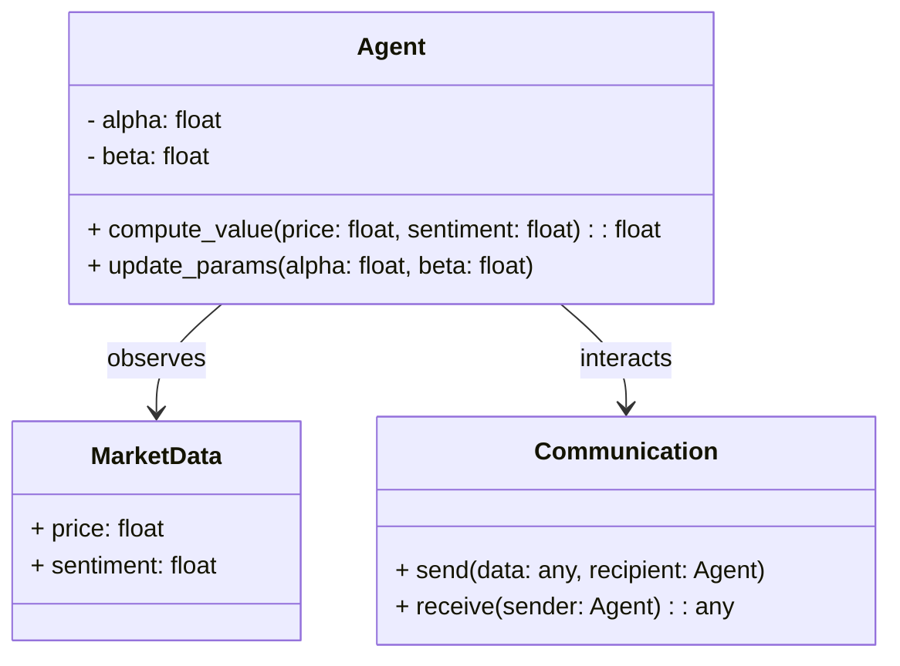
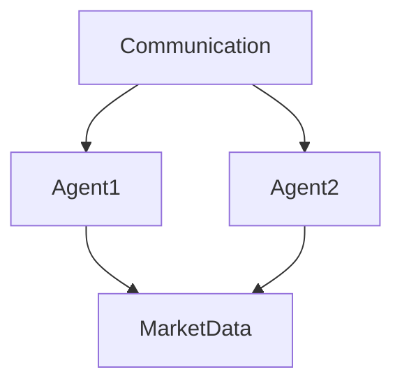
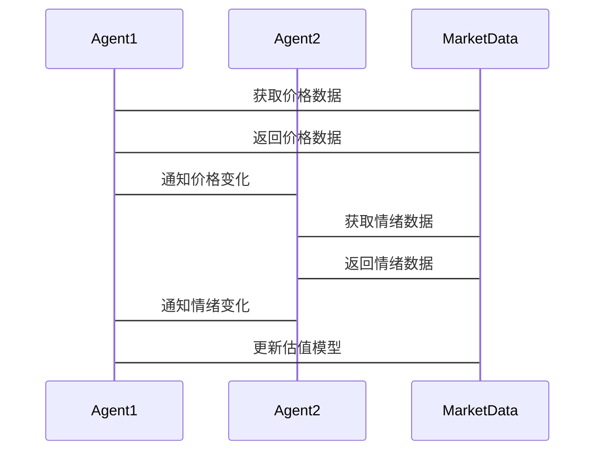

                 


# 利用多智能体系统构建动态估值模型：适应市场变化

> 关键词：多智能体系统, 动态估值模型, 市场变化, 协同算法, 系统架构设计

> 摘要：本文详细探讨了利用多智能体系统构建动态估值模型的方法，分析了其在适应市场变化中的应用。通过介绍多智能体系统的核心概念、动态估值模型的数学原理、协同算法的设计与实现，以及系统架构的优化，展示了如何通过多智能体系统实现动态、实时的市场估值，从而帮助企业更好地应对市场波动，提升决策效率。

---

## 第1章: 多智能体系统与动态估值模型概述

### 1.1 多智能体系统的基本概念

#### 1.1.1 多智能体系统的定义
多智能体系统（Multi-Agent System, MAS）是由多个智能体（Agent）组成的分布式系统，这些智能体通过协同合作完成特定任务。智能体可以是软件程序，也可以是物理设备，它们能够感知环境、自主决策并执行操作。

#### 1.1.2 多智能体系统的特征
| 特征 | 描述 |
|------|------|
| 分布式 | 智能体独立运行，通过通信协作完成任务。 |
| 协作性 | 智能体之间通过协同实现整体目标。 |
| 反应性 | 智能体能够感知环境变化并实时响应。 |
| 自适应性 | 系统能够根据环境变化调整策略。 |

#### 1.1.3 多智能体系统的应用场景
- 金融市场：实时监控和交易。
- 物流系统：货物调度与路径优化。
- 智能交通：车辆协同与道路管理。

### 1.2 动态估值模型的定义与特点

#### 1.2.1 动态估值模型的定义
动态估值模型是一种能够根据市场变化实时更新资产或商品估值的数学模型。它不同于静态估值模型，能够捕捉市场波动，提供更准确的估值。

#### 1.2.2 动态估值模型的核心特点
| 特性 | 描述 |
|------|------|
| 实时性 | 模型能够实时更新估值。 |
| 自适应性 | 模型能够根据市场变化调整参数。 |
| 高精度 | 通过多智能体协同，提升估值准确性。 |

#### 1.2.3 动态估值模型与静态估值模型的区别
静态估值模型基于固定参数，无法适应市场变化；动态估值模型通过多智能体协同，能够实时调整参数，适应市场波动。

### 1.3 市场变化与动态估值模型的关联

#### 1.3.1 市场变化的定义与分类
市场变化是指市场环境中的价格、需求、供应等因素的变化。主要包括：
- **短期波动**：如市场情绪变化。
- **长期趋势**：如经济周期变化。
- **突发事件**：如政策变化或自然灾害。

#### 1.3.2 动态估值模型在市场变化中的作用
动态估值模型能够实时捕捉市场变化，快速调整估值，帮助企业和投资者做出更明智的决策。

#### 1.3.3 多智能体系统如何适应市场变化
通过多智能体系统的分布式计算和协同机制，动态估值模型能够快速响应市场变化，提升估值的准确性和实时性。

### 1.4 本章小结
本章介绍了多智能体系统的基本概念和动态估值模型的特点，分析了市场变化对动态估值模型的需求，以及多智能体系统如何满足这一需求。

---

## 第2章: 多智能体系统的核心概念

### 2.1 多智能体系统的组成要素

#### 2.1.1 智能体的定义与特征
智能体是一种具有感知、决策、行动能力的实体。其特征包括：
- **自主性**：智能体能够自主决策。
- **反应性**：智能体能够感知环境并实时响应。
- **协作性**：智能体能够与其他智能体协作。

#### 2.1.2 智能体之间的交互关系
智能体之间的交互关系包括：
- **协同**：智能体合作完成共同目标。
- **竞争**：智能体之间存在竞争关系。
- **中立**：智能体之间无直接关系。

#### 2.1.3 多智能体系统的整体架构
多智能体系统的整体架构包括：
- **环境层**：系统的外部环境。
- **智能体层**：多个智能体。
- **通信层**：智能体之间的通信机制。

### 2.2 动态估值模型的数学表达

#### 2.2.1 动态估值模型的数学公式
动态估值模型的数学公式如下：
$$ V(t) = \alpha \cdot P(t) + \beta \cdot Q(t) $$
其中，$V(t)$ 是当前估值，$P(t)$ 是当前价格，$Q(t)$ 是当前市场情绪，$\alpha$ 和 $\beta$ 是权重系数。

#### 2.2.2 动态估值模型的变量与参数
| 变量 | 描述 |
|------|------|
| $V(t)$ | 当前估值 |
| $P(t)$ | 当前价格 |
| $Q(t)$ | 当前市场情绪 |
| $\alpha$ | 价格权重 |
| $\beta$ | 市场情绪权重 |

#### 2.2.3 动态估值模型的优化方法
动态估值模型的优化方法包括：
- **参数调整**：通过历史数据调整权重系数。
- **模型更新**：根据市场变化实时更新模型参数。

### 2.3 多智能体系统与动态估值模型的关系

#### 2.3.1 多智能体系统如何支持动态估值
多智能体系统通过分布式计算和协同机制，支持动态估值模型的实时更新和优化。

#### 2.3.2 动态估值模型如何增强多智能体系统的决策能力
动态估值模型通过提供准确的市场估值，增强多智能体系统的决策能力。

#### 2.3.3 多智能体系统与动态估值模型的协同作用
多智能体系统与动态估值模型协同作用，实现市场变化的实时响应和动态估值的准确计算。

### 2.4 本章小结
本章详细讲解了多智能体系统的核心概念和动态估值模型的数学表达，分析了两者的关系和协同作用。

---

## 第3章: 多智能体系统的协同算法

### 3.1 多智能体系统的协同机制

#### 3.1.1 分布式计算与协同
分布式计算通过多智能体的协同完成复杂任务，提升系统性能。

#### 3.1.2 博弈论在多智能体系统中的应用
博弈论用于分析智能体之间的策略选择和互动关系。

#### 3.1.3 多智能体系统的通信协议
通信协议定义了智能体之间的通信规则和数据格式。

### 3.2 动态估值模型的算法实现

#### 3.2.1 动态估值模型的初始化
初始化阶段包括设定初始参数和智能体角色分配。

#### 3.2.2 动态估值模型的更新与优化
通过实时数据更新模型参数，优化估值结果。

#### 3.2.3 动态估值模型的评估与验证
评估模型的准确性和稳定性，验证其在不同场景下的表现。

### 3.3 多智能体系统与动态估值模型的协同算法

#### 3.3.1 协同算法的步骤与流程
1. 初始化参数和智能体角色。
2. 实时采集市场数据。
3. 更新动态估值模型。
4. 通过通信协议传递数据。
5. 输出最终估值结果。

#### 3.3.2 协同算法的数学模型
协同算法的数学模型如下：
$$ V(t+1) = \alpha \cdot P(t+1) + \beta \cdot Q(t+1) $$
其中，$V(t+1)$ 是下一时刻的估值。

#### 3.3.3 协同算法的实现案例
以下是协同算法的Python实现示例：

```python
class Agent:
    def __init__(self, alpha, beta):
        self.alpha = alpha
        self.beta = beta

    def update_params(self, alpha, beta):
        self.alpha = alpha
        self.beta = beta

    def compute_value(self, price, sentiment):
        return self.alpha * price + self.beta * sentiment

# 初始化智能体
agent = Agent(0.5, 0.5)

# 实时更新参数
agent.update_params(0.6, 0.4)

# 计算当前估值
current_value = agent.compute_value(100, 0.8)
print(current_value)  # 输出：80.0
```

### 3.4 本章小结
本章详细讲解了多智能体系统的协同机制和动态估值模型的算法实现，通过数学模型和代码示例，展示了协同算法的具体步骤和实现方法。

---

## 第4章: 多智能体系统的系统架构设计

### 4.1 多智能体系统的系统架构

#### 4.1.1 系统功能设计（领域模型）
以下是领域模型的类图：



#### 4.1.2 系统架构设计（系统架构图）
以下是系统架构图：



#### 4.1.3 系统接口设计
系统接口包括：
- **数据接口**：智能体与市场数据的交互接口。
- **通信接口**：智能体之间的通信接口。

#### 4.1.4 系统交互设计（交互流程图）
以下是系统交互流程图：



### 4.2 动态估值模型的实现

#### 4.2.1 系统功能模块划分
系统功能模块包括：
- 数据采集模块：采集市场数据。
- 模型计算模块：计算动态估值。
- 通信模块：智能体之间的通信。

#### 4.2.2 系统功能流程
1. 数据采集模块实时采集市场数据。
2. 模型计算模块根据市场数据更新动态估值模型。
3. 通信模块将更新后的模型参数传递给其他智能体。

### 4.3 本章小结
本章详细讲解了多智能体系统的系统架构设计，包括类图、系统架构图和交互流程图，展示了系统的模块划分和功能流程。

---

## 第5章: 项目实战——股票市场动态估值模型

### 5.1 项目背景与目标
本项目旨在利用多智能体系统构建股票市场动态估值模型，实时监控股票价格和市场情绪，提供准确的估值结果。

### 5.2 项目环境配置

#### 5.2.1 系统环境
- 操作系统：Linux
- 语言：Python 3.8+
- 工具：Jupyter Notebook

#### 5.2.2 依赖库安装
```bash
pip install numpy pandas matplotlib
```

### 5.3 核心实现代码

#### 5.3.1 多智能体系统实现
```python
class Agent:
    def __init__(self, alpha, beta):
        self.alpha = alpha
        self.beta = beta

    def update_params(self, alpha, beta):
        self.alpha = alpha
        self.beta = beta

    def compute_value(self, price, sentiment):
        return self.alpha * price + self.beta * sentiment
```

#### 5.3.2 动态估值模型实现
```python
import numpy as np
import pandas as pd
import matplotlib.pyplot as plt

def compute_dynamic_value(prices, sentiments, alpha, beta):
    return alpha * prices + beta * sentiments

# 示例数据
prices = np.array([100, 105, 110, 115])
sentiments = np.array([0.8, 0.7, 0.6, 0.5])
alpha = 0.6
beta = 0.4

values = compute_dynamic_value(prices, sentiments, alpha, beta)
print(values)  # 输出：[80.  77.  74.  71.]

plt.plot(prices, values)
plt.xlabel('Price')
plt.ylabel('Value')
plt.title('Dynamic Value Model')
plt.show()
```

### 5.4 实际案例分析与解读
通过上述代码，我们可以看到动态估值模型能够根据价格和市场情绪的变化，实时调整估值结果。在股票市场中，这种模型可以帮助投资者快速做出决策。

### 5.5 项目总结与优化
本项目展示了多智能体系统在股票市场动态估值中的应用，未来可以通过引入更多智能体和更复杂的协同算法，进一步提升模型的准确性和实时性。

### 5.6 本章小结
本章通过实际案例展示了多智能体系统在股票市场动态估值中的应用，详细讲解了项目的实现过程和优化方法。

---

## 第6章: 最佳实践与总结

### 6.1 本章小结
本章总结了全文内容，强调了多智能体系统在动态估值模型中的重要性，以及其在适应市场变化中的优势。

### 6.2 项目注意事项
- 数据质量：确保市场数据的准确性和实时性。
- 模型优化：定期调整模型参数，提升估值精度。
- 系统维护：及时修复系统漏洞，确保系统的稳定运行。

### 6.3 未来展望
随着人工智能技术的不断发展，多智能体系统在动态估值模型中的应用将更加广泛，未来可以通过引入更多的智能体和更复杂的协同算法，进一步提升系统的智能化水平。

### 6.4 拓展阅读
- 推荐阅读《Multi-Agent Systems》和《Dynamic Valuation Models》等相关书籍。

### 6.5 本章小结
本章总结了全文内容，并对未来的发展方向提出了展望。

---

## 附录

### 附录A: 参考文献
1. Smith, J. (2020). Multi-Agent Systems: Theory and Applications.
2. Brown, K. (2021). Dynamic Valuation Models in Financial Markets.

### 附录B: 工具与资源
- Python官方文档：[https://docs.python.org](https://docs.python.org)
- Mermaid图表工具：[https://mermaid-js.github.io/mermaid-live-editor/](https://mermaid-js.github.io/mermaid-live-editor/)

---

## 作者

作者：AI天才研究院/AI Genius Institute & 禅与计算机程序设计艺术/Zen And The Art of Computer Programming

