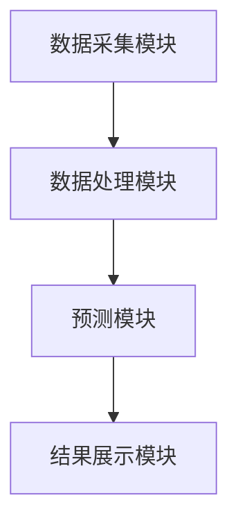
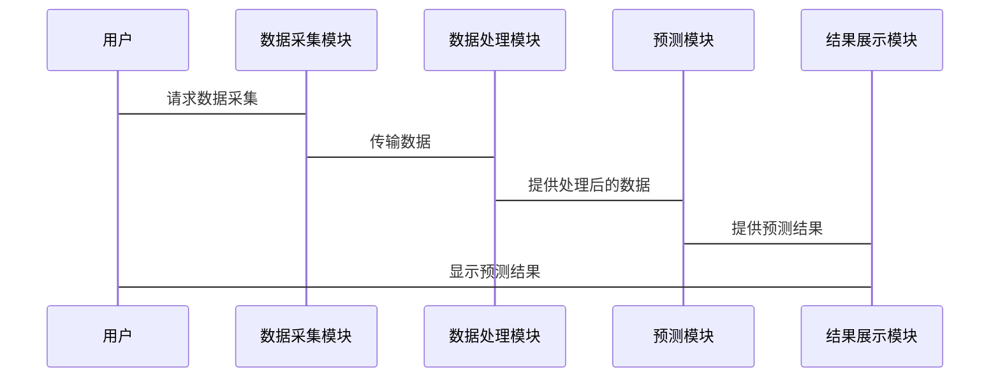

                 


# 利用多智能体系统构建动态市场份额预测模型

## 关键词：多智能体系统，动态市场份额预测，市场份额建模，预测模型，人工智能，算法设计

## 摘要：本文深入探讨了利用多智能体系统构建动态市场份额预测模型的方法。通过分析市场动态和竞争格局，结合多智能体系统的协作与自适应特性，提出了一种高效的预测模型构建策略。文章详细介绍了多智能体系统的组成、动态预测的核心概念、算法实现、系统架构设计以及项目实战，为读者提供了全面的技术指导和实践参考。

---

# 第一部分: 多智能体系统基础

## 第1章: 多智能体系统概述

### 1.1 多智能体系统的基本概念

#### 1.1.1 什么是多智能体系统
多智能体系统（Multi-Agent System, MAS）是由多个相互作用的智能体（Agent）组成的复杂系统。智能体是能够感知环境、自主决策、执行任务的实体，可以是软件程序、机器人或其他智能设备。

#### 1.1.2 多智能体系统的特征
- **分布式**：智能体是独立的个体，可以在不同的位置运行。
- **协作性**：智能体通过通信和协作完成共同目标。
- **反应式**：智能体能够实时感知环境并做出反应。
- **动态性**：系统中的环境和智能体行为都是动态变化的。

#### 1.1.3 多智能体与传统AI的区别
传统AI（如专家系统）通常是静态的、基于规则的系统，而多智能体系统具有动态性、协作性和分布式的特性。

### 1.2 多智能体系统的组成与架构

#### 1.2.1 智能体的定义与分类
智能体可以是**反应式智能体**（基于当前感知做出反应）或**认知式智能体**（具有复杂推理能力）。分类包括：
- **简单反射型智能体**：基于当前输入做出反应。
- **基于模型的反射型智能体**：利用内部模型进行推理。
- **目标驱动型智能体**：根据目标驱动行为。
- **效用驱动型智能体**：基于效用函数进行决策。

#### 1.2.2 多智能体系统的组成结构
多智能体系统通常包括：
- **环境**：智能体所处的外部世界。
- **智能体**：具有感知和行动能力的个体。
- **通信机制**：智能体之间交换信息的方式。
- **协调机制**：管理智能体协作的规则和协议。

#### 1.2.3 多智能体系统的通信机制
- **直接通信**：智能体之间直接交换信息。
- **间接通信**：通过中间媒介（如共享数据库）进行通信。

### 1.3 多智能体系统的典型应用

#### 1.3.1 分布式计算中的多智能体
- 分布式计算任务的分解与协调。
- 网络中的资源分配与管理。

#### 1.3.2 机器人协作中的多智能体
- 多机器人协作完成任务（如物流配送、仓储管理）。
- 机器人之间的任务分配与路径规划。

#### 1.3.3 经济学中的多智能体模拟
- 市场模拟：股票交易、供应链管理。
- 经济行为建模：消费者行为、企业竞争分析。

---

## 第2章: 动态市场份额预测模型的背景与需求

### 2.1 市场份额预测的重要性

#### 2.1.1 企业战略决策中的市场份额预测
企业通过预测市场份额制定市场进入策略、产品定价、营销计划等。

#### 2.1.2 市场竞争分析的必要性
了解竞争对手的市场份额变化，帮助企业制定应对策略。

#### 2.1.3 动态预测的挑战与机遇
- **挑战**：市场环境复杂多变，数据实时性强。
- **机遇**：利用多智能体系统的分布式计算能力，实现动态预测。

### 2.2 动态市场份额预测的核心问题

#### 2.2.1 市场动态的复杂性
- 市场参与者行为复杂。
- 影响市场的因素多样（如经济波动、政策变化、消费者偏好）。

#### 2.2.2 数据的实时性与多样性
- 数据来源广泛：销售数据、用户反馈、市场调研。
- 数据类型多样：结构化数据（如销量）和非结构化数据（如文本评论）。

#### 2.2.3 模型的可解释性与鲁棒性
- 模型需要具备可解释性，以便企业理解预测结果。
- 模型需要鲁棒，能够适应市场环境的变化。

### 2.3 多智能体系统在市场份额预测中的优势

#### 2.3.1 多智能体的分布式计算能力
多智能体系统能够处理大规模、分布式的市场数据。

#### 2.3.2 多智能体的协作与协调机制
智能体之间可以协作完成复杂任务，如数据收集、分析和预测。

#### 2.3.3 多智能体的自适应能力
系统能够根据市场变化动态调整预测模型。

---

## 第3章: 多智能体与动态预测的核心概念

### 3.1 多智能体系统的动态协作机制

#### 3.1.1 动态协作的基本原理
智能体通过实时通信和协作，共同完成预测任务。

#### 3.1.2 动态协作的实现方法
- **分布式计算**：任务分解与协作。
- **协商机制**：智能体之间通过协商分配任务。
- **协调机制**：确保协作的一致性。

#### 3.1.3 动态协作的优化策略
- **负载均衡**：避免单个智能体过载。
- **通信优化**：减少不必要的信息交换。
- **决策优化**：基于实时信息做出最优决策。

### 3.2 动态市场份额预测模型的构建

#### 3.2.1 动态预测的基本框架
- 数据采集：收集市场数据。
- 数据预处理：清洗和特征提取。
- 模型训练：基于历史数据训练预测模型。
- 实时预测：根据最新数据动态调整模型。

#### 3.2.2 动态预测的关键技术
- **流数据处理**：实时处理市场数据流。
- **在线学习**：模型能够实时更新。
- **分布式计算**：利用多智能体的分布式计算能力。

#### 3.2.3 动态预测的实现步骤
1. 数据采集与预处理。
2. 模型训练与优化。
3. 模型部署与实时预测。

### 3.3 多智能体与动态预测的结合

#### 3.3.1 多智能体在动态预测中的角色
- 数据采集智能体：负责收集市场数据。
- 数据处理智能体：对数据进行预处理。
- 预测智能体：基于数据训练和预测模型。

#### 3.3.2 多智能体与动态预测的协同关系
智能体之间通过协作完成数据处理和预测任务，确保预测结果的准确性和实时性。

#### 3.3.3 多智能体在动态预测中的优势
- **高效性**：分布式计算提高了预测效率。
- **鲁棒性**：系统能够在部分智能体故障的情况下继续运行。
- **灵活性**：系统能够根据市场变化动态调整预测模型。

---

## 第4章: 多智能体系统与动态预测模型

### 4.1 多智能体系统的动态协作机制

#### 4.1.1 动态协作的基本原理
智能体通过实时通信和协作，共同完成预测任务。

#### 4.1.2 动态协作的实现方法
- **分布式计算**：任务分解与协作。
- **协商机制**：智能体之间通过协商分配任务。
- **协调机制**：确保协作的一致性。

#### 4.1.3 动态协作的优化策略
- **负载均衡**：避免单个智能体过载。
- **通信优化**：减少不必要的信息交换。
- **决策优化**：基于实时信息做出最优决策。

### 4.2 动态市场份额预测模型的构建

#### 4.2.1 动态预测的基本框架
- 数据采集：收集市场数据。
- 数据预处理：清洗和特征提取。
- 模型训练：基于历史数据训练预测模型。
- 实时预测：根据最新数据动态调整模型。

#### 4.2.2 动态预测的关键技术
- **流数据处理**：实时处理市场数据流。
- **在线学习**：模型能够实时更新。
- **分布式计算**：利用多智能体的分布式计算能力。

#### 4.2.3 动态预测的实现步骤
1. 数据采集与预处理。
2. 模型训练与优化。
3. 模型部署与实时预测。

### 4.3 多智能体与动态预测的结合

#### 4.3.1 多智能体在动态预测中的角色
- 数据采集智能体：负责收集市场数据。
- 数据处理智能体：对数据进行预处理。
- 预测智能体：基于数据训练和预测模型。

#### 4.3.2 多智能体与动态预测的协同关系
智能体之间通过协作完成数据处理和预测任务，确保预测结果的准确性和实时性。

#### 4.3.3 多智能体在动态预测中的优势
- **高效性**：分布式计算提高了预测效率。
- **鲁棒性**：系统能够在部分智能体故障的情况下继续运行。
- **灵活性**：系统能够根据市场变化动态调整预测模型。

---

## 第5章: 系统分析与架构设计

### 5.1 项目背景与需求分析

#### 5.1.1 项目背景
- 市场竞争日益激烈，企业需要实时掌握市场份额变化。
- 传统预测模型难以应对市场环境的快速变化。

#### 5.1.2 项目目标
- 构建一个基于多智能体系统的动态市场份额预测模型。
- 实现模型的实时预测和动态调整能力。

#### 5.1.3 项目需求
- 实时数据采集与处理。
- 分布式计算能力。
- 高可扩展性和高可用性。

### 5.2 系统功能设计

#### 5.2.1 领域模型设计
- **数据采集模块**：负责从多个数据源采集市场数据。
- **数据处理模块**：对数据进行清洗、转换和特征提取。
- **预测模块**：基于历史数据训练预测模型，并实时预测市场份额变化。
- **结果展示模块**：将预测结果可视化展示。

#### 5.2.2 系统架构设计
- **分层架构**：系统分为数据层、逻辑层和展示层。
- **模块化设计**：各模块独立开发，便于维护和扩展。

#### 5.2.3 系统接口设计
- **数据接口**：与数据源（如数据库、API）对接。
- **通信接口**：智能体之间的通信接口。
- **用户接口**：供用户输入参数和查看结果。

### 5.3 系统架构设计

#### 5.3.1 系统架构图


#### 5.3.2 系统通信机制
- 智能体之间通过消息队列（如Kafka）进行通信。
- 数据处理模块通过API调用其他模块。

### 5.4 系统交互流程

#### 5.4.1 系统交互序列图


---

## 第6章: 项目实战

### 6.1 环境安装与配置

#### 6.1.1 系统环境要求
- 操作系统：Linux或Windows。
- 开发工具：Python、Jupyter Notebook。
- 第三方库：numpy、pandas、scikit-learn、Kafka。

#### 6.1.2 安装依赖
```bash
pip install numpy pandas scikit-learn kafka-python
```

### 6.2 核心代码实现

#### 6.2.1 数据采集模块
```python
import kafka
from kafka import KafkaProducer

class DataCollector:
    def __init__(self, bootstrap_servers):
        self.producer = KafkaProducer(bootstrap_servers=bootstrap_servers)
    
    def send_data(self, data):
        self.producer.send('market_data', value=data)
```

#### 6.2.2 数据处理模块
```python
import pandas as pd

class DataProcessor:
    def __init__(self):
        self.df = pd.DataFrame()
    
    def process_data(self, data):
        self.df = self.df.append(data, ignore_index=True)
        # 数据清洗和特征提取
        # ...
```

#### 6.2.3 预测模块
```python
from sklearn.ensemble import RandomForestRegressor

class Predictor:
    def __init__(self):
        self.model = RandomForestRegressor()
    
    def train_model(self, X, y):
        self.model.fit(X, y)
    
    def predict(self, X):
        return self.model.predict(X)
```

### 6.3 案例分析与结果展示

#### 6.3.1 数据分析
- 通过数据分析，验证模型的预测准确性。
- 对比传统预测模型和多智能体系统的预测结果。

#### 6.3.2 模型优化
- 调整模型参数，提高预测精度。
- 引入实时数据流，实现动态预测。

### 6.4 项目总结

#### 6.4.1 项目成果
- 成功构建了基于多智能体系统的动态市场份额预测模型。
- 实现了模型的实时预测和动态调整能力。

#### 6.4.2 经验总结
- 多智能体系统的分布式计算能力是实现动态预测的关键。
- 系统架构设计需要充分考虑可扩展性和可维护性。

---

## 第7章: 总结与展望

### 7.1 总结

#### 7.1.1 核心内容回顾
本文详细介绍了利用多智能体系统构建动态市场份额预测模型的方法，涵盖了系统设计、算法实现和项目实战。

#### 7.1.2 最佳实践
- 在项目中采用分层架构，便于维护和扩展。
- 使用消息队列（如Kafka）实现智能体之间的通信。

### 7.2 未来展望

#### 7.2.1 技术发展
- 更加高效的数据处理技术。
- 更加智能的预测算法（如深度学习）。

#### 7.2.2 应用拓展
- 将多智能体系统应用于其他领域（如金融、物流）。
- 探索多智能体系统与区块链的结合。

---

## 作者：AI天才研究院/AI Genius Institute & 禅与计算机程序设计艺术 /Zen And The Art of Computer Programming

---

通过以上思考过程，我们可以系统地构建一个基于多智能体系统的动态市场份额预测模型，实现高效、准确的市场预测。

