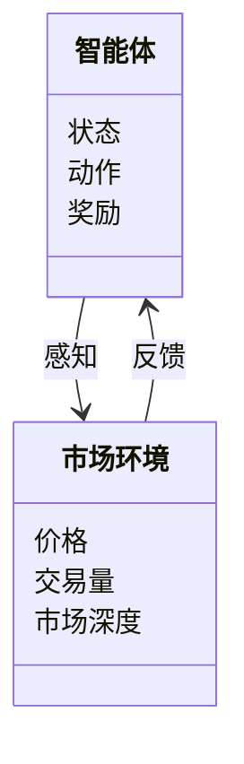
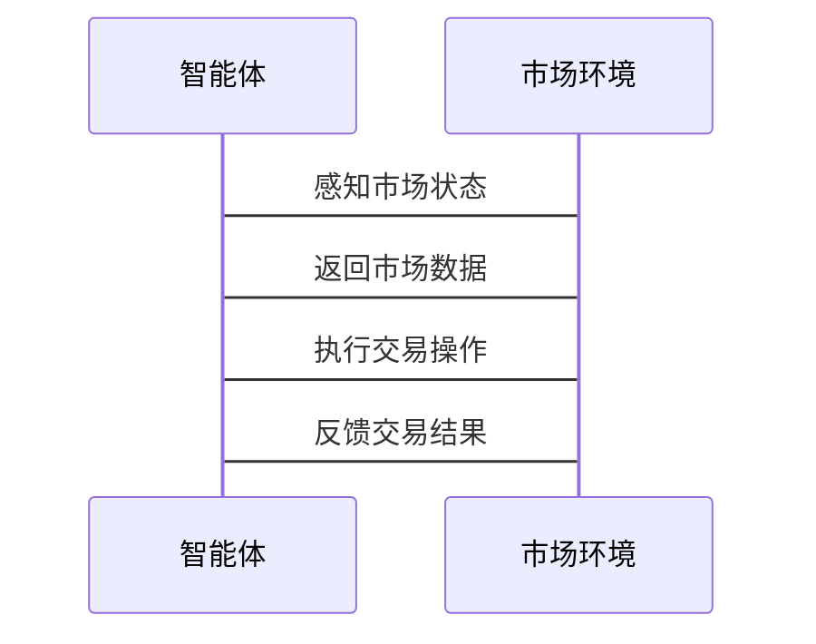

                 


# 利用多智能体系统构建动态市场微观结构模型：优化交易策略

> 关键词：多智能体系统，动态市场微观结构模型，交易策略优化，Q-learning算法，金融市场建模

> 摘要：本文通过多智能体系统的视角，探讨了动态市场微观结构模型的构建方法及其在优化交易策略中的应用。从基础概念到算法实现，从系统设计到项目实战，系统性地分析了如何利用多智能体系统构建动态市场微观结构模型，并通过实际案例展示了如何优化交易策略。

---

## 第1章: 多智能体系统与动态市场微观结构模型概述

### 1.1 多智能体系统的基本概念

#### 1.1.1 多智能体系统的定义
多智能体系统（Multi-Agent System, MAS）是由多个智能体组成的系统，每个智能体都是能够独立感知环境、自主决策并执行任务的实体。智能体之间通过通信和协作，共同完成复杂任务。

#### 1.1.2 多智能体系统的特性
- **自主性**：智能体能够自主决策。
- **反应性**：智能体能够实时感知环境并做出反应。
- **协作性**：多个智能体之间可以协作完成任务。
- **分布性**：智能体分布在不同的空间或时间维度。

#### 1.1.3 多智能体系统在金融领域的应用
在金融领域，多智能体系统可以模拟市场参与者（如投资者、交易员）的行为，分析市场动态，优化交易策略。

---

### 1.2 动态市场微观结构模型的背景

#### 1.2.1 金融市场微观结构的基本概念
金融市场微观结构是指市场的组织形式和运行机制，包括市场参与者、交易规则、价格形成机制等。

#### 1.2.2 动态市场微观结构模型的定义
动态市场微观结构模型是一种能够模拟金融市场动态行为的模型，能够捕捉市场参与者的互动、价格波动等动态特性。

#### 1.2.3 动态市场微观结构模型的构建目标
- 模拟市场参与者的互动行为。
- 描述市场的动态特性。
- 优化交易策略。

---

### 1.3 优化交易策略的核心问题

#### 1.3.1 交易策略优化的挑战
- 市场环境复杂多变。
- 参与者行为难以预测。
- 交易策略需要实时调整。

#### 1.3.2 多智能体系统在交易策略优化中的作用
- 模拟市场参与者的互动。
- 分析市场动态。
- 优化交易策略。

#### 1.3.3 动态市场微观结构模型的优势
- 能够捕捉市场的动态特性。
- 可以模拟市场参与者的互动。
- 支持交易策略的实时优化。

---

## 第2章: 多智能体系统与动态市场微观结构模型的核心概念

### 2.1 多智能体系统的组成与功能

#### 2.1.1 多智能体系统的组成要素
- **智能体**：市场参与者（投资者、交易员）。
- **环境**：金融市场。
- **通信机制**：智能体之间的信息交换。
- **协作机制**：智能体之间的协作规则。

#### 2.1.2 多智能体系统的功能模块
- **感知模块**：感知市场环境。
- **决策模块**：制定交易策略。
- **执行模块**：执行交易操作。
- **学习模块**：优化交易策略。

#### 2.1.3 多智能体系统与金融市场的关系
多智能体系统模拟了金融市场中多个参与者的行为，通过智能体的协作与互动，反映了市场的动态特性。

---

### 2.2 动态市场微观结构模型的构建要素

#### 2.2.1 市场参与者的角色与行为
- **角色**：投资者、交易员、市场 makers。
- **行为**：买卖决策、价格制定、订单提交。

#### 2.2.2 市场微观结构的动态特性
- **价格波动**：市场价格的动态变化。
- **交易量**：交易量的波动。
- **市场深度**：市场订单簿的深度。

#### 2.2.3 模型的输入与输出
- **输入**：市场参与者的行为参数、市场环境数据。
- **输出**：市场价格、交易量、交易策略。

---

### 2.3 多智能体系统与动态市场微观结构模型的关联

#### 2.3.1 多智能体系统在模型中的作用
- 模拟市场参与者的互动行为。
- 分析市场的动态特性。
- 优化交易策略。

#### 2.3.2 模型的动态特性与多智能体系统的互动
- 模型的动态特性通过多智能体系统的协作实现。
- 多智能体系统的互动反映了模型的动态特性。

#### 2.3.3 模型的优化目标与实现路径
- 优化目标：提高交易策略的收益。
- 实现路径：通过多智能体系统的协作与学习，优化交易策略。

---

### 2.4 核心概念对比分析

#### 2.4.1 多智能体系统与传统金融模型的对比
| 特性             | 多智能体系统         | 传统金融模型       |
|------------------|--------------------|-------------------|
| 模型复杂性       | 高                 | 低               |
| 可解释性         | 低                 | 高               |
| 应用场景         | 金融市场模拟         | 金融数据分析       |

#### 2.4.2 动态市场微观结构模型与静态模型的对比
| 特性             | 动态模型           | 静态模型           |
|------------------|-------------------|-------------------|
| 模型复杂性       | 高                 | 低               |
| 动态特性         | 有                 | 无               |
| 应用场景         | 金融市场预测         | 金融市场分析       |

#### 2.4.3 模型优化目标与实际应用的对比
| 特性             | 优化目标           | 实际应用           |
|------------------|-------------------|-------------------|
| 目标             | 最大化收益         | 实现收益与风险平衡 |
| 方法             | 基于算法优化       | 基于经验调整       |

---

## 第3章: 多智能体系统与动态市场微观结构模型的算法原理

### 3.1 多智能体系统的核心算法

#### 3.1.1 基于Q-learning的策略优化
Q-learning是一种强化学习算法，通过智能体与环境的交互，优化策略。

#### 3.1.2 基于强化学习的交易策略
强化学习通过智能体与市场的交互，学习最优交易策略。

#### 3.1.3 基于博弈论的策略选择
博弈论分析市场参与者的策略选择，寻找纳什均衡。

---

### 3.2 动态市场微观结构模型的算法实现

#### 3.2.1 市场参与者行为的建模
通过Q-learning算法，模拟市场参与者的买卖行为。

#### 3.2.2 市场动态的模拟与预测
通过多智能体系统的协作，模拟市场价格的动态变化。

#### 3.2.3 交易策略的优化与调整
通过强化学习算法，优化交易策略，实现收益最大化。

---

### 3.3 算法原理的数学模型

#### 3.3.1 Q-learning算法的数学公式
$$ Q(s, a) = Q(s, a) + \alpha \left( r + \gamma \max Q(s', a') - Q(s, a) \right) $$
其中：
- \( s \)：当前状态。
- \( a \)：当前动作。
- \( r \)：奖励。
- \( \gamma \)：折扣因子。
- \( \alpha \)：学习率。

---

## 第4章: 多智能体系统与动态市场微观结构模型的系统架构设计

### 4.1 问题场景介绍
在金融市场中，市场参与者的行为复杂，市场价格波动频繁，需要一种动态的模型来模拟市场行为。

### 4.2 项目介绍
本项目旨在构建一个基于多智能体系统的动态市场微观结构模型，优化交易策略。

### 4.3 系统功能设计
#### 4.3.1 领域模型


### 4.4 系统架构设计
#### 4.4.1 系统架构图


### 4.5 系统接口设计
- **智能体接口**：感知市场环境，执行交易操作。
- **市场环境接口**：提供市场数据，反馈交易结果。

### 4.6 系统交互设计
#### 4.6.1 交互流程图


---

## 第5章: 多智能体系统与动态市场微观结构模型的项目实战

### 5.1 环境安装
- 安装Python
- 安装相关库（如numpy, matplotlib, gym）

### 5.2 核心代码实现

#### 5.2.1 Q-learning算法实现
```python
class QLearning:
    def __init__(self, state_space, action_space, learning_rate=0.1, gamma=0.9):
        self.state_space = state_space
        self.action_space = action_space
        self.learning_rate = learning_rate
        self.gamma = gamma
        self.q_table = np.zeros((state_space, action_space))
    
    def choose_action(self, state):
        return np.argmax(self.q_table[state])
    
    def update(self, state, action, reward, next_state):
        self.q_table[state, action] += self.learning_rate * (reward + self.gamma * np.max(self.q_table[next_state]) - self.q_table[state, action])
```

---

### 5.3 案例分析与详细解读
通过实际案例，分析模型的优化效果，展示如何通过多智能体系统的协作，优化交易策略。

---

## 第6章: 优化与扩展

### 6.1 模型优化策略
- **参数优化**：调整学习率、折扣因子等参数。
- **算法改进**：结合其他强化学习算法，如DQN。

### 6.2 模型的扩展方向
- **多市场模拟**：扩展到多个金融市场。
- **复杂场景模拟**：引入更多市场参与者，如高频交易者。

### 6.3 应用中的注意事项
- **模型的鲁棒性**：确保模型在复杂市场环境中的稳定运行。
- **实时性**：确保模型能够实时处理市场数据。

---

## 第7章: 总结与展望

### 7.1 总结
通过多智能体系统构建动态市场微观结构模型，优化交易策略，能够有效捕捉市场动态，提高交易收益。

### 7.2 展望
未来，随着人工智能技术的发展，动态市场微观结构模型将在金融市场中发挥更大的作用。

---

## 作者：AI天才研究院/AI Genius Institute & 禅与计算机程序设计艺术 /Zen And The Art of Computer Programming

---

通过本文的系统性分析，读者可以全面了解如何利用多智能体系统构建动态市场微观结构模型，并将其应用于交易策略优化。从理论到实践，从算法到系统设计，本文为读者提供了一个完整的解决方案。

