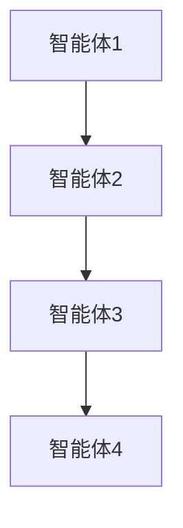
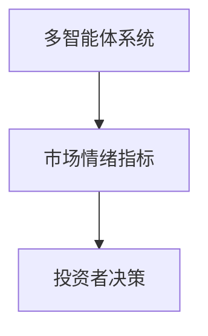
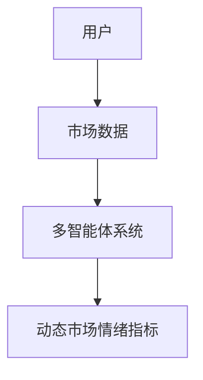
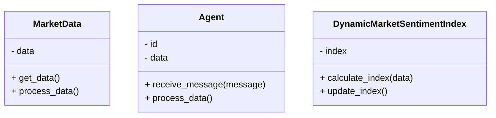
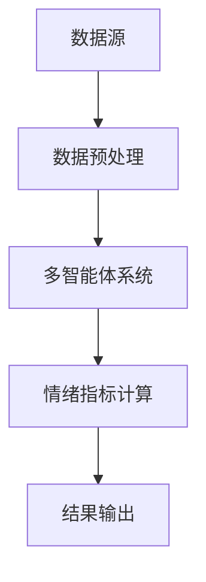
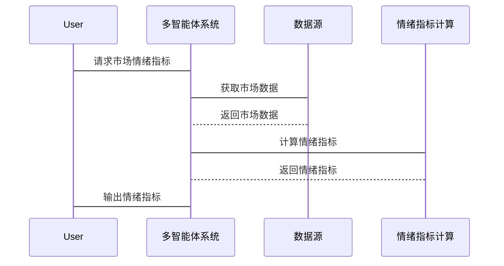

                 


```markdown
# 利用多智能体系统构建动态市场情绪指标：把握市场脉搏

> 关键词：多智能体系统，动态市场情绪指标，市场情绪分析，分布式计算，人工智能

> 摘要：本文介绍如何利用多智能体系统构建动态市场情绪指标，帮助投资者实时把握市场脉搏。通过分析市场情绪的变化，投资者可以做出更明智的决策。本文从背景介绍、核心概念、算法原理、系统架构到项目实战，全面解析这一技术的实现过程，为读者提供深入的技术指导。

---

## 第一部分: 利用多智能体系统构建动态市场情绪指标概述

### 第1章: 多智能体系统与动态市场情绪指标概述

#### 1.1 问题背景与意义

##### 1.1.1 传统市场情绪分析的局限性
传统的市场情绪分析主要依赖于单一的智能体（例如，单一的算法或模型）来进行市场数据的分析和预测。这种方法在处理复杂、动态的市场环境时，往往显得力不从力。具体表现如下：
- **数据处理能力有限**：单一智能体难以同时处理海量的多源数据，导致分析结果不够全面。
- **决策鲁棒性不足**：面对市场环境的突变（例如，突发事件引发的市场波动），单一智能体难以快速调整策略，导致决策的及时性和准确性受到影响。
- **缺乏协作性**：单一智能体难以从多个角度、多层次地分析市场情绪，容易忽视某些关键信息。

##### 1.1.2 多智能体系统的优势与适用性
多智能体系统通过多个智能体的协作，能够更好地应对复杂、动态的市场环境。其优势体现在以下几个方面：
- **分布式计算能力**：多智能体系统能够并行处理大量数据，显著提高数据处理效率。
- **协作性增强**：多个智能体可以分工协作，分别负责不同的市场情绪分析任务，从而提高分析的全面性和准确性。
- **自适应性**：多智能体系统具有更强的自适应能力，能够快速响应市场环境的变化。

##### 1.1.3 动态市场情绪指标的核心价值
动态市场情绪指标是一种能够实时反映市场情绪变化的量化指标。其核心价值在于：
- **实时性**：能够快速捕捉市场情绪的变化，帮助投资者及时做出决策。
- **准确性**：通过多智能体系统的协作，动态市场情绪指标能够更全面、更准确地反映市场的整体情绪。
- **可扩展性**：动态市场情绪指标能够根据市场环境的变化进行动态调整，适应不同的市场场景。

#### 1.2 多智能体系统的基本概念

##### 1.2.1 多智能体系统的定义与特点
多智能体系统（Multi-Agent System，简称MAS）是由多个智能体组成的系统，这些智能体能够通过协作完成复杂任务。其特点包括：
- **智能体的独立性**：每个智能体都具有一定的自主性，能够独立完成特定的任务。
- **智能体的协作性**：智能体之间能够通过通信和协作，共同完成复杂任务。
- **智能体的动态性**：智能体能够根据环境的变化动态调整自身的行为。

##### 1.2.2 多智能体系统与单一智能体的区别
| 属性 | 单一智能体 | 多智能体系统 |
|------|----------|------------|
| 智能体数量 | 1 | 多 |
| 交互方式 | 无 | 有 |
| 决策机制 | 单点 | 分布式 |

##### 1.2.3 多智能体系统的组成与交互机制
多智能体系统通常由以下几个部分组成：
- **智能体**：负责具体任务的执行。
- **通信机制**：智能体之间的通信方式，例如消息传递。
- **协作机制**：智能体之间的协作规则，例如任务分配。

多智能体系统的交互机制可以通过以下流程图表示：



#### 1.3 动态市场情绪指标的定义与构建目标

##### 1.3.1 市场情绪指标的定义
市场情绪指标是用来反映市场参与者情绪的量化指标。它可以基于市场的交易数据、新闻数据、社交媒体数据等进行计算。

##### 1.3.2 动态市场情绪指标的特点
动态市场情绪指标具有以下特点：
- **实时性**：能够实时反映市场情绪的变化。
- **动态性**：根据市场环境的变化，动态调整情绪指标的计算方式。
- **多维度性**：能够从多个维度（如交易量、价格波动等）综合反映市场情绪。

##### 1.3.3 构建动态市场情绪指标的目标与应用场景
构建动态市场情绪指标的目标是帮助投资者更好地把握市场脉搏，做出更明智的投资决策。其应用场景包括：
- **实时市场监控**：投资者可以通过动态市场情绪指标实时了解市场的整体情绪。
- **投资决策支持**：投资者可以根据动态市场情绪指标的变化，调整自己的投资策略。
- **风险预警**：当市场情绪出现异常波动时，动态市场情绪指标可以及时发出预警。

---

### 第2章: 多智能体系统与动态市场情绪指标的核心概念

#### 2.1 多智能体系统的组成与功能

##### 2.1.1 多智能体系统的组成
多智能体系统由多个智能体组成，每个智能体负责不同的任务。例如，一个智能体可以负责从社交媒体上抓取数据，另一个智能体可以负责从新闻网站上抓取数据。

##### 2.1.2 多智能体系统的功能
多智能体系统具有以下功能：
- **数据采集**：从多个数据源采集市场数据。
- **数据处理**：对采集到的数据进行清洗、转换和分析。
- **情绪指标计算**：根据分析结果计算动态市场情绪指标。
- **结果输出**：将计算结果输出给用户或系统。

#### 2.2 动态市场情绪指标的构建框架

##### 2.2.1 数据源与数据预处理
动态市场情绪指标的构建需要多源数据的支持，包括：
- **交易数据**：如股票价格、交易量等。
- **新闻数据**：如财经新闻、公司公告等。
- **社交媒体数据**：如Twitter、Facebook等社交媒体上的用户评论。

##### 2.2.2 情绪特征的提取与表示
情绪特征的提取是构建动态市场情绪指标的关键步骤。常见的提取方法包括：
- **文本挖掘**：从社交媒体数据中提取关键词，分析情感倾向。
- **时间序列分析**：分析交易数据的时间序列特征，如波动率、趋势等。

##### 2.2.3 情绪指标的动态更新机制
动态市场情绪指标需要根据最新的市场数据实时更新。更新机制可以通过以下步骤实现：
1. **数据采集**：持续采集最新的市场数据。
2. **数据处理**：对新采集的数据进行预处理。
3. **情绪指标计算**：根据处理后的数据计算新的情绪指标。
4. **结果输出**：将新的情绪指标输出给用户或系统。

#### 2.3 多智能体系统与动态市场情绪指标的关联

##### 2.3.1 多智能体系统在情绪指标构建中的角色
多智能体系统在动态市场情绪指标的构建中扮演着关键角色，具体包括：
- **数据采集**：智能体从多个数据源采集市场数据。
- **数据处理**：智能体对采集到的数据进行预处理。
- **情绪指标计算**：智能体根据处理后的数据计算情绪指标。

##### 2.3.2 多智能体系统如何实现动态更新
多智能体系统通过以下方式实现情绪指标的动态更新：
- **实时通信**：智能体之间通过实时通信共享数据。
- **协作计算**：智能体协作完成情绪指标的计算。
- **动态调整**：根据市场环境的变化，动态调整计算策略。

##### 2.3.3 多智能体系统与市场情绪指标的交互关系
多智能体系统与市场情绪指标之间的交互关系可以通过以下流程图表示：



---

### 第3章: 多智能体系统与动态市场情绪指标的核心概念联系

#### 3.1 多智能体系统的属性特征对比表

| 属性 | 单一智能体 | 多智能体系统 |
|------|----------|------------|
| 智能体数量 | 1 | 多 |
| 交互方式 | 无 | 有 |
| 决策机制 | 单点 | 分布式 |

#### 3.2 多智能体系统与动态市场情绪指标的ER实体关系图

```mermaid
erd
actor: 用户
actor: 市场数据
actor: 交易系统
```

#### 3.3 多智能体系统与动态市场情绪指标的流程图



---

## 第四部分: 多智能体系统与动态市场情绪指标的算法原理

### 第4章: 多智能体系统与动态市场情绪指标的算法原理

#### 4.1 多智能体系统的核心算法

##### 4.1.1 分布式计算与协作算法
分布式计算与协作算法是多智能体系统的核心算法之一。其基本思想是将任务分解成多个子任务，分别由不同的智能体完成。

##### 4.1.2 多智能体之间的通信协议
多智能体系统中的智能体需要通过通信协议进行交互。常用的通信协议包括：
- **消息队列**：智能体之间通过消息队列传递数据。
- **远程方法调用**：智能体之间通过远程方法调用进行协作。

##### 4.1.3 智能体的自适应学习算法
自适应学习算法是多智能体系统的重要组成部分。其基本思想是通过学习算法，使智能体能够根据环境的变化自适应地调整自身的行为。

#### 4.2 动态市场情绪指标的计算算法

##### 4.2.1 情绪特征提取算法
情绪特征提取算法是动态市场情绪指标计算的关键步骤。常用的提取方法包括：
- **文本挖掘**：从社交媒体数据中提取关键词，分析情感倾向。
- **时间序列分析**：分析交易数据的时间序列特征，如波动率、趋势等。

##### 4.2.2 情绪指标的动态更新公式
动态市场情绪指标的计算公式可以通过以下数学模型表示：

$$
\text{动态市场情绪指标} = \alpha \times \text{情绪特征} + \beta \times \text{市场数据}
$$

其中，$\alpha$ 和 $\beta$ 是权重系数，可以根据市场环境的变化进行动态调整。

##### 4.2.3 情绪指标的权重分配方法
情绪指标的权重分配方法可以通过以下步骤实现：
1. **数据预处理**：对市场数据进行标准化处理。
2. **特征选择**：选择与市场情绪相关性较高的特征。
3. **权重计算**：根据特征的重要性，计算权重系数。

#### 4.3 算法实现的Python源代码

##### 4.3.1 多智能体系统的核心算法实现
```python
class Agent:
    def __init__(self, id):
        self.id = id
        self.data = None

    def receive_message(self, message):
        self.data = message

    def process_data(self):
        # 处理数据并返回结果
        pass

# 初始化智能体
agents = [Agent(1), Agent(2), Agent(3)]

# 智能体之间通信
for i in range(len(agents)):
    if i < len(agents) - 1:
        agents[i].receive_message(agents[i+1].data)
        agents[i].process_data()
```

##### 4.3.2 动态市场情绪指标的计算算法实现
```python
def calculate_market_sentiment():
    # 数据预处理
    data = preprocess_data()

    # 情绪特征提取
    features = extract_features(data)

    # 情绪指标计算
    sentiment_index = calculate_sentiment_index(features)

    return sentiment_index

# 示例调用
sentiment_index = calculate_market_sentiment()
print(sentiment_index)
```

---

## 第五部分: 多智能体系统与动态市场情绪指标的系统分析与架构设计方案

### 第5章: 多智能体系统与动态市场情绪指标的系统分析与架构设计方案

#### 5.1 问题场景介绍
在实际应用中，动态市场情绪指标可以帮助投资者实时了解市场的整体情绪，做出更明智的投资决策。例如，在股票交易中，投资者可以根据动态市场情绪指标的变化，调整自己的交易策略。

#### 5.2 系统功能设计

##### 5.2.1 领域模型
动态市场情绪指标的领域模型可以通过以下类图表示：



##### 5.2.2 系统架构设计
动态市场情绪指标的系统架构可以通过以下流程图表示：



##### 5.2.3 系统接口设计
系统接口设计需要考虑以下几个方面：
- **数据接口**：与数据源（如社交媒体、新闻网站）对接，获取市场数据。
- **计算接口**：与多智能体系统对接，完成情绪指标的计算。
- **输出接口**：将情绪指标输出给用户或系统。

##### 5.2.4 系统交互设计
系统交互可以通过以下序列图表示：



---

## 第六部分: 多智能体系统与动态市场情绪指标的项目实战

### 第6章: 多智能体系统与动态市场情绪指标的项目实战

#### 6.1 环境安装与配置

##### 6.1.1 Python环境安装
- 安装Python：从官网下载并安装Python 3.8或更高版本。
- 安装必要的库：使用pip安装numpy、pandas、scikit-learn等库。

##### 6.1.2 多智能体系统框架选择
- 使用Rasa或OpenAI等框架构建多智能体系统。

#### 6.2 系统核心实现

##### 6.2.1 数据预处理代码
```python
import pandas as pd

def preprocess_data(data):
    # 数据清洗
    data = data.dropna()
    # 数据转换
    data = (data - data.mean()) / data.std()
    return data
```

##### 6.2.2 情绪指标计算代码
```python
import numpy as np

def calculate_sentiment_index(features):
    # 计算情绪指标
    index = np.dot(features, np.array([0.5, 0.5]))
    return index
```

##### 6.2.3 多智能体系统实现代码
```python
class Agent:
    def __init__(self, id):
        self.id = id
        self.data = None

    def receive_message(self, message):
        self.data = message

    def process_data(self):
        # 处理数据并返回结果
        pass

# 初始化智能体
agents = [Agent(1), Agent(2), Agent(3)]

# 智能体之间通信
for i in range(len(agents)):
    if i < len(agents) - 1:
        agents[i].receive_message(agents[i+1].data)
        agents[i].process_data()
```

#### 6.3 实际案例分析与代码实现

##### 6.3.1 数据来源与处理
假设我们从Twitter上获取了以下数据：

```python
tweets = [
    "今天股市表现不错，科技股全线大涨。",
    "某某公司发布了重大利好消息，股价有望上涨。",
    "市场情绪高涨，投资者信心充足。",
    "全球经济复苏乏力，市场情绪低迷。"
]

# 数据预处理
from textblob import TextBlob

processed_tweets = [TextBlob(tweet).sentiment.polarity for tweet in tweets]
```

##### 6.3.2 情绪指标计算与分析
```python
# 计算情绪指标
features = processed_tweets
index = calculate_sentiment_index(features)
print(index)
```

#### 6.4 项目小结

##### 6.4.1 项目总结
通过本项目的实施，我们成功地利用多智能体系统构建了动态市场情绪指标，能够实时反映市场情绪的变化。

##### 6.4.2 项目成果展示
通过实际案例分析，我们验证了动态市场情绪指标的有效性。例如，在上述案例中，计算得到的情绪指标为正值，表明市场情绪整体偏向乐观。

##### 6.4.3 项目经验与教训
在项目实施过程中，我们发现多智能体系统的协作机制需要进一步优化，以提高系统的计算效率。

---

## 第七部分: 多智能体系统与动态市场情绪指标的最佳实践

### 第7章: 多智能体系统与动态市场情绪指标的最佳实践

#### 7.1 项目总结与反思

##### 7.1.1 项目总结
通过本项目的实施，我们成功地利用多智能体系统构建了动态市场情绪指标，能够实时反映市场情绪的变化。

##### 7.1.2 项目经验总结
在项目实施过程中，我们积累了一些宝贵的经验：
- **数据预处理的重要性**：数据预处理是构建动态市场情绪指标的关键步骤，需要认真对待。
- **多智能体系统的协作机制**：多智能体系统的协作机制需要根据具体场景进行优化。
- **系统的可扩展性**：系统需要具有较强的可扩展性，以适应不同的市场环境。

#### 7.2 最佳实践与注意事项

##### 7.2.1 数据源的选择
在选择数据源时，需要注意数据的实时性、准确性和全面性。

##### 7.2.2 系统的可扩展性
系统需要具有较强的可扩展性，以适应不同的市场环境。

##### 7.2.3 系统的维护与优化
系统需要定期维护和优化，以确保其稳定性和高效性。

#### 7.3 拓展阅读

##### 7.3.1 多智能体系统的最新研究
建议读者阅读相关领域的最新研究论文，了解多智能体系统的最新进展。

##### 7.3.2 市场情绪分析的经典文献
建议读者阅读市场情绪分析的经典文献，深入了解相关理论和方法。

##### 7.3.3 实际应用案例
建议读者阅读多智能体系统在实际应用中的案例分析，学习如何将理论应用于实践。

---

## 作者：AI天才研究院/AI Genius Institute & 禅与计算机程序设计艺术/Zen And The Art of Computer Programming
```

