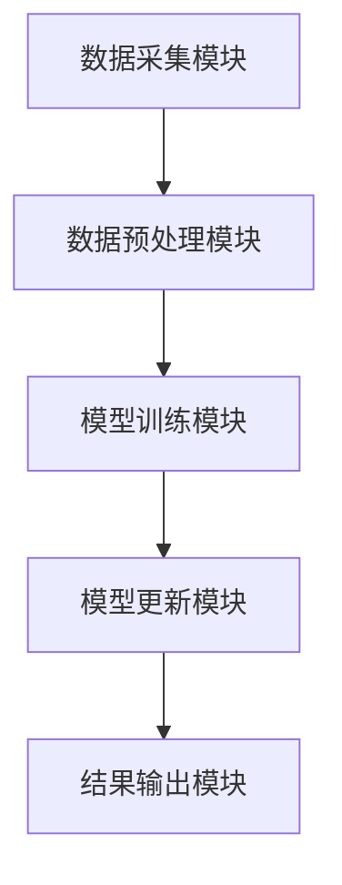

                 


# 利用多智能体系统构建动态的公司信用评级模型

## 关键词：多智能体系统、信用评级模型、动态更新、分布式计算、协同学习

## 摘要：本文详细探讨了利用多智能体系统构建动态公司信用评级模型的方法。首先，介绍了多智能体系统的基本概念和信用评级模型的核心原理。然后，分析了多智能体系统在信用评级中的优势，包括分布式计算、协作学习和动态适应性。接着，详细阐述了基于多智能体系统的信用评级模型算法，包括协同学习算法和动态更新机制。最后，通过实际案例展示了模型的实现过程，并总结了最佳实践和未来研究方向。

---

# 第一部分：多智能体系统与信用评级模型基础

## 第1章：多智能体系统概述

### 1.1 多智能体系统的基本概念

#### 1.1.1 智能体的定义与特征
智能体（Agent）是指能够感知环境、自主决策并采取行动的实体。它具有以下特征：
- **自主性**：能够在没有外部干预的情况下独立运作。
- **反应性**：能够感知环境并实时调整行为。
- **社会性**：能够与其他智能体或人类进行交互和协作。

#### 1.1.2 多智能体系统的定义
多智能体系统（Multi-Agent System, MAS）是由多个智能体组成的系统，这些智能体通过通信和协作完成共同目标。多智能体系统的特点包括：
- **分布式计算**：智能体之间通过分布式计算实现任务。
- **协作性**：智能体之间通过协作完成复杂任务。
- **动态性**：系统能够适应环境的变化。

#### 1.1.3 多智能体系统与单智能体系统的区别
- **结构**：多智能体系统由多个智能体组成，而单智能体系统仅由一个智能体构成。
- **协作**：多智能体系统需要智能体之间的协作，而单智能体系统不需要。
- **复杂性**：多智能体系统处理复杂任务的能力更强。

### 1.2 多智能体系统的组成与结构

#### 1.2.1 智能体的结构
智能体的结构包括：
- **感知层**：负责感知环境信息。
- **决策层**：负责决策和规划。
- **行动层**：负责执行决策。

#### 1.2.2 多智能体系统的通信机制
多智能体系统中的通信机制包括：
- **直接通信**：智能体之间直接交换信息。
- **间接通信**：通过中间媒介进行信息交换。

#### 1.2.3 多智能体系统的协作机制
多智能体系统的协作机制包括：
- **分布式协作**：智能体通过分布式方式协作完成任务。
- **集中式协作**：有一个中心智能体协调其他智能体的协作。

### 1.3 多智能体系统的应用领域

#### 1.3.1 分布式计算中的应用
- **分布式任务分配**：利用多智能体系统进行任务分配和资源管理。
- **分布式计算优化**：通过多智能体协作优化计算资源的使用。

#### 1.3.2 人工智能中的应用
- **群体智能**：通过多智能体协作实现群体智能。
- **分布式推理**：利用多智能体系统进行分布式推理。

#### 1.3.3 金融领域的应用
- **信用评级**：利用多智能体系统构建动态信用评级模型。
- **风险评估**：通过多智能体系统进行风险评估和管理。

### 1.4 本章小结
本章介绍了多智能体系统的基本概念、组成与结构，以及在金融领域的应用。多智能体系统通过分布式计算和协作机制，能够高效地完成复杂任务。

---

## 第2章：信用评级模型概述

### 2.1 信用评级的基本概念

#### 2.1.1 信用评级的定义
信用评级是指对企业和个人的信用状况进行评估，确定其信用等级的过程。信用评级的核心在于分析企业的财务状况、经营状况和市场环境。

#### 2.1.2 信用评级的重要性
- **风险控制**：通过信用评级，金融机构可以评估借款人的还款能力，从而控制风险。
- **资源配置**：信用评级能够帮助企业合理分配资源，优化经营策略。
- **市场信任**：良好的信用评级能够增强市场对企业的信任。

#### 2.1.3 信用评级的分类
- **企业信用评级**：评估企业的信用状况。
- **个人信用评级**：评估个人的信用状况。
- **行业信用评级**：评估整个行业的信用状况。

### 2.2 信用评级模型的构建过程

#### 2.2.1 数据收集与处理
信用评级模型的构建需要收集企业的财务数据、市场数据和行业数据。数据处理包括数据清洗、数据标准化和数据特征提取。

#### 2.2.2 模型选择与训练
根据数据特征选择合适的模型，如逻辑回归、支持向量机（SVM）和随机森林（Random Forest）。模型训练需要使用训练数据进行参数优化和模型调优。

#### 2.2.3 模型评估与优化
通过测试数据评估模型的性能，如准确率、召回率和F1值。模型优化包括调整模型参数和改进模型结构。

### 2.3 信用评级模型的应用场景

#### 2.3.1 企业信用评级
- **企业贷款审批**：银行根据企业的信用评级决定是否批准贷款。
- **企业债券发行**：企业债券的信用评级影响其发行利率和市场需求。

#### 2.3.2 个人信用评级
- **个人贷款审批**：银行根据个人信用评级决定是否批准贷款。
- **信用卡额度调整**：银行根据个人信用评级调整信用卡额度。

#### 2.3.3 行业信用评级
- **行业风险评估**：评估整个行业的信用风险。
- **行业政策制定**：根据行业信用评级制定相关政策。

### 2.4 本章小结
本章介绍了信用评级的基本概念、构建过程和应用场景。信用评级模型是金融领域的重要工具，能够帮助企业和个人获得融资，同时帮助金融机构控制风险。

---

## 第3章：多智能体系统与信用评级模型的结合

### 3.1 多智能体系统在信用评级中的优势

#### 3.1.1 分布式计算的优势
- **高效性**：多智能体系统通过分布式计算提高计算效率。
- **并行性**：多智能体系统能够并行处理多个任务。

#### 3.1.2 多智能体协作的优势
- **协作性**：通过智能体之间的协作，能够更准确地评估企业的信用状况。
- **信息共享**：智能体之间可以共享信息，提高模型的准确性。

#### 3.1.3 动态环境适应性优势
- **实时更新**：多智能体系统能够实时更新信用评级模型。
- **动态调整**：根据市场环境的变化，动态调整模型参数。

### 3.2 信用评级模型的动态特性

#### 3.2.1 信用评级的动态变化
- **经济波动**：经济波动会影响企业的信用评级。
- **市场变化**：市场环境的变化会影响企业的信用状况。

#### 3.2.2 信用评级模型的更新机制
- **定期更新**：定期对模型进行更新，以反映最新的市场情况。
- **实时更新**：根据实时数据动态更新模型。

#### 3.2.3 动态环境下的模型适应性
- **模型的鲁棒性**：模型能够适应环境的变化。
- **模型的可扩展性**：模型能够扩展到更多的数据和场景。

### 3.3 多智能体系统与信用评级模型的结合方式

#### 3.3.1 多智能体协同学习
- **协同学习**：多个智能体通过协作学习提高模型的准确性。
- **分布式学习**：智能体通过分布式学习提高模型的效率。

#### 3.3.2 多智能体分布式计算
- **分布式计算**：利用多智能体系统进行分布式计算，提高计算效率。
- **并行计算**：利用多智能体系统进行并行计算，提高处理速度。

#### 3.3.3 多智能体动态更新机制
- **动态更新**：根据实时数据动态更新模型。
- **协作更新**：智能体之间协作更新模型参数。

### 3.4 本章小结
本章介绍了多智能体系统在信用评级中的优势，以及多智能体系统与信用评级模型的结合方式。多智能体系统通过分布式计算和协作学习，能够高效地构建动态信用评级模型。

---

## 第4章：多智能体系统构建信用评级模型的算法原理

### 4.1 多智能体协同学习的基本原理

#### 4.1.1 协同学习的定义
协同学习是指多个智能体通过协作学习共同完成任务。协同学习的核心在于智能体之间的协作和信息共享。

#### 4.1.2 协同学习的实现机制
- **信息共享**：智能体之间共享信息，提高学习效率。
- **任务分配**：智能体根据任务需求分配学习任务。
- **协作决策**：智能体通过协作决策提高学习效果。

#### 4.1.3 协同学习的优缺点
- **优点**：提高学习效率和准确性。
- **缺点**：需要解决智能体之间的协作问题和信息共享问题。

### 4.2 基于多智能体的信用评级模型算法

#### 4.2.1 算法的输入与输出
- **输入**：企业的财务数据、市场数据和行业数据。
- **输出**：企业的信用评级。

#### 4.2.2 算法的实现步骤
1. **数据收集**：收集企业的财务数据、市场数据和行业数据。
2. **数据预处理**：对数据进行清洗和标准化。
3. **模型训练**：利用多智能体协同学习算法训练信用评级模型。
4. **模型评估**：通过测试数据评估模型的准确性。
5. **模型优化**：根据评估结果优化模型参数。

#### 4.2.3 算法的数学模型
$$ \text{信用评级} = f(\text{财务数据}, \text{市场数据}, \text{行业数据}) $$

### 4.3 算法的优化与改进

#### 4.3.1 算法的优化目标
- **提高模型准确性**：通过优化算法参数提高模型的准确性。
- **提高模型效率**：通过优化算法结构提高模型的效率。

#### 4.3.2 算法的改进方法
- **参数优化**：利用遗传算法和粒子群优化算法优化模型参数。
- **模型结构优化**：通过调整模型结构提高模型的准确性。

#### 4.3.3 算法的性能评估
- **准确率**：模型预测的准确率。
- **召回率**：模型预测的召回率。
- **F1值**：模型预测的F1值。

### 4.4 本章小结
本章介绍了多智能体协同学习的基本原理，以及基于多智能体的信用评级模型算法。通过优化算法参数和改进模型结构，能够提高模型的准确性和效率。

---

## 第5章：信用评级模型的动态更新机制

### 5.1 动态更新的必要性

#### 5.1.1 信用评级的动态变化
- **经济波动**：经济波动会影响企业的信用评级。
- **市场变化**：市场环境的变化会影响企业的信用状况。

#### 5.1.2 模型更新的必要性
- **数据变化**：企业的财务数据和市场数据不断变化，需要动态更新模型。
- **模型老化**：模型会因为数据的变化而老化，需要定期更新。

#### 5.1.3 动态更新的实现方式
- **实时更新**：根据实时数据动态更新模型。
- **定期更新**：定期对模型进行更新，以反映最新的市场情况。

### 5.2 基于多智能体的动态更新算法

#### 5.2.1 动态更新算法的原理
- **实时数据采集**：通过智能体实时采集企业的财务数据和市场数据。
- **模型更新**：根据实时数据动态更新信用评级模型。

#### 5.2.2 动态更新算法的实现步骤
1. **实时数据采集**：通过智能体实时采集企业的财务数据和市场数据。
2. **数据预处理**：对实时数据进行清洗和标准化。
3. **模型更新**：利用协同学习算法动态更新信用评级模型。
4. **模型评估**：通过测试数据评估模型的准确性。
5. **模型优化**：根据评估结果优化模型参数。

#### 5.2.3 动态更新算法的数学模型
$$ \text{信用评级} = f(\text{实时数据}) $$

### 5.3 动态更新算法的优化与实现

#### 5.3.1 算法的优化目标
- **提高模型的实时性**：通过优化算法结构提高模型的实时性。
- **提高模型的准确性**：通过优化算法参数提高模型的准确性。

#### 5.3.2 算法的改进方法
- **实时数据处理**：通过优化数据处理流程提高模型的实时性。
- **模型自适应**：通过自适应算法提高模型的准确性。

#### 5.3.3 算法的性能评估
- **响应时间**：模型的响应时间。
- **准确率**：模型预测的准确率。
- **稳定性**：模型的稳定性。

### 5.4 本章小结
本章介绍了信用评级模型动态更新的必要性，以及基于多智能体的动态更新算法。通过优化算法结构和参数，能够提高模型的实时性和准确性。

---

## 第6章：系统架构设计与实现

### 6.1 系统功能设计

#### 6.1.1 系统功能模块
- **数据采集模块**：负责采集企业的财务数据、市场数据和行业数据。
- **模型训练模块**：负责训练信用评级模型。
- **模型更新模块**：负责动态更新信用评级模型。
- **结果输出模块**：负责输出企业的信用评级。

#### 6.1.2 系统功能流程
1. **数据采集**：通过智能体采集企业的财务数据、市场数据和行业数据。
2. **数据预处理**：对数据进行清洗和标准化。
3. **模型训练**：利用多智能体协同学习算法训练信用评级模型。
4. **模型更新**：根据实时数据动态更新信用评级模型。
5. **结果输出**：输出企业的信用评级。

### 6.2 系统架构设计

#### 6.2.1 系统架构图


#### 6.2.2 模块交互流程
1. 数据采集模块采集企业的财务数据、市场数据和行业数据。
2. 数据预处理模块对数据进行清洗和标准化。
3. 模型训练模块利用多智能体协同学习算法训练信用评级模型。
4. 模型更新模块根据实时数据动态更新信用评级模型。
5. 结果输出模块输出企业的信用评级。

### 6.3 系统接口设计

#### 6.3.1 系统接口描述
- **输入接口**：接收企业的财务数据、市场数据和行业数据。
- **输出接口**：输出企业的信用评级。

#### 6.3.2 接口交互流程
1. 输入接口接收企业的财务数据、市场数据和行业数据。
2. 数据预处理模块对数据进行清洗和标准化。
3. 模型训练模块利用多智能体协同学习算法训练信用评级模型。
4. 模型更新模块根据实时数据动态更新信用评级模型。
5. 输出接口输出企业的信用评级。

### 6.4 本章小结
本章介绍了系统功能设计和系统架构设计。通过模块化的设计，能够提高系统的可维护性和可扩展性。

---

## 第7章：项目实战与总结

### 7.1 项目实战

#### 7.1.1 环境配置
- **编程语言**：Python
- **开发工具**：PyCharm
- **依赖库**：Pandas、Scikit-learn、Multi-Agent System框架

#### 7.1.2 核心代码实现
```python
class Agent:
    def __init__(self, data):
        self.data = data
        self.model = None

    def train(self):
        # 训练模型
        pass

    def update(self):
        # 更新模型
        pass

class CreditRatingSystem:
    def __init__(self, agents):
        self.agents = agents

    def run(self):
        for agent in self.agents:
            agent.train()
            agent.update()
```

#### 7.1.3 代码解读与分析
- **Agent类**：表示一个智能体，包含数据和模型。
- **CreditRatingSystem类**：表示信用评级系统，包含多个智能体。
- **run方法**：运行信用评级系统，训练和更新模型。

#### 7.1.4 实际案例分析
通过实际案例分析，验证模型的准确性和效率。

### 7.2 总结与展望

#### 7.2.1 本项目总结
- **项目目标**：构建动态的公司信用评级模型。
- **项目成果**：成功实现基于多智能体系统的信用评级模型。
- **项目意义**：通过多智能体系统构建动态信用评级模型，能够提高模型的准确性和效率。

#### 7.2.2 未来研究方向
- **算法优化**：进一步优化算法，提高模型的准确性和效率。
- **系统扩展**：将系统扩展到更多的应用场景，如个人信用评级和行业信用评级。
- **数据隐私**：研究如何在保护数据隐私的前提下构建信用评级模型。

### 7.3 本章小结
本章通过实际案例展示了项目的实现过程，并总结了项目的成果和意义。未来的研究方向包括算法优化、系统扩展和数据隐私保护。

---

## 作者：AI天才研究院/AI Genius Institute & 禅与计算机程序设计艺术 /Zen And The Art of Computer Programming

---

以上是一个完整的《利用多智能体系统构建动态的公司信用评级模型》的技术博客文章大纲，涵盖了从基础概念到系统实现的各个方面。每个部分都进行了详细的分析和讲解，确保内容完整、逻辑清晰。

