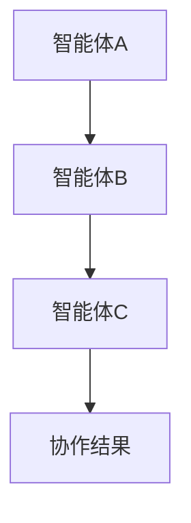
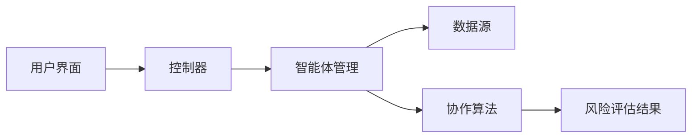

                 


# 利用多智能体系统构建动态的公司治理风险评估模型

> 关键词：多智能体系统，公司治理，风险评估，动态模型，协作算法

> 摘要：随着公司治理的复杂化和风险的多样化，传统的静态风险评估方法已难以满足实际需求。本文提出利用多智能体系统构建动态的公司治理风险评估模型，通过智能体之间的协作与交互，实现对风险的实时监测、评估和优化。本文详细阐述了多智能体系统的概念与特点，分析了其在公司治理风险评估中的应用前景，提出了基于多智能体系统的协作算法，并结合实际案例展示了如何通过系统设计与实现，构建一个高效、动态的风险评估模型。文章最后总结了研究成果，并展望了未来的发展方向。

---

# 第一部分: 多智能体系统与公司治理风险评估概述

## 第1章: 多智能体系统与公司治理风险评估概述

### 1.1 多智能体系统的概念与特点
#### 1.1.1 多智能体系统的定义
多智能体系统（Multi-Agent System, MAS）是由多个相互作用的智能体（Agent）组成的分布式系统。智能体是指能够感知环境、做出决策并采取行动的实体，可以是软件程序、机器人或其他具有智能性的实体。

#### 1.1.2 多智能体系统的特征
多智能体系统具有以下核心特征：
1. **分布性**：智能体是分布式存在的，没有中央控制节点。
2. **自主性**：每个智能体都是自主决策的，能够独立完成任务。
3. **协作性**：智能体之间可以通过协作完成共同目标。
4. **反应性**：智能体能够根据环境变化实时调整行为。
5. **动态性**：系统的状态和智能体之间的关系可以实时变化。

#### 1.1.3 多智能体系统与公司治理的关系
公司治理涉及多个利益相关者，包括股东、董事会、管理层、员工和外部监管机构等。这些利益相关者之间存在复杂的交互关系，可以通过多智能体系统进行建模和模拟。

---

### 1.2 公司治理风险评估的背景与意义
#### 1.2.1 公司治理的基本概念
公司治理是通过公司章程、规章制度和组织结构，确保公司战略目标的实现、风险的有效控制和利益相关者的权益保护。

#### 1.2.2 风险评估在公司治理中的重要性
风险评估是公司治理的核心环节，旨在识别、量化和应对各种潜在风险，确保公司稳健运营。

#### 1.2.3 动态风险评估的需求
传统的风险评估方法通常是静态的，无法实时捕捉公司内外部环境的变化。动态风险评估能够根据实时数据和环境变化，快速调整评估结果，提高风险应对的及时性和有效性。

---

### 1.3 多智能体系统在风险评估中的应用前景
#### 1.3.1 多智能体系统的优势
1. **分布式计算**：能够处理复杂的分布式问题。
2. **协作能力**：智能体之间可以协作完成复杂任务。
3. **适应性**：能够根据环境变化自适应调整行为。

#### 1.3.2 多智能体系统在风险评估中的潜在应用
1. **实时数据处理**：利用多智能体系统实时采集和分析数据。
2. **风险传播模拟**：通过智能体模拟风险在公司内部和外部的传播路径。
3. **决策支持**：基于智能体协作结果，提供风险应对策略。

#### 1.3.3 应用中的挑战与解决方案
1. **智能体之间的通信与协调**：需要设计高效的通信协议和协调机制。
2. **动态环境下的稳定性**：需要确保系统在动态环境下的稳定性和鲁棒性。

---

## 第2章: 多智能体系统构建动态风险评估模型的核心概念

### 2.1 多智能体系统的核心要素
#### 2.1.1 智能体的定义与分类
智能体可以分为简单反应型智能体、基于模型的反应型智能体、目标驱动型智能体和实用驱动型智能体。

#### 2.1.2 智能体之间的交互机制
智能体之间的交互可以通过直接通信或间接影响实现。通信机制包括消息传递、状态共享等。

#### 2.1.3 智能体的协作与协调
协作是指智能体之间通过合作完成共同目标，协调是指在协作过程中保持一致性和效率。

---

### 2.2 公司治理风险评估模型的构建要素
#### 2.2.1 风险评估的维度与指标
公司治理风险评估可以从财务风险、运营风险、法律风险、声誉风险等多个维度进行。

#### 2.2.2 动态风险评估的模型结构
动态风险评估模型需要考虑时间因素，能够实时更新风险评估结果。

#### 2.2.3 数据来源与处理方法
数据来源可以包括公司内部数据、外部市场数据和监管数据等，需要进行清洗、融合和分析。

---

### 2.3 多智能体系统与风险评估模型的结合
#### 2.3.1 多智能体系统在风险评估中的角色
智能体可以作为数据采集者、风险分析者和决策支持者。

#### 2.3.2 动态风险评估模型的构建逻辑
1. **数据采集**：智能体实时采集公司内外部数据。
2. **风险分析**：智能体对数据进行分析，识别潜在风险。
3. **风险评估**：通过多智能体协作，综合评估风险的严重性和影响范围。
4. **动态更新**：根据环境变化，实时更新风险评估结果。

#### 2.3.3 模型的动态更新与优化机制
通过反馈机制和自适应算法，实现模型的动态优化。

---

# 第二部分: 多智能体系统构建动态风险评估模型的算法原理

## 第3章: 多智能体系统协作算法原理

### 3.1 多智能体协作的基本原理
#### 3.1.1 协作机制的定义
协作机制是指智能体之间如何通过合作完成共同目标。

#### 3.1.2 协作算法的分类
协作算法可以分为基于规则的协作、基于目标的协作和基于博弈论的协作。

#### 3.1.3 协作算法的核心步骤
1. **任务分配**：智能体根据自身能力和目标分配任务。
2. **信息共享**：智能体之间共享必要的信息和数据。
3. **协作执行**：智能体协同完成任务。
4. **结果反馈**：根据结果调整协作策略。

---

### 3.2 基于多智能体的协作算法实现
#### 3.2.1 算法流程图（Mermaid）


#### 3.2.2 算法实现的Python代码
```python
class Agent:
    def __init__(self, id):
        self.id = id
        self.state = None

    def collaborate(self, other_agents):
        # 获取其他智能体的状态
        states = [agent.state for agent in other_agents]
        # 计算协作结果
        result = self.calculate(states)
        return result

    def calculate(self, states):
        # 简单的协作逻辑，返回平均值
        return sum(states) / len(states)

# 示例
agent1 = Agent(1)
agent2 = Agent(2)
agent3 = Agent(3)

# 智能体协作
result = agent1.collaborate([agent2, agent3])
print(f"协作结果：{result}")
```

---

### 3.3 数学模型与公式
#### 3.3.1 动态风险评估的数学模型
$$ R(t) = f(x(t), y(t), z(t)) $$
其中，$R(t)$ 表示时间 $t$ 的风险值，$x(t)$、$y(t)$、$z(t)$ 分别表示不同的风险因素。

#### 3.3.2 协作算法的优化模型
$$ \text{min} \quad \sum_{i=1}^{n} (R_i - R_{\text{target}})^2 $$
其中，$R_i$ 表示第 $i$ 个智能体的评估结果，$R_{\text{target}}$ 表示目标风险值。

---

# 第四章: 系统分析与架构设计

## 第4章: 系统分析与架构设计

### 4.1 项目背景与需求分析
本项目旨在通过多智能体系统构建动态的公司治理风险评估模型，实现对公司风险的实时监测和评估。

### 4.2 系统功能设计
系统功能包括数据采集、风险分析、协作评估和结果展示。

### 4.3 系统架构设计


### 4.4 系统接口设计
系统接口包括数据接口、协作接口和结果展示接口。

---

## 第5章: 项目实战

### 5.1 环境安装与配置
需要安装Python、相关库（如NumPy、Matplotlib）和多智能体框架（如Multi-Agent Framework）。

### 5.2 核心代码实现
```python
import numpy as np

class RiskAssessmentAgent:
    def __init__(self, id):
        self.id = id
        self.data = []

    def collect_data(self, data):
        self.data.append(data)

    def assessRisk(self):
        if not self.data:
            return 0
        return np.mean(self.data)

# 创建智能体
agent1 = RiskAssessmentAgent(1)
agent2 = RiskAssessmentAgent(2)

# 数据采集与评估
agent1.collect_data(0.8)
agent1.collect_data(0.9)
agent2.collect_data(0.7)
agent2.collect_data(0.8)

result1 = agent1.assessRisk()
result2 = agent2.assessRisk()

print(f"Agent 1评估结果：{result1}")
print(f"Agent 2评估结果：{result2}")
```

### 5.3 实际案例分析
通过实际案例分析，展示多智能体系统在公司治理风险评估中的应用效果。

---

## 第6章: 总结与展望

### 6.1 总结
本文提出了利用多智能体系统构建动态的公司治理风险评估模型的方法，详细阐述了其核心概念、算法原理和系统设计。

### 6.2 注意事项
在实际应用中，需要注意数据隐私、智能体之间的通信效率和系统的可扩展性。

### 6.3 未来研究方向
未来可以研究多智能体系统在其他领域的应用，如金融风险评估、城市交通管理等。

---

# 作者：AI天才研究院/AI Genius Institute & 禅与计算机程序设计艺术 /Zen And The Art of Computer Programming

