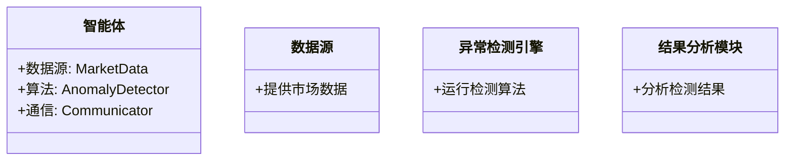
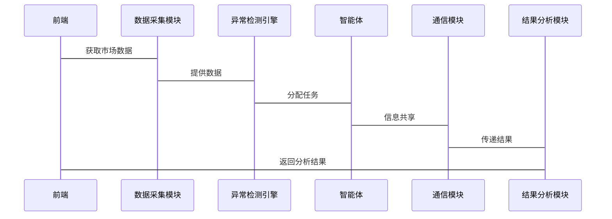

                 


# 利用多智能体系统构建动态的市场异常检测模型

> **关键词**: 多智能体系统, 市场异常检测, 动态模型, 分布式计算, 强化学习, 协作机制  
> **摘要**: 本文探讨了利用多智能体系统构建动态市场异常检测模型的方法，详细介绍了核心概念、算法原理、系统架构及实战项目。通过多智能体系统的协作机制和动态适应性，提升市场异常检测的实时性和准确性。

---

## 第1章: 多智能体系统与市场异常检测概述

### 1.1 多智能体系统的概念与特点

#### 1.1.1 多智能体系统的定义
多智能体系统（Multi-Agent System, MAS）是由多个智能体（Agent）组成的系统，这些智能体能够通过协作完成复杂任务。每个智能体具备感知环境、自主决策和学习能力，能够与其他智能体通信并共享信息。

**对比表：多智能体系统与其他协作系统的特点对比**

| 特性                | 分布式系统          | 并行计算系统      | 多智能体系统（MAS）     |
|---------------------|-------------------|------------------|-----------------------|
| 结构化协作           | 基于任务分配       | 基于并行处理       | 基于智能体协作         |
| 智能性               | 无明确智能性       | 无明确智能性       | 具有自主智能性         |
| 信息共享机制         | 基于共享内存       | 基于数据交换       | 基于消息传递和协作     |
| 适应性               | 低                | 中                | 高                    |

#### 1.1.2 多智能体系统的属性特征对比表
| 属性       | 分布式计算         | 并行计算         | 多智能体协作       |
|------------|------------------|----------------|-----------------|
| 信息共享    | 共享内存           | 数据交换         | 消息传递           |
| 任务分配    | 静态任务分配       | 静态任务分配     | 动态任务分配       |
| 可扩展性    | 高                | 高               | 高                |
| 协作机制    | 无                | 无               | 强               |

#### 1.1.3 多智能体系统的ER实体关系图

```mermaid
er
actor Role: 市场分析师
actor Role: 智能体
actor Role: 数据源
actor Role: 异常检测引擎
```

### 1.2 市场异常检测的背景与问题

#### 1.2.1 市场异常检测的定义
市场异常检测（Market Anomaly Detection）是指在金融市场中识别价格波动、交易量突变等异常现象，帮助投资者和监管机构及时发现潜在风险。

#### 1.2.2 市场异常检测的常见问题
- **数据复杂性**: 市场数据包含大量噪声和非线性关系。
- **实时性需求**: 异常检测需要快速响应。
- **动态性挑战**: 市场环境不断变化，模型需动态调整。

#### 1.2.3 市场异常检测的边界与外延
- **边界**: 识别偏离正常模式的交易或价格波动。
- **外延**: 涵盖股票、期货等多种金融产品。

### 1.3 多智能体系统在市场异常检测中的应用

#### 1.3.1 多智能体系统的协作机制
多智能体系统通过协作完成任务，每个智能体负责特定数据处理和分析。

#### 1.3.2 多智能体系统的动态适应性
系统能够根据市场变化动态调整智能体的行为和协作方式。

#### 1.3.3 多智能体系统的优势与挑战
- **优势**: 高度并行、分布式计算能力强。
- **挑战**: 协作复杂性高，需解决通信和同步问题。

---

## 第2章: 多智能体系统的核心原理

### 2.1 多智能体系统的协作机制

#### 2.1.1 分布式计算与协作
分布式计算将任务分解到多个节点，每个节点独立处理，通过通信机制共享结果。

#### 2.1.2 信息共享与协调
智能体之间通过消息传递共享信息，协调一致行动。

#### 2.1.3 协作算法的实现
协作算法包括任务分配、信息共享和结果整合。

### 2.2 强化学习与多智能体系统的结合

#### 2.2.1 强化学习的基本原理
强化学习通过试错优化策略，智能体通过与环境互动获得奖励。

#### 2.2.2 多智能体强化学习的挑战
- **策略协调**: 智能体之间策略一致。
- **通信复杂性**: 通信开销增加。

#### 2.2.3 多智能体强化学习的实现
实现包括分布式计算和协作策略优化。

### 2.3 多智能体系统的动态适应性

#### 2.3.1 动态环境的定义与特点
动态环境指市场环境快速变化，智能体需实时调整。

#### 2.3.2 多智能体系统的动态调整机制
系统通过反馈机制和自适应算法动态调整协作方式。

#### 2.3.3 动态适应性的实现方法
使用在线学习和反馈机制优化模型。

---

## 第3章: 多智能体系统的算法原理

### 3.1 多智能体协作算法

#### 3.1.1 分布式强化学习算法
分布式强化学习通过多智能体并行优化策略。

#### 3.1.2 协作式强化学习算法
协作式强化学习中，智能体协作完成任务，共享奖励。

#### 3.1.3 联合强化学习算法
联合强化学习中，智能体共同优化策略。

### 3.2 多智能体系统的数学模型

#### 3.2.1 多智能体系统的状态空间
状态空间包括市场数据和智能体状态。

#### 3.2.2 动作空间
动作空间包括交易决策和数据处理动作。

#### 3.2.3 奖励函数
奖励函数定义为异常检测准确率。

---

## 第4章: 多智能体系统的系统架构

### 4.1 问题场景介绍

#### 4.1.1 问题描述
实时监控金融市场数据，识别异常交易。

#### 4.1.2 项目介绍
构建一个多智能体系统，实时分析市场数据，检测异常。

### 4.2 系统功能设计

#### 4.2.1 功能模块
- 数据采集模块
- 异常检测引擎
- 结果分析模块

#### 4.2.2 领域模型


### 4.3 系统架构设计

#### 4.3.1 系统架构


### 4.4 系统交互设计

#### 4.4.1 系统交互流程


---

## 第5章: 项目实战

### 5.1 环境安装

#### 5.1.1 安装Python
```bash
python --version
pip install -r requirements.txt
```

#### 5.1.2 安装依赖
```bash
pip install numpy pandas scikit-learn
```

### 5.2 系统核心实现源代码

#### 5.2.1 异常检测引擎
```python
class AnomalyDetector:
    def __init__(self):
        self.models = {}  # 每个智能体对应的模型

    def detect(self, data):
        # 分配任务给多个智能体
        results = []
        for agent in self.models:
            result = self.models[agent].predict(data)
            results.append(result)
        return results
```

#### 5.2.2 智能体协作
```python
class Agent:
    def __init__(self, id):
        self.id = id
        self.model = Model()

    def collaborate(self, data):
        result = self.model.predict(data)
        return result
```

### 5.3 案例分析

#### 5.3.1 数据预处理
处理市场数据，提取特征。

#### 5.3.2 模型训练
使用历史数据训练异常检测模型。

#### 5.3.3 实时检测
部署系统，实时监控市场数据。

---

## 第6章: 最佳实践

### 6.1 小结
多智能体系统通过协作和动态适应性，提升了市场异常检测的效率和准确性。

### 6.2 注意事项
- 确保数据安全
- 优化通信机制
- 定期模型更新

### 6.3 拓展阅读
推荐学习分布式系统和强化学习相关知识。

---

**作者：AI天才研究院 & 禅与计算机程序设计艺术**

