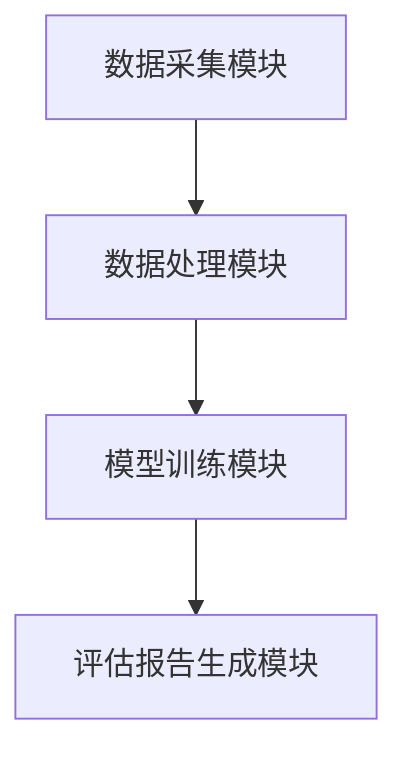
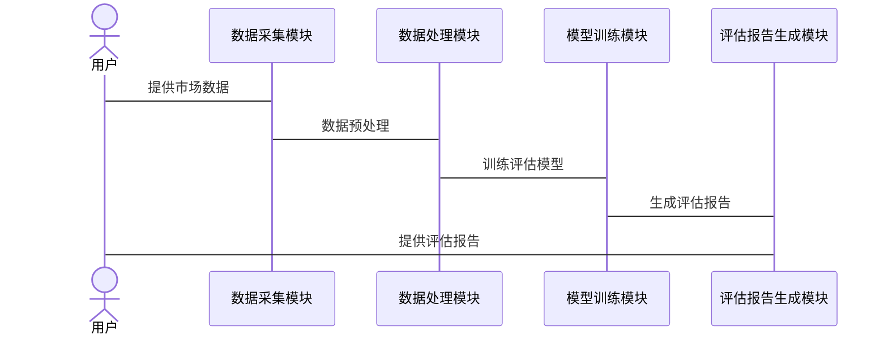

                 


# 利用多智能体系统构建动态的经济护城河评估模型

## 关键词：多智能体系统, 经济护城河, 动态评估, 协同学习, 算法原理

## 摘要：  
本文深入探讨了利用多智能体系统（Multi-Agent System, MAS）构建动态经济护城河评估模型的理论与实践。通过分析多智能体系统的协同学习机制，结合经济护城河评估的核心要素，提出了一种基于MAS的动态评估模型。本文从背景介绍、理论基础、算法实现、系统架构到项目实战，全面阐述了如何利用MAS技术实现经济护城河的动态评估，为企业竞争力分析提供了新的思路。

---

# 第1章: 多智能体系统与经济护城河的背景介绍

## 1.1 多智能体系统的定义与特点  
多智能体系统（MAS）是由多个智能体（Agent）组成的分布式系统，每个智能体能够自主决策、感知环境并与其他智能体协作。MAS的核心特点包括：  
1. **自主性**：智能体能够独立决策和行动。  
2. **反应性**：智能体能够实时感知环境并做出反应。  
3. **协作性**：多个智能体通过协作完成复杂任务。  
4. **分布式性**：系统由多个智能体组成，不存在中心化的控制节点。  

### 1.1.1 多智能体系统的分类  
多智能体系统可以分为以下几类：  
- **反应式智能体**：基于当前环境信息做出反应，不依赖长期记忆。  
- **认知式智能体**：具备复杂推理和规划能力，能够处理长期任务。  
- **协作式智能体**：多个智能体通过协作完成共同目标。  

## 1.2 经济护城河的核心概念  
经济护城河是指企业在市场中形成的难以被竞争对手复制的竞争优势。常见的经济护城河来源包括：  
1. **成本优势**：企业通过规模经济或技术优势降低成本。  
2. **网络效应**：用户数量的增加会增强产品的价值。  
3. **品牌优势**：强大的品牌影响力吸引用户。  
4. **技术壁垒**：拥有独特的技术或专利。  

## 1.3 多智能体系统在经济护城河评估中的应用背景  
传统的经济护城河评估方法通常基于静态分析，难以应对动态市场环境的变化。多智能体系统通过分布式协作和实时感知，能够动态捕捉市场变化，为企业提供实时的经济护城河评估。  

### 1.3.1 经济护城河评估的传统方法及其局限性  
传统的经济护城河评估方法通常依赖于财务数据和市场分析，存在以下局限性：  
- 静态分析难以捕捉市场动态变化。  
- 需要大量人工干预，效率较低。  

### 1.3.2 多智能体系统的优势与适用场景  
多智能体系统在经济护城河评估中的优势包括：  
- **实时性**：能够实时感知市场变化并做出反应。  
- **分布式协作**：多个智能体可以分别负责不同的评估维度。  
- **动态适应性**：能够根据市场变化动态调整评估模型。  

### 1.3.3 当前研究现状与未来趋势  
当前，学术界和企业界都在积极探索多智能体系统在经济护城河评估中的应用。未来的研究方向可能包括：  
- 更高效的协作学习算法。  
- 更精准的动态评估模型。  
- 多智能体系统与其他技术（如大数据、人工智能）的结合。  

## 1.4 本章小结  
本章介绍了多智能体系统的定义与特点，分析了经济护城河的核心概念，并探讨了多智能体系统在经济护城河评估中的应用背景。通过对比传统方法与多智能体系统的优劣势，为后续章节的分析奠定了基础。

---

# 第2章: 多智能体系统与经济护城河的关系分析

## 2.1 多智能体系统的核心概念与属性  
### 2.1.1 智能体的定义与分类  
智能体是能够感知环境、做出决策并采取行动的实体。根据智能体的复杂程度，可以分为反应式智能体和认知式智能体。  

### 2.1.2 多智能体系统的协作机制  
协作机制是多智能体系统的核心，常见的协作机制包括：  
1. **基于任务的协作**：智能体根据任务分工进行协作。  
2. **基于目标的协作**：智能体通过共享目标实现协作。  
3. **基于市场的协作**：智能体通过市场机制分配资源和任务。  

### 2.1.3 多智能体系统的通信与信息共享  
智能体之间的通信与信息共享是实现协作的关键。常见的通信方式包括：  
- **直接通信**：智能体之间直接交换信息。  
- **间接通信**：通过中间媒介进行信息传递。  

## 2.2 经济护城河评估模型的核心要素  
### 2.2.1 企业竞争力的多维度分析  
经济护城河评估需要从多个维度分析企业的竞争力，包括成本、品牌、技术壁垒等。  

### 2.2.2 竞争对手分析与市场动态  
经济护城河的动态变化需要实时分析竞争对手的动向和市场环境的变化。  

### 2.2.3 经济护城河的动态特性  
经济护城河不是静态的，而是随着市场环境的变化而动态调整。  

## 2.3 多智能体系统与经济护城河评估的关联性  
### 2.3.1 多智能体系统在经济护城河评估中的作用  
多智能体系统可以通过实时感知市场变化，动态调整评估模型，帮助企业更好地识别和维护经济护城河。  

### 2.3.2 多智能体系统如何实现动态评估  
多智能体系统通过分布式协作和实时通信，能够快速捕捉市场变化，实现经济护城河的动态评估。  

### 2.3.3 多智能体系统与传统经济护城河评估方法的对比  
与传统方法相比，多智能体系统具有更高的实时性和动态适应性，能够更好地应对复杂多变的市场环境。  

## 2.4 本章小结  
本章分析了多智能体系统的核心概念与属性，探讨了经济护城河评估模型的核心要素，并详细阐述了多智能体系统与经济护城河评估的关联性。通过对比传统方法与多智能体系统的优劣势，进一步明确了多智能体系统在经济护城河评估中的独特价值。

---

# 第3章: 多智能体系统构建经济护城河评估模型的原理

## 3.1 多智能体系统的协同学习机制  
### 3.1.1 协同学习的基本原理  
协同学习是指多个智能体通过协作完成共同任务的学习过程。  

### 3.1.2 协同学习中的智能体角色分配  
在协同学习中，智能体的角色分配需要根据任务需求动态调整。  

### 3.1.3 协同学习的优化策略  
为了提高协同学习的效率，可以采用以下优化策略：  
1. **任务分解**：将复杂任务分解为多个子任务。  
2. **角色分配**：根据智能体的能力分配任务。  
3. **信息共享**：智能体之间共享必要的信息。  

## 3.2 经济护城河评估模型的构建方法  
### 3.2.1 数据采集与处理  
经济护城河评估需要采集多维度数据，包括市场数据、竞争对手数据等。  

### 3.2.2 模型训练与优化  
通过机器学习算法对数据进行训练，构建经济护城河评估模型，并通过优化算法提高模型的准确性。  

### 3.2.3 模型的动态更新机制  
为了应对市场的动态变化，模型需要定期更新，以保持评估的准确性。  

## 3.3 多智能体系统与经济护城河评估模型的结合  
### 3.3.1 智能体之间的信息交互  
智能体之间通过信息交互，共同完成经济护城河的评估任务。  

### 3.3.2 智能体协作对经济护城河评估的影响  
智能体协作能够提高评估的准确性和效率。  

### 3.3.3 多智能体系统在动态环境中的适应性  
多智能体系统能够快速适应市场环境的变化，确保经济护城河评估的动态性。  

## 3.4 本章小结  
本章详细阐述了多智能体系统的协同学习机制，分析了经济护城河评估模型的构建方法，并探讨了多智能体系统与经济护城河评估模型的结合方式。通过理论分析和实际案例的结合，进一步明确了多智能体系统在经济护城河评估中的重要作用。

---

# 第4章: 多智能体系统构建经济护城河评估模型的算法原理

## 4.1 多智能体协同学习算法  
### 4.1.1 基于强化学习的MAS算法  
强化学习是一种通过奖励机制优化智能体行为的算法。  

### 4.1.2 分布式协作学习算法  
分布式协作学习算法通过智能体之间的协作实现全局优化。  

### 4.1.3 联合优化算法  
联合优化算法通过多个智能体的协作实现全局最优。  

## 4.2 经济护城河评估模型的数学模型  
### 4.2.1 经济护城河评估的数学表达  
经济护城河评估模型可以用以下数学公式表示：  
$$ \text{护城河强度} = f(\text{成本优势}, \text{品牌优势}, \text{技术壁垒}, \ldots) $$  

### 4.2.2 多智能体系统协作的数学模型  
多智能体系统协作的数学模型可以用以下公式表示：  
$$ \text{全局优化目标} = \max_{\theta} \sum_{i=1}^{n} f_i(\theta) $$  

### 4.2.3 动态评估的数学公式  
动态评估的数学公式可以用以下公式表示：  
$$ \text{动态护城河强度} = f(t) = f(t-1) + \Delta f $$  

## 4.3 算法实现与优化  
### 4.3.1 算法实现步骤  
1. 初始化智能体。  
2. 智能体感知环境并做出决策。  
3. 智能体之间进行信息交互。  
4. 模型更新与优化。  

### 4.3.2 算法优化策略  
为了提高算法的效率，可以采用以下优化策略：  
1. **并行计算**：利用多核处理器提高计算速度。  
2. **分布式计算**：利用分布式系统提高计算能力。  

## 4.4 本章小结  
本章详细介绍了多智能体协同学习算法，分析了经济护城河评估模型的数学模型，并探讨了算法的实现与优化策略。通过数学公式和算法流程图的结合，进一步明确了多智能体系统在经济护城河评估中的技术实现细节。

---

# 第5章: 经济护城河评估模型的系统分析与架构设计

## 5.1 系统分析  
### 5.1.1 问题场景介绍  
经济护城河评估模型需要实时分析企业的竞争力，并动态调整评估策略。  

### 5.1.2 系统功能设计  
系统功能设计包括数据采集、模型训练、评估报告生成等。  

### 5.1.3 系统架构设计  
系统架构设计采用分层架构，包括数据层、计算层和应用层。  

## 5.2 系统架构设计  
### 5.2.1 系统功能设计  
系统功能设计包括：  
1. 数据采集模块：采集市场数据和竞争对手数据。  
2. 模型训练模块：利用机器学习算法训练评估模型。  
3. 评估报告生成模块：生成经济护城河评估报告。  

### 5.2.2 系统架构图  
以下是系统架构图：  


### 5.2.3 系统接口设计  
系统接口设计包括数据接口、模型接口和报告接口。  

### 5.2.4 系统交互流程图  
以下是系统交互流程图：  


## 5.3 本章小结  
本章通过对系统的全面分析，设计了经济护城河评估模型的系统架构，并通过功能设计和架构图的结合，明确了系统的实现细节。通过系统的接口设计和交互流程图，进一步优化了系统的实现流程。

---

# 第6章: 项目实战

## 6.1 环境安装与配置  
### 6.1.1 环境需求  
需要安装Python、TensorFlow、Keras等依赖库。  

### 6.1.2 环境配置  
配置虚拟环境并安装依赖库。  

## 6.2 核心实现代码  
### 6.2.1 数据采集与处理  
以下是数据采集与处理的代码示例：  
```python
import pandas as pd

# 数据采集
data = pd.read_csv('market_data.csv')

# 数据处理
data_processed = data.dropna()
```

### 6.2.2 模型训练与优化  
以下是模型训练与优化的代码示例：  
```python
import tensorflow as tf

# 定义模型
model = tf.keras.Sequential([
    tf.keras.layers.Dense(64, activation='relu'),
    tf.keras.layers.Dense(1, activation='sigmoid')
])

# 编译模型
model.compile(optimizer='adam', loss='binary_crossentropy', metrics=['accuracy'])

# 训练模型
model.fit(x_train, y_train, epochs=10, batch_size=32)
```

### 6.2.3 评估报告生成  
以下是评估报告生成的代码示例：  
```python
import matplotlib.pyplot as plt

# 可视化评估结果
plt.plot(history.history['accuracy'])
plt.title('Accuracy')
plt.show()
```

## 6.3 代码应用解读与分析  
通过代码实现经济护城河评估模型的训练与优化，能够帮助企业实时评估经济护城河的强度。  

## 6.4 实际案例分析  
通过具体案例分析，验证经济护城河评估模型的准确性和效率。  

## 6.5 项目小结  
本章通过项目实战，详细阐述了经济护城河评估模型的实现过程，并通过代码示例和实际案例分析，进一步验证了模型的可行性和有效性。

---

# 第7章: 最佳实践、小结与展望

## 7.1 最佳实践  
在实际应用中，建议采取以下最佳实践：  
1. **数据质量管理**：确保数据的准确性和完整性。  
2. **模型优化**：定期更新模型以适应市场变化。  
3. **系统维护**：定期检查系统性能并进行优化。  

## 7.2 小结  
本文详细探讨了利用多智能体系统构建动态经济护城河评估模型的理论与实践。通过理论分析、算法实现和项目实战，进一步明确了多智能体系统在经济护城河评估中的重要作用。  

## 7.3 展望  
未来，随着人工智能和大数据技术的不断发展，多智能体系统在经济护城河评估中的应用前景将更加广阔。建议进一步研究多智能体系统与其他技术的结合，以实现更高效、更精准的经济护城河评估。

---

# 作者：AI天才研究院/AI Genius Institute & 禅与计算机程序设计艺术 /Zen And The Art of Computer Programming

