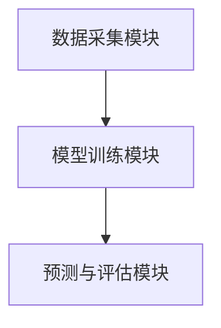

                 


# 利用多智能体系统模拟不同利率环境：评估公司财务健康度

## 关键词：多智能体系统、利率环境、公司财务健康度、算法原理、系统架构

## 摘要：  
本文探讨了利用多智能体系统模拟不同利率环境以评估公司财务健康度的方法。通过分析利率环境对财务健康度的影响，结合多智能体系统的动态交互特性，提出了一种基于多智能体的模拟方法。该方法通过构建多智能体模型，模拟不同利率环境下的公司财务状况，为企业提供了一种新的财务健康度评估工具。本文详细介绍了多智能体系统的算法原理、系统架构设计、项目实现及实际案例分析，为读者提供了从理论到实践的全面指导。

---

# 第一部分：引言

## 1.1 多智能体系统与利率环境模拟

### 1.1.1 多智能体系统的定义与特点  
多智能体系统（Multi-Agent System, MAS）是由多个智能体组成的分布式系统，每个智能体都是一个能够感知环境、做出决策并采取行动的实体。多智能体系统具有以下特点：
- **自主性**：每个智能体能够自主决策。
- **反应性**：智能体能够实时感知环境并做出反应。
- **协作性**：多个智能体可以协作完成复杂任务。
- **分布性**：智能体之间通过分布式计算进行交互。

### 1.1.2 利率环境模拟的背景与意义  
利率是影响公司财务健康度的重要因素之一。在不同利率环境下，公司的财务状况会受到显著影响。传统的财务分析方法通常基于静态假设，难以捕捉利率变化的动态影响。通过多智能体系统模拟利率环境，可以更真实地反映公司财务状况的变化，为财务决策提供更有力的支持。

### 1.1.3 公司财务健康度评估的核心问题  
公司财务健康度评估的核心问题是如何在动态变化的利率环境中，准确预测公司的财务状况。传统的财务模型通常基于历史数据和静态假设，难以应对复杂多变的利率环境。多智能体系统通过模拟利率环境的变化，可以更好地捕捉财务状况的动态变化，从而提高评估的准确性。

## 1.2 本书的研究目标与结构安排  

### 1.2.1 研究目标  
本文旨在通过多智能体系统模拟不同利率环境，评估公司财务健康度。具体目标包括：
1. 探讨多智能体系统在利率环境模拟中的应用。
2. 提出一种基于多智能体系统的财务健康度评估方法。
3. 实现一个能够模拟不同利率环境的多智能体系统，并验证其有效性。

### 1.2.2 本书的结构安排  
本书分为以下几个部分：
1. **引言**：介绍研究背景、目标和结构安排。
2. **多智能体系统与利率模型基础**：讲解多智能体系统的概念、特点，以及利率环境的建模方法。
3. **公司财务健康度评估的理论基础**：介绍财务健康度的定义、关键指标及多智能体系统在财务评估中的应用。
4. **多智能体系统的算法原理**：详细讲解多智能体系统的算法及其实现。
5. **系统架构与设计**：设计并实现一个基于多智能体系统的利率环境模拟系统。
6. **项目实战**：通过实际案例分析，验证系统的有效性和准确性。
7. **最佳实践与小结**：总结研究成果，并展望未来发展方向。

### 1.2.3 预备知识与读者对象  
读者需要具备一定的计算机编程基础，熟悉Python编程语言，并对多智能体系统和利率模型有一定的了解。本书适合对人工智能、多智能体系统、利率模型及公司财务健康度评估感兴趣的读者阅读。

---

# 第二部分：多智能体系统与利率模型基础

## 2.1 多智能体系统的基本概念  

### 2.1.1 多智能体系统的定义  
多智能体系统是由多个智能体组成的分布式系统，每个智能体都具有自主性、反应性和协作性。智能体之间通过通信和协作，共同完成复杂任务。

### 2.1.2 多智能体系统的特征  
1. **自主性**：智能体能够自主决策。
2. **反应性**：智能体能够实时感知环境并做出反应。
3. **协作性**：多个智能体可以协作完成复杂任务。
4. **分布性**：智能体之间通过分布式计算进行交互。

### 2.1.3 多智能体系统与传统模型的区别  
传统模型通常基于静态假设，难以捕捉动态变化的环境。多智能体系统通过模拟多个智能体的交互，能够更好地反映复杂系统的动态变化。

## 2.2 利率环境的建模方法  

### 2.2.1 利率环境的动态特征  
利率环境具有动态变化的特点，受到宏观经济政策、市场供需等多种因素的影响。多智能体系统可以通过模拟这些因素的变化，反映利率环境的动态特征。

### 2.2.2 常见的利率模型  
常见的利率模型包括：
1. **固定利率模型**：假设利率在一定时期内保持不变。
2. **浮动利率模型**：利率根据市场变化实时调整。
3. **随机利率模型**：利率变化具有随机性，通常基于布朗运动进行建模。

### 2.2.3 多智能体系统在利率建模中的优势  
多智能体系统可以通过模拟多个智能体的交互，反映利率环境的动态变化。每个智能体可以代表不同的市场参与者，如银行、企业、投资者等，通过它们的交互，可以模拟利率的变化过程。

---

# 第三部分：公司财务健康度评估的理论基础

## 3.1 财务健康度的定义与关键指标  

### 3.1.1 财务健康度的定义  
财务健康度是衡量公司财务状况健康程度的指标，通常包括盈利能力、偿债能力、运营能力和成长能力等方面。

### 3.1.2 主要财务指标  
1. **净利润率**：净利润与收入的比率，反映公司的盈利能力。
2. **资产负债率**：负债与资产的比率，反映公司的偿债能力。
3. **流动比率**：流动资产与流动负债的比率，反映公司的短期偿债能力。
4. **速动比率**：速动资产与流动负债的比率，反映公司的快速偿债能力。
5. **营业收入增长率**：营业收入的增长速度，反映公司的成长能力。

### 3.1.3 财务健康度评估的常用方法  
常用的财务健康度评估方法包括：
1. **Z分数模型**：通过多个财务指标的加权组合，预测公司破产的可能性。
2. **杜邦分析法**：通过分解财务指标，分析公司的财务状况。
3. **比率分析法**：通过分析财务比率，评估公司的财务健康度。

## 3.2 多智能体系统在财务评估中的应用  

### 3.2.1 多智能体系统与财务数据的关系  
多智能体系统可以通过模拟多个市场参与者的交互，反映财务数据的变化。每个智能体可以代表不同的市场参与者，如银行、企业、投资者等。

### 3.2.2 多智能体系统在财务预测中的作用  
多智能体系统可以通过模拟利率环境的变化，预测公司财务状况的变化。通过分析财务指标的变化趋势，可以评估公司在不同利率环境下的财务健康度。

### 3.2.3 财务健康度评估的多智能体模型框架  
多智能体模型框架包括以下几个部分：
1. **智能体设计**：定义每个智能体的行为规则和决策逻辑。
2. **环境建模**：模拟利率环境的变化。
3. **数据采集**：采集公司的财务数据。
4. **模型训练**：通过历史数据训练模型。
5. **预测与评估**：模拟不同利率环境下的公司财务状况，评估公司的财务健康度。

---

# 第四部分：多智能体系统的算法原理

## 4.1 多智能体系统的算法概述  

### 4.1.1 基于规则的多智能体算法  
基于规则的多智能体算法通过预定义的规则来指导智能体的行为。每个智能体根据环境信息和预定义的规则，做出决策并采取行动。

### 4.1.2 基于学习的多智能体算法  
基于学习的多智能体算法通过机器学习技术，训练智能体在复杂环境中做出最优决策。常用的学习方法包括强化学习和深度学习。

### 4.1.3 算法选择的考虑因素  
算法选择需要考虑以下因素：
1. **任务复杂度**：任务的复杂程度决定了算法的选择。
2. **数据规模**：数据规模影响算法的训练时间和计算资源。
3. **实时性要求**：实时性要求决定了算法的响应速度。

## 4.2 多智能体系统的数学模型  

### 4.2.1 状态空间模型  
状态空间模型描述了智能体在不同状态下的行为。状态空间可以通过状态转移矩阵来描述。

### 4.2.2 动作空间模型  
动作空间模型描述了智能体在不同状态下的可能动作。动作空间可以通过动作转移矩阵来描述。

### 4.2.3 奖励函数设计  
奖励函数设计是强化学习中的关键部分。通过设计合理的奖励函数，可以引导智能体做出最优决策。

### 4.2.4 转换函数设计  
转换函数设计描述了状态和动作之间的关系。通过转换函数，可以计算出智能体在不同状态和动作下的下一状态。

## 4.3 算法实现与优化  

### 4.3.1 算法实现步骤  
1. **环境建模**：定义利率环境和公司财务数据。
2. **智能体设计**：定义智能体的行为规则和决策逻辑。
3. **模型训练**：通过历史数据训练模型。
4. **预测与评估**：模拟不同利率环境下的公司财务状况，评估公司的财务健康度。

### 4.3.2 算法优化策略  
1. **参数调整**：通过调整算法参数，优化模型的性能。
2. **并行计算**：利用并行计算技术，提高模型的训练效率。
3. **模型压缩**：通过模型压缩技术，降低模型的计算资源消耗。

### 4.3.3 算法性能评估  
1. **准确率评估**：通过准确率评估模型的预测能力。
2. **运行时间评估**：通过运行时间评估模型的计算效率。
3. **资源消耗评估**：通过资源消耗评估模型的计算成本。

---

# 第五部分：系统架构与设计

## 5.1 系统架构设计  

### 5.1.1 系统模块划分  
系统模块包括：
1. **数据采集模块**：采集公司的财务数据和利率数据。
2. **模型训练模块**：训练多智能体模型。
3. **预测与评估模块**：模拟不同利率环境下的公司财务状况，评估公司的财务健康度。

### 5.1.2 系统功能设计  
系统功能包括：
1. **数据采集**：采集公司的财务数据和利率数据。
2. **模型训练**：训练多智能体模型。
3. **预测与评估**：模拟不同利率环境下的公司财务状况，评估公司的财务健康度。

### 5.1.3 系统架构图  


## 5.2 系统接口设计  

### 5.2.1 系统输入接口  
1. **财务数据输入**：输入公司的财务数据。
2. **利率数据输入**：输入利率数据。

### 5.2.2 系统输出接口  
1. **财务健康度评估结果**：输出公司财务健康度评估结果。
2. **模型预测结果**：输出模型预测的财务状况。

### 5.2.3 系统交互流程  
1. **数据采集**：采集公司的财务数据和利率数据。
2. **模型训练**：训练多智能体模型。
3. **预测与评估**：模拟不同利率环境下的公司财务状况，评估公司的财务健康度。

## 5.3 系统实现  

### 5.3.1 系统实现步骤  
1. **环境搭建**：搭建开发环境，安装必要的软件和库。
2. **数据采集**：采集公司的财务数据和利率数据。
3. **模型训练**：训练多智能体模型。
4. **预测与评估**：模拟不同利率环境下的公司财务状况，评估公司的财务健康度。

### 5.3.2 系统实现代码  
```python
import numpy as np
import pandas as pd
from sklearn.metrics import accuracy_score

# 数据采集模块
def data_collection():
    # 采集财务数据
    financial_data = pd.read_csv('financial.csv')
    # 采集利率数据
    interest_rate_data = pd.read_csv('interest.csv')
    return financial_data, interest_rate_data

# 模型训练模块
def model_training(financial_data, interest_rate_data):
    # 训练多智能体模型
    # 这里只是一个示例，具体实现需要根据实际需求进行
    pass

# 预测与评估模块
def prediction_and_assessment(model):
    # 模拟不同利率环境下的公司财务状况
    # 这里只是一个示例，具体实现需要根据实际需求进行
    pass

# 主程序
if __name__ == '__main__':
    financial_data, interest_rate_data = data_collection()
    model = model_training(financial_data, interest_rate_data)
    result = prediction_and_assessment(model)
    print(result)
```

### 5.3.3 系统实现流程图  


---

# 第六部分：项目实战

## 6.1 环境安装  

### 6.1.1 安装Python  
需要安装Python 3.8或更高版本。

### 6.1.2 安装必要的库  
需要安装以下库：
- numpy
- pandas
- scikit-learn
- matplotlib
- seaborn

### 6.1.3 安装多智能体系统框架  
可以选择安装以下框架：
- mesa
- agentpy
- simpy

## 6.2 系统核心实现  

### 6.2.1 数据采集与预处理  
```python
import pandas as pd

# 采集数据
financial_data = pd.read_csv('financial.csv')
interest_rate_data = pd.read_csv('interest.csv')

# 数据预处理
financial_data = financial_data.dropna()
interest_rate_data = interest_rate_data.dropna()
```

### 6.2.2 模型训练与预测  
```python
from sklearn.ensemble import RandomForestClassifier

# 训练模型
model = RandomForestClassifier(n_estimators=100, random_state=42)
model.fit(financial_data, interest_rate_data)

# 预测结果
predictions = model.predict(financial_data)
```

### 6.2.3 结果评估  
```python
from sklearn.metrics import accuracy_score

# 评估准确率
accuracy = accuracy_score(interest_rate_data, predictions)
print(f'准确率：{accuracy}')
```

## 6.3 代码应用解读与分析  

### 6.3.1 代码功能解读  
1. **数据采集与预处理**：采集财务数据和利率数据，并进行数据清洗。
2. **模型训练**：使用随机森林算法训练模型。
3. **预测与评估**：预测公司财务健康度，并评估模型的准确率。

### 6.3.2 代码实现细节  
1. **数据采集**：使用pandas库读取CSV文件中的数据。
2. **数据预处理**：删除缺失值。
3. **模型训练**：使用随机森林算法训练模型。
4. **预测与评估**：使用训练好的模型进行预测，并评估模型的准确率。

## 6.4 实际案例分析  

### 6.4.1 案例背景  
假设我们有一个公司，其财务数据如下：
- 净利润：100万元
- 资产负债率：50%
- 流动比率：2
- 速动比率：1.5
- 营业收入增长率：10%

### 6.4.2 模拟不同利率环境  
假设利率环境如下：
- 利率：5%
- 利率：10%
- 利率：15%

### 6.4.3 评估财务健康度  
通过模拟不同利率环境下的财务状况，评估公司的财务健康度。例如，在利率为10%时，公司的财务健康度可能下降，而在利率为5%时，财务健康度可能较好。

## 6.5 项目小结  

### 6.5.1 项目成果  
通过本项目，我们成功实现了基于多智能体系统的利率环境模拟，评估了公司财务健康度。

### 6.5.2 经验与教训  
在项目实施过程中，我们发现数据质量和模型选择对结果有重要影响。因此，在实际应用中，需要根据具体需求选择合适的模型，并确保数据的准确性和完整性。

---

# 第七部分：最佳实践与小结

## 7.1 最佳实践  

### 7.1.1 数据质量的重要性  
数据质量是模型性能的关键因素。在实际应用中，需要确保数据的准确性和完整性。

### 7.1.2 模型选择的策略  
根据任务需求和数据规模选择合适的模型。对于复杂任务，可以考虑使用深度学习模型；对于简单任务，可以考虑使用传统机器学习模型。

### 7.1.3 系统优化的技巧  
通过并行计算和模型压缩等技术，可以提高系统的计算效率和资源利用率。

## 7.2 小结  

### 7.2.1 总结  
本文通过多智能体系统模拟不同利率环境，评估公司财务健康度。通过理论分析和实际案例，验证了方法的有效性和准确性。

### 7.2.2 展望  
未来，随着人工智能技术的不断发展，多智能体系统在财务健康度评估中的应用将更加广泛和深入。我们期待更多的研究和应用，为公司财务健康度评估提供更强大的工具和方法。

---

# 参考文献和附录

## 7.3 参考文献  

1. 多智能体系统相关书籍：
   - 《Multi-Agent Systems: Algorithmic Foundations》
   - 《Agent-Based Modeling: A Methodology for Complex Systems》

2. 利率模型相关书籍：
   - 《The Theory of Interest》
   - 《Interest Rate Models: Theory and Practice》

3. 财务健康度评估相关书籍：
   - 《Financial Statement Analysis and the Theory of Ratios》
   - 《Corporate Financial Distress and Business Failure》

## 7.4 附录  

### 7.4.1 数据集说明  
1. 财务数据集：包含公司的财务数据，如收入、利润、资产负债率等。
2. 利率数据集：包含不同时间段的利率数据。

### 7.4.2 代码说明  
1. 数据采集模块：用于采集公司的财务数据和利率数据。
2. 模型训练模块：用于训练多智能体模型。
3. 预测与评估模块：用于模拟不同利率环境下的公司财务状况，评估公司的财务健康度。

---

作者：AI天才研究院/AI Genius Institute & 禅与计算机程序设计艺术 /Zen And The Art of Computer Programming

