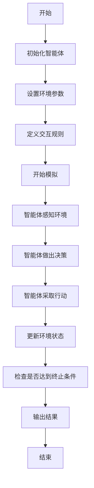
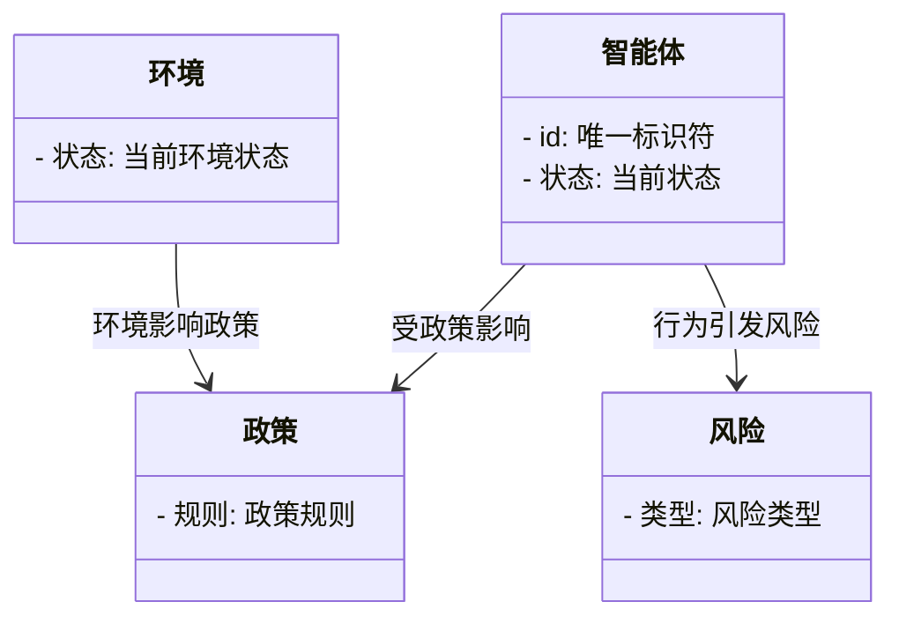
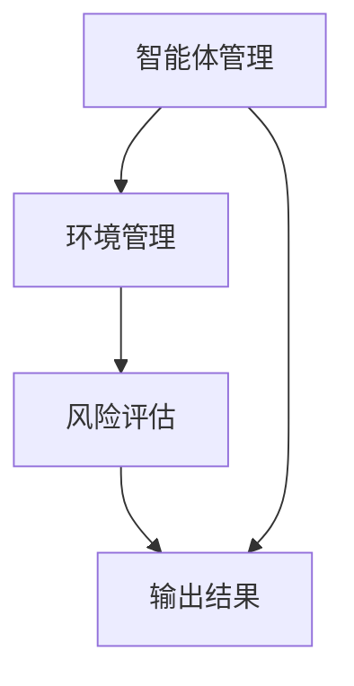
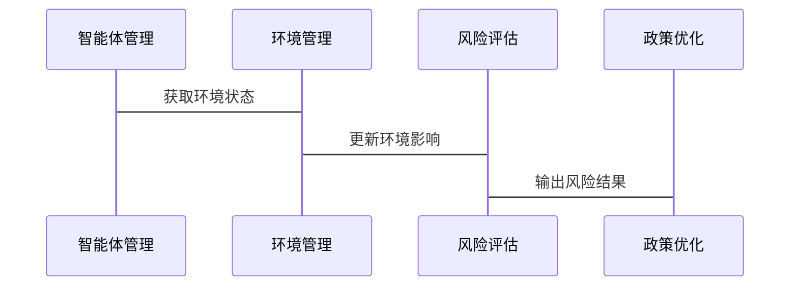

                 


# 利用多智能体系统模拟不同监管情景：评估政策风险

> 关键词：多智能体系统，政策风险评估，监管情景模拟，智能体建模，风险分析，系统架构

> 摘要：本文探讨了利用多智能体系统模拟不同监管情景以评估政策风险的方法。通过分析多智能体系统的原理、算法实现、系统架构以及实际案例，本文详细阐述了如何利用多智能体技术进行政策风险评估，为政策制定者和监管机构提供科学依据。

---

## 第一部分：背景介绍

### 第1章：问题背景与描述

#### 1.1 问题背景
随着全球化和数字化的快速发展，政策制定和监管环境变得越来越复杂。政策的制定和执行往往涉及多方利益的博弈，而这些博弈关系可能会对经济、社会和环境产生深远影响。传统的政策评估方法往往依赖于静态的模型和假设，难以捕捉动态变化的复杂情景。因此，如何在复杂环境中准确评估政策风险，成为政策制定者和监管机构面临的重大挑战。

#### 1.2 问题描述
政策风险评估的核心目标是预测政策在实施过程中可能产生的各种风险，并制定相应的应对策略。然而，政策的实施往往受到多种因素的影响，包括经济、社会、技术等。传统的评估方法通常基于假设和简化模型，难以模拟多方利益相关者的互动及其对政策结果的影响。

#### 1.3 问题解决方法
多智能体系统（Multi-Agent System, MAS）是一种模拟多个具有自主性、反应性和协作性的智能体在复杂环境中的互动行为的系统。通过模拟多个智能体的互动，可以更准确地预测政策实施后的各种可能结果。因此，利用多智能体系统模拟不同监管情景，能够为政策风险评估提供更加动态和全面的视角。

#### 1.4 边界与外延
在政策风险评估中，多智能体系统的应用范围主要包括政策制定、执行和评估的全过程。其边界在于，系统的复杂性和计算资源的限制可能会影响模拟的精度和范围。此外，多智能体系统的外延还包括与其他数据分析技术（如大数据、机器学习）的结合，以提高评估的准确性和效率。

#### 1.5 核心要素与概念结构
多智能体系统的核心要素包括智能体、环境、交互规则和系统架构。智能体是系统的基本单元，具有自主性、反应性和协作性；环境是智能体互动的场所；交互规则定义了智能体之间的行为规范；系统架构决定了智能体的组织方式和协作机制。

---

## 第二部分：核心概念与联系

### 第2章：多智能体系统原理

#### 2.1 多智能体系统的基本原理
多智能体系统由多个智能体组成，每个智能体都是一个独立的实体，能够感知环境、做出决策并采取行动。智能体之间的互动构成了系统的动态行为。

#### 2.2 智能体的属性特征对比
以下是智能体的属性特征对比表：

| 属性       | 描述                                                         |
|------------|--------------------------------------------------------------|
| 自主性      | 智能体能够独立决策，不受外部控制                             |
| 反应性      | 智能体能够感知环境并实时调整行为                             |
| 协作性      | 智能体能够与其他智能体协作完成共同目标                       |
| 学习能力    | 智能体能够通过经验改进自身的决策和行为                       |

#### 2.3 实体关系与系统架构
以下是系统的实体关系图（ER图）：

```mermaid
er
    %% 实体关系图：监管情景模拟中的实体关系
    %% 智能体、环境、政策、风险、交互规则
    classDiagram
        class 智能体 {
            - id: 唯一标识符
            - 状态: 当前状态
            - 行为: 当前行为
        }
        class 环境 {
            - 状态: 当前环境状态
        }
        class 政策 {
            - 规则: 政策规则
        }
        class 风险 {
            - 类型: 风险类型
            - 影响: 风险影响
        }
        class 交互规则 {
            - 条件: 交互条件
            - 结果: 交互结果
        }
        智能体 --> 政策: 受政策影响
        智能体 --> 风险: 风险由智能体行为引发
        政策 --> 风险: 政策实施可能导致风险
        智能体 --> 交互规则: 智能体遵循交互规则
```

---

## 第三部分：算法原理

### 第3章：算法实现

#### 3.1 算法流程图
以下是多智能体系统模拟监管情景的算法流程图：



#### 3.2 Python代码实现
以下是实现多智能体系统模拟的Python代码：

```python
import random

class Agent:
    def __init__(self, id):
        self.id = id
        self.state = "idle"
    
    def perceive(self, environment):
        # 智能体感知环境状态
        pass
    
    def decide(self):
        # 智能体根据感知做出决策
        pass
    
    def act(self):
        # 智能体采取行动
        pass

class Environment:
    def __init__(self):
        self.state = "normal"
    
    def update_state(self, action):
        # 更新环境状态
        pass

# 初始化智能体和环境
agents = [Agent(i) for i in range(5)]
environment = Environment()

# 定义交互规则
def interaction_rule(agent1, agent2):
    # 根据规则决定是否交互
    return random.random() > 0.5

# 模拟过程
for agent in agents:
    agent.perceive(environment)
    agent.decide()
    if interaction_rule(agent, random.choice(agents)):
        agent.act()
        environment.update_state(agent.act())
```

#### 3.3 数学模型与公式
以下是模拟过程中的数学模型：

$$
P(\text{风险发生}) = \sum_{i=1}^{n} P_i \times R_i
$$

其中，\( P_i \) 是第 \( i \) 个智能体采取某种行为的概率，\( R_i \) 是该行为导致风险的概率。

---

## 第四部分：系统分析与架构设计

### 第4章：系统架构设计

#### 4.1 问题场景介绍
监管情景模拟系统需要支持多个智能体的互动，能够实时更新环境状态，并输出风险评估结果。

#### 4.2 领域模型类图
以下是领域模型类图：



#### 4.3 系统架构图
以下是系统架构图：



#### 4.4 接口与交互序列图
以下是系统交互序列图：



---

## 第五部分：项目实战

### 第5章：实战案例

#### 5.1 环境安装
需要安装以下工具：
- Python 3.8+
- Mermaid CLI 或支持 Mermaid 的编辑器
- 必要的 Python 库（如 matplotlib、numpy）

#### 5.2 核心代码实现
以下是核心代码实现：

```python
import matplotlib.pyplot as plt

# 智能体行为模拟
def simulate_agents(agents, environment):
    for agent in agents:
        agent.perceive(environment)
        agent.decide()
        if random.random() > 0.5:
            agent.act()
            environment.update_state(agent.act())
    return environment.state

# 风险评估
def assess_risk(environment_state):
    # 根据环境状态评估风险
    pass

# 可视化结果
def visualize_results(environment_states):
    plt.plot(environment_states)
    plt.show()

# 主函数
def main():
    agents = [Agent(i) for i in range(5)]
    environment = Environment()
    states = []
    for _ in range(10):
        environment = simulate_agents(agents, environment)
        states.append(environment.state)
    visualize_results(states)

if __name__ == "__main__":
    main()
```

#### 5.3 案例分析
通过模拟不同监管政策下的智能体行为，可以评估政策实施后的风险。例如，在模拟中，可以观察到某些政策可能导致智能体之间的冲突，从而引发更大的风险。

#### 5.4 项目小结
通过本案例，我们可以看到多智能体系统在政策风险评估中的潜力。然而，实际应用中需要考虑更多的复杂因素，例如智能体的异构性、环境的动态变化等。

---

## 第六部分：最佳实践与总结

### 第6章：总结与建议

#### 6.1 小结
多智能体系统为政策风险评估提供了一种动态、交互式的模拟方法。通过模拟智能体的互动行为，可以更准确地预测政策实施后的各种可能结果。

#### 6.2 注意事项
- 确保智能体模型的准确性和代表性
- 处理好智能体之间的协作与冲突
- 定期更新模型以反映环境的变化

#### 6.3 拓展阅读
- 多智能体系统的相关文献
- 政策评估的其他方法
- 机器学习在政策风险评估中的应用

---

## 作者：AI天才研究院 & 禅与计算机程序设计艺术

---

通过本文的详细讲解，我们探讨了利用多智能体系统模拟不同监管情景以评估政策风险的方法。从理论到实践，我们一步步分析了系统的构建和实现，为政策制定者和监管机构提供了科学的决策支持。

