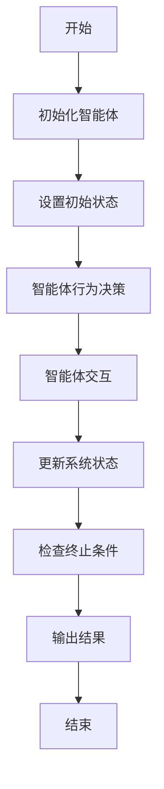
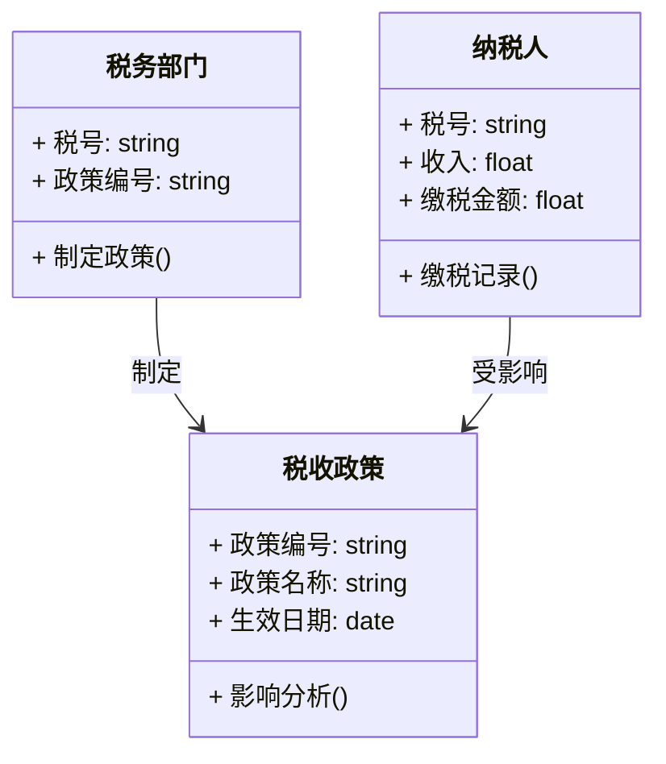
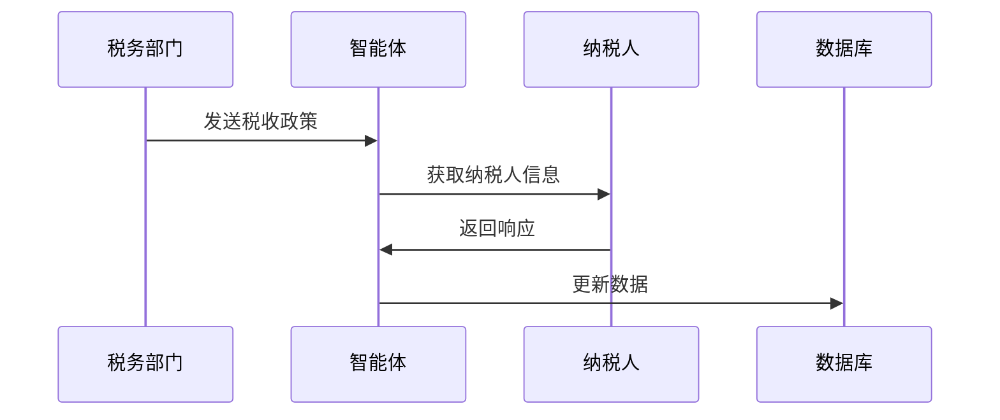

                 


# 利用多智能体系统模拟不同税收政策：评估政策影响

> 关键词：多智能体系统、税收政策、政策模拟、系统架构、算法实现、数学模型

> 摘要：本文系统地探讨了如何利用多智能体系统模拟不同税收政策，并评估其对经济和社会的影响。通过详细分析多智能体系统的原理、算法实现、系统架构以及实际案例，本文为政策制定者和研究人员提供了科学的模拟方法和工具。结合数学模型和实际数据，本文展示了如何通过多智能体系统优化税收政策，实现经济和社会的可持续发展。

---

## 第一部分：多智能体系统与税收政策模拟基础

### 第1章：多智能体系统与税收政策模拟的背景介绍

#### 1.1 问题背景

税收政策是政府调节经济的重要工具，但其复杂性使得政策效果的预测和评估极具挑战性。传统方法依赖于统计模型和专家判断，但在处理复杂系统的动态性和多变量交互时显得力不从心。多智能体系统（Multi-Agent System, MAS）凭借其分布式计算和自主性特点，为税收政策模拟提供了新的可能性。

**多智能体系统**是一种由多个自主实体（智能体）组成的系统，这些智能体能够通过交互和协作完成复杂任务。在税收政策模拟中，智能体可以代表不同的经济主体，如企业和个人，每个智能体的行为规则反映了其对税收政策的反应。

#### 1.2 问题描述

税收政策模拟的核心问题是预测政策实施后的经济和社会影响。传统的模拟方法通常基于静态模型，难以捕捉复杂系统的动态变化。多智能体系统能够模拟个体行为的多样性及其相互作用，从而更准确地反映政策的真实影响。

#### 1.3 问题解决

多智能体系统的解决方案在于通过模拟个体行为，捕捉整体系统的动态变化。通过设计合理的智能体行为规则和交互机制，可以构建一个动态的、分布式的税收政策模拟系统。

#### 1.4 边界与外延

系统的边界条件包括智能体的数量、行为规则的复杂度以及模拟的时间范围。模拟的适用范围包括税收政策对就业、收入分配和经济增长的影响，但其局限性在于对复杂社会因素的简化处理。

#### 1.5 核心概念与联系

多智能体系统的定义与特点如下：

| 属性 | 特点 |
|------|------|
| 分布式 | 智能体独立运行 |
| 自主性 | 智能体自主决策 |
| 交互性 | 智能体之间可以通信和协作 |
| 社会性 | 智能体形成社会结构 |

税收政策模拟的变量包括税收类型、税率、收入水平等，这些变量通过智能体的行为规则相互关联。

#### 1.6 ER实体关系图架构

```mermaid
erDiagram
    actor 税务部门 {
        key K1 税号
        string 纳税人姓名
        string 联系方式
    }
    actor 纳税人 {
        key K1 税号
        string 纳税人姓名
        string 联系方式
    }
    entity 税收政策 {
        key P1 政策编号
        string 政策名称
        date 生效日期
    }
    entity 税收数据 {
        key T1 缴税记录编号
        int 税额
        date 缴税日期
        string 纳税人ID
        string 政策编号
    }
    税务部门 --> 税收政策 : 制定
    纳税人 --> 税收数据 : 缴纳
    税收政策 --> 税收数据 : 影响
```

---

### 第2章：多智能体系统的核心概念与联系

#### 2.1 核心概念原理

多智能体系统的原理在于通过个体行为模拟整体系统。每个智能体都有自己的目标、知识和决策规则，能够根据环境和交互信息做出反应。

#### 2.2 概念属性特征对比

多智能体系统与传统模型的对比：

| 对比维度 | 多智能体系统 | 传统模型 |
|------|------|------|
| 结构 | 分布式 | 集中式 |
| 行为 | 自主 | 被动 |
| 交互 | 高度交互 | 低交互 |

#### 2.3 ER实体关系图架构

```mermaid
erDiagram
    entity 税务部门 {
        key K1 税号
        string 部门名称
    }
    entity 纳税人 {
        key K1 税号
        string 纳税人名称
    }
    entity 税收政策 {
        key P1 政策编号
        string 政策名称
    }
    税务部门 --> 税收政策 : 制定
    纳税人 --> 税收政策 : 受影响
```

---

## 第二部分：多智能体系统模拟算法与数学模型

### 第3章：多智能体系统模拟算法原理

#### 3.1 算法原理讲解

多智能体系统的算法基于智能体的行为规则和交互机制。每个智能体根据当前状态和接收到的信息做出决策，从而影响整个系统的状态。

#### 3.2 算法流程图



#### 3.3 算法实现代码

以下是Python代码示例，展示一个简单的多智能体系统模拟：

```python
class Agent:
    def __init__(self, id, initial_state):
        self.id = id
        self.state = initial_state

    def decide(self, observation):
        # 简单的行为规则：根据观察结果做出反应
        if observation > 0.5:
            return 'action1'
        else:
            return 'action0'

# 初始化多个智能体
agents = [Agent(i, 0.5) for i in range(5)]

# 模拟过程
for step in range(10):
    for agent in agents:
        observation = # 获取观察信息
        action = agent.decide(observation)
        # 更新系统状态
```

#### 3.4 数学模型与公式

税收政策模拟的数学模型可以表示为：

$$ \text{总收入} = \sum_{i=1}^{n} (\text{收入}_i \times \text{税率}_i) $$

其中，$\text{收入}_i$ 是第 $i$ 个纳税人的收入，$\text{税率}_i$ 是其适用的税率。

---

### 第4章：数学模型与公式

#### 4.1 数学模型构建

税收政策模拟的数学框架可以包括多个变量和参数，例如：

$$ \text{GDP} = \sum_{i=1}^{m} (\text{生产}_i \times \text{价格}_i) $$

其中，$\text{生产}_i$ 是第 $i$ 个企业的生产量，$\text{价格}_i$ 是其产品价格。

#### 4.2 关键公式

政策对就业的影响可以通过以下公式建模：

$$ \text{就业率} = \frac{\sum_{i=1}^{n} \text{就业}_i}{\text{劳动力人口}} $$

其中，$\text{就业}_i$ 是第 $i$ 个企业的就业人数。

---

## 第三部分：系统分析与架构设计

### 第5章：系统架构设计

#### 5.1 系统功能设计

系统的功能需求包括智能体行为建模、交互模拟和结果分析。领域模型类图如下：



#### 5.2 系统架构设计

系统的架构设计包括分层结构：数据层、业务逻辑层和用户界面层。架构图如下：


#### 5.3 系统接口设计

主要接口包括智能体通信接口和数据存储接口。序列图如下：



---

## 结语

通过上述结构和内容，本文系统地介绍了多智能体系统在税收政策模拟中的应用，从理论到实践，详细讲解了算法实现、系统架构和案例分析。通过科学的方法和工具，可以帮助政策制定者更好地理解和优化税收政策，推动经济和社会的可持续发展。

---

作者：AI天才研究院/AI Genius Institute & 禅与计算机程序设计艺术/Zen And The Art of Computer Programming

