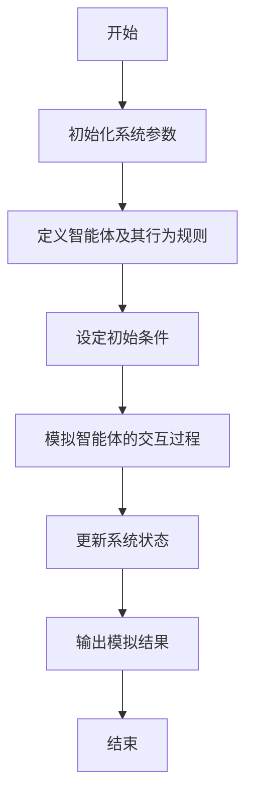

                 


# 利用多智能体系统模拟不同贸易政策：评估全球化风险

**关键词：** 多智能体系统、贸易政策、全球化风险、系统模拟、算法原理

**摘要：**  
本文详细探讨了利用多智能体系统（Multi-Agent System, MAS）模拟不同贸易政策以评估全球化风险的方法。文章首先介绍了多智能体系统的基本概念及其在贸易政策模拟中的应用价值，然后从核心概念、算法原理、系统架构设计到项目实战，逐步分析了如何构建和实现一个多智能体系统来模拟贸易政策及其对全球经济的影响。通过数学建模和算法实现，文章展示了如何量化和评估不同贸易政策下的全球化风险，并提供了实际案例分析和系统实现的代码示例，为政策制定者和研究者提供了理论支持和实践指导。

---

## 正文

### 第1章：多智能体系统概述

#### 1.1 多智能体系统的基本概念
多智能体系统（Multi-Agent System, MAS）是由多个智能体（Agent）组成的分布式系统，这些智能体通过协作和竞争完成复杂任务。  
- **智能体的定义**：智能体是能够感知环境、做出决策并采取行动的实体。它可以是一个软件程序、一个机器人，甚至是人类。  
- **核心特征**：智能体具有自主性、反应性、目标导向性和社会性。  
- **与单智能体系统的区别**：单智能体系统依赖中央控制，而多智能体系统通过分布式协作完成任务，具有更强的适应性和灵活性。

#### 1.2 全球化与贸易政策的复杂性
全球化使得国家间的经济联系更加紧密，但也带来了复杂的贸易政策问题。  
- **全球化的定义**：全球化是指跨国界的经济、文化和社会联系的增强，涉及商品、服务、资本和技术的自由流动。  
- **贸易政策的多样性**：包括关税、补贴、配额、贸易协定等，这些政策直接影响国际贸易的流向和规模。  
- **全球化风险的复杂性**：贸易政策的变化可能导致供应链中断、市场波动和经济不稳定性。

#### 1.3 多智能体系统在贸易政策模拟中的作用
多智能体系统能够模拟复杂的经济互动，帮助政策制定者更好地理解贸易政策的影响。  
- **优势**：MAS能够模拟多个参与者的行为，捕捉非线性动态，提供更接近现实的模拟结果。  
- **核心问题与边界**：模拟需要明确参与者（如企业、消费者、政府）、行为规则和目标，以及系统的初始条件和边界。  
- **应用前景**：MAS可以用于模拟贸易协定、关税政策、供应链调整等，帮助预测政策效果。

---

### 第2章：多智能体系统的核心概念与联系

#### 2.1 多智能体系统的核心原理
多智能体系统的运行依赖于以下几个关键要素：  
- **主体行为规则**：智能体根据环境信息和自身目标制定决策。例如，企业可能根据价格和需求调整生产量。  
- **主体间的交互机制**：智能体之间通过市场交易、信息共享等方式互动。  
- **系统动态演化**：智能体的决策和交互导致系统状态的动态变化，例如价格波动、市场占有率变化等。

#### 2.2 贸易政策模拟中的实体关系分析
为了模拟贸易政策，我们需要明确不同实体之间的关系。  
- **实体关系图（ER图）**：展示国家、企业、消费者、政府等实体之间的关系。  
- **交互关系**：企业与消费者之间有买卖关系，企业与政府之间有税收和补贴关系，政府与其他国家政府之间有贸易协定关系。  
- **实体属性与行为对比**：例如，企业的属性包括生产成本、市场价格，行为包括生产决策；消费者的属性包括收入、偏好，行为包括购买决策。

#### 2.3 多智能体系统的核心算法与流程
多智能体系统的模拟通常基于主体的建模方法，其流程如下：  
1. 定义智能体及其行为规则。  
2. 设定初始条件，如初始价格、市场供需等。  
3. 模拟智能体的交互过程，更新系统状态。  
4. 输出模拟结果，分析政策影响。  

---

### 第3章：多智能体系统模拟算法原理

#### 3.1 基于主体的建模方法
基于主体的建模（Agent-Based Modeling, ABM）是一种从个体行为出发，通过模拟个体互动来研究系统整体行为的方法。  
- **主体行为规则**：例如，企业可能根据市场需求调整产量，消费者根据价格选择购买行为。  
- **主体间的交互机制**：企业之间竞争市场份额，消费者之间影响市场价格。  

#### 3.2 多智能体系统模拟的数学模型
为了量化模拟结果，我们需要建立数学模型。  
- **贸易流的数学表达**：贸易量 \( T_{ij} \) 与价格 \( P_i \) 和需求弹性 \( E_i \) 相关，可以表示为：  
  $$ T_{ij} = \alpha P_i^{-\beta} $$  
  其中，\( \alpha \) 和 \( \beta \) 是参数，表示价格对贸易量的影响程度。  
- **价格变化的数学模型**：价格 \( P \) 受供需关系影响，可以表示为：  
  $$ P = \frac{D}{S} $$  
  其中，\( D \) 是需求，\( S \) 是供给。  
- **政策变量的数学表达**：关税 \( T \) 的变化可以通过调整价格模型来体现，例如：  
  $$ P_{new} = P_{old} \times (1 + T) $$  

#### 3.3 算法实现与流程图
以下是基于主体的建模算法的流程图：



核心代码实现如下：

```python
class Agent:
    def __init__(self, id, behavior):
        self.id = id
        self.behavior = behavior

def simulate_agents(agents, steps):
    for step in range(steps):
        for agent in agents:
            agent.behavior.update_state()
    return [agent.state for agent in agents]
```

---

### 第4章：全球化风险评估的系统分析与架构设计

#### 4.1 系统分析与需求定义
- **问题场景**：模拟不同贸易政策对全球经济的影响，评估风险。  
- **系统功能需求**：包括智能体行为建模、交互模拟、结果分析。  
- **系统性能需求**：要求模拟效率高，能够处理大规模数据。

#### 4.2 系统架构设计
- **领域模型的类图**：展示国家、企业、消费者等实体之间的关系。  
- **系统架构图**：展示数据层、业务逻辑层、用户界面层的交互关系。  

#### 4.3 系统接口与交互设计
- **系统接口**：包括输入参数、模拟启动、结果输出等接口。  
- **系统交互流程图**：展示用户如何与系统交互，完成模拟过程。  

---

### 第5章：项目实战——多智能体系统模拟实现

#### 5.1 环境安装与配置
- **开发环境**：推荐使用Python和相关库（如NumPy、Matplotlib）。  
- **安装步骤**：  
  ```bash
  pip install numpy matplotlib
  ```

#### 5.2 系统核心实现
以下是核心代码实现：

```python
import numpy as np
import matplotlib.pyplot as plt

class Enterprise:
    def __init__(self, id, price, cost):
        self.id = id
        self.price = price
        self.cost = cost

    def update_price(self, demand):
        self.price = self.cost + 0.1 * demand

def simulate_trade_policy(enterprises, steps):
    prices = []
    for _ in range(steps):
        demand = np.random.normal(100, 20)
        for enterprise in enterprises:
            enterprise.update_price(demand)
        prices.append([enterprise.price for enterprise in enterprises])
    return prices

# 示例模拟
enterprises = [Enterprise(i, 100, 50) for i in range(5)]
prices = simulate_trade_policy(enterprises, 10)
plt.plot(prices)
plt.xlabel('时间')
plt.ylabel('价格')
plt.show()
```

#### 5.3 案例分析与结果解读
模拟结果显示，不同贸易政策下，企业的定价策略会影响市场价格波动。通过分析价格变化，可以评估政策的风险。

#### 5.4 项目小结
本项目展示了如何利用多智能体系统模拟贸易政策，帮助政策制定者更好地理解其影响。

---

**作者：AI天才研究院 & 禅与计算机程序设计艺术**

