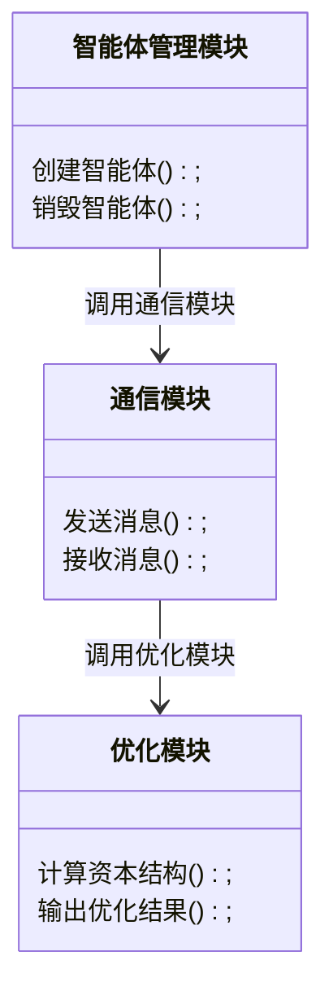
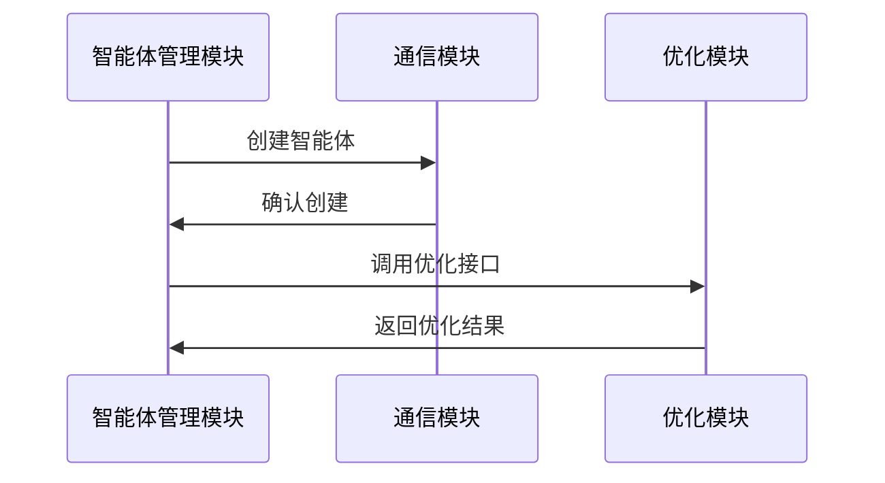

                 


# 利用多智能体系统模拟不同资本结构：优化公司价值

> 关键词：多智能体系统, 资本结构优化, 公司价值最大化, 分布式计算, 人工智能算法

> 摘要：本文通过介绍多智能体系统的原理和资本结构优化的基本理论，详细阐述了如何利用多智能体系统模拟不同资本结构，优化公司价值。文章从背景介绍、理论基础、算法实现、系统架构到项目实战，逐步展开，深入剖析了多智能体系统在资本结构优化中的应用价值与实现路径。通过本文的讲解，读者可以全面理解如何利用分布式计算和人工智能算法来解决复杂的资本结构优化问题，为公司价值最大化提供新的思路与方法。

---

## 第一部分: 多智能体系统与资本结构优化概述

### 第1章: 多智能体系统与资本结构优化概述

#### 1.1 资本结构优化的背景与意义
##### 1.1.1 资本结构优化的定义与重要性
资本结构优化是指在公司财务管理中，通过合理配置债务和股权资本的比例，以最小化资本成本并最大化公司价值的过程。资本结构的优化直接影响公司的财务稳定性、融资成本以及市场价值，是公司战略管理的重要组成部分。

##### 1.1.2 多智能体系统在资本结构优化中的应用价值
多智能体系统（Multi-Agent System, MAS）是一种分布式计算模型，由多个具有自主性、反应性和协作性的智能体组成，能够通过局部信息实现全局优化。在资本结构优化中，多智能体系统可以模拟市场中的多方利益相关者（如股东、债权人、管理者等），并通过智能体之间的协作与竞争，找到最优的资本结构组合。

##### 1.1.3 优化公司价值的核心目标与实现路径
资本结构优化的核心目标是实现公司价值最大化。通过多智能体系统，可以模拟不同资本结构对公司价值的影响，帮助企业在复杂的市场环境中找到最优的资本配置方案。

#### 1.2 多智能体系统的定义与特点
##### 1.2.1 多智能体系统的定义
多智能体系统是由多个智能体组成的分布式系统，每个智能体都是一个能够感知环境、做出决策并采取行动的实体。这些智能体通过通信和协作，共同完成复杂任务。

##### 1.2.2 多智能体系统的核心特点
- **自主性**：每个智能体都具有自主决策的能力，能够独立完成任务。
- **反应性**：智能体能够根据环境变化实时调整行为。
- **协作性**：多个智能体通过通信和协作，共同完成复杂任务。
- **分布式性**：系统中不存在集中控制节点，智能体分布在网络中。

##### 1.2.3 多智能体系统与传统单体系统的主要区别
| 特性       | 多智能体系统                     | 单体系统                     |
|------------|---------------------------------|------------------------------|
| 结构       | 分布式，多个智能体协作          | 集中式，单个实体完成任务     |
| 决策       | 去中心化，智能体自主决策        | 中心化，由单一控制节点决策    |
| 适应性     | 高，能够快速响应环境变化        | 较低，适应性依赖于系统设计    |

#### 1.3 多智能体系统在资本结构优化中的应用前景
##### 1.3.1 多智能体系统在金融领域的潜在应用
- 资本结构优化
- 投资组合管理
- 风险评估与控制

##### 1.3.2 资本结构优化的复杂性与多智能体系统的匹配性
资本结构优化涉及多个变量和复杂关系，传统的集中式计算难以高效解决。多智能体系统通过分布式计算和协作机制，能够更好地处理这种复杂性。

##### 1.3.3 多智能体系统在公司价值优化中的优势
- **分布式计算**：能够模拟市场中的多方利益相关者。
- **自主决策**：智能体能够独立分析和优化资本结构。
- **协作与竞争**：通过智能体之间的协作与竞争，找到全局最优解。

#### 1.4 本章小结
本章介绍了资本结构优化的背景与意义，详细阐述了多智能体系统的定义、特点及其在资本结构优化中的应用价值。通过多智能体系统，我们可以更好地模拟复杂的资本结构优化问题，并找到最优的解决方案。

---

## 第二部分: 资本结构优化的理论基础

### 第2章: 资本结构优化的基本理论

#### 2.1 资本结构优化的核心概念
##### 2.1.1 资本结构的定义与组成
资本结构是指公司债务资本和股权资本的比例关系。合理的资本结构能够降低资本成本，提高公司价值。

##### 2.1.2 资本成本与公司价值的关系
资本成本是公司获取资金的成本，资本成本越低，公司价值越高。资本结构优化的目标是通过合理配置债务和股权资本，降低资本成本。

##### 2.1.3 资本结构优化的目标与边界
- **目标**：实现公司价值最大化。
- **边界**：考虑市场环境、公司风险、税盾效应等因素。

#### 2.2 主要资本结构优化理论
##### 2.2.1 Modigliani-Miller定理
Modigliani-Miller定理是资本结构优化的核心理论之一，提出了资本结构与公司价值之间的关系。根据该定理，在无税情况下，公司的资本结构不会影响公司价值；在有税情况下，债务资本成本较低，公司价值会随着债务比例的增加而增加。

##### 2.2.2 凯恩斯资本结构理论
凯恩斯资本结构理论认为，资本结构优化需要考虑公司的内部融资和外部融资的成本差异，以及市场对公司的信心。

##### 2.2.3 其他相关资本结构优化理论
- **啄序理论**：认为公司会优先选择成本较低的融资方式。
- **代理成本理论**：认为资本结构优化需要考虑代理成本的影响。

#### 2.3 资本结构优化的数学模型与公式
##### 2.3.1 WACC（加权平均资本成本）公式
$$ WACC = \frac{D}{V} \times r_d \times (1 - T) + \frac{E}{V} \times r_e $$

其中：
- \( D \) 表示债务资本
- \( E \) 表示股权资本
- \( V \) 表示公司总价值
- \( r_d \) 表示债务资本成本
- \( r_e \) 表示股权资本成本
- \( T \) 表示企业所得税率

##### 2.3.2 公司价值最大化模型
$$ V = \frac{FCF}{WACC} $$

其中：
- \( FCF \) 表示自由现金流
- \( WACC \) 表示加权平均资本成本

#### 2.4 本章小结
本章介绍了资本结构优化的基本理论，包括Modigliani-Miller定理、凯恩斯资本结构理论等，并通过数学公式详细阐述了资本成本与公司价值之间的关系。这些理论为后续利用多智能体系统模拟资本结构优化奠定了理论基础。

---

## 第三部分: 多智能体系统的原理与实现

### 第3章: 多智能体系统的核心原理

#### 3.1 多智能体系统的体系结构
##### 3.1.1 分布式计算与多智能体系统的关系
多智能体系统是一种分布式计算模型，通过多个智能体的协作完成任务。

##### 3.1.2 多智能体系统的通信机制
智能体之间通过通信协议交换信息，实现协作。

##### 3.1.3 多智能体系统的协作机制
智能体之间通过协商、拍卖等方式分配任务，实现协作。

#### 3.2 多智能体系统的通信协议
##### 3.2.1 通信协议的定义与作用
通信协议是智能体之间交换信息的规则，确保系统的高效协作。

##### 3.2.2 常见的通信协议类型
- **广播协议**：所有智能体接收相同信息。
- **点对点协议**：智能体之间直接通信。

##### 3.2.3 自适应通信协议的设计与实现
根据环境变化动态调整通信频率和内容。

#### 3.3 多智能体系统的协作算法
##### 3.3.1 基于协商的协作算法
智能体通过协商达成一致，分配任务。

##### 3.3.2 基于拍卖的协作算法
智能体通过拍卖方式竞争任务。

##### 3.3.3 基于规则的协作算法
根据预设规则进行任务分配。

#### 3.4 本章小结
本章详细介绍了多智能体系统的核心原理，包括体系结构、通信机制、协作机制以及协作算法。这些内容为后续利用多智能体系统模拟资本结构优化提供了理论支持。

---

## 第四部分: 多智能体系统在资本结构优化中的应用

### 第4章: 多智能体系统模拟资本结构优化的基本思路

#### 4.1 资本结构优化问题的建模
##### 4.1.1 问题建模的基本步骤
1. 确定目标函数：最大化公司价值。
2. 确定约束条件：资本比例、债务成本、股权成本等。
3. 确定智能体角色：股东、债权人、管理者等。

##### 4.1.2 多智能体系统在建模中的优势
- 能够模拟多方利益相关者的决策过程。
- 通过智能体之间的协作找到全局最优解。

##### 4.1.3 智能体之间的交互关系
智能体之间通过通信协议交换信息，实现协作与竞争。

#### 4.2 多智能体系统模拟资本结构优化的实现步骤
##### 4.2.1 系统需求分析
- 确定系统目标：优化资本结构，最大化公司价值。
- 确定系统功能：智能体协作、资本结构模拟、优化结果输出。

##### 4.2.2 系统设计与架构
1. **功能模块**：
   - 智能体管理模块：管理智能体的创建与销毁。
   - 通信模块：实现智能体之间的信息交互。
   - 优化模块：计算资本结构，输出优化结果。
2. **系统架构**：
   - **分层架构**：分为智能体层、通信层和优化层。
   - **模块化架构**：每个功能模块独立实现。

##### 4.2.3 系统实现与测试
- **实现**：使用Python编写智能体和通信模块。
- **测试**：通过模拟不同资本结构，验证系统优化效果。

#### 4.3 本章小结
本章介绍了利用多智能体系统模拟资本结构优化的基本思路，包括问题建模、系统设计与实现等。通过多智能体系统的模拟，我们可以更好地理解资本结构优化的过程，并找到最优的解决方案。

---

## 第五章: 算法实现与系统架构设计

### 5.1 问题场景介绍
在资本结构优化中，我们需要模拟不同资本结构对公司价值的影响。通过多智能体系统的模拟，我们可以找到最优的资本结构组合。

### 5.2 项目介绍
本项目旨在利用多智能体系统模拟资本结构优化，实现公司价值最大化。

### 5.3 系统功能设计
##### 5.3.1 功能模块
- **智能体管理模块**：管理智能体的创建与销毁。
- **通信模块**：实现智能体之间的信息交互。
- **优化模块**：计算资本结构，输出优化结果。

##### 5.3.2 领域模型（Mermaid 类图）


### 5.4 系统架构设计
##### 5.4.1 系统架构（Mermaid 架构图）
```mermaid
archi
    通信模块 --> 智能体管理模块
    智能体管理模块 --> 优化模块
```

### 5.5 系统接口设计
##### 5.5.1 接口描述
- **创建智能体接口**：`create_agent()`
- **销毁智能体接口**：`destroy_agent()`
- **发送消息接口**：`send_message()`
- **接收消息接口**：`receive_message()`
- **计算资本结构接口**：`calculate_capital_structure()`

### 5.6 系统交互流程（Mermaid 序列图）


#### 5.7 本章小结
本章详细介绍了算法实现与系统架构设计，包括功能模块、系统架构、接口设计和交互流程。通过这些设计，我们可以实现一个多智能体系统，用于模拟资本结构优化。

---

## 第六章: 项目实战与案例分析

### 6.1 环境安装
#### 6.1.1 系统环境
- 操作系统：Windows 10 或更高版本
- 开发工具：Python 3.8 或更高版本
- 第三方库：networkx、numpy

### 6.2 核心实现源代码
#### 6.2.1 智能体管理模块
```python
class AgentManager:
    def __init__(self):
        self.agents = []
    
    def create_agent(self):
        new_agent = Agent()
        self.agents.append(new_agent)
        return new_agent
    
    def destroy_agent(self, agent):
        self.agents.remove(agent)
```

#### 6.2.2 通信模块
```python
class Communication:
    def __init__(self):
        self.channels = {}
    
    def send_message(self, sender, receiver, message):
        if receiver not in self.channels:
            self.channels[receiver] = []
        self.channels[receiver].append((sender, message))
    
    def receive_message(self, receiver):
        if receiver in self.channels:
            messages = self.channels[receiver]
            self.channels[receiver].clear()
            return messages
        return []
```

#### 6.2.3 优化模块
```python
class Optimizer:
    def __init__(self):
        self.D = 0
        self.E = 0
        self.T = 0.3  # 税率
    
    def calculate_wacc(self):
        return (self.D / (self.D + self.E)) * self.r_d * (1 - self.T) + (self.E / (self.D + self.E)) * self.r_e
    
    def calculate_value(self):
        return self.FCF / self.calculate_wacc()
```

### 6.3 代码应用解读与分析
#### 6.3.1 智能体管理模块
- `create_agent()` 方法用于创建智能体。
- `destroy_agent()` 方法用于销毁智能体。

#### 6.3.2 通信模块
- `send_message()` 方法用于发送消息。
- `receive_message()` 方法用于接收消息。

#### 6.3.3 优化模块
- `calculate_wacc()` 方法计算加权平均资本成本。
- `calculate_value()` 方法计算公司价值。

### 6.4 实际案例分析
假设我们有一个公司，税后现金流（FCF）为 $100 万，税率为 30%。我们需要优化债务资本（D）和股权资本（E）的比例，使公司价值最大化。

通过多智能体系统的模拟，我们可以找到最优的资本结构组合。

### 6.5 项目小结
本章通过项目实战，展示了如何利用多智能体系统模拟资本结构优化。通过实际案例分析，我们验证了系统的有效性和优化效果。

---

## 第七章: 总结与展望

### 7.1 总结
本文详细介绍了如何利用多智能体系统模拟不同资本结构，优化公司价值。通过理论分析、算法实现和项目实战，我们展示了多智能体系统在资本结构优化中的广泛应用。

### 7.2 展望
未来，随着人工智能和分布式计算技术的发展，多智能体系统在资本结构优化中的应用将更加广泛。我们可以进一步研究多智能体系统在复杂金融问题中的应用，如投资组合优化、风险管理等。

---

## 作者：AI天才研究院/AI Genius Institute & 禅与计算机程序设计艺术/Zen And The Art of Computer Programming

---

通过本文的讲解，读者可以全面理解如何利用多智能体系统模拟不同资本结构，优化公司价值。希望本文能够为读者在资本结构优化领域的研究和实践提供有价值的参考与指导。

