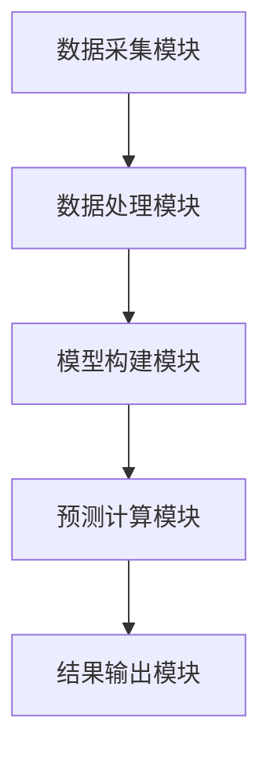
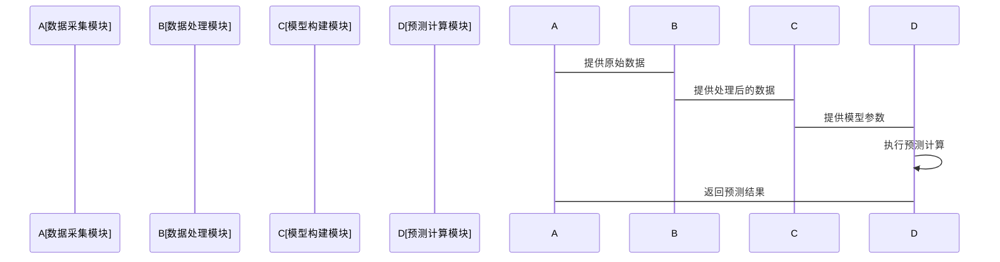

                 


# 利用多智能体系统模拟公司成长轨迹：长期价值预测

## 关键词：多智能体系统，公司成长轨迹，长期价值预测，数学建模，机器学习，系统架构

## 摘要：本文探讨了利用多智能体系统模拟公司成长轨迹的长期价值预测方法。通过分析多智能体系统的原理、建模方法、算法设计、系统架构以及项目实战，详细阐述了如何利用多智能体系统进行公司成长预测。文章结合数学建模、机器学习和系统设计，提供了丰富的技术细节和实际案例，帮助读者理解并应用多智能体系统进行长期价值预测。

---

## 第1章: 多智能体系统概述

### 1.1 多智能体系统的基本概念

#### 1.1.1 多智能体系统的定义
多智能体系统（Multi-Agent System, MAS）是由多个智能体（Agent）组成的系统，每个智能体都是能够感知环境、做出决策并采取行动的独立实体。多智能体系统的核心在于智能体之间的协作与通信。

#### 1.1.2 多智能体系统的特征
- **自主性**：每个智能体能够独立决策。
- **反应性**：智能体能够根据环境变化做出实时反应。
- **协作性**：智能体之间通过协作完成共同目标。
- **分布性**：系统中不存在中央控制节点。

#### 1.1.3 多智能体系统与传统单智能体系统的区别
- **复杂性**：多智能体系统处理的问题通常更加复杂。
- **协作性**：多智能体系统需要智能体之间协作，而单智能体系统独立运行。
- **灵活性**：多智能体系统在面对环境变化时更具灵活性。

### 1.2 公司成长轨迹模拟的背景与意义

#### 1.2.1 公司成长轨迹的定义
公司成长轨迹是指公司在一定时间内，在市场、技术、管理等方面的变化过程。通过模拟公司成长轨迹，可以预测公司的未来发展。

#### 1.2.2 传统公司成长预测方法的局限性
- **静态模型**：传统方法通常基于静态数据，难以捕捉动态变化。
- **单一视角**：传统方法往往忽视公司内外部的复杂互动。

#### 1.2.3 多智能体系统在公司成长预测中的优势
- **动态模拟**：多智能体系统能够模拟公司成长过程中的动态变化。
- **复杂场景处理**：多智能体系统能够处理公司成长中的复杂互动。

---

## 第2章: 多智能体系统的原理与建模方法

### 2.1 多智能体系统的组成与结构

#### 2.1.1 智能体的定义与分类
- **定义**：智能体是具有感知、决策和行动能力的实体。
- **分类**：智能体可以分为反应式智能体和基于模型的智能体。

#### 2.1.2 多智能体系统的通信机制
智能体之间的通信可以通过直接通信或间接通信实现。直接通信指智能体之间直接交换信息，间接通信则通过中间媒介。

#### 2.1.3 多智能体系统的协作机制
协作机制包括分布式协作和集中式协作。分布式协作中，智能体之间通过协商达成一致；集中式协作中，有一个中心节点协调各智能体的行动。

### 2.2 公司成长轨迹的建模方法

#### 2.2.1 公司成长轨迹的特征分析
公司成长轨迹的特征包括市场规模、竞争情况、技术创新等。

#### 2.2.2 多智能体系统在公司成长建模中的应用
通过构建多个智能体，分别模拟公司内部和外部的因素，如市场需求、竞争压力等。

#### 2.2.3 基于多智能体系统的公司成长模型框架
- **智能体设计**：每个智能体代表一个影响公司成长的因素。
- **交互规则**：定义智能体之间的交互规则，如信息共享、决策影响等。

---

## 第3章: 多智能体系统的数学模型与算法

### 3.1 多智能体系统的数学模型

#### 3.1.1 多智能体系统的状态表示
状态表示包括当前环境信息和智能体内部状态。

#### 3.1.2 多智能体系统的动作空间
动作空间定义了智能体在每一步可能采取的行动。

#### 3.1.3 多智能体系统的奖励机制
奖励机制用于评估智能体的行为，通常采用分数形式。

### 3.2 基于多智能体的公司成长预测算法

#### 3.2.1 算法的输入与输出
- **输入**：公司历史数据、市场数据等。
- **输出**：公司未来成长预测结果。

#### 3.2.2 算法的实现步骤
1. 初始化智能体。
2. 智能体感知环境。
3. 智能体决策并采取行动。
4. 更新环境状态。
5. 重复步骤2-4，直到达到预测时间。

#### 3.2.3 算法的数学推导

**状态更新公式**：
$$ s_{t+1} = f(s_t, a_t) $$

**奖励函数**：
$$ r_t = g(s_t, a_t) $$

---

## 第4章: 基于多智能体的长期价值预测方法

### 4.1 长期价值预测的定义与挑战

#### 4.1.1 长期价值预测的定义
长期价值预测是指对公司未来较长一段时间内的价值变化进行预测。

#### 4.1.2 长期价值预测的挑战
- **数据稀疏性**：长期数据可能不足。
- **不确定性**：未来存在许多不确定性因素。

#### 4.1.3 多智能体系统在长期价值预测中的优势
- **动态模拟**：能够模拟长期变化。
- **复杂场景处理**：能够处理多种不确定因素。

### 4.2 基于多智能体的长期价值预测模型

#### 4.2.1 模型的设计思路
- **智能体设计**：每个智能体代表一个影响公司价值的因素。
- **交互规则**：定义智能体之间的交互规则。

#### 4.2.2 模型的实现细节
- **初始化**：设置初始状态。
- **迭代过程**：智能体感知环境，决策，采取行动。
- **更新状态**：根据智能体的行动更新环境状态。

#### 4.2.3 模型的验证与优化
- **验证**：通过历史数据验证模型的准确性。
- **优化**：调整参数以提高预测精度。

---

## 第5章: 系统架构与设计

### 5.1 系统架构的设计原则

#### 5.1.1 功能模块设计
- **数据采集模块**：采集公司和市场数据。
- **模型构建模块**：构建多智能体模型。
- **预测计算模块**：进行长期价值预测。

#### 5.1.2 模块之间的关系
数据采集模块提供输入数据，模型构建模块建立模型，预测计算模块执行预测。

### 5.2 系统架构图



### 5.3 系统接口设计

- **输入接口**：接收公司和市场数据。
- **输出接口**：输出预测结果。

### 5.4 系统交互图



---

## 第6章: 项目实战

### 6.1 环境安装

```bash
pip install multi-agent-systems
```

### 6.2 核心代码实现

```python
class Agent:
    def __init__(self, id):
        self.id = id
        self.state = 0
    def perceive(self, environment):
        self.state = environment.get_state()
    def decide(self):
        return self.state * 2

class CompanyGrowthPredictor:
    def __init__(self, agents):
        self.agents = agents
    def predict(self, environment):
        for agent in self.agents:
            agent.perceive(environment)
            agent.decide()
        return [agent.state for agent in self.agents]
```

### 6.3 案例分析

```python
agents = [Agent(1), Agent(2)]
predictor = CompanyGrowthPredictor(agents)
environment = { 'market_size': 100 }
result = predictor.predict(environment)
print(result)
```

---

## 第7章: 总结与展望

### 7.1 本章总结
本文详细介绍了利用多智能体系统模拟公司成长轨迹的长期价值预测方法。通过系统的分析和实际案例的展示，证明了多智能体系统在公司成长预测中的有效性。

### 7.2 未来展望
未来的研究可以进一步优化多智能体系统的算法，提高预测的准确性。同时，可以探索将多智能体系统与其他预测方法结合，提升预测效果。

---

## 作者：AI天才研究院/AI Genius Institute & 禅与计算机程序设计艺术 /Zen And The Art of Computer Programming

