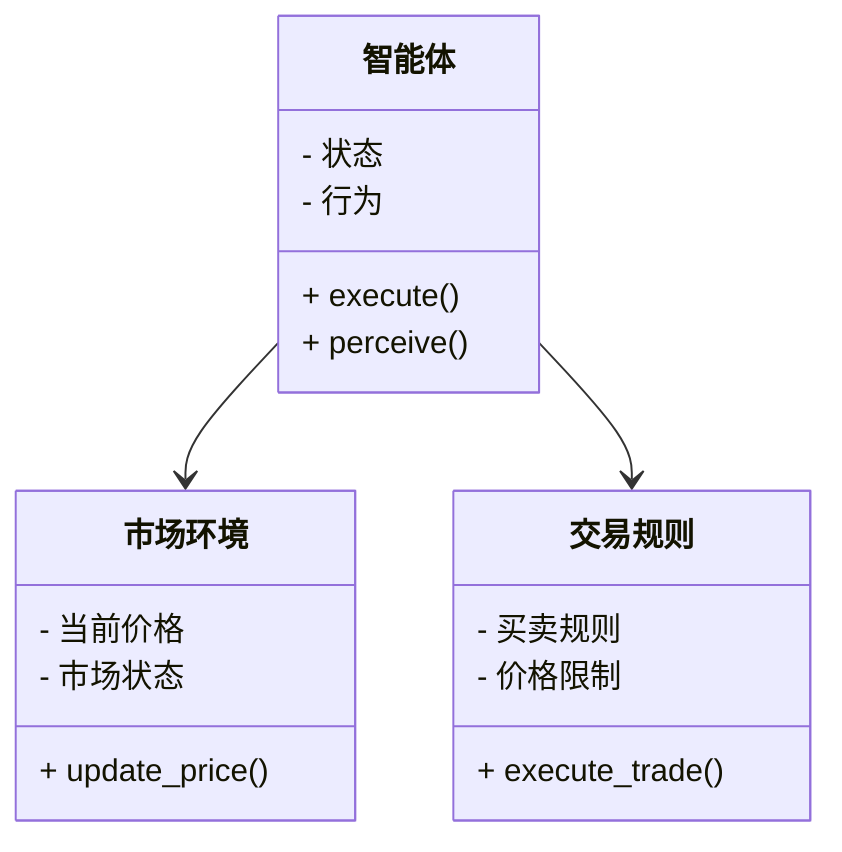
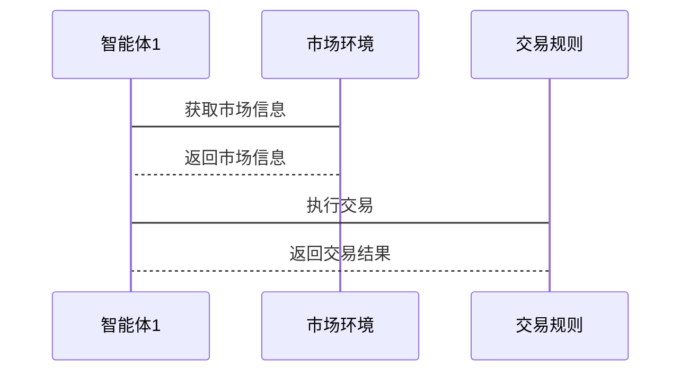

                 


```markdown
# 利用多智能体系统模拟市场情景：增强风险管理

> 关键词：多智能体系统、市场模拟、风险管理、协作算法、系统架构

> 摘要：本文将详细探讨如何利用多智能体系统（Multi-Agent System，MAS）来模拟市场情景，从而增强风险管理能力。通过分析多智能体系统的核心概念、建模方法、算法原理以及实际应用案例，本文旨在为读者提供一个全面的视角，理解如何通过多智能体系统来优化市场风险的预测与控制。

---

## 第一部分：多智能体系统与市场模拟概述

### 第1章：多智能体系统（MAS）基础

#### 1.1 多智能体系统概述

##### 1.1.1 多智能体系统的定义
多智能体系统（MAS）是由多个智能体（Agent）组成的分布式系统，这些智能体能够通过协作完成复杂的任务。智能体是具有感知、决策和执行能力的实体，可以是软件程序或物理设备。

##### 1.1.2 多智能体系统的分类与特点
多智能体系统可以分为三类：
1. **简单反射型智能体**：基于当前感知做出反应，不依赖历史信息。
2. **基于模型的反射型智能体**：利用内部模型和历史信息进行决策。
3. **目标驱动型智能体**：以明确的目标为导向，主动规划行动。

多智能体系统的优点包括：
- **分布式计算**：任务分解到多个智能体，提高效率。
- **自主性**：智能体能够自主决策，减少对中心控制的依赖。
- **协作性**：通过智能体之间的协作，实现复杂任务的完成。

##### 1.1.3 多智能体系统在市场模拟中的应用
多智能体系统广泛应用于金融市场模拟，如股票交易、价格预测、风险管理等领域。通过模拟市场参与者的决策过程，可以更好地理解市场动态。

#### 1.2 多智能体系统的核心概念

##### 1.2.1 智能体的基本属性
| 属性 | 描述 |
|------|------|
| **自主性** | 智能体能够自主决策和行动。 |
| **反应性** | 智能体能够感知环境并做出实时反应。 |
| **协作性** | 智能体能够与其他智能体协作完成任务。 |
| **学习性** | 智能体能够通过经验改进性能。 |

##### 1.2.2 智能体之间的交互与协作
智能体之间的交互可以通过以下方式实现：
1. **直接通信**：智能体之间通过消息传递进行通信。
2. **共享知识库**：多个智能体共享一个中央知识库。
3. **分布式协作**：智能体通过分布式协议协作。

##### 1.2.3 市场模拟中的智能体建模
在市场模拟中，智能体通常代表市场参与者，如投资者、交易员和机构。每个智能体都有自己的目标和行为策略。

#### 1.3 本章小结
本章介绍了多智能体系统的基本概念、分类和特点，并重点探讨了其在市场模拟中的应用。通过理解多智能体系统的核心概念，我们可以更好地设计市场模拟模型。

---

## 第二部分：多智能体系统在市场模拟中的应用

### 第2章：市场模拟的背景与需求

#### 2.1 市场模拟的目的与意义

##### 2.1.1 市场模拟的基本概念
市场模拟是通过构建数学模型，模拟市场参与者的行为和市场动态的过程。其目的是为了更好地理解市场机制，并为实际操作提供参考。

##### 2.1.2 市场模拟在风险管理中的作用
市场模拟可以帮助我们评估不同市场情景下的风险，从而制定更有效的风险管理策略。

##### 2.1.3 市场模拟的典型应用场景
1. **股票交易**：模拟股票价格波动，帮助投资者制定交易策略。
2. **外汇市场**：模拟汇率变化，帮助交易员进行套利操作。
3. **风险管理**：评估市场风险，制定风险控制措施。

#### 2.2 市场模拟的核心问题

##### 2.2.1 市场参与者的建模
市场参与者的建模需要考虑其行为、决策和目标。例如，投资者可能根据市场信息做出买入或卖出决策。

##### 2.2.2 市场动态的复杂性
市场动态受到多种因素的影响，如宏观经济指标、政策变化、市场情绪等。这些因素使得市场模拟具有高度复杂性。

##### 2.2.3 市场风险的评估与控制
通过模拟不同市场情景，我们可以评估潜在风险，并制定相应的控制措施。

#### 2.3 本章小结
本章探讨了市场模拟的目的与意义，并分析了市场模拟的核心问题。通过理解这些内容，我们可以更好地设计市场模拟模型。

---

## 第三部分：多智能体系统的建模与算法

### 第3章：多智能体系统建模方法

#### 3.1 市场参与者的建模

##### 3.1.1 市场参与者的分类
市场参与者可以分为以下几类：
1. **投资者**：包括个人投资者和机构投资者。
2. **交易员**：负责执行交易指令。
3. **做市商**：提供买卖报价。

##### 3.1.2 市场参与者的行为特征
不同市场参与者的行为特征不同，例如：
- 投资者可能根据市场信息做出理性决策。
- 交易员需要快速执行指令。
- 做市商需要实时调整买卖价差。

##### 3.1.3 市场参与者的决策模型
决策模型可以基于以下方法：
1. **基于规则的方法**：根据预设规则做出决策。
2. **基于模型的方法**：利用数学模型进行决策。
3. **基于机器学习的方法**：通过训练模型进行决策。

#### 3.2 多智能体系统的建模框架

##### 3.2.1 基于MAS的市场建模框架
基于MAS的市场建模框架通常包括以下组件：
1. **智能体**：代表市场参与者。
2. **环境**：模拟市场环境。
3. **规则**：定义智能体的行为规则。

##### 3.2.2 市场环境的建模
市场环境建模需要考虑市场结构、交易机制、价格形成机制等因素。

##### 3.2.3 市场规则的定义与实现
市场规则可以通过以下方式实现：
1. **基于规则的实现**：通过预设规则定义智能体行为。
2. **基于博弈论的实现**：通过博弈论模型定义智能体行为。

#### 3.3 本章小结
本章介绍了市场参与者的建模方法，并探讨了基于MAS的市场建模框架。通过这些方法，我们可以更好地模拟市场情景。

### 第4章：多智能体系统的算法原理

#### 4.1 多智能体协作算法

##### 4.1.1 分布式协作算法
分布式协作算法通过智能体之间的分布式通信实现协作。例如，分布式一致性算法可以通过智能体之间的消息传递实现。

##### 4.1.2 基于博弈论的协作算法
基于博弈论的协作算法通过分析智能体之间的博弈关系，制定最优决策策略。

##### 4.1.3 基于规则的协作算法
基于规则的协作算法通过预设规则定义智能体之间的协作方式。

#### 4.2 市场模拟中的优化算法

##### 4.2.1 遗传算法
遗传算法是一种基于自然选择的优化算法。在市场模拟中，可以用于优化交易策略。

##### 4.2.2 粒子群优化算法
粒子群优化算法是一种基于群智能的优化算法。在市场模拟中，可以用于优化投资组合。

##### 4.2.3 模拟退火算法
模拟退火算法是一种基于热力学原理的优化算法。在市场模拟中，可以用于优化风险管理策略。

#### 4.3 算法实现与代码示例

##### 4.3.1 遗传算法实现
以下是一个简单的遗传算法实现示例：

```python
def genetic_algorithm(population_size, fitness_function, mutation_rate):
    # 初始化种群
    population = [random个体(population_size)]
    
    # 迭代过程
    while not 终止条件：
        # 计算适应度
        fitness = [fitness_function(individual) for individual in population]
        
        # 选择
        selected = selection(population, fitness)
        
        # 交叉
        offspring = crossover(selected)
        
        # 变异
        mutated = mutation(offspring, mutation_rate)
        
        # 更新种群
        population = mutated
```

##### 4.3.2 算法流程图（Mermaid）
```mermaid
graph TD
    A[开始] --> B[初始化参数]
    B --> C[计算适应度]
    C --> D[选择]
    D --> E[交叉]
    E --> F[变异]
    F --> G[更新种群]
    G --> H[检查终止条件]
    H --> A[继续迭代] 或 H --> K[结束]
    K[结束]
```

#### 4.4 本章小结
本章介绍了多智能体系统的协作算法和优化算法，并通过代码示例和流程图展示了算法的实现过程。

---

## 第四部分：系统分析与架构设计

### 第5章：系统分析与架构设计

#### 5.1 问题场景介绍
在本章中，我们将设计一个多智能体系统，用于模拟股票市场中的投资者行为。

#### 5.2 系统功能设计

##### 5.2.1 领域模型（Mermaid 类图）


#### 5.3 系统架构设计（Mermaid 架构图）
```mermaid
container 多智能体系统 {
    智能体1
    智能体2
    智能体3
    市场环境
    交易规则
}
```

#### 5.4 系统接口设计
系统接口设计包括智能体之间的通信接口和智能体与市场环境的接口。

#### 5.5 系统交互（Mermaid 序列图）


#### 5.6 本章小结
本章通过系统分析与架构设计，展示了如何构建一个多智能体系统，用于模拟市场情景。

---

## 第五部分：项目实战

### 第6章：项目实战

#### 6.1 环境安装
需要安装以下工具：
1. Python 3.x
2. 基于MAS的框架（如 Multi-Agent Framework）

#### 6.2 核心代码实现

##### 6.2.1 智能体实现
```python
class Agent:
    def __init__(self, id):
        self.id = id
        self.state = "idle"
        
    def perceive(self, environment):
        # 获取市场信息
        pass
        
    def execute(self, action):
        # 执行操作
        pass
```

##### 6.2.2 市场环境实现
```python
class MarketEnvironment:
    def __init__(self):
        self.price = 100
        
    def update_price(self, change):
        self.price += change
```

##### 6.2.3 交易规则实现
```python
class TradingRules:
    def __init__(self):
        self.buy_limit = 101
        self.sell_limit = 99
        
    def execute_trade(self, agent, action):
        if action == "buy" and self.price < self.buy_limit:
            return True
        elif action == "sell" and self.price > self.sell_limit:
            return True
        return False
```

#### 6.3 案例分析与实现
通过具体案例分析，展示如何利用多智能体系统模拟市场情景。

#### 6.4 项目总结
总结项目实现过程中的经验与教训，并提出改进建议。

---

## 第六部分：总结与展望

### 第7章：总结与展望

#### 7.1 全文总结
本文详细探讨了如何利用多智能体系统模拟市场情景，并通过实际案例展示了其在风险管理中的应用。

#### 7.2 展望未来
未来，随着人工智能和大数据技术的发展，多智能体系统在市场模拟中的应用将更加广泛和深入。

---

## 作者信息

作者：AI天才研究院（AI Genius Institute） & 禅与计算机程序设计艺术（Zen And The Art of Computer Programming）

---

本文通过详细探讨多智能体系统的原理、算法和实际应用，为读者提供了一个全面的视角，理解如何利用多智能体系统模拟市场情景，从而增强风险管理能力。希望本文对读者在相关领域的研究和实践有所帮助。
```

