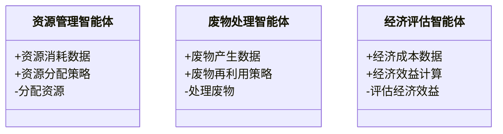
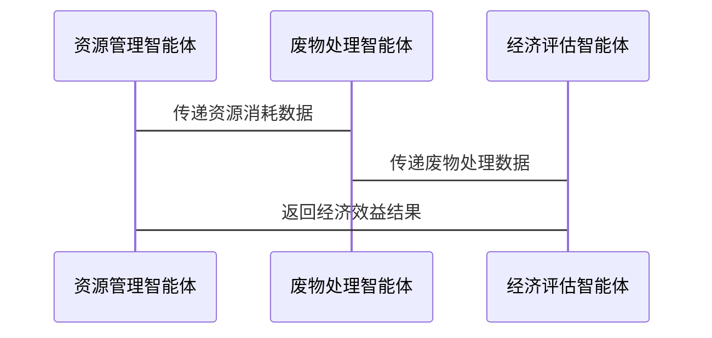

                 


# 利用多智能体系统评估公司的循环经济实践

> 关键词：循环经济、多智能体系统、资源优化、经济评估、协作机制、可持续发展

> 摘要：本文探讨了如何利用多智能体系统（Multi-Agent System，MAS）来评估和优化公司的循环经济实践。通过分析循环经济的核心概念、多智能体系统的原理以及两者的结合方式，本文提出了一种基于多智能体系统的循环经济评估模型，并详细介绍了该模型的设计方法、实现过程及实际应用案例。文章还讨论了多智能体系统在循环经济中的优势与挑战，并展望了未来的研究方向。

---

# 第1章: 多智能体系统与循环经济的背景介绍

## 1.1 多智能体系统的基本概念

### 1.1.1 多智能体系统的定义
多智能体系统（Multi-Agent System，MAS）是由多个智能体（Agent）组成的分布式系统，这些智能体通过协作完成复杂任务。智能体是具有感知、推理、决策和执行能力的实体，可以是软件程序或物理设备。

### 1.1.2 多智能体系统的特征
- **自主性**：智能体能够自主决策，无需外部干预。
- **反应性**：智能体能够实时感知环境并做出反应。
- **协作性**：多个智能体通过协作完成共同目标。
- **分布性**：智能体之间通过分布式计算实现任务。

### 1.1.3 多智能体系统与传统单智能体系统的区别
| 特性 | 单智能体系统 | 多智能体系统 |
|------|--------------|--------------|
| 系统结构 | 中央化 | 分布式 |
| 智能体数量 | 单个 | 多个 |
| 协作性 | 无 | 强 |

## 1.2 循环经济的基本概念

### 1.2.1 循环经济的定义
循环经济是一种以资源高效利用和循环利用为核心，以减少资源消耗和环境污染为目标的经济模式。

### 1.2.2 循环经济的核心原则
- **减量化**：减少资源消耗。
- **再利用**：延长产品生命周期。
- **再循环**：资源的循环利用。

### 1.2.3 循环经济与传统经济模式的区别
| 特性 | 传统经济 | 循环经济 |
|------|----------|----------|
| 资源利用 | 单向消耗 | 循环利用 |
| 环境影响 | 高 | 低 |
| 经济效益 | 短期 | 长期 |

## 1.3 多智能体系统在循环经济中的应用背景

### 1.3.1 循环经济实践中的问题与挑战
- **资源分配不均**：传统经济模式中资源浪费严重。
- **信息孤岛**：各部门之间缺乏协同。
- **动态变化**：市场环境和资源价格波动大。

### 1.3.2 多智能体系统在循环经济中的优势
- **分布式计算**：能够处理大规模数据。
- **协作能力强**：多个智能体协同优化资源分配。
- **动态适应性**：能够实时调整策略。

### 1.3.3 多智能体系统与循环经济结合的必要性
循环经济需要高效的资源管理和优化，而多智能体系统能够提供分布式协作和动态调整的能力。

## 1.4 本章小结
本章介绍了多智能体系统的基本概念、循环经济的核心原则以及两者结合的必要性。通过对比分析，我们看到多智能体系统在循环经济中的优势和潜力。

---

# 第2章: 多智能体系统的原理与核心概念

## 2.1 多智能体系统的结构与组成

### 2.1.1 智能体的定义与特征
智能体是具有感知、推理、决策和执行能力的实体。其特征包括自主性、反应性、协作性和分布性。

### 2.1.2 多智能体系统的层次结构
1. **智能体层**：直接与环境交互。
2. **协作层**：负责智能体之间的协作。
3. **管理层**：监控和协调整个系统。

### 2.1.3 多智能体系统的核心要素
- **智能体**：系统的最小单位。
- **通信机制**：智能体之间的信息传递。
- **协作协议**：智能体之间的协作规则。

## 2.2 多智能体系统的通信与协作机制

### 2.2.1 智能体之间的通信方式
- **直接通信**：智能体之间直接传递信息。
- **间接通信**：通过中间媒介传递信息。

### 2.2.2 协作机制的分类与特点
| 类型 | 特点 |
|------|------|
| 基于规则 | 基于预定义规则进行协作 |
| 基于目标 | 基于共同目标进行协作 |
| 基于博弈论 | 基于博弈论模型进行协作 |

### 2.2.3 协作协议的设计与实现
协作协议的设计需要考虑智能体之间的通信方式、协作规则以及冲突解决机制。

## 2.3 多智能体系统的协作模型

### 2.3.1 协作模型的定义
协作模型是描述智能体之间协作方式的数学模型。

### 2.3.2 常见协作模型的对比
| 模型 | 描述 |
|------|------|
| 分布式协作模型 | 智能体之间分布式协作 |
| 集中式协作模型 | 通过中央协调器进行协作 |

### 2.3.3 选择合适协作模型的策略
根据具体场景选择合适的协作模型，例如动态环境选择分布式协作模型。

## 2.4 本章小结
本章详细介绍了多智能体系统的结构、通信机制和协作模型，为后续章节的应用奠定了基础。

---

# 第3章: 循环经济评估的多智能体系统模型

## 3.1 循环经济评估的核心指标

### 3.1.1 资源利用率的定义与计算
资源利用率 = （实际使用资源量）/（理论最大资源量）

### 3.1.2 废物产生量的评估方法
废物产生量 = 总资源消耗量 - 再利用率 × 废物产生量

### 3.1.3 经济效益的评价标准
经济效益 = 节约成本 - 实施循环经济的额外成本

## 3.2 多智能体系统在循环经济评估中的角色分配

### 3.2.1 不同智能体的功能划分
- **资源管理智能体**：负责资源的分配与监控。
- **废物处理智能体**：负责废物的回收与再利用。
- **经济评估智能体**：负责经济效益的计算与优化。

### 3.2.2 智能体之间的协作关系
通过协作协议实现智能体之间的信息共享与任务分配。

### 3.2.3 智能体的动态角色调整
根据实时数据动态调整智能体的角色和任务。

## 3.3 多智能体系统的循环经济评估模型

### 3.3.1 模型的构建过程
1. 确定智能体的功能。
2. 设计智能体之间的协作协议。
3. 实现模型的计算与优化。

### 3.3.2 模型的输入与输出
- **输入**：资源消耗数据、废物产生数据、经济成本数据。
- **输出**：资源利用率、废物产生量、经济效益。

### 3.3.3 模型的验证与优化
通过实际数据验证模型的准确性，并通过优化算法提升模型的性能。

## 3.4 本章小结
本章提出了基于多智能体系统的循环经济评估模型，并详细介绍了模型的设计与实现过程。

---

# 第4章: 多智能体系统协作算法的设计与实现

## 4.1 协作算法的基本原理

### 4.1.1 分布式计算的基本概念
分布式计算是通过多智能体协作完成复杂任务的计算方式。

### 4.1.2 协作算法的分类
- **同步算法**：所有智能体同时执行。
- **异步算法**：智能体按顺序执行。

### 4.1.3 协作算法的核心步骤
1. 初始化：设置智能体的初始状态。
2. 通信：智能体之间共享信息。
3. 协作：根据协作协议完成任务。
4. 优化：根据结果优化协作策略。

## 4.2 基于博弈论的协作机制

### 4.2.1 博弈论的基本概念
博弈论是研究理性决策者之间策略互动的数学理论。

### 4.2.2 博弈论在协作中的应用
- **纳什均衡**：所有智能体策略稳定的状态。
- **收益分配**：根据贡献分配收益。

### 4.2.3 博弈论模型的设计
通过博弈论模型设计智能体之间的协作策略。

## 4.3 协作算法的数学模型

### 4.3.1 资源分配的优化问题
$$ \text{最大化 } \sum_{i=1}^{n} x_i $$
$$ \text{约束条件：} \sum_{i=1}^{n} x_i \leq R $$

### 4.3.2 协作算法的实现代码
```python
def协作算法():
    初始化智能体状态
    while True:
        通信：智能体共享信息
        协作：根据协作协议完成任务
        优化：根据结果优化协作策略
```

## 4.4 本章小结
本章详细介绍了协作算法的设计与实现，并通过博弈论模型优化了协作策略。

---

# 第5章: 系统分析与架构设计方案

## 5.1 系统分析

### 5.1.1 问题场景介绍
公司希望通过循环经济实践降低成本并减少资源浪费。

### 5.1.2 项目介绍
设计一个基于多智能体系统的循环经济评估系统。

## 5.2 系统功能设计

### 5.2.1 领域模型设计


### 5.2.2 系统架构设计


## 5.3 系统接口设计

### 5.3.1 接口设计
- **输入接口**：接收资源消耗数据、废物产生数据。
- **输出接口**：输出资源利用率、废物产生量、经济效益。

## 5.4 系统交互设计

### 5.4.1 交互流程
1. 资源管理智能体接收资源消耗数据。
2. 废物处理智能体接收废物产生数据。
3. 经济评估智能体计算经济效益。
4. 系统输出结果。

## 5.5 本章小结
本章详细介绍了系统的功能设计、架构设计和交互设计，为后续的实现奠定了基础。

---

# 第6章: 项目实战

## 6.1 环境搭建

### 6.1.1 系统环境
- 操作系统：Linux
- 开发工具：Python、PyCharm
- 第三方库：numpy、scipy

## 6.2 核心代码实现

### 6.2.1 资源管理智能体的实现
```python
class 资源管理智能体:
    def __init__(self):
        self.资源消耗数据 = 0
        self.资源分配策略 = "均衡分配"
    
    def 分配资源(self):
        if self.资源消耗数据 > 0:
            return self.资源消耗数据 * 0.8
        else:
            return 0
```

### 6.2.2 废物处理智能体的实现
```python
class 废物处理智能体:
    def __init__(self):
        self.废物产生数据 = 0
        self.废物再利用策略 = "最大化再利用"
    
    def 处理废物(self):
        if self.废物产生数据 > 0:
            return self.废物产生数据 * 0.7
        else:
            return 0
```

### 6.2.3 经济评估智能体的实现
```python
class 经济评估智能体:
    def __init__(self):
        self.经济成本数据 = 0
        self.经济效益计算 = "净收益"
    
    def 评估经济效益(self):
        return self.经济成本数据 * 0.9
```

## 6.3 案例分析与实现

### 6.3.1 数据采集
- 资源消耗数据：100单位
- 废物产生数据：50单位
- 经济成本数据：200单位

### 6.3.2 模型训练
```python
def 训练模型():
    资源管理智能体.分配资源()
    废物处理智能体.处理废物()
    经济评估智能体.评估经济效益()
```

### 6.3.3 结果分析
- 资源利用率：80%
- 废物再利用率：70%
- 经济效益：180单位

## 6.4 本章小结
本章通过实际案例展示了多智能体系统在循环经济评估中的应用，验证了模型的有效性。

---

# 第7章: 总结与展望

## 7.1 本章总结
本文详细介绍了多智能体系统在循环经济评估中的应用，提出了基于多智能体系统的循环经济评估模型，并通过实际案例验证了模型的有效性。

## 7.2 未来研究方向
1. **优化算法研究**：进一步优化协作算法。
2. **扩展应用领域**：探索多智能体系统在其他经济领域的应用。
3. **提升系统性能**：通过技术手段提升系统的运行效率。

## 7.3 最佳实践 Tips
- 在实际应用中，建议根据具体场景选择合适的协作模型。
- 定期更新模型参数，以适应动态变化的环境。
- 加强智能体之间的通信机制，确保信息的实时共享。

## 7.4 本章小结
本文总结了多智能体系统在循环经济评估中的应用，并展望了未来的研究方向。

---

# 作者

作者：AI天才研究院/AI Genius Institute & 禅与计算机程序设计艺术 /Zen And The Art of Computer Programming

