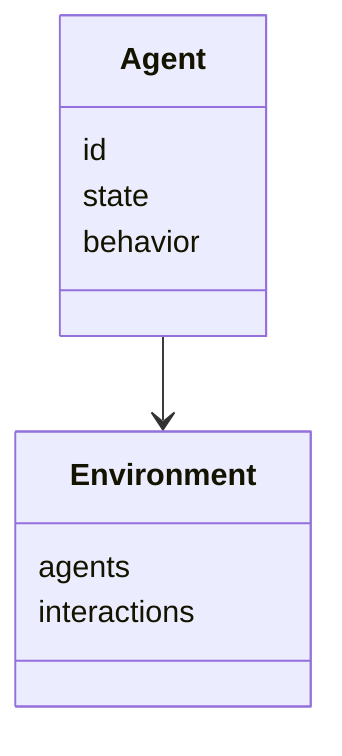
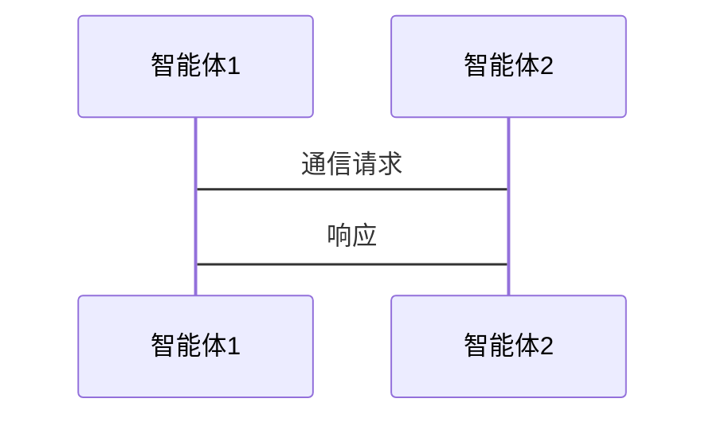

                 


# 利用多智能体系统评估公司的数字化转型进程

> 关键词：多智能体系统, 数字化转型, 企业评估, 系统架构, 人工智能

> 摘要：随着数字化转型在全球范围内的深入推进，企业对数字化转型的评估需求日益增长。本文将深入探讨如何利用多智能体系统这一创新技术来评估公司的数字化转型进程。通过分析多智能体系统的概念、算法原理、系统架构以及实际应用案例，本文旨在为企业提供一种高效、智能的数字化转型评估方法。

---

## 第一部分: 多智能体系统与数字化转型概述

### 第1章: 多智能体系统概述

#### 1.1 多智能体系统的基本概念
##### 1.1.1 多智能体系统的定义
多智能体系统（Multi-Agent System, MAS）是由多个智能体（Agent）组成的分布式系统，这些智能体能够通过协作完成复杂的任务。

##### 1.1.2 多智能体系统的特征
- **自主性**：每个智能体都具有自主决策的能力。
- **反应性**：智能体能够感知环境并实时做出反应。
- **协作性**：智能体之间通过通信和协作完成共同目标。
- **分布式性**：系统中的智能体分布在网络的各个节点上，不依赖于中心化的控制。

##### 1.1.3 多智能体系统与单智能体系统的区别
| 特性 | 单智能体系统 | 多智能体系统 |
|------|--------------|-------------|
| 结构 | 单一中心节点 | 分布式节点   |
| 决策 | 中央决策     | 去中心化决策 |
| 通信 | 无           | 高           |

#### 1.2 数字化转型的定义与特征
##### 1.2.1 数字化转型的定义
数字化转型是指利用数字技术对业务模式、文化、过程、技能和资产进行根本性改变，以创造新价值的过程。

##### 1.2.2 数字化转型的核心特征
- **数据驱动**：依赖数据进行决策。
- **智能化**：利用人工智能和大数据技术实现自动化。
- **生态系统**：构建开放的合作伙伴生态系统。
- **持续改进**：通过反馈不断优化。

#### 1.3 多智能体系统在数字化转型中的作用
##### 1.3.1 多智能体系统在数字化转型中的优势
- **分布式协作**：能够协调分布在不同部门或系统的智能体。
- **实时反馈**：智能体能够实时感知并做出反应。
- **复杂任务处理**：适合处理跨部门、跨系统的复杂任务。

##### 1.3.2 多智能体系统如何推动企业变革
通过多智能体系统的协作，企业能够实现业务流程的自动化和智能化，从而提升效率和竞争力。

##### 1.3.3 多智能体系统与企业业务流程的关系
多智能体系统能够模拟和优化企业业务流程，通过智能体之间的协作实现流程的优化和创新。

---

### 第2章: 多智能体系统与数字化转型的背景

#### 2.1 数字化转型的背景与趋势
##### 2.1.1 数字化转型的背景
随着信息技术的飞速发展，企业需要通过数字化转型来应对市场竞争的压力。

##### 2.1.2 数字化转型的全球趋势
全球范围内，企业都在加速数字化转型，以适应新的商业环境。

##### 2.1.3 数字化转型对企业的影响
- **提升效率**：通过数字化技术优化业务流程。
- **降低成本**：减少人工干预，降低运营成本。
- **增强竞争力**：通过数据驱动的决策提升企业的市场竞争力。

#### 2.2 多智能体系统的发展历程
##### 2.2.1 多智能体系统的起源
多智能体系统的概念起源于20世纪80年代的人工智能研究。

##### 2.2.2 多智能体系统的演变
从早期的简单协作到现在的复杂协作，多智能体系统经历了多次演变。

##### 2.2.3 多智能体系统在不同领域的应用
- **金融**：用于交易和风险管理。
- **医疗**：用于患者数据管理和诊断支持。
- **制造**：用于生产流程优化。

#### 2.3 数字化转型与多智能体系统的结合
##### 2.3.1 数字化转型对多智能体系统的需求
企业需要多智能体系统来支持复杂的业务流程和决策。

##### 2.3.2 多智能体系统如何支持数字化转型
通过智能体之间的协作，实现企业数字化转型的目标。

##### 2.3.3 多智能体系统与数字化转型的协同效应
多智能体系统能够增强数字化转型的效果，通过智能化的协作提升企业的整体能力。

---

### 第3章: 多智能体系统的核心概念与原理

#### 3.1 多智能体系统的组成与结构
##### 3.1.1 多智能体系统的组成
- **智能体**：系统的最基本单元。
- **环境**：智能体所处的环境。
- **通信协议**：智能体之间的通信规则。

##### 3.1.2 多智能体系统的层次结构
- **物理层**：硬件设备。
- **数据层**：数据的存储和管理。
- **逻辑层**：智能体的行为逻辑。

##### 3.1.3 多智能体系统的通信机制
智能体之间的通信可以通过消息传递、服务调用等方式实现。

#### 3.2 数字化转型的评估指标
##### 3.2.1 数字化转型的关键指标
- **效率提升**：业务流程的优化。
- **成本降低**：运营成本的减少。
- **客户满意度**：客户体验的提升。

##### 3.2.2 多智能体系统在评估中的作用
通过多智能体系统的协作，实现对数字化转型的全面评估。

##### 3.2.3 评估指标的权重与计算方法
- **权重分配**：根据指标的重要性分配权重。
- **计算方法**：采用加权平均法进行计算。

#### 3.3 多智能体系统的协作机制
##### 3.3.1 协作的基本原理
智能体通过通信和协作完成共同目标。

##### 3.3.2 协作的实现方式
- **分布式协作**：智能体之间分布式协作。
- **集中式协作**：通过中央节点进行协作。

##### 3.3.3 协作中的挑战与解决方案
- **挑战**：信息孤岛、协作效率低下。
- **解决方案**：通过通信协议和分布式算法解决协作问题。

---

### 第4章: 多智能体系统的算法原理

#### 4.1 多智能体系统的通信协议
##### 4.1.1 通信协议的定义
通信协议是智能体之间进行信息交换的规则。

##### 4.1.2 常见的通信协议
- **HTTP**：用于Web服务之间的通信。
- **WebSocket**：用于实时通信。

##### 4.1.3 通信协议的选择与优化
根据具体场景选择合适的通信协议，并进行优化。

#### 4.2 多智能体系统的协作算法
##### 4.2.1 基于一致性算法的协作
一致性算法（如Paxos、Raft）用于保证分布式系统的一致性。

##### 4.2.2 分布式计算在协作中的应用
通过分布式计算实现智能体之间的协作。

##### 4.2.3 协作算法的数学模型
$$ \text{一致性算法的数学模型可以表示为：} \forall i,j, \text{value}_i = \text{value}_j $$

#### 4.3 多智能体系统的决策机制
##### 4.3.1 决策的基本原理
智能体根据感知到的信息做出决策。

##### 4.3.2 基于博弈论的决策模型
通过博弈论模型实现智能体之间的决策优化。

##### 4.3.3 决策机制的优化与实现
- **优化**：通过强化学习优化决策策略。
- **实现**：通过算法实现决策逻辑。

---

### 第5章: 数字化转型的系统架构设计

#### 5.1 问题场景介绍
企业需要通过多智能体系统实现数字化转型的评估。

#### 5.2 系统功能设计
##### 5.2.1 领域模型


##### 5.2.2 系统架构设计


##### 5.2.3 系统接口设计
智能体之间的接口设计需要遵循通信协议。

##### 5.2.4 系统交互


---

## 第二部分: 项目实战

### 第6章: 项目实战

#### 6.1 环境安装
- **工具安装**：安装Python、Jupyter Notebook等工具。
- **依赖安装**：安装必要的库（如pym媒体、requests等）。

#### 6.2 系统核心实现源代码
```python
class Agent:
    def __init__(self, id):
        self.id = id
        self.state = None

    def send_message(self, message, receiver):
        # 消息发送逻辑
        pass

    def receive_message(self, message):
        # 消息接收逻辑
        pass

    def decide_action(self):
        # 决策逻辑
        pass
```

#### 6.3 代码应用解读与分析
- **代码解读**：解释代码的功能和实现逻辑。
- **代码分析**：分析代码的优缺点。

#### 6.4 实际案例分析
- **案例背景**：企业数字化转型的某个具体案例。
- **案例分析**：如何利用多智能体系统进行评估。

#### 6.5 项目小结
总结项目的实现过程和成果。

---

## 第三部分: 总结与展望

### 第7章: 总结与展望

#### 7.1 最佳实践 tips
- **小结**：总结项目的成功经验。
- **注意事项**：提醒读者在实际应用中需要注意的问题。
- **拓展阅读**：推荐相关领域的书籍和资源。

#### 7.2 小结
通过多智能体系统实现数字化转型的评估是一个复杂但极具价值的过程。

#### 7.3 注意事项
- **数据安全**：注意数据的安全性和隐私性。
- **系统维护**：定期维护和优化系统。

#### 7.4 拓展阅读
- **推荐书籍**：《Multi-Agent Systems》
- **推荐论文**：《A Survey on Multi-Agent Systems》

---

## 作者：AI天才研究院 & 禅与计算机程序设计艺术

---

通过以上目录结构，文章将系统地介绍多智能体系统在数字化转型评估中的应用，从理论到实践，帮助读者全面理解并掌握相关知识。

