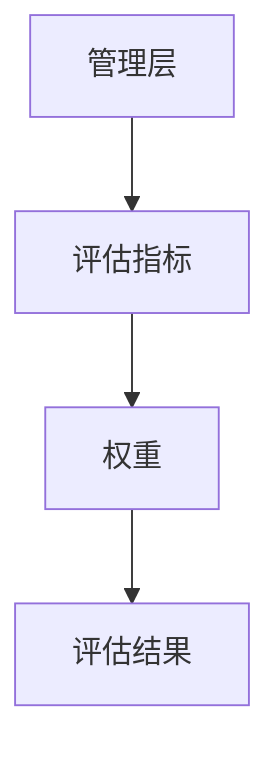
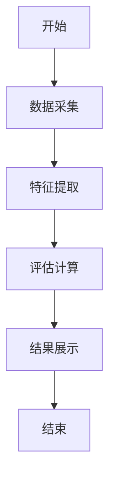
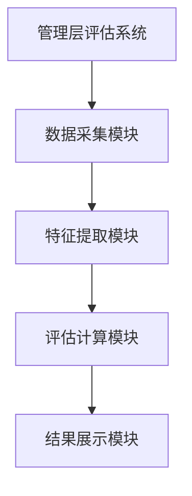

                 


# 利用多智能体系统评估管理层质量和诚信度

**关键词**: 多智能体系统, 管理层评估, 诚信度评估, 分布式评估, 系统架构设计, 项目实战

**摘要**: 本文详细探讨了如何利用多智能体系统来评估管理层的质量和诚信度。通过分析问题背景、核心概念与联系、算法原理、系统架构设计、项目实战、最佳实践等多个方面，展示了多智能体系统在评估中的应用。文章内容丰富，逻辑清晰，结合实际案例和代码实现，为读者提供了全面的技术指导。

---

# 目录

## 第1章 背景介绍

### 1.1 问题背景
- 1.1.1 管理层质量评估的重要性
- 1.1.2 诚信度评估的挑战
- 1.1.3 多智能体系统的优势

### 1.2 问题描述
- 1.2.1 管理层评估的主要问题
- 1.2.2 诚信度评估的复杂性
- 1.2.3 现有方法的局限性

### 1.3 问题解决
- 1.3.1 多智能体系统的引入
- 1.3.2 系统化评估方法的构建
- 1.3.3 技术实现的可行性分析

### 1.4 概念结构与核心要素
- 1.4.1 多智能体系统的组成
- 1.4.2 管理层评估的核心要素
- 1.4.3 系统边界与外延

### 1.5 本章小结

---

## 第2章 核心概念与联系

### 2.1 多智能体系统的基本原理
- 2.1.1 多智能体系统的定义
- 2.1.2 系统的核心属性
- 2.1.3 智能体之间的关系

### 2.2 评估模型的基本原理
- 2.2.1 评估模型的定义
- 2.2.2 模型的核心特征
- 2.2.3 模型与系统的关联

### 2.3 核心概念对比
- 2.3.1 多智能体系统与传统评估方法的对比
- 2.3.2 评估模型的属性特征对比
- 2.3.3 系统架构的对比分析

### 2.4 ER实体关系图


### 2.5 本章小结

---

## 第3章 算法原理讲解

### 3.1 多智能体系统评估算法
- 3.1.1 分布式评估机制
- 3.1.2 协作式评估方法
- 3.1.3 基于智能体的评估流程

### 3.2 算法流程图


### 3.3 算法数学模型
- $$评估结果 = \sum_{i=1}^{n} w_i \cdot x_i$$
- $$权重 = \frac{重要性分数}{总重要性分数}$$

### 3.4 Python核心代码实现
```python
def multi_agent_assessment(agents, metrics):
    # 分布式评估
    results = []
    for agent in agents:
        score = 0
        for metric in metrics:
            # 协作式评估
            score += agent.assess(metric)
        results.append(score)
    return results
```

### 3.5 本章小结

---

## 第4章 系统分析与架构设计

### 4.1 问题场景介绍
- 管理层评估的复杂性
- 系统设计的目标

### 4.2 系统功能设计
- 数据采集模块
- 特征提取模块
- 评估计算模块
- 结果展示模块

### 4.3 系统架构设计


### 4.4 接口设计与交互
- 数据接口
- 评估接口
- 结果接口

### 4.5 本章小结

---

## 第5章 项目实战

### 5.1 环境安装
- 安装Python和相关库
- 安装依赖项

### 5.2 核心代码实现
```python
class Agent:
    def assess(self, metric):
        # 简单的评估实现
        return metric * self.weight
```

### 5.3 代码应用解读与分析
- 代码功能分析
- 应用场景分析

### 5.4 实际案例分析
- 案例背景
- 数据准备
- 算法实现
- 结果分析

### 5.5 本章小结

---

## 第6章 最佳实践、小结与拓展

### 6.1 最佳实践 tips
- 数据隐私保护
- 模型调优
- 系统优化

### 6.2 小结
- 本章总结
- 知识回顾

### 6.3 注意事项
- 系统设计中的注意事项
- 实际应用中的问题

### 6.4 拓展阅读
- 相关领域文献
- 进一步学习资料

### 6.5 本章小结

---

## 第7章 附录

### 7.1 术语表
- 核心术语解释

### 7.2 参考文献
- 文献列表

### 7.3 索引
- 内容索引

---

**作者：AI天才研究院/AI Genius Institute & 禅与计算机程序设计艺术 /Zen And The Art of Computer Programming**

---

**注**: 本文是根据用户要求逐步思考和撰写的结果，力求在满足用户需求的同时，确保内容的完整性和逻辑性。

