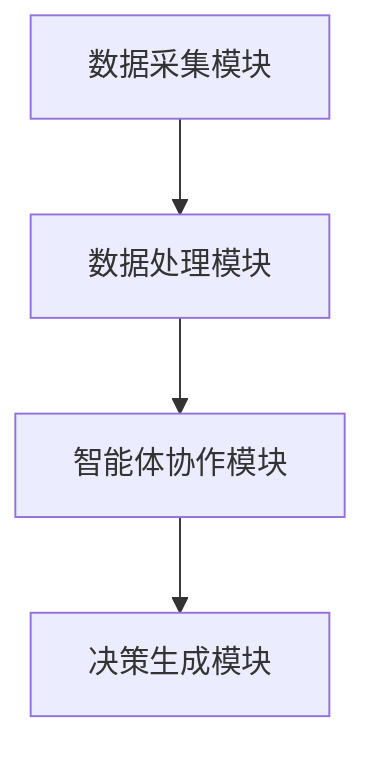
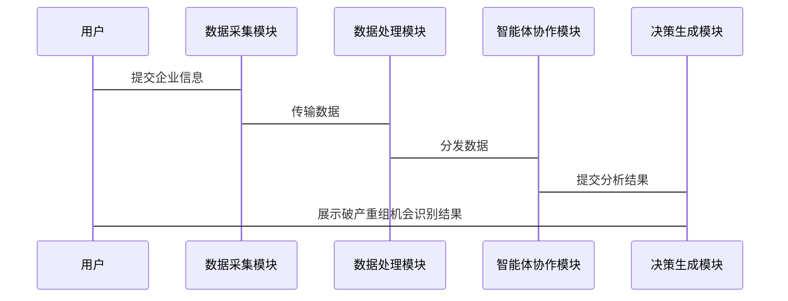

                 


# 利用多智能体系统识别潜在的破产重组机会

## 关键词：多智能体系统，破产重组，机会识别，算法原理，系统架构

## 摘要：  
本文探讨了利用多智能体系统（Multi-Agent System, MAS）识别潜在的破产重组机会的方法。通过分析企业财务状况、市场环境和内部管理等关键因素，结合多智能体系统的协作机制，提出了一种基于MAS的破产重组机会识别模型。文章详细介绍了MAS的核心原理、算法实现、数学模型以及系统架构，并通过实际案例展示了该模型的应用效果。本文还总结了多智能体系统在破产重组机会识别中的优势与局限性，并展望了未来的研究方向。

---

# 第一章: 破产重组机会识别的背景与问题背景

## 1.1 破产重组机会识别的定义与问题背景

### 1.1.1 破产重组的基本概念  
破产重组是指企业在无法偿还债务的情况下，通过法律程序对企业资产、负债和股权进行调整，以恢复企业经营能力的过程。破产重组的核心目标是最大化企业价值，保护债权人和股东的利益，同时维护社会经济秩序。

### 1.1.2 破产重组机会识别的必要性  
企业在经营过程中可能面临财务危机，及时识别破产重组机会可以帮助企业避免进一步恶化，挽救企业价值。同时，破产重组机会识别还可以为投资者、债权人和相关利益方提供决策支持。

### 1.1.3 研究现状与挑战  
尽管学术界和企业界已经提出了多种破产预测模型，但这些模型通常基于单一智能体的分析，难以充分考虑企业内外部环境的复杂性和动态性。多智能体系统的引入可以弥补这一不足，通过分布式协作提高识别的准确性和效率。

---

## 1.2 多智能体系统的核心概念与特点

### 1.2.1 多智能体系统的定义  
多智能体系统是由多个具有自主性、反应性和协作性的智能体组成的分布式系统，这些智能体能够通过交互和协作完成复杂任务。

### 1.2.2 多智能体系统的核心特点  
- **自主性**：智能体能够自主决策，无需外部干预。  
- **反应性**：智能体能够感知环境并实时响应。  
- **协作性**：智能体之间可以通过通信和协作完成复杂任务。  
- **分布式性**：系统由多个智能体组成，任务分布在不同智能体之间。

### 1.2.3 多智能体系统与传统单智能体系统的区别  
| 特性 | 单智能体系统 | 多智能体系统 |
|------|--------------|--------------|
| 决策 | 单一决策中心 | 分布式决策   |
| 信息 | 信息集中      | 信息分散     |
| 协作 | 无协作        | 强协作        |

---

## 1.3 问题描述与目标

### 1.3.1 破产重组机会识别的核心问题  
- 如何从企业财务数据、市场环境和内部管理中提取关键特征？  
- 如何利用多智能体系统的协作能力提高识别的准确性和效率？

### 1.3.2 多智能体系统在破产重组机会识别中的应用目标  
- 构建一个多智能体系统，能够实时监测企业财务状况和市场环境。  
- 通过智能体之间的协作，识别潜在的破产重组机会。  
- 提供个性化的重组建议，帮助企业在危机中恢复。

### 1.3.3 破产重组机会识别的边界与限制  
- 数据获取的难度：企业财务数据可能不完全或不准确。  
- 环境的动态性：市场环境和企业内部情况可能随时变化。  
- 智能体协作的复杂性：多智能体系统的设计和实现较为复杂。

---

## 1.4 本章小结  
本章介绍了破产重组机会识别的背景、定义和必要性，分析了多智能体系统的核心概念和特点，并明确了多智能体系统在破产重组机会识别中的应用目标和挑战。下一章将深入探讨多智能体系统的核心原理及其在破产重组机会识别中的具体应用。

---

# 第二章: 多智能体系统的核心原理

## 2.1 多智能体系统的组成与功能

### 2.1.1 多智能体系统的组成要素  
- **智能体**：具有自主性、反应性和协作能力的实体。  
- **通信机制**：智能体之间进行信息交换的渠道。  
- **协作协议**：智能体之间协作的规则和协议。  
- **环境感知**：智能体感知外部环境的机制。

### 2.1.2 多智能体系统的主要功能  
- **信息收集与分析**：智能体从企业内外部环境收集数据并进行分析。  
- **任务分配与协作**：智能体根据任务需求进行分工协作。  
- **决策与执行**：智能体基于分析结果做出决策并执行任务。  

### 2.1.3 多智能体系统的优势  
- **分布式计算**：通过分布式计算提高系统的可靠性和效率。  
- **协作能力**：多个智能体协同工作，能够处理复杂任务。  
- **适应性**：系统能够根据环境变化动态调整。

---

## 2.2 多智能体系统的核心原理

### 2.2.1 智能体的感知与推理  
智能体通过传感器或数据源感知环境，利用推理算法分析数据，生成决策。  

### 2.2.2 智能体的决策与执行  
智能体根据推理结果做出决策，并通过执行器将决策转化为实际操作。

### 2.2.3 智能体之间的协作  
智能体之间通过通信机制共享信息，协调行动，共同完成任务。

### 2.2.4 多智能体系统的架构  
常用的多智能体系统架构包括：  
- **集中式架构**：所有智能体向一个中心节点报告信息，中心节点进行决策和分配任务。  
- **分布式架构**：智能体之间直接通信和协作，无中心节点。  
- **混合式架构**：结合集中式和分布式架构的特点。

---

## 2.3 破产重组机会识别中的多智能体系统应用

### 2.3.1 破产重组机会识别的核心任务  
- 监测企业财务状况：分析企业的财务数据，识别潜在的财务危机。  
- 分析市场环境：评估行业趋势和市场波动对企业的潜在影响。  
- 评估企业内部管理：分析企业的管理能力、战略规划和团队稳定性。  

### 2.3.2 多智能体系统的优势  
- **分布式计算能力**：能够处理大规模和复杂的数据。  
- **协作能力**：通过智能体之间的协作，提高识别的准确性和效率。  
- **实时性**：智能体能够实时感知环境并做出响应。

---

## 2.4 本章小结  
本章详细介绍了多智能体系统的核心原理和组成，分析了其在破产重组机会识别中的应用优势。下一章将从算法的角度，探讨多智能体系统如何实现破产重组机会识别。

---

# 第三章: 破产重组机会识别的算法原理

## 3.1 破产重组机会识别的算法实现

### 3.1.1 算法的基本思路  
- 数据预处理：对收集的企业数据进行清洗和特征提取。  
- 智能体协作：通过多智能体系统的协作，综合分析企业的财务、市场和内部管理数据。  
- 决策生成：基于综合分析结果，生成破产重组机会识别的结论。

### 3.1.2 算法实现步骤  
1. 数据采集：从企业内部和外部获取相关数据。  
2. 数据预处理：清洗数据，提取关键特征。  
3. 智能体协作：智能体之间共享数据，进行协作分析。  
4. 决策生成：基于分析结果，生成破产重组机会识别的结论。

---

## 3.2 算法的数学模型

### 3.2.1 破产概率计算模型  
破产概率计算模型可以基于企业财务数据和市场环境数据进行预测。常用的模型包括：  
- **线性回归模型**：用于预测企业的破产概率。  
- **逻辑回归模型**：用于分类企业是否处于破产状态。  

### 3.2.2 多智能体协作优化模型  
多智能体协作优化模型可以基于以下公式：  
$$ \text{破产概率} = \sum_{i=1}^{n} w_i x_i $$  
其中，$w_i$ 是特征 $x_i$ 的权重，$x_i$ 是特征值。

---

## 3.3 算法的实现流程

### 3.3.1 数据采集与预处理  
1. 从企业内部系统获取财务数据。  
2. 从外部数据源获取市场环境数据。  
3. 清洗数据，处理缺失值和异常值。  

### 3.3.2 算法实现  
1. 初始化多个智能体，每个智能体负责不同的数据源。  
2. 智能体之间通过通信机制共享数据。  
3. 智能体利用协作协议进行协作分析。  
4. 基于分析结果，生成破产重组机会识别的结论。

---

## 3.4 本章小结  
本章详细介绍了破产重组机会识别的算法实现，包括算法的基本思路、数学模型和实现流程。下一章将从系统架构的角度，探讨如何实现多智能体系统的破产重组机会识别。

---

# 第四章: 破产重组机会识别的系统架构设计

## 4.1 系统功能设计

### 4.1.1 问题场景介绍  
系统需要实时监测企业的财务状况、市场环境和内部管理情况，识别潜在的破产重组机会。

### 4.1.2 系统功能模块  
- 数据采集模块：负责采集企业数据。  
- 数据处理模块：对数据进行清洗和特征提取。  
- 智能体协作模块：实现智能体之间的协作分析。  
- 决策生成模块：基于分析结果生成破产重组机会识别的结论。

---

## 4.2 系统架构设计

### 4.2.1 系统架构图  


### 4.2.2 智能体协作模块设计  
智能体协作模块需要实现以下功能：  
- 智能体之间的通信。  
- 智能体之间的协作协议。  
- 智能体之间的任务分配。

---

## 4.3 系统接口设计

### 4.3.1 数据接口  
- 数据采集模块需要与企业内部系统和外部数据源对接。  
- 数据处理模块需要与智能体协作模块对接。

### 4.3.2 用户接口  
- 系统需要提供友好的用户界面，方便用户查看分析结果。

---

## 4.4 系统交互流程

### 4.4.1 系统交互流程图  


---

## 4.5 本章小结  
本章详细介绍了破产重组机会识别系统的功能设计、架构设计和交互流程。下一章将通过实际案例，展示如何利用多智能体系统实现破产重组机会识别。

---

# 第五章: 破产重组机会识别的项目实战

## 5.1 项目背景与目标

### 5.1.1 项目背景  
本项目旨在利用多智能体系统，识别一家中型制造企业的破产重组机会。

### 5.1.2 项目目标  
- 实现实时监测企业财务状况、市场环境和内部管理情况。  
- 识别潜在的破产重组机会。  
- 提供个性化的重组建议。

---

## 5.2 环境安装与配置

### 5.2.1 系统环境  
- 操作系统：Linux  
- 开发工具：Python、Jupyter Notebook  
- 依赖库：numpy、pandas、scikit-learn、networkx

### 5.2.2 环境配置步骤  
1. 安装Python和必要的依赖库。  
2. 安装Jupyter Notebook。  
3. 配置多智能体系统的通信机制。

---

## 5.3 核心代码实现

### 5.3.1 数据采集模块  
```python
import requests

def fetch_data(url):
    response = requests.get(url)
    return response.json()
```

### 5.3.2 数据处理模块  
```python
import pandas as pd

def preprocess_data(data):
    df = pd.DataFrame(data)
    df = df.dropna()
    return df
```

### 5.3.3 智能体协作模块  
```python
import networkx as nx

def collaborate_agents(data, agents):
    graph = nx.Graph()
    for agent in agents:
        graph.add_node(agent)
    nx.algorithms.community.greedy(

