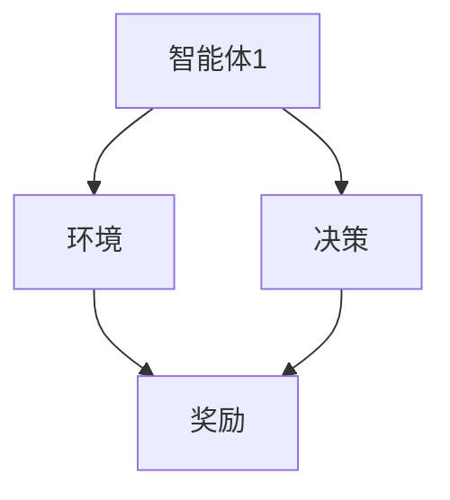
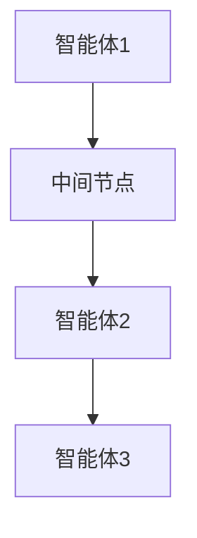

                 

# 利用多智能体系统进行全球市场价值机会扫描

## 关键词：多智能体系统、全球市场、价值机会扫描、金融市场、协作算法

## 摘要：  
在现代金融市场中，价值机会的识别和扫描是投资者和机构的核心目标。传统的市场分析工具和方法在面对复杂多变的市场环境时，往往显得力不从心。多智能体系统作为一种新兴的技术，通过多个智能体的协同工作，能够高效地扫描全球市场中的价值机会。本文将详细探讨多智能体系统的核心概念、算法原理及其在金融市场中的应用，特别是如何利用多智能体系统进行全球市场价值机会扫描。通过案例分析和系统设计，本文旨在为读者提供一个全面的理解和实践指南。

---

# 第1章 多智能体系统与全球市场价值机会扫描概述

## 1.1 多智能体系统的定义与特点

### 1.1.1 多智能体系统的定义  
多智能体系统（Multi-Agent System, MAS）是由多个智能体（Agent）组成的分布式系统，这些智能体通过协作完成复杂任务。每个智能体都是一个能够感知环境、自主决策的实体，具有一定的计算能力和信息处理能力。

### 1.1.2 多智能体系统的核心特点  
- **分布式性**：多个智能体协同工作，没有中心化的控制节点。  
- **自主性**：每个智能体能够独立决策和行动。  
- **协作性**：智能体之间通过通信和协作完成共同目标。  
- **适应性**：能够根据环境变化动态调整行为。  

### 1.1.3 多智能体系统与传统单智能体系统的主要区别  
| 特性         | 多智能体系统                   | 单智能体系统                 |
|--------------|-------------------------------|-----------------------------|
| 结构         | 分布式，多个智能体协同工作     | 单一智能体独立完成任务       |
| 决策机制     | 分散决策，智能体之间协商       | 集中的决策机制               |
| 稳定性       | 单点故障风险低，容错能力强      | 单点故障风险高               |

---

## 1.2 全球市场价值机会扫描的背景与意义

### 1.2.1 全球市场价值机会扫描的定义  
全球市场价值机会扫描是指通过分析全球市场中的各种数据，识别出具有投资价值的机会。这些机会可能存在于股票、外汇、期货等多种金融资产中。

### 1.2.2 当前市场分析工具的局限性  
- **数据量大**：金融市场数据量庞大，传统工具难以实时处理。  
- **复杂性高**：市场波动频繁，传统模型难以捕捉复杂趋势。  
- **信息滞后**：传统分析工具通常依赖历史数据，难以实时响应市场变化。  

### 1.2.3 多智能体系统在市场扫描中的优势  
- **高效性**：多智能体系统能够并行处理大量数据，提高扫描效率。  
- **适应性**：智能体能够根据市场变化快速调整策略。  
- **协作性**：多个智能体可以从不同角度分析市场，提供更全面的洞察。  

---

## 1.3 本章小结

### 1.3.1 多智能体系统的核心概念  
多智能体系统是由多个智能体组成的分布式系统，具有分布式性、自主性和协作性等特点。  

### 1.3.2 全球市场价值机会扫描的目标与价值  
通过多智能体系统的协作，可以高效地扫描全球市场，识别投资机会，提高投资决策的准确性和及时性。  

### 1.3.3 本章内容回顾与总结  
本章介绍了多智能体系统的基本概念和特点，并分析了其在全球市场价值机会扫描中的应用价值。

---

# 第2章 多智能体系统的核心概念与原理

## 2.1 多智能体系统的组成与结构

### 2.1.1 多智能体系统的组成要素  
- **智能体**：具有感知和决策能力的实体。  
- **通信机制**：智能体之间的信息交互方式。  
- **任务分配**：系统中任务的分配与协作方式。  

### 2.1.2 多智能体系统的通信机制  
- **直接通信**：智能体之间直接交换信息。  
- **间接通信**：通过中间媒介进行信息传递。  

### 2.1.3 多智能体系统的任务分配与协作  
- **基于角色分配**：根据智能体的职责分配任务。  
- **基于能力分配**：根据智能体的能力动态分配任务。  

---

## 2.2 多智能体系统的核心算法

### 2.2.1 基于强化学习的多智能体协作算法  
- **定义**：通过强化学习，智能体通过试错的方式学习协作策略。  
- **流程**：  
  1. 智能体感知环境，获取状态信息。  
  2. 智能体做出决策，发送动作。  
  3. 环境反馈奖励，智能体更新策略。  

### 2.2.2 基于博弈论的多智能体决策算法  
- **定义**：通过博弈论模型，分析智能体之间的互动，制定最优决策。  
- **流程**：  
  1. 分析可能的博弈场景。  
  2. 计算各智能体的收益与损失。  
  3. 确定最优策略。  

### 2.2.3 基于分布式计算的多智能体通信算法  
- **定义**：通过分布式计算技术，实现智能体之间的高效通信。  
- **流程**：  
  1. 智能体通过网络进行通信。  
  2. 数据经过中间节点进行路由。  
  3. 目标智能体接收数据并处理。  

---

## 2.3 多智能体系统的性能评估与优化

### 2.3.1 多智能体系统性能评估指标  
| 指标         | 定义                              |
|--------------|----------------------------------|
| 响应时间     | 系统完成任务所需的时间            |
| 准确率       | 系统预测的正确比例                |
| 并行性       | 系统同时处理任务的能力            |

### 2.3.2 多智能体系统的优化方法  
- **负载均衡**：合理分配任务，避免资源浪费。  
- **通信优化**：减少不必要的数据传输。  
- **算法优化**：改进协作算法，提高效率。  

### 2.3.3 常见优化算法的对比分析  
| 算法         | 优点                              | 缺点                              |
|--------------|----------------------------------|----------------------------------|
| 强化学习      | 灵活性高，适应性强               | 训练时间长，计算资源消耗大        |
| 博弈论        | 分析全面，策略优化                | 实施复杂，需要精确的模型          |
| 分布式计算    | 扩展性强，处理能力高              | 通信延迟，可能导致性能下降        |

---

## 2.4 本章小结

### 2.4.1 多智能体系统的核心概念  
多智能体系统由多个智能体组成，通过通信和协作完成任务。  

### 2.4.2 多智能体系统的算法特点  
不同的算法适用于不同的场景，强化学习和博弈论是常见的选择。  

### 2.4.3 本章内容总结与展望  
本章介绍了多智能体系统的组成与算法，为后续的应用提供了理论基础。

---

# 第3章 多智能体系统在金融市场中的应用

## 3.1 金融市场中的价值机会扫描

### 3.1.1 金融市场的复杂性与挑战  
- **数据多样性**：包括价格、成交量、新闻等多种数据。  
- **市场波动性**：价格波动频繁，难以预测。  
- **信息不对称**：投资者获取信息的渠道不一致。  

### 3.1.2 价值机会扫描的定义与目标  
- **定义**：通过分析市场数据，识别具有投资价值的机会。  
- **目标**：帮助投资者做出更明智的投资决策。  

### 3.1.3 多智能体系统在市场扫描中的优势  
- **高效性**：多智能体系统能够快速处理大量数据。  
- **协作性**：多个智能体可以从不同角度分析市场，提供全面的洞察。  

---

## 3.2 多智能体系统在股票市场的应用

### 3.2.1 基于多智能体系统的股票预测模型  
- **模型设计**：智能体通过分析历史数据，预测股票价格走势。  
- **协作机制**：智能体之间共享数据，提高预测的准确性。  

### 3.2.2 多智能体系统在股票交易中的协作机制  
- **实时监控**：智能体实时监控市场动态，发现交易机会。  
- **风险控制**：智能体通过协作，降低交易风险。  

### 3.2.3 实例分析：多智能体系统在某股票市场的应用  
- **案例描述**：某股票市场中，多智能体系统通过分析新闻、财务数据等，预测股票价格走势。  
- **结果分析**：预测准确率显著提高，交易收益增加。  

---

## 3.3 多智能体系统在外汇市场的应用

### 3.3.1 外汇市场的特点与挑战  
- **24小时交易**：外汇市场是全球最大的金融市场，交易时间长。  
- **汇率波动**：受多种因素影响，汇率波动频繁。  

### 3.3.2 多智能体系统在外汇交易中的应用  
- **实时汇率监控**：智能体实时监控汇率变化，发现交易机会。  
- **多策略协作**：多个智能体采用不同的交易策略，提高整体收益。  

### 3.3.3 实例分析：多智能体系统在某外汇交易中的应用  
- **案例描述**：某外汇交易中，多智能体系统通过分析经济指标、市场情绪等，制定交易策略。  
- **结果分析**：交易策略更加灵活，收益显著提高。  

---

## 3.4 多智能体系统在期货市场的应用

### 3.4.1 期货市场的特点与挑战  
- **杠杆交易**：期货交易具有高杠杆性，风险较大。  
- **复杂性高**：期货市场的价格受多种因素影响。  

### 3.4.2 多智能体系统在期货交易中的应用  
- **风险控制**：智能体通过协作，实时监控市场风险。  
- **套利机会识别**：智能体通过分析不同市场的价格差异，识别套利机会。  

### 3.4.3 实例分析：多智能体系统在某期货交易中的应用  
- **案例描述**：某期货市场中，多智能体系统通过分析宏观经济数据、市场情绪等，识别套利机会。  
- **结果分析**：套利机会识别准确率高，收益显著。  

---

## 3.5 本章小结

### 3.5.1 多智能体系统在金融市场中的应用价值  
多智能体系统能够高效地扫描市场，识别投资机会，提高投资决策的准确性和及时性。  

### 3.5.2 不同市场中的应用特点  
股票、外汇和期货市场各有特点，多智能体系统的应用需要根据市场特点进行调整。  

### 3.5.3 本章内容总结与展望  
本章通过实例分析，展示了多智能体系统在不同金融市场中的应用，为后续的系统设计提供了参考。

---

# 作者：AI天才研究院/AI Genius Institute & 禅与计算机程序设计艺术 /Zen And The Art of Computer Programming

