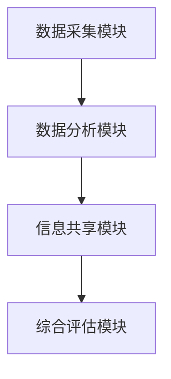
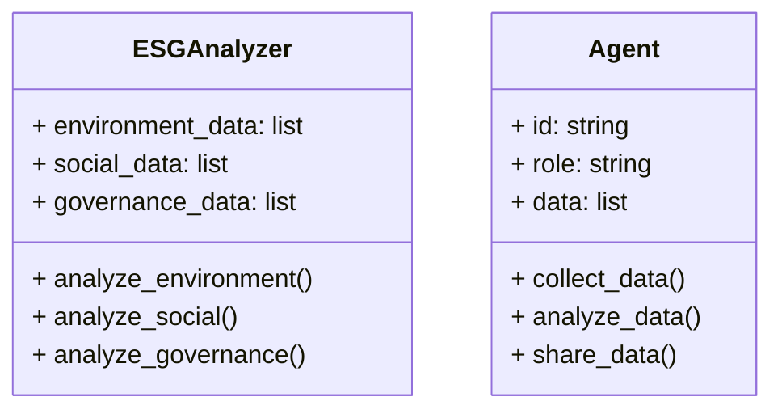
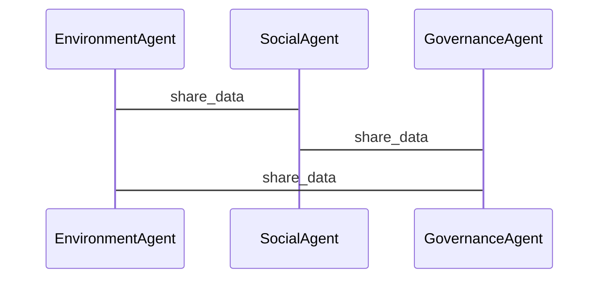

                 


# 利用多智能体系统进行全面的ESG因素分析

## 关键词：多智能体系统、ESG分析、环境、社会、治理、协作机制、系统架构

## 摘要：  
随着全球对企业社会责任的关注度不断提高，ESG（环境、社会、治理）分析成为企业评估的重要组成部分。然而，传统的ESG分析方法往往依赖于人工判断和单一模型，难以应对复杂多变的现实情况。为了克服这些限制，本文提出利用多智能体系统进行ESG因素分析。通过构建多个智能体协同工作的体系，可以更全面、更精准地捕捉和评估ESG相关因素。本文将从多智能体系统的背景、体系结构、算法原理、系统设计、项目实战等多方面展开，详细阐述如何利用多智能体系统进行全面的ESG因素分析。

---

## 第一部分：多智能体系统与ESG分析的背景与基础

### 第1章：多智能体系统与ESG分析的背景

#### 1.1 ESG分析的重要性

##### 1.1.1 什么是ESG  
ESG（Environmental, Social, Governance）是环境、社会和治理三个维度的简称，用于评估企业在可持续发展方面的表现。环境维度关注企业对资源的使用和环境影响，社会维度关注企业对社会的贡献和责任，治理维度关注企业的管理结构和治理效率。

##### 1.1.2 ESG分析的背景与意义  
随着全球气候变化、社会不平等和企业治理问题的加剧，ESG分析逐渐成为企业和投资者的重要决策依据。通过ESG分析，企业可以识别和管理潜在的社会和环境风险，同时优化自身的治理结构。

##### 1.1.3 多智能体系统在ESG分析中的作用  
传统的ESG分析通常依赖于单一模型或人工判断，存在信息不全、分析维度有限等问题。多智能体系统能够通过多个智能体协同工作，从不同维度全面分析企业的ESG表现，提高分析的准确性和全面性。

#### 1.2 多智能体系统的基本概念

##### 1.2.1 多智能体系统的定义  
多智能体系统（Multi-Agent System, MAS）是由多个智能体组成的分布式系统，每个智能体都是一个具有感知、决策和执行能力的独立实体，能够与其他智能体协作完成复杂任务。

##### 1.2.2 多智能体系统的特点  
- **分布式**：智能体之间分布在网络中，每个智能体负责不同的任务。
- **协作性**：智能体之间通过通信和协作完成共同目标。
- **自治性**：每个智能体能够自主决策，无需外部集中控制。
- **动态性**：系统能够适应环境的变化，动态调整任务分配。

##### 1.2.3 多智能体系统与传统单智能体系统的区别  
| 属性             | 多智能体系统       | 单智能体系统         |
|------------------|------------------|---------------------|
| 结构             | 分布式结构       | 集中式结构         |
| 协作             | 强调协作          | 无协作或协作有限    |
| 灵活性           | 高               | 低                 |
| 适用场景         | 复杂任务          | 简单任务           |

#### 1.3 为什么选择多智能体系统进行ESG分析

##### 1.3.1 ESG分析的复杂性  
ESG分析需要考虑环境、社会和治理三个维度，每个维度又涉及多个指标。传统的单智能体系统难以同时处理多个维度的复杂关系。

##### 1.3.2 多智能体系统的优势  
- **模块化**：每个智能体专注于特定任务，如环境、社会或治理维度的分析。
- **协作性**：多个智能体协同工作，全面覆盖ESG的各个维度。
- **动态性**：系统能够实时更新数据，适应市场变化。

##### 1.3.3 多智能体系统在ESG分析中的应用前景  
随着企业对ESG的关注增加，多智能体系统能够通过模块化和协作性优势，为ESG分析提供更高效、更全面的解决方案。

#### 1.4 本章小结  
本章介绍了ESG分析的重要性和多智能体系统的基本概念，分析了多智能体系统在ESG分析中的优势和应用前景，为后续内容奠定了基础。

---

### 第2章：多智能体系统的体系结构与实现

#### 2.1 多智能体系统的体系结构

##### 2.1.1 分层结构  
分层结构将系统划分为多个层次，如感知层、决策层和执行层，每个层次负责不同的功能。

##### 2.1.2 分布式结构  
分布式结构中，每个智能体独立运行，通过通信机制协作完成任务。

##### 2.1.3 集中式结构  
集中式结构中，有一个中央控制器协调所有智能体的行动，适用于任务简单但需要集中控制的场景。

#### 2.2 多智能体系统的通信机制

##### 2.2.1 通信协议  
智能体之间的通信需要遵循特定的协议，如HTTP、MQTT等。

##### 2.2.2 信息交换  
智能体之间通过消息传递机制交换信息，如环境数据、社会影响评估结果等。

##### 2.2.3 通信安全  
为了保证通信的安全性，需要采用加密技术，如AES、RSA等。

#### 2.3 多智能体系统的协作机制

##### 2.3.1 协作协议  
协作协议定义了智能体之间的协作规则，如任务分配协议、信息共享协议等。

##### 2.3.2 任务分配  
任务分配机制通过算法将任务分配给合适的智能体，如基于角色的分配、基于能力的分配等。

##### 2.3.3 协作冲突解决  
当智能体之间出现冲突时，需要通过协商或仲裁机制解决冲突，如投票机制、优先级机制等。

#### 2.4 本章小结  
本章详细介绍了多智能体系统的体系结构和通信协作机制，为后续的ESG分析系统设计奠定了基础。

---

## 第二部分：多智能体系统在ESG分析中的应用

### 第3章：多智能体系统的ESG分析框架

#### 3.1 ESG分析的核心维度

##### 3.1.1 环境维度  
环境维度关注企业的资源消耗、碳排放、废物处理等问题。通过智能体分析企业的生产过程，评估其对环境的影响。

##### 3.1.2 社会维度  
社会维度关注企业的社会责任、员工福利、社区贡献等。通过智能体分析企业的社会行为，评估其对社会的贡献。

##### 3.1.3 治理维度  
治理维度关注企业的治理结构、管理层透明度、公司治理效率等。通过智能体分析企业的治理机制，评估其治理能力。

#### 3.2 多智能体系统的ESG分析框架

##### 3.2.1 框架设计  
ESG分析框架由多个智能体组成，每个智能体负责一个维度的分析，如环境智能体、社会智能体和治理智能体。

##### 3.2.2 智能体的角色与任务  
- 环境智能体：负责收集和分析企业的环境数据，评估环境影响。
- 社会智能体：负责收集和分析企业的社会数据，评估社会责任。
- 治理智能体：负责收集和分析企业的治理数据，评估治理能力。

##### 3.2.3 智能体的协作机制  
智能体之间通过通信机制共享数据，协作完成ESG分析任务。

#### 3.3 ESG分析系统的数据流

##### 3.3.1 数据来源  
数据来源包括企业公开报告、第三方数据、新闻媒体等。

##### 3.3.2 数据处理  
通过智能体对数据进行清洗、转换和分析，提取ESG相关指标。

##### 3.3.3 数据输出  
输出ESG评估结果，包括各维度的评分、风险分析和改进建议。

#### 3.4 本章小结  
本章提出了一个多智能体系统的ESG分析框架，详细描述了智能体的角色与任务，以及系统的数据流。

---

### 第4章：多智能体系统的算法与实现

#### 4.1 多智能体系统的协同算法

##### 4.1.1 分布式计算  
分布式计算通过将任务分配给多个智能体，利用并行计算提高效率。

##### 4.1.2 任务分配  
任务分配算法基于智能体的能力和负载，动态分配任务。

##### 4.1.3 信息融合  
信息融合算法将多个智能体的结果进行整合，形成最终的评估结果。

#### 4.2 基于多智能体的ESG分析算法

##### 4.2.1 算法流程  
1. 初始化智能体：为每个智能体分配初始任务。
2. 数据采集：智能体采集环境、社会和治理数据。
3. 数据分析：智能体对数据进行分析，提取ESG指标。
4. 信息共享：智能体之间共享分析结果。
5. 综合评估：系统根据各智能体的分析结果，综合评估企业的ESG表现。
6. 输出结果：输出企业的ESG评分和改进建议。

##### 4.2.2 算法实现  
以下是基于多智能体的ESG分析算法的伪代码：

```python
def multi_agent_ESG_analysis():
    initialize_agents()  # 初始化智能体
    assign_tasks(agents, tasks)  # 任务分配
    while True:
        collect_data(agents)    # 收集数据
        analyze_data(agents)    # 分析数据
        share_information(agents)  # 信息共享
        update_scores(agents)   # 更新评分
        output_results(agents)  # 输出结果
```

#### 4.3 本章小结  
本章详细介绍了多智能体系统的协同算法，包括分布式计算、任务分配和信息融合，并给出了基于多智能体的ESG分析算法的实现步骤。

---

## 第三部分：系统设计与实现

### 第5章：ESG分析系统的架构设计

#### 5.1 系统架构设计

##### 5.1.1 系统功能模块  
- 数据采集模块：负责采集环境、社会和治理数据。
- 数据分析模块：负责分析数据，提取ESG指标。
- 信息共享模块：负责智能体之间的信息共享。
- 综合评估模块：负责综合各智能体的分析结果，输出ESG评分。

##### 5.1.2 系统架构图  
以下是系统架构的Mermaid图：



#### 5.2 系统功能设计

##### 5.2.1 领域模型  
以下是领域模型的Mermaid类图：



#### 5.3 系统接口设计

##### 5.3.1 接口定义  
- `collect_data(agent_id)`：采集数据。
- `analyze_data(agent_id)`：分析数据。
- `share_data(agent_id, data)`：共享数据。
- `update_score(agent_id)`：更新评分。

##### 5.3.2 接口实现  
以下是接口实现的伪代码：

```python
def collect_data(agent_id):
    # 采集数据并存储
    pass

def analyze_data(agent_id):
    # 分析数据并返回结果
    pass

def share_data(agent_id, data):
    # 共享数据到共享池
    pass

def update_score(agent_id):
    # 更新评分
    pass
```

#### 5.4 本章小结  
本章详细介绍了ESG分析系统的架构设计和功能设计，包括系统功能模块、领域模型和接口设计。

---

## 第四部分：项目实战

### 第6章：基于多智能体的ESG分析系统实现

#### 6.1 环境搭建

##### 6.1.1 开发工具  
- Python编程语言
- Flask框架
- Redis数据库
- MQTT协议

##### 6.1.2 依赖安装  
```bash
pip install flask
pip install redis
pip install paho-mqtt
```

#### 6.2 核心代码实现

##### 6.2.1 环境智能体实现  
```python
class EnvironmentAgent:
    def __init__(self, agent_id):
        self.agent_id = agent_id
        self.role = 'environment'
        self.data = []

    def collect_data(self):
        # 收集环境数据
        pass

    def analyze_data(self):
        # 分析环境数据
        pass

    def share_data(self, data):
        # 共享数据
        pass
```

##### 6.2.2 社会智能体实现  
```python
class SocialAgent:
    def __init__(self, agent_id):
        self.agent_id = agent_id
        self.role = 'social'
        self.data = []

    def collect_data(self):
        # 收集社会数据
        pass

    def analyze_data(self):
        # 分析社会数据
        pass

    def share_data(self, data):
        # 共享数据
        pass
```

##### 6.2.3 治理智能体实现  
```python
class GovernanceAgent:
    def __init__(self, agent_id):
        self.agent_id = agent_id
        self.role = 'governance'
        self.data = []

    def collect_data(self):
        # 收集治理数据
        pass

    def analyze_data(self):
        # 分析治理数据
        pass

    def share_data(self, data):
        # 共享数据
        pass
```

#### 6.3 系统接口设计

##### 6.3.1 接口定义  
以下是系统接口的Mermaid序列图：



#### 6.4 实际案例分析

##### 6.4.1 案例背景  
假设某企业需要进行ESG分析，我们通过多智能体系统分析其环境、社会和治理表现。

##### 6.4.2 数据采集  
智能体采集企业的环境数据、社会数据和治理数据。

##### 6.4.3 数据分析  
智能体分别对数据进行分析，提取ESG指标。

##### 6.4.4 信息共享  
智能体之间共享分析结果，综合评估企业的ESG表现。

##### 6.4.5 输出结果  
系统输出企业的ESG评分和改进建议。

#### 6.5 本章小结  
本章通过实际案例分析，详细展示了多智能体系统在ESG分析中的应用，包括数据采集、数据分析、信息共享和结果输出。

---

## 第五部分：总结与展望

### 第7章：总结与展望

#### 7.1 本章总结  
本文详细介绍了利用多智能体系统进行全面的ESG因素分析的方法，包括多智能体系统的体系结构、算法实现、系统设计和项目实战。通过多智能体系统的协作机制，能够更全面、更精准地评估企业的ESG表现。

#### 7.2 未来展望  
未来的研究可以进一步优化多智能体系统的协作算法，提高系统的实时性和准确性。同时，可以扩展多智能体系统的应用范围，探索其在其他领域的潜在应用。

#### 7.3 最佳实践Tips  
- 在实际应用中，建议根据具体需求选择合适的智能体数量和结构。
- 定期更新智能体的数据和算法，以适应市场变化。
- 注意数据隐私和安全问题，确保系统的安全性。

#### 7.4 本章小结  
本章总结了全文的主要内容，展望了未来的研究方向，并提出了实际应用中的注意事项。

---

## 作者信息  

作者：AI天才研究院/AI Genius Institute & 禅与计算机程序设计艺术 /Zen And The Art of Computer Programming  

---

以上是文章的完整目录大纲和详细内容，涵盖了多智能体系统在ESG分析中的各个方面，包括背景、理论、算法、系统设计和项目实战。通过本文，读者可以全面了解如何利用多智能体系统进行ESG因素分析，并在实际应用中提供有价值的参考和指导。

