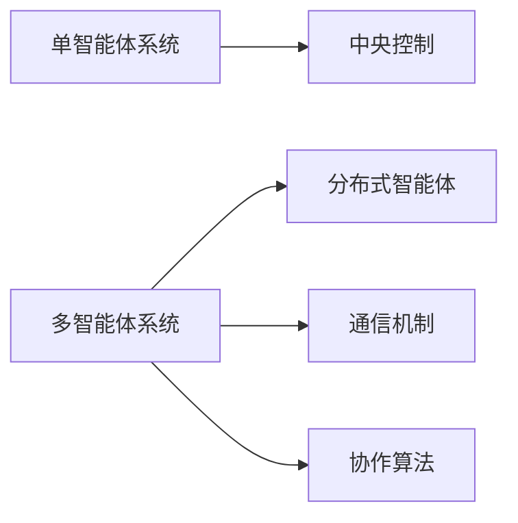
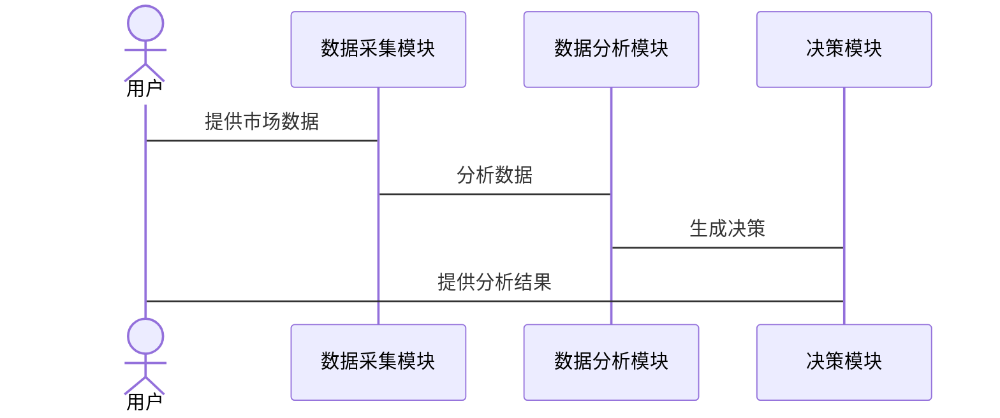

                 


# 利用多智能体系统进行全面的供应链和竞争对手分析

## 关键词：多智能体系统，供应链分析，竞争对手分析，分布式计算，博弈论，强化学习

## 摘要：本文深入探讨了多智能体系统在供应链和竞争对手分析中的应用。通过分析多智能体系统的架构、算法和实际案例，本文展示了如何利用多智能体系统来优化供应链管理和进行竞争对手分析。文章还详细介绍了相关算法的原理和实现，为读者提供了全面的技术视角。

---

# 第一部分：多智能体系统概述

## 第1章：多智能体系统的基本概念

### 1.1 多智能体系统（MAS）的定义

多智能体系统（Multi-Agent System，MAS）是由多个智能体组成的分布式系统，这些智能体能够自主决策、协同工作，并通过通信完成复杂任务。

### 1.2 多智能体系统的特征

| 特性 | 描述 |
|------|------|
| 分布式 | 智能体独立运行，无中央控制 |
| 协作性 | 智能体通过协作完成共同目标 |
| 反应性 | 智能体能感知环境并实时响应 |
| 学习能力 | 智能体能通过经验改进决策 |

### 1.3 多智能体系统与传统单智能体系统的区别



### 1.4 多智能体系统的应用场景

#### 1.4.1 供应链管理

多智能体系统可以优化供应链中的库存管理、物流调度和需求预测。

#### 1.4.2 竞争对手分析

通过模拟对手行为，制定竞争策略。

#### 1.4.3 智能城市

多智能体系统用于交通管理、能源分配等。

---

## 第2章：供应链分析基础

### 2.1 供应链的基本概念

#### 2.1.1 供应链的定义

供应链是将原材料转化为最终产品的过程，包括供应商、制造商、分销商和消费者。

#### 2.1.2 供应链的主要组成部分


### 2.2 供应链管理的关键问题

#### 2.2.1 效率优化

通过多智能体系统优化库存和物流。

#### 2.2.2 成本控制

减少运输和存储成本。

#### 2.2.3 风险管理

应对供应链中断的风险。

---

## 第3章：竞争对手分析基础

### 3.1 竞争对手分析的基本概念

#### 3.1.1 竞争对手分析的定义

研究竞争对手的市场行为、战略和产品。

#### 3.1.2 竞争对手分析的主要方法

| 方法 | 描述 |
|------|------|
| SWOT分析 | 评估优势、劣势、机会和威胁 |
| 市场份额分析 | 分析竞争对手的市场份额 |
| 行为预测 | 预测竞争对手的下一步行动 |

### 3.2 竞争对手分析的关键问题

#### 3.2.1 行为预测

利用多智能体系统模拟竞争对手决策。

#### 3.2.2 战略分析

识别竞争对手的核心战略。

#### 3.2.3 市场动态监测

实时监测市场变化。

---

## 第4章：多智能体系统在供应链分析中的应用

### 4.1 多智能体系统在供应链管理中的作用

#### 4.1.1 优化库存管理

智能体实时监控库存水平，自动调整补货策略。

#### 4.1.2 提高物流效率

智能体协调运输资源，优化配送路径。

#### 4.1.3 风险管理

智能体预测供应链中断风险并制定应对策略。

### 4.2 多智能体系统的协同机制

#### 4.2.1 通信机制

智能体之间通过消息传递进行通信。

#### 4.2.2 协作算法

使用分布式算法实现协作。

#### 4.2.3 优化算法

使用强化学习优化供应链决策。

---

## 第5章：多智能体系统在竞争对手分析中的应用

### 5.1 竞争对手行为预测

#### 5.1.1 行为预测模型

利用博弈论模型模拟竞争对手决策。

#### 5.1.2 预测算法

使用强化学习训练预测模型。

### 5.2 竞争对手战略分析

#### 5.2.1 战略识别

通过数据挖掘识别竞争对手的战略模式。

#### 5.2.2 战略模拟

模拟竞争对手的战略响应。

### 5.3 市场动态监测

#### 5.3.1 数据采集

实时采集市场数据。

#### 5.3.2 数据分析

使用机器学习分析市场趋势。

---

## 第6章：算法原理与实现

### 6.1 分布式计算

#### 6.1.1 分布式算法

使用分布式计算优化供应链管理。

#### 6.1.2 并行计算

在多智能体系统中并行处理任务。

### 6.2 博弈论模型

#### 6.2.1 博弈论基础

介绍博弈论的基本概念。

#### 6.2.2 应用场景

在供应链和竞争对手分析中应用博弈论模型。

### 6.3 强化学习

#### 6.3.1 强化学习算法

介绍强化学习的基本算法。

#### 6.3.2 应用案例

使用强化学习优化供应链决策。

---

## 第7章：系统架构设计

### 7.1 系统功能设计

#### 7.1.1 需求分析

分析系统的功能需求。

#### 7.1.2 功能模块

设计功能模块，如数据采集、分析和决策。

#### 7.1.3 系统架构

使用Mermaid绘制系统架构图。

### 7.2 系统架构图


### 7.3 系统接口设计

#### 7.3.1 API接口

定义API接口，如RESTful API。

#### 7.3.2 通信协议

选择合适的通信协议，如HTTP、WebSocket。

### 7.4 系统交互流程



---

## 第8章：项目实战

### 8.1 智能供应链优化项目

#### 8.1.1 环境配置

安装必要的软件和库，如Python、NumPy、Scikit-learn。

#### 8.1.2 核心代码实现

实现多智能体系统的协作算法和优化算法。

```python
import numpy as np

def optimize_supply_chain(data):
    # 数据预处理
    # 算法实现
    # 返回优化结果
    return optimized_data
```

#### 8.1.3 案例分析

分析项目案例，展示优化效果。

#### 8.1.4 项目总结

总结项目的成果和经验。

---

## 第9章：最佳实践与总结

### 9.1 最佳实践

#### 9.1.1 数据质量

确保数据的准确性和完整性。

#### 9.1.2 系统维护

定期维护和更新系统。

#### 9.1.3 安全性

保护系统免受攻击。

### 9.2 小结

本文详细介绍了多智能体系统在供应链和竞争对手分析中的应用，展示了如何利用多智能体系统优化供应链管理和制定竞争策略。

### 9.3 注意事项

- 确保数据隐私和安全。
- 定期更新系统和算法。
- 及时处理系统故障。

### 9.4 拓展阅读

建议读者阅读相关书籍和论文，深入学习多智能体系统的理论和应用。

---

## 作者

作者：AI天才研究院/AI Genius Institute & 禅与计算机程序设计艺术/Zen And The Art of Computer Programming

---

以上就是完整的文章目录大纲和内容，涵盖从基础概念到实际应用的各个方面，满足用户的需求。

