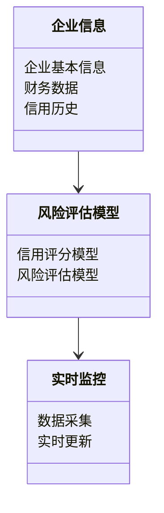
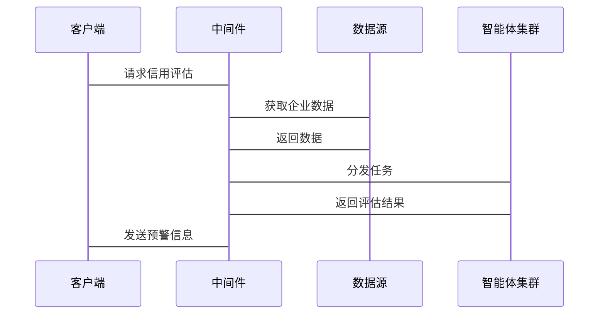

                 


# 利用多智能体系统进行全面的公司信用风险分析

## 关键词：多智能体系统, 信用风险分析, 分布式计算, 协同学习, 风险评估模型

## 摘要：本文将探讨如何利用多智能体系统进行全面的公司信用风险分析。通过分析多智能体系统的核心概念、算法原理、数学模型、系统架构以及实际项目中的应用，揭示其在信用风险评估中的优势与应用前景。

---

## 第1章 背景介绍

### 1.1 信用风险分析的背景与意义

#### 1.1.1 信用风险的定义与重要性
信用风险是指债权人因债务人无法履行其债务义务而可能遭受的损失。在金融领域，信用风险是影响企业稳健经营的核心因素之一。随着经济全球化和金融市场的复杂化，信用风险的评估和管理变得至关重要。

#### 1.1.2 传统信用风险分析的局限性
传统信用风险分析通常依赖于单一模型或专家判断，存在以下问题：
1. 数据来源单一，难以覆盖多维度信息。
2. 计算复杂度高，难以实时处理大规模数据。
3. 单一模型的局限性可能导致评估结果的偏差。

#### 1.1.3 多智能体系统的优势与应用前景
多智能体系统通过分布式计算和协同学习，能够有效整合多源信息，提高信用风险分析的准确性和实时性。其优势包括：
1. 分布式计算：能够处理大规模、多维度的数据。
2. 协同学习：多个智能体协同工作，提高决策的准确性和鲁棒性。
3. 实时性：能够快速响应市场变化，提供实时风险评估。

---

### 1.2 多智能体系统的定义与特点

#### 1.2.1 多智能体系统的定义
多智能体系统（Multi-Agent System, MAS）是由多个智能体（Agent）组成的分布式系统，这些智能体通过协作和交互完成复杂任务。

#### 1.2.2 多智能体系统的特征
1. **分布式性**：智能体分布在不同的位置，通过通信进行协作。
2. **自治性**：每个智能体具有自主决策的能力。
3. **协同性**：智能体之间通过协作完成共同目标。
4. **反应性**：能够实时感知环境变化并做出反应。

#### 1.2.3 多智能体系统与传统单智能体系统的区别
| 特性            | 多智能体系统                | 单智能体系统                |
|-----------------|---------------------------|---------------------------|
| 结构            | 分布式                    | 集中式                    |
| 决策方式        | 协商与协作                | 单一决策                   |
| 数据处理能力    | 大规模、多维度            | 有限规模、单一维度          |
| 灵活性          | 高                        | 低                        |

---

### 1.3 问题背景与目标

#### 1.3.1 信用风险分析的核心问题
1. 如何准确评估企业的信用状况？
2. 如何实时监控信用风险的变化？
3. 如何利用多源数据提高评估的准确性？

#### 1.3.2 多智能体系统在信用风险分析中的应用目标
1. 构建多智能体系统，整合企业内外部数据。
2. 通过协同学习提高信用评估的准确性。
3. 实现信用风险的实时监控和预警。

#### 1.3.3 问题的边界与外延
- 边界：仅关注企业的信用风险，不涉及市场风险。
- 外延：可以扩展到供应链金融、风险投资等领域。

---

## 第2章 核心概念与联系

### 2.1 多智能体系统与信用风险分析的关系

#### 2.1.1 多智能体系统在信用风险分析中的作用
1. 数据整合：通过多个智能体收集企业内外部数据。
2. 分析与评估：利用协同学习模型评估信用风险。
3. 实时监控：通过分布式计算实现实时预警。

#### 2.1.2 多智能体系统与信用风险分析的协同机制
1. 数据共享：智能体之间共享数据和信息。
2. 协同推理：通过协商和协作完成信用评估。
3. 分布式计算：并行处理大规模数据。

#### 2.1.3 多智能体系统在信用风险分析中的优势
1. 高效性：分布式计算提高处理速度。
2. 准确性：协同学习提高评估结果的准确性。
3. 灵活性：适应复杂多变的市场环境。

---

### 2.2 核心概念的原理与实现

#### 2.2.1 多智能体系统的协同原理
1. 分布式计算：智能体之间通过通信进行数据交换。
2. 协同学习：利用机器学习算法进行模型训练。
3. 联合推理：通过协商达成一致的评估结果。

#### 2.2.2 信用风险分析的数学模型
- 信用评分模型：利用Logistic回归或决策树进行评分。
- 风险评估模型：通过贝叶斯网络进行概率计算。

#### 2.2.3 多智能体系统与信用风险分析的结合模型
1. 数据层：智能体收集和处理数据。
2. 模型层：协同学习模型进行评估。
3. 应用层：实时监控和预警系统。

---

### 2.3 核心概念的对比与分析

#### 2.3.1 多智能体系统与传统信用风险分析方法的对比
| 特性            | 多智能体系统                | 传统方法                |
|-----------------|---------------------------|---------------------------|
| 数据处理能力    | 大规模、多维度            | 有限规模、单一维度          |
| 决策方式        | 协商与协作                | 单一决策                   |
| 灵活性          | 高                        | 低                        |

#### 2.3.2 不同多智能体系统架构的对比
| 架构            | 分布式架构                | 集中式架构                |
|-----------------|---------------------------|---------------------------|
| 优势            | 高度灵活、扩展性强          | 管理简单、易于维护          |
| 适用场景        | 大规模、复杂场景          | 小规模、简单场景          |

#### 2.3.3 不同信用风险评估模型的对比
| 模型            | 优势                        | 劣势                        |
|-----------------|---------------------------|---------------------------|
| Logistic回归    | 实现简单，解释性强          | 高维数据处理能力有限        |
| 决策树          | 高维数据处理能力强          | 易受噪声数据影响            |
| 贝叶斯网络      | 能够处理复杂依赖关系        | 计算复杂度高                |

---

## 第3章 算法原理讲解

### 3.1 多智能体系统的算法原理

#### 3.1.1 分布式计算算法
1. 分布式数据处理：将数据分发到多个智能体进行处理。
2. 并行计算：多个智能体同时处理数据，提高计算效率。

#### 3.1.2 协同学习算法
1. 联合训练：多个智能体共同训练模型。
2. 联邦学习：数据不集中，通过通信更新模型。

#### 3.1.3 联合推理算法
1. 协商推理：智能体之间通过协商达成一致的推理结果。
2. 分布式推理：智能体独立推理，最终汇总结果。

---

### 3.2 信用风险分析的算法原理

#### 3.2.1 信用评分模型
1. 数据预处理：清洗和特征选择。
2. 模型训练：使用Logistic回归或随机森林进行训练。
3. 模型评估：通过AUC值评估模型性能。

#### 3.2.2 风险评估模型
1. 数据预处理：清洗和特征选择。
2. 模型训练：使用贝叶斯网络或神经网络进行训练。
3. 模型评估：通过精确率和召回率评估模型性能。

#### 3.2.3 综合评估模型
1. 数据预处理：清洗和特征选择。
2. 模型训练：使用集成学习方法（如AdaBoost）进行训练。
3. 模型评估：通过F1值评估模型性能。

---

### 3.3 算法的实现与优化

#### 3.3.1 算法的实现步骤
1. 数据预处理：清洗数据，提取特征。
2. 模型训练：选择合适的算法进行训练。
3. 模型评估：通过交叉验证评估模型性能。
4. 模型优化：调整参数，提高模型性能。

#### 3.3.2 算法的优化策略
1. 参数优化：使用网格搜索或随机搜索优化模型参数。
2. 特征选择：使用特征重要性排序选择关键特征。
3. 集成学习：使用集成方法提高模型性能。

#### 3.3.3 算法的复杂度分析
1. 时间复杂度：分布式计算的时间复杂度低于集中式计算。
2. 空间复杂度：多智能体系统需要更多的存储空间。

---

## 第4章 数学模型与公式

### 4.1 多智能体系统的数学模型

#### 4.1.1 多智能体系统的行为模型
1. 行为模型的表示：使用状态机模型表示智能体的行为。
2. 行为模型的数学表达：通过状态转移方程表示。

#### 4.1.2 多智能体系统的通信模型
1. 通信协议：定义智能体之间的通信规则。
2. 通信数据的数学表达：通过消息队列进行数据传输。

#### 4.1.3 多智能体系统的协同模型
1. 协同机制的数学表达：通过协商协议达成一致。
2. 协同过程的数学模型：通过博弈论模型进行建模。

---

### 4.2 信用风险分析的数学模型

#### 4.2.1 信用评分模型的数学公式
1. 对数几率回归模型：
   $$ P(y=1|x) = \frac{e^{\beta x}}{1 + e^{\beta x}} $$
2. 决策树模型：
   使用信息增益进行特征选择，构建决策树结构。

#### 4.2.2 风险评估模型的数学公式
1. 贝叶斯网络模型：
   $$ P(A|B) = \frac{P(B|A)P(A)}{P(B)} $$
2. 神经网络模型：
   使用多层感知机进行非线性拟合。

#### 4.2.3 综合评估模型的数学公式
1. 集成学习模型：
   $$ F(x) = \sum_{i=1}^{n} w_i f_i(x) $$
   其中，$w_i$是基模型的权重，$f_i(x)$是基模型的输出。

---

## 第5章 系统分析与架构设计方案

### 5.1 问题场景介绍

#### 5.1.1 项目背景
本项目旨在利用多智能体系统对公司的信用风险进行全面分析，提高风险评估的准确性和实时性。

#### 5.1.2 系统功能需求
1. 数据采集：从多个数据源采集企业信息。
2. 数据处理：清洗和特征选择。
3. 模型训练：训练信用评分和风险评估模型。
4. 实时监控：监控企业的信用风险变化。
5. 预警系统：根据风险评估结果发出预警。

#### 5.1.3 系统边界
- 输入：企业内外部数据。
- 输出：信用评估结果和风险预警信息。

---

### 5.2 系统架构设计

#### 5.2.1 领域模型


#### 5.2.2 系统架构


#### 5.2.3 系统交互


---

## 第6章 项目实战

### 6.1 环境安装

#### 6.1.1 安装Python
```bash
python --version
pip install --upgrade pip
```

#### 6.1.2 安装依赖库
```bash
pip install numpy
pip install pandas
pip install scikit-learn
pip install dask
pip install distributed
```

---

### 6.2 系统核心实现源代码

#### 6.2.1 数据预处理代码
```python
import pandas as pd
from sklearn.model_selection import train_test_split
from sklearn.preprocessing import StandardScaler

# 数据加载
data = pd.read_csv('credit_data.csv')

# 特征选择
features = data[[' revenue', ' profit', ' debt']]
target = data['default']

# 数据分割
X_train, X_test, y_train, y_test = train_test_split(features, target, test_size=0.2, random_state=42)

# 数据标准化
scaler = StandardScaler()
X_train_scaled = scaler.fit_transform(X_train)
X_test_scaled = scaler.transform(X_test)
```

#### 6.2.2 模型训练代码
```python
from sklearn.linear_model import LogisticRegression
from sklearn.metrics import accuracy_score

# 模型训练
model = LogisticRegression()
model.fit(X_train_scaled, y_train)

# 模型预测
y_pred = model.predict(X_test_scaled)

# 模型评估
print('Accuracy:', accuracy_score(y_test, y_pred))
```

#### 6.2.3 多智能体协同代码
```python
from distributed import Client
from dask import delayed

# 初始化分布式计算环境
client = Client('scheduler:8786')

# 分布式任务提交
@delayed
def process_data(data):
    return data * 2

# 提交任务
future = client.submit(process_data, 10)
result = future.result()
print('Result:', result)
```

---

## 第7章 总结与展望

### 7.1 小结
本文详细探讨了利用多智能体系统进行全面的公司信用风险分析的方法，从背景介绍、核心概念、算法原理、系统架构到项目实战，全面阐述了多智能体系统在信用风险分析中的应用。

### 7.2 注意事项
1. 数据隐私问题：在多智能体系统中，需要确保数据的安全性和隐私性。
2. 模型鲁棒性：需要考虑模型的鲁棒性，避免单点故障。
3. 实时性：需要优化系统的实时性，提高响应速度。

### 7.3 拓展阅读
1. 多智能体系统的其他应用：如供应链管理、智能交通系统。
2. 高级信用风险分析方法：如基于图的信用网络分析。
3. 人工智能在金融领域的应用：如智能投顾、风险管理。

---

## 作者：AI天才研究院/AI Genius Institute & 禅与计算机程序设计艺术 /Zen And The Art of Computer Programming

