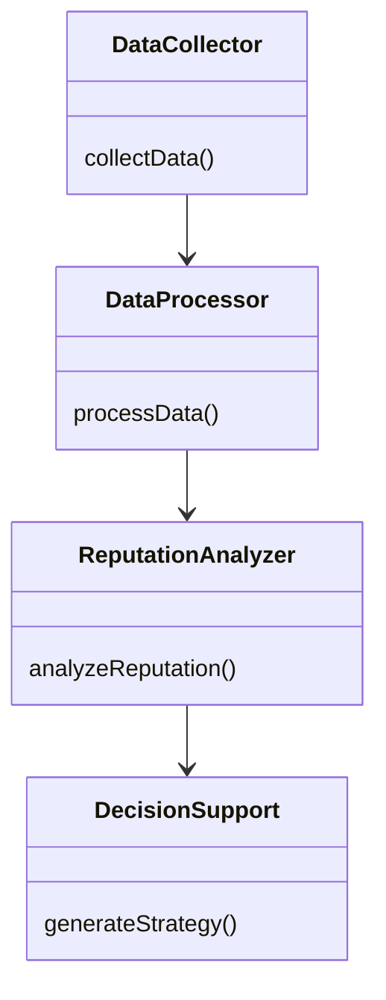
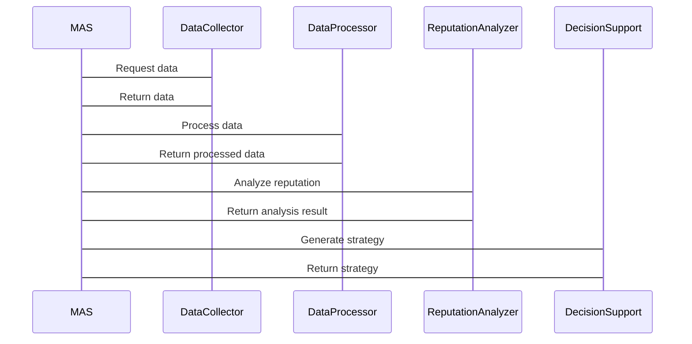

                 


# 利用多智能体系统进行全面的公司声誉风险分析

## 关键词：多智能体系统、声誉风险分析、分布式计算、协同机制、系统架构

## 摘要：本文探讨了如何利用多智能体系统来进行公司声誉风险分析。通过分析多智能体系统的原理和架构，结合声誉风险分析的算法和数学模型，展示了如何在实际项目中应用这些技术。文章详细讲解了系统设计、算法实现和项目实战，并给出了最佳实践和注意事项。

---

# 第1章: 多智能体系统与公司声誉风险分析概述

## 1.1 多智能体系统的定义与特点

### 1.1.1 多智能体系统的定义
多智能体系统（Multi-Agent System, MAS）是由多个智能体（Agent）组成的系统，这些智能体能够通过协同工作完成复杂任务。每个智能体都是一个独立的实体，具有感知环境、自主决策和行动的能力。

### 1.1.2 多智能体系统的核心特点
- **自主性**：智能体能够自主决策和行动。
- **反应性**：能够实时感知环境变化并做出反应。
- **协同性**：多个智能体能够通过通信和协作完成共同目标。
- **分布性**：智能体分布在网络中，能够进行分布式计算。

### 1.1.3 多智能体系统与传统单智能体系统的区别
| 特性 | 单智能体系统 | 多智能体系统 |
|------|--------------|--------------|
| 结构  | 单一中心化   | 分布式       |
| 协作  | 无           | 高度协作     |
| 灵活性 | 低           | 高           |

## 1.2 公司声誉风险分析的定义与重要性

### 1.2.1 公司声誉的定义
公司声誉是公司在市场上的形象和信誉，反映了消费者、投资者和其他利益相关者对公司的好坏评价。

### 1.2.2 声誉风险的定义
声誉风险是指由于公司行为或外部事件导致声誉下降，进而影响公司业务和财务表现的风险。

### 1.2.3 声誉风险分析的重要性
- 帮助公司及时发现和解决潜在声誉问题。
- 提供数据支持，优化公司决策。
- 有助于提升公司形象和市场竞争力。

## 1.3 多智能体系统在声誉风险分析中的应用前景

### 1.3.1 多智能体系统的优势
- **分布式计算**：能够处理大量数据，提高效率。
- **协同工作**：多个智能体可以分工合作，提高分析精度。
- **动态适应**：能够实时响应环境变化。

### 1.3.2 多智能体系统在声誉风险分析中的潜在应用领域
- **实时监控**：实时分析社交媒体和新闻，发现潜在声誉风险。
- **数据融合**：整合多个来源的数据，提供全面的声誉分析。
- **预测分析**：基于历史数据，预测未来声誉变化趋势。

### 1.3.3 多智能体系统应用的挑战与机遇
- **挑战**：通信延迟、数据隐私、协同效率。
- **机遇**：提高分析效率、增强数据准确性、实现实时监控。

---

# 第2章: 多智能体系统的核心概念与联系

## 2.1 多智能体系统的原理与架构

### 2.1.1 多智能体系统的基本原理
多智能体系统通过智能体之间的通信和协作，实现对复杂问题的分布式求解。每个智能体负责特定的任务，并通过共享信息和协同决策来完成整体目标。

### 2.1.2 多智能体系统的协同机制
- **通信**：智能体之间通过消息传递进行信息共享。
- **协商**：智能体通过协商分配任务和资源。
- **协调**：通过一致性协议确保系统整体目标的一致性。

### 2.1.3 多智能体系统的通信协议
- **发布-订阅模式**：智能体发布信息，其他智能体订阅感兴趣的信息。
- **请求-响应模式**：智能体请求数据，提供数据的智能体进行响应。

## 2.2 多智能体系统的架构设计

### 2.2.1 分层架构
将系统划分为多个层次，每个层次负责不同的功能。例如，感知层负责数据采集，计算层负责数据分析，决策层负责制定策略。

### 2.2.2 分布式架构
智能体分布在网络中，每个智能体负责特定的任务，通过通信和协作完成整体目标。

### 2.2.3 集中式架构
有一个中心节点负责协调和管理所有智能体的活动，其他智能体负责执行具体任务。

## 2.3 多智能体系统与声誉风险分析的结合

### 2.3.1 多智能体系统在声誉风险分析中的角色
- **数据采集智能体**：负责从社交媒体、新闻等来源收集声誉相关数据。
- **数据分析智能体**：对收集到的数据进行处理和分析，识别潜在风险。
- **决策智能体**：根据分析结果制定应对策略。

### 2.3.2 多智能体系统的协同如何提升声誉风险分析的效率
- **并行处理**：多个智能体可以同时处理不同类型的数据，提高效率。
- **分布式计算**：通过分布式计算，减少单点故障，提高系统稳定性。

### 2.3.3 多智能体系统的可扩展性与声誉风险分析的需求匹配
- **可扩展性**：多智能体系统可以根据需求灵活扩展，适应数据量的增加。
- **需求匹配**：声誉风险分析需要实时监控和快速响应，多智能体系统的分布式架构能够满足这些需求。

---

# 第3章: 基于多智能体的声誉风险分析算法

## 3.1 声誉风险分析的基本算法

### 3.1.1 基于单智能体的声誉评分算法
```python
def single_agent_reputation_score(data):
    score = 0
    for item in data:
        if item > 0:
            score += item
    return score / len(data)
```

### 3.1.2 基于多智能体的分布式声誉评分算法
```python
def distributed_reputation_score(data, agents):
    scores = []
    for agent in agents:
        agent_score = single_agent_reputation_score(data)
        scores.append(agent_score)
    return sum(scores) / len(scores)
```

## 3.2 多智能体系统的协同算法

### 3.2.1 多智能体协同的基本原理
- **一致性协议**：通过一致性协议确保所有智能体的决策一致。
- **分布式计算**：利用分布式计算技术，将任务分解到多个智能体上进行处理。

### 3.2.2 基于一致性协议的协同算法
```python
def consensus_protocol(agents, data):
    for agent in agents:
        agent.update(data)
    return agent.consensus()
```

### 3.2.3 基于分布式计算的协同算法
```python
def distributed_computation(agents, task):
    results = []
    for agent in agents:
        result = agent.compute(task)
        results.append(result)
    return combine_results(results)
```

## 3.3 声誉风险分析的数学模型

### 3.3.1 基于概率论的声誉评分模型
$$ P(\text{reputation issue}) = \sum_{i=1}^{n} P_i \times R_i $$
其中，\( P_i \) 是第 \( i \) 个事件发生的概率，\( R_i \) 是事件对声誉的影响程度。

### 3.3.2 基于加权评分的声誉分析模型
$$ \text{Reputation Score} = \sum_{i=1}^{m} w_i \times v_i $$
其中，\( w_i \) 是第 \( i \) 个因素的权重，\( v_i \) 是第 \( i \) 个因素的值。

### 3.3.3 基于图论的声誉传播模型
使用图论中的传播模型，分析声誉在社会网络中的传播路径和影响范围。

---

# 第4章: 系统分析与架构设计方案

## 4.1 系统需求分析

### 4.1.1 项目介绍
本项目旨在利用多智能体系统进行公司声誉风险分析，通过实时监控社交媒体和新闻，识别潜在声誉风险，并提供应对策略。

### 4.1.2 系统功能设计
- **数据采集**：从社交媒体、新闻网站等来源收集声誉相关数据。
- **数据处理**：对收集到的数据进行清洗、转换和存储。
- **声誉分析**：利用多智能体系统对数据进行分析，识别潜在风险。
- **决策支持**：根据分析结果，提供应对策略和建议。

## 4.2 系统架构设计

### 4.2.1 领域模型（Mermaid 类图）


### 4.2.2 系统架构图（Mermaid 架构图）
```mermaid
aws
  provider "Multi-Agent System" as MAS
  provider "Data Sources" as DS
  provider "Reputation Database" as RD
  provider "Decision Support" as DSU
  MAS --> DS: Collect data
  MAS --> RD: Store data
  MAS --> DSU: Generate strategy
```

### 4.2.3 系统接口设计
- **数据采集接口**：用于从数据源获取声誉相关数据。
- **数据分析接口**：用于对数据进行处理和分析。
- **决策支持接口**：用于根据分析结果生成应对策略。

### 4.2.4 系统交互流程图（Mermaid 序列图）


---

# 第5章: 项目实战

## 5.1 环境安装

### 5.1.1 安装Python和相关库
```bash
pip install numpy pandas scikit-learn
```

## 5.2 系统核心实现源代码

### 5.2.1 数据采集智能体
```python
class DataCollector:
    def collect_data(self, source):
        # 从指定数据源获取数据
        pass
```

### 5.2.2 数据处理智能体
```python
class DataProcessor:
    def process_data(self, data):
        # 对数据进行清洗和转换
        pass
```

### 5.2.3 声誉分析智能体
```python
class ReputationAnalyzer:
    def analyze_reputation(self, data):
        # 基于数学模型进行声誉分析
        pass
```

### 5.2.4 决策支持智能体
```python
class DecisionSupport:
    def generate_strategy(self, analysis_result):
        # 根据分析结果生成应对策略
        pass
```

## 5.3 实际案例分析

### 5.3.1 案例背景
某公司发现社交媒体上出现大量负面评论，需要快速分析并制定应对策略。

### 5.3.2 数据采集
从社交媒体和新闻网站收集相关数据。

### 5.3.3 数据处理
对数据进行清洗和转换，提取关键信息。

### 5.3.4 声誉分析
利用多智能体系统分析数据，识别潜在风险。

### 5.3.5 决策支持
根据分析结果，生成应对策略，例如发布澄清声明、采取公关活动等。

## 5.4 项目小结
通过项目实战，验证了多智能体系统在声誉风险分析中的有效性，能够快速响应和处理潜在风险。

---

# 第6章: 最佳实践与总结

## 6.1 最佳实践 tips
- **数据隐私**：确保数据采集和处理过程中的隐私保护。
- **系统可扩展性**：设计灵活的架构，方便后续扩展。
- **智能体协同**：选择合适的协同机制，确保系统高效运行。

## 6.2 小结
本文详细介绍了多智能体系统在公司声誉风险分析中的应用，从系统原理到实际案例，全面展示了如何利用多智能体系统进行有效的声誉管理。

## 6.3 注意事项
- **数据质量**：确保数据的准确性和完整性。
- **系统稳定性**：避免因智能体协同问题导致系统崩溃。
- **实时性**：保证系统的实时响应能力。

## 6.4 拓展阅读
- **推荐书籍**：《Multi-Agent Systems: Algorithmic, Complexity, and Synthesis》
- **推荐文章**：《Distributed Computing and Its Applications to Problem Solving》

---

# 作者：AI天才研究院/AI Genius Institute & 禅与计算机程序设计艺术 /Zen And The Art of Computer Programming

---

通过以上结构，文章详细讲解了多智能体系统在公司声誉风险分析中的应用，从理论到实践，全面覆盖了相关知识点。

