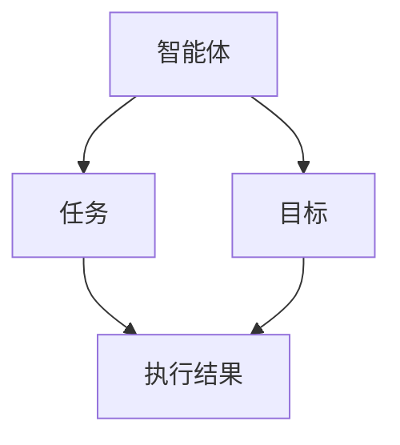
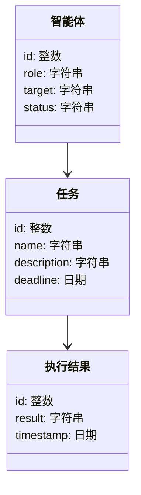
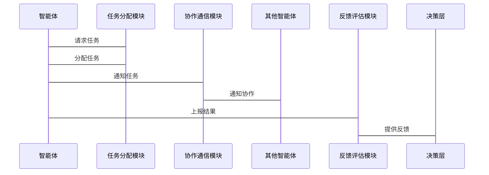

                 


# 利用多智能体系统进行全面的公司战略执行力分析

> 关键词：多智能体系统，战略执行力分析，分布式计算，共识算法，系统架构设计，战略分解

> 摘要：本文将探讨如何利用多智能体系统（Multi-Agent System，MAS）对公司战略执行力进行全面分析。通过介绍多智能体系统的核心概念、算法原理、系统架构设计以及实际应用案例，本文旨在揭示多智能体系统在公司战略执行分析中的独特优势和应用前景。结合理论与实践，本文将详细分析多智能体系统如何帮助公司实现战略目标，优化执行效率，并提供可操作的实施建议。

---

# 第1章: 多智能体系统与公司战略执行力分析概述

## 1.1 多智能体系统的定义与特点

### 1.1.1 多智能体系统的定义
多智能体系统（Multi-Agent System，MAS）是由多个智能体（Agent）组成的分布式系统。每个智能体都是具有自主性、反应性、目标导向和协作能力的实体。智能体可以是软件程序、算法或物理设备，能够感知环境、自主决策并与其他智能体协作完成复杂任务。

### 1.1.2 多智能体系统的核心特点
1. **自主性**：智能体能够自主决策，无需外部干预。
2. **反应性**：智能体能够感知环境变化并实时调整行为。
3. **目标导向**：智能体的行为以实现特定目标为导向。
4. **协作性**：多个智能体能够通过通信和协作完成复杂任务。

### 1.1.3 多智能体系统与传统单智能体系统的区别
| 特性       | 单智能体系统               | 多智能体系统               |
|------------|---------------------------|---------------------------|
| 系统结构   | 中央化，单一决策中心       | 分布式，多个决策中心       |
| 任务分配   | 单一任务，集中处理         | 多任务，分布式处理         |
| 可扩展性   | 有限，难以扩展             | 高，支持大规模扩展         |
| 协作能力   | 无，单一决策               | 有，多智能体协作完成任务   |

---

## 1.2 公司战略执行力分析的背景与意义

### 1.2.1 战略执行力的定义
战略执行力是指公司将其制定的战略目标转化为具体行动并实现目标的能力。它涵盖了战略分解、任务分配、资源配置、过程监控和结果评估等多个方面。

### 1.2.2 战略执行力分析的重要性
1. **提高执行效率**：通过分析战略执行过程中的问题，优化资源配置和任务分配。
2. **增强协作能力**：通过分析部门间协作的效率，提升整体执行力。
3. **实时监控与调整**：通过动态分析，及时发现并解决执行过程中的问题。

### 1.2.3 多智能体系统在战略执行力分析中的优势
1. **分布式计算能力**：多智能体系统能够将复杂任务分解为多个子任务，通过分布式计算提高效率。
2. **动态协作能力**：智能体能够实时通信和协作，适应执行过程中的变化。
3. **数据驱动决策**：通过智能体的感知和反馈，提供实时数据支持决策。

---

## 1.3 多智能体系统在公司战略执行力分析中的应用前景

### 1.3.1 多智能体系统的潜在应用场景
1. **战略分解与任务分配**：将公司战略目标分解为多个子目标，并分配给不同的智能体执行。
2. **任务监控与反馈**：通过智能体实时监控任务执行情况，并向决策层反馈数据。
3. **动态调整与优化**：根据执行过程中的反馈，动态调整任务分配和资源分配。

### 1.3.2 企业采用多智能体系统的优势
1. **提高执行效率**：通过分布式计算和协作，减少单点依赖，提高执行效率。
2. **增强灵活性**：智能体能够快速响应变化，适应复杂的执行环境。
3. **数据驱动的决策**：通过智能体的反馈，提供实时数据支持决策。

### 1.3.3 多智能体系统应用的挑战与机遇
1. **技术挑战**：多智能体系统的实现需要复杂的算法和通信机制，技术门槛较高。
2. **协作挑战**：智能体之间的协作需要高效的通信和协调机制。
3. **机遇**：随着人工智能和分布式技术的发展，多智能体系统在公司战略执行中的应用前景广阔。

---

## 1.4 本章小结

本章介绍了多智能体系统的核心概念、特点以及在公司战略执行力分析中的应用前景。通过对比多智能体系统与传统单智能体系统的区别，我们明确了多智能体系统在战略执行力分析中的独特优势。接下来，我们将深入探讨多智能体系统的核心概念与联系，为后续的分析奠定基础。

---

# 第2章: 多智能体系统的核心概念与联系

## 2.1 多智能体系统的原理

### 2.1.1 智能体的定义与分类
智能体（Agent）是具有自主性、反应性和目标导向的实体。根据智能体的智能水平和复杂程度，可以将其分为以下几类：
1. **简单反射型智能体**：基于简单的规则做出反应。
2. **基于模型的反射型智能体**：利用内部模型进行决策。
3. **目标导向型智能体**：以实现特定目标为导向。
4. **实用导向型智能体**：以最大化效用函数为目标。

### 2.1.2 智能体的通信机制
智能体之间的通信是多智能体系统的核心之一。通信机制包括以下几种：
1. **直接通信**：智能体之间直接交换信息。
2. **间接通信**：通过中间媒介传递信息。
3. **发布-订阅模型**：智能体发布信息，其他智能体订阅信息。

### 2.1.3 智能体的协作机制
智能体的协作机制包括以下几种：
1. **基于规则的协作**：根据预定义规则进行协作。
2. **基于协商的协作**：智能体通过协商达成一致。
3. **基于市场的协作**：智能体在虚拟市场上进行资源分配和任务协作。

---

## 2.2 多智能体系统与公司战略执行力的联系

### 2.2.1 战略分解与智能体任务分配
公司战略目标可以分解为多个子目标，每个子目标由一个或多个智能体负责。例如，销售目标可以分解为市场推广、客户维护和销售团队管理三个子目标。

### 2.2.2 智能体协作与战略执行的动态调整
在战略执行过程中，智能体需要实时协作，动态调整任务分配和资源分配。例如，当市场环境发生变化时，智能体需要快速调整市场推广策略。

### 2.2.3 智能体反馈与战略执行效果评估
智能体通过反馈机制向决策层汇报执行结果，帮助评估战略执行效果。例如，智能体可以汇报销售数据、市场反馈和客户满意度等。

---

## 2.3 多智能体系统的ER实体关系图



---

## 2.4 本章小结

本章详细介绍了多智能体系统的核心概念与原理，并探讨了其与公司战略执行力的联系。通过ER实体关系图，我们明确了智能体、任务、目标和执行结果之间的关系。接下来，我们将深入探讨多智能体系统的算法原理，为实现战略执行力分析提供理论支持。

---

# 第3章: 多智能体系统的算法原理

## 3.1 分布式计算与多智能体协作算法

### 3.1.1 分布式计算的基本原理
分布式计算是指将任务分解为多个子任务，通过多台计算机协作完成任务。分布式计算的核心是任务分解、通信与同步。

### 3.1.2 多智能体协作算法的实现
多智能体协作算法是分布式计算的核心。以下是其实现步骤：
1. **任务分解**：将战略目标分解为多个子任务。
2. **任务分配**：将子任务分配给不同的智能体。
3. **协作通信**：智能体之间通过通信机制交换信息。
4. **动态调整**：根据反馈动态调整任务分配和资源分配。

### 3.1.3 分布式计算在战略执行中的应用
以下是分布式计算在战略执行中的应用场景：
1. **销售目标分解**：将销售目标分解为市场推广、客户维护和销售团队管理。
2. **任务分配**：将子任务分配给不同的智能体。
3. **协作通信**：智能体之间实时通信，确保任务顺利进行。

---

## 3.2 多智能体系统中的共识算法

### 3.2.1 共识算法的定义与作用
共识算法是指多个智能体通过协商达成一致的算法。其作用是确保智能体之间达成共识，避免冲突。

### 3.2.2 常见共识算法的实现
以下是常见的共识算法：
1. **PBFT（ Practical Byzantine Fault Tolerance）**：适用于异步网络的共识算法。
2. **RAFT**：适用于分布式系统的共识算法。
3. **POW（Proof of Work）**：比特币等区块链系统中使用的共识算法。

### 3.2.3 共识算法在战略执行中的应用
以下是共识算法在战略执行中的应用场景：
1. **任务分配**：通过共识算法达成任务分配的共识。
2. **资源分配**：通过共识算法达成资源分配的共识。
3. **决策制定**：通过共识算法达成战略决策的共识。

---

## 3.3 多智能体系统的数学模型与公式

### 3.3.1 分布式计算的数学模型
以下是分布式计算的数学模型：
$$f(x) = \sum_{i=1}^{n} f_i(x_i)$$
其中，$f_i(x_i)$ 表示第$i$个智能体的任务函数，$x_i$ 表示第$i$个智能体的输入。

### 3.3.2 共识算法的数学模型
以下是共识算法的数学模型：
$$C = \arg\max_{c} \sum_{i=1}^{n} w_i c_i$$
其中，$w_i$ 表示第$i$个智能体的权重，$c_i$ 表示第$i$个智能体的决策。

---

## 3.4 本章小结

本章详细介绍了多智能体系统的算法原理，包括分布式计算和共识算法。通过数学模型和公式，我们明确了多智能体系统在战略执行力分析中的实现方法。接下来，我们将探讨多智能体系统的系统架构设计，为实现战略执行力分析提供技术支持。

---

# 第4章: 多智能体系统的系统架构设计

## 4.1 系统功能设计

### 4.1.1 领域模型设计
以下是领域模型设计的Mermaid类图：



### 4.1.2 系统架构设计
以下是系统架构设计的Mermaid架构图：


### 4.1.3 系统接口设计
以下是系统接口设计的Mermaid序列图：



---

## 4.2 系统实现与优化

### 4.2.1 系统实现的关键技术
1. **分布式计算技术**：利用分布式计算技术实现任务分解和资源分配。
2. **共识算法实现**：通过共识算法确保任务分配和资源分配的公平性。
3. **智能体通信机制**：通过智能体通信机制实现实时协作。

### 4.2.2 系统优化建议
1. **提高通信效率**：优化智能体之间的通信机制，减少通信延迟。
2. **增强协作能力**：改进智能体的协作算法，提高协作效率。
3. **动态调整机制**：根据执行情况动态调整任务分配和资源分配。

---

## 4.3 本章小结

本章详细介绍了多智能体系统的系统架构设计，包括领域模型设计、系统架构设计和系统接口设计。通过优化建议，我们明确了实现战略执行力分析系统的优化方向。接下来，我们将探讨多智能体系统的项目实战，为实际应用提供参考。

---

# 第5章: 多智能体系统的项目实战

## 5.1 项目背景与目标

### 5.1.1 项目背景
我们选择一个中型制造企业作为案例，分析其战略执行力问题。

### 5.1.2 项目目标
1. **提高执行效率**：通过多智能体系统优化任务分配和资源分配。
2. **增强协作能力**：通过智能体协作提高部门间协作效率。
3. **实时监控与调整**：通过智能体反馈实时监控执行情况并动态调整。

---

## 5.2 系统核心代码实现

### 5.2.1 环境搭建
以下是环境搭建步骤：
1. **安装Python**：安装Python 3.8及以上版本。
2. **安装依赖库**：安装`networkx`和`numpy`库。
3. **配置开发环境**：配置PyCharm或Jupyter Notebook。

### 5.2.2 核心代码实现
以下是核心代码实现：

```python
import networkx as nx
import numpy as np

class Agent:
    def __init__(self, id, role):
        self.id = id
        self.role = role
        self.target = None
        self.status = 'idle'
    
    def assign_task(self, task):
        self.target = task
        self.status = 'busy'
    
    def complete_task(self):
        self.status = 'idle'
        return f"Task {self.target} completed by Agent {self.id}"

class Task:
    def __init__(self, id, name, description, deadline):
        self.id = id
        self.name = name
        self.description = description
        self.deadline = deadline
        self.agent = None

def main():
    # 初始化智能体
    agents = [Agent(1, '销售'), Agent(2, '市场'), Agent(3, '客户')]
    
    # 初始化任务
    tasks = [
        Task(1, '市场推广', '推广新产品的市场活动', '2023-12-31'),
        Task(2, '客户维护', '维护现有客户关系', '2023-12-31'),
        Task(3, '销售目标', '完成年度销售目标', '2023-12-31')
    ]
    
    # 任务分配
    for i in range(len(tasks)):
        agents[i].assign_task(tasks[i])
    
    # 任务执行
    for agent in agents:
        if agent.status == 'busy':
            print(agent.complete_task())

if __name__ == '__main__':
    main()
```

---

## 5.3 代码功能解读与分析

### 5.3.1 代码功能解读
1. **智能体类（Agent）**：定义智能体的属性和方法，包括任务分配和任务完成。
2. **任务类（Task）**：定义任务的属性，包括任务ID、名称、描述和截止日期。
3. **主函数（main）**：初始化智能体和任务，完成任务分配和任务执行。

### 5.3.2 代码实现分析
1. **任务分配**：通过循环将任务分配给不同的智能体。
2. **任务执行**：通过循环完成任务执行，并输出任务完成结果。

---

## 5.4 实际案例分析与详细讲解

### 5.4.1 案例分析
以中型制造企业的战略执行分析为例，我们通过多智能体系统优化其销售目标的执行过程。

### 5.4.2 详细讲解
1. **战略分解**：将销售目标分解为市场推广、客户维护和销售团队管理三个子目标。
2. **任务分配**：将子目标分配给不同的智能体。
3. **协作通信**：智能体之间通过通信机制实时协作。
4. **动态调整**：根据反馈动态调整任务分配和资源分配。

---

## 5.5 本章小结

本章通过实际案例分析，详细讲解了多智能体系统的项目实战。通过代码实现和功能解读，我们明确了多智能体系统在战略执行力分析中的实际应用。接下来，我们将总结本书的核心内容，并展望未来的发展方向。

---

# 第6章: 总结与展望

## 6.1 本书总结
通过本书的讲解，我们深入探讨了多智能体系统在公司战略执行力分析中的应用。从理论到实践，我们详细介绍了多智能体系统的核心概念、算法原理、系统架构设计和项目实战。

## 6.2 未来展望
随着人工智能和分布式技术的不断发展，多智能体系统在公司战略执行力分析中的应用前景广阔。未来的研究方向包括：
1. **智能体协作算法的优化**：进一步优化共识算法和协作机制。
2. **智能体通信机制的改进**：提高智能体之间的通信效率。
3. **智能体决策模型的创新**：探索更智能的决策模型。

## 6.3 最佳实践 Tips
1. **注重智能体协作算法的选择**：根据实际需求选择合适的共识算法。
2. **优化智能体通信机制**：减少通信延迟，提高协作效率。
3. **动态调整任务分配**：根据反馈动态调整任务分配和资源分配。

---

# 作者：AI天才研究院/AI Genius Institute & 禅与计算机程序设计艺术/Zen And The Art of Computer Programming

---

通过以上章节内容，我们系统地介绍了多智能体系统在公司战略执行力分析中的应用。从理论到实践，从基础到高级，本书为读者提供了全面的指导。希望本书能够帮助读者更好地理解多智能体系统的核心概念，并将其应用于实际工作中。

