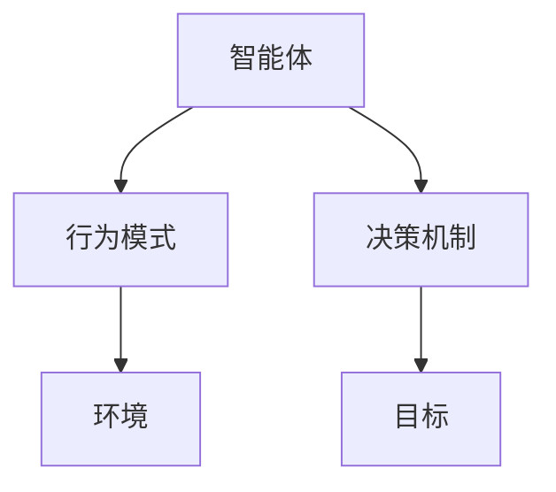
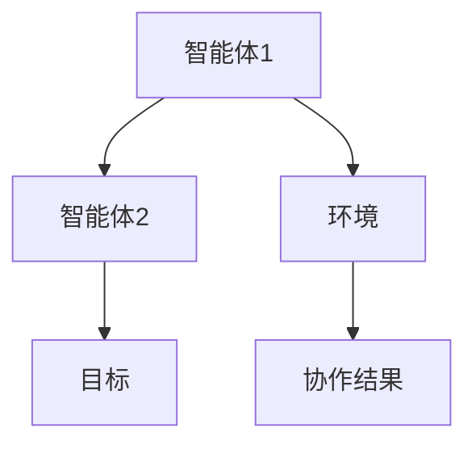
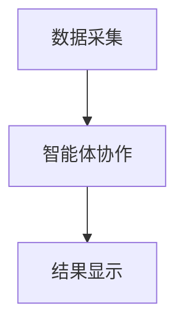
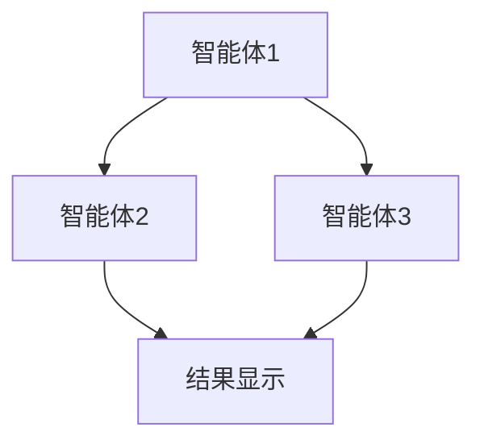
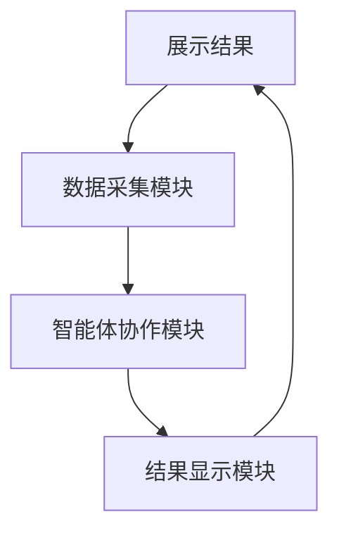

                 


# 利用多智能体系统进行全面的公司文化和价值观分析

## 关键词：多智能体系统、公司文化、价值观分析、组织行为学、AI技术

## 摘要：  
随着企业规模的不断扩大和组织结构的复杂化，传统的公司文化与价值观分析方法逐渐暴露出其局限性。本文将介绍如何利用多智能体系统（MAS, Multi-Agent Systems）这一前沿技术，通过智能体之间的协作与交互，全面、动态地分析公司文化和价值观。本文将从多智能体系统的背景、核心概念、算法原理、系统架构设计到实际项目实现，逐步展开分析，帮助读者深入了解多智能体系统在公司文化分析中的应用。

---

## 第一部分：多智能体系统与公司文化分析的背景介绍

### 第1章：多智能体系统概述

#### 1.1 多智能体系统的基本概念

##### 1.1.1 多智能体系统的定义
多智能体系统（MAS）是由多个智能体（Agent）组成的分布式系统，这些智能体通过通信和协作完成复杂任务。智能体是具有感知环境、做出决策、执行动作能力的实体。

##### 1.1.2 多智能体系统的特点
- **分布性**：智能体分布在不同的位置，独立运行。
- **协作性**：智能体之间通过通信和协作完成共同目标。
- **自主性**：智能体能够自主决策，无需外部干预。
- **反应性**：智能体能够根据环境变化调整行为。
- **多样性**：智能体可以有不同的目标、能力和行为模式。

##### 1.1.3 多智能体系统的分类
- **基于规则的智能体**：根据预定义的规则执行动作。
- **基于模型的智能体**：通过内部模型推理和决策。
- **反应式智能体**：实时感知环境并做出反应。
- **混合智能体**：结合规则和模型的智能体。

#### 1.2 多智能体系统在公司文化分析中的应用背景

##### 1.2.1 公司文化与价值观的定义
公司文化是指企业在经营活动中形成的价值观、行为准则和组织氛围。价值观是企业对目标、意义和重要性的判断标准。

##### 1.2.2 传统公司文化分析的局限性
- **主观性**：传统分析依赖主观判断，缺乏客观性。
- **片面性**：难以全面覆盖组织的各个层面。
- **动态性**：公司文化会随着环境变化而变化，传统方法难以动态更新。

##### 1.2.3 多智能体系统的优势
- **全面性**：多个智能体可以分别分析不同维度的文化特征。
- **动态性**：智能体能够实时感知环境变化，动态调整分析结果。
- **协作性**：智能体之间可以协作，提供更全面的分析结果。

#### 1.3 本章小结
本章介绍了多智能体系统的基本概念和特点，并分析了其在公司文化分析中的应用背景及其优势。

---

## 第二部分：多智能体系统的核心概念与联系

### 第2章：多智能体系统的原理与核心要素

#### 2.1 多智能体系统的原理

##### 2.1.1 智能体的定义与特征
智能体是具有感知、决策和执行能力的实体。其特征包括自主性、反应性、目标导向性和协作性。

##### 2.1.2 多智能体系统的通信机制
智能体之间的通信是通过共享语言和协议进行的，常见的通信方式包括发布-订阅模式和请求-响应模式。

##### 2.1.3 多智能体系统的协作机制
协作机制包括任务分配、协调和冲突解决。智能体通过协商和合作完成共同目标。

#### 2.2 多智能体系统的核心要素

##### 2.2.1 智能体的类型
- **简单反射型智能体**：基于当前输入做出反应。
- **基于模型的反射型智能体**：通过内部模型推理和决策。
- **目标驱动型智能体**：为实现特定目标而行动。
- **效用驱动型智能体**：根据效用函数做出决策。

##### 2.2.2 智能体的行为模式
- **反应式行为**：基于当前感知做出反应。
- **目标导向行为**：为实现目标而行动。
- **协作式行为**：与其他智能体协作完成任务。

##### 2.2.3 智能体的决策机制
- **基于规则的决策**：根据预定义规则做出决策。
- **基于模型的决策**：通过推理和预测做出决策。
- **基于效用的决策**：根据效用函数选择最优行动。

#### 2.3 多智能体系统与公司文化分析的关系

##### 2.3.1 公司文化分析的维度
- **组织结构**：分析组织的层级和职责分配。
- **价值观传播**：分析企业如何传递和强化价值观。
- **行为规范**：分析员工的行为模式和规范。

##### 2.3.2 多智能体系统在文化分析中的应用
- **分布式分析**：多个智能体分别分析不同部门或团队的文化特征。
- **动态跟踪**：智能体实时跟踪文化变化，提供动态分析结果。
- **协作分析**：智能体协作完成跨部门的文化分析。

##### 2.3.3 多智能体系统的文化适应性
- **灵活性**：智能体可以根据环境变化调整分析策略。
- **多样性**：不同智能体可以关注不同的文化维度。
- **自我优化**：智能体可以学习和优化分析方法。

### 第3章：多智能体系统的概念关系图

#### 3.1 多智能体系统核心概念对比表

| 智能体类型       | 行为模式       | 决策机制       |
|------------------|---------------|---------------|
| 简单反射型       | 反应式         | 基于规则       |
| 基于模型的反射型 | 反应式/目标导向 | 基于模型       |
| 目标驱动型       | 目标导向       | 基于目标       |
| 效用驱动型       | 效用导向       | 基于效用       |

#### 3.2 多智能体系统ER实体关系图



#### 3.3 多智能体系统协作流程图



---

## 第三部分：多智能体系统的算法原理讲解

### 第4章：一致性算法与分布式计算

#### 4.1 一致性算法的基本原理

##### 4.1.1 一致性算法的定义
一致性算法用于确保分布式系统中各个节点的数据一致性。

##### 4.1.2 一致性算法的分类
- **强一致性**：所有副本在任何时间点都保持相同。
- **最终一致性**：副本在一定时间后保持一致。
- **因果一致性**：保证操作的因果关系在副本间一致。

##### 4.1.3 一致性算法的实现
$$\text{新值} = \frac{\text{当前值} + \text{邻居值}}{2}$$

#### 4.2 分布式计算模型

##### 4.2.1 分布式计算的基本概念
分布式计算是将计算任务分布在多个计算节点上完成。

##### 4.2.2 分布式计算的实现
- **任务分配**：将任务分配给不同的智能体。
- **协同计算**：智能体之间协同完成计算任务。
- **结果汇总**：将各智能体的计算结果汇总。

#### 4.3 共识算法

##### 4.3.1 共识算法的定义
共识算法用于确保分布式系统中所有节点达成共识。

##### 4.3.2 共识算法的实现
$$\text{共识值} = \text{多数节点的值}$$

---

## 第四部分：系统分析与架构设计方案

### 第5章：系统功能设计

#### 5.1 系统功能设计概述

##### 5.1.1 系统功能模块
- **数据采集模块**：采集公司文化相关数据。
- **智能体协作模块**：协调多个智能体完成分析任务。
- **结果显示模块**：展示分析结果。

##### 5.1.2 系统功能流程


#### 5.2 系统架构设计

##### 5.2.1 系统架构图


#### 5.3 系统接口设计

##### 5.3.1 智能体接口
- **输入接口**：接收环境数据和任务指令。
- **输出接口**：输出分析结果和协作信息。

#### 5.4 系统交互流程图



---

## 第五部分：项目实战

### 第6章：项目实现与案例分析

#### 6.1 项目环境安装

##### 6.1.1 系统环境
- **操作系统**：Linux/Windows/MacOS
- **编程语言**：Python
- **开发工具**：PyCharm、VS Code

##### 6.1.2 依赖安装
```bash
pip install numpy
pip install matplotlib
pip install networkx
```

#### 6.2 系统核心实现

##### 6.2.1 智能体类

```python
class Agent:
    def __init__(self, id):
        self.id = id
        self.data = []
    
    def collect_data(self, environment):
        self.data.append(environment.read())
    
    def collaborate(self, other_agents):
        for agent in other_agents:
            self.data.extend(agent.data)
    
    def analyze(self):
        return self.data
```

##### 6.2.2 多智能体协作

```python
agents = [Agent(1), Agent(2), Agent(3)]
for agent in agents:
    agent.collect_data(environment)
for i in range(len(agents)):
    agents[i].collaborate(agents[i+1:])
result = agents[0].analyze()
```

#### 6.3 案例分析

##### 6.3.1 数据采集与处理
```python
environment.read()  # 采集公司文化数据
```

##### 6.3.2 智能体协作
```python
agent1.collaborate([agent2, agent3])  # 协作完成数据汇总
```

##### 6.3.3 结果展示
```python
matplotlib.pyplot.hist(result)  # 展示分析结果
```

#### 6.4 项目小结
本章通过具体项目实现，展示了多智能体系统在公司文化分析中的应用，验证了其可行性和有效性。

---

## 第六部分：总结与展望

### 第7章：总结与展望

#### 7.1 本章总结
本文介绍了多智能体系统在公司文化分析中的应用，从背景、原理到实现，全面阐述了其优势和实现方法。

#### 7.2 未来展望
- **智能化升级**：结合机器学习提升分析精度。
- **扩展性优化**：优化系统架构，支持更大规模的分析任务。
- **应用拓展**：探索多智能体系统在其他领域的应用。

---

## 作者：AI天才研究院 & 禅与计算机程序设计艺术

---

以上就是完整的《利用多智能体系统进行全面的公司文化和价值观分析》的技术博客文章大纲。如果需要进一步扩展或调整，请随时告知！

