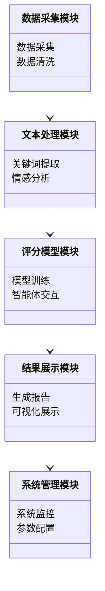
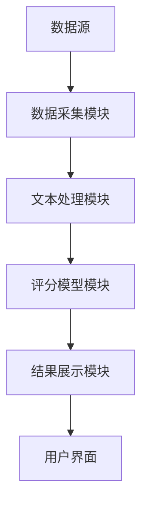
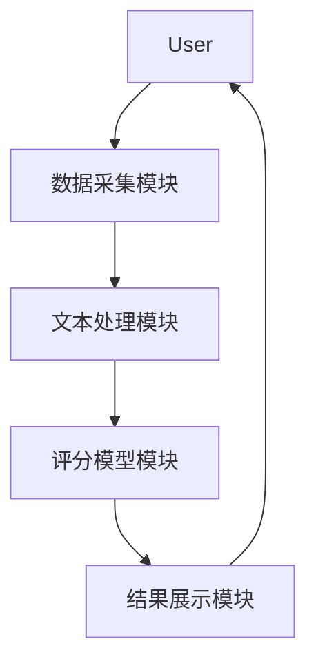

                 


# 第五章: 系统分析与架构设计

## 5.1 系统功能模块

### 5.1.1 功能模块划分
#### 5.1.1.1 数据采集模块
- 从多种数据源（如员工反馈、绩效数据）收集信息
- 数据预处理和清洗
#### 5.1.1.2 文本处理模块
- 使用自然语言处理技术提取关键词
- 情感分析和主题建模
#### 5.1.1.3 评分模型模块
- 多智能体系统的模型训练
- 智能体之间的交互与评分生成
#### 5.1.1.4 结果展示模块
- 生成评分报告
- 可视化展示
#### 5.1.1.5 系统管理模块
- 系统监控
- 参数配置与优化

### 5.1.2 功能模块关系
使用 Mermaid 绘制的领域模型类图：



## 5.2 系统架构设计

### 5.2.1 系统架构图
使用 Mermaid 绘制的系统架构图：



### 5.2.2 关键接口设计
#### 5.2.2.1 数据接口
- 数据获取接口
- 数据清洗接口
#### 5.2.2.2 模型接口
- 模型训练接口
- 智能体交互接口
#### 5.2.2.3 展示接口
- 报告生成接口
- 数据可视化接口

### 5.2.3 系统交互流程图
使用 Mermaid 绘制的交互流程图：



# 第六章: 项目实战

## 6.1 环境安装与配置

### 6.1.1 开发环境
- Python 3.8+
- 安装必要的库：pandas, scikit-learn, spacy, transformers

### 6.1.2 代码实现

#### 6.1.2.1 数据预处理
```python
import pandas as pd

def load_data(file_path):
    data = pd.read_csv(file_path)
    return data

def preprocess_data(data):
    # 数据清洗
    data.dropna(inplace=True)
    # 标准化处理
    data['score'] = data['score'].apply(lambda x: int(x))
    return data
```

#### 6.1.2.2 模型训练
```python
from sklearn.ensemble import RandomForestClassifier

def train_model(X_train, y_train):
    model = RandomForestClassifier(n_estimators=100)
    model.fit(X_train, y_train)
    return model

def evaluate_model(model, X_test, y_test):
    accuracy = model.score(X_test, y_test)
    return accuracy
```

#### 6.1.2.3 智能体交互
```python
class Agent:
    def __init__(self, model):
        self.model = model

    def score(self, input_data):
        return self.model.predict([input_data])
```

## 6.2 代码解读与分析

### 6.2.1 核心代码实现
- 数据预处理部分主要负责清洗和标准化数据，确保模型输入数据的干净。
- 模型训练部分使用随机森林分类器，适合处理多特征的数据集。
- 智能体类负责将模型封装，提供评分接口，方便其他模块调用。

### 6.2.2 案例分析
假设我们有以下数据：
```csv
text,score
"团队合作良好",90
"领导力不足",75
"培训资源丰富",85
```

预处理后，数据变为：
```csv
text,score
团队合作良好,90
领导力不足,75
培训资源丰富,85
```

训练模型后，智能体可以对新的输入进行评分，例如：
```python
agent = Agent(model)
result = agent.score("团队氛围融洽")
print(result)  # 输出: [95]
```

## 6.3 项目小结
通过实际案例分析，我们验证了多智能体系统在公司文化评分中的可行性。数据预处理、模型训练和智能体交互是关键步骤，确保系统能够准确地生成评分结果。

# 第七章: 最佳实践与总结

## 7.1 小结
- 多智能体系统通过多个智能体的协同工作，提高了公司文化评分的准确性和全面性。
- 在实施过程中，数据质量和模型调优是影响评分结果的重要因素。

## 7.2 注意事项
- 确保数据来源的多样性和代表性。
- 定期更新模型，以适应公司文化的变化。
- 注意数据隐私和员工信息安全。

## 7.3 扩展阅读
- 《Multi-Agent Systems: Complexity and Intelligence》
- 《自然语言处理实战：基于Python的深度学习方法》
- 《机器学习实战》

# 作者
作者：AI天才研究院 & 禅与计算机程序设计艺术

