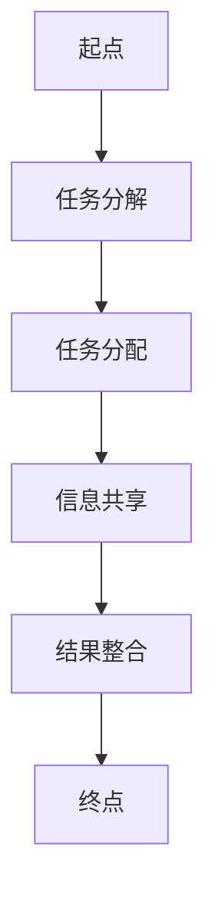
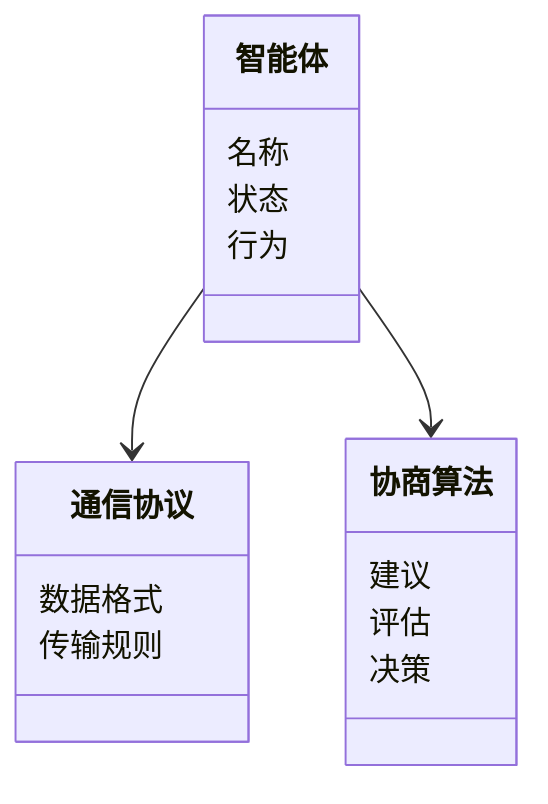
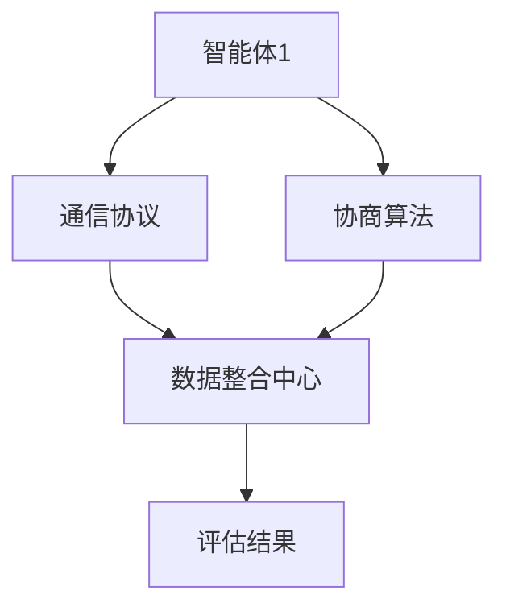
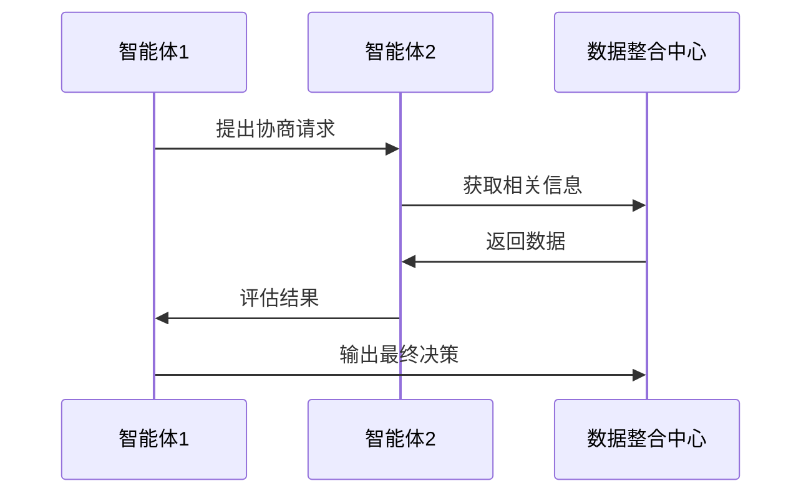

                 


# 利用多智能体系统进行全面的公司治理评估

> 关键词：多智能体系统, 公司治理评估, 分布式计算, 协商算法, 共识机制

> 摘要：本文深入探讨了如何利用多智能体系统进行全面的公司治理评估。通过分析多智能体系统的原理、算法、架构设计及实际案例，展示了其在公司治理中的广泛应用。文章内容涵盖问题背景、核心概念、算法原理、系统设计、项目实战及总结，旨在为读者提供全面的理论与实践指导。

---

## 第1章: 多智能体系统与公司治理评估的背景介绍

### 1.1 问题背景与描述
#### 1.1.1 当前公司治理评估的挑战
- 传统公司治理评估方法的局限性：
  - 数据来源单一，难以全面反映企业状况。
  - 评估过程集中化，缺乏灵活性和实时性。
  - 部门间协作不足，导致评估结果片面。

#### 1.1.2 多智能体系统的引入
- 多智能体系统的定义与特点：
  - 分布式计算：任务分解到多个智能体，协同完成。
  - 自主性：智能体独立决策，减少依赖性。
  - 协作性：通过通信与协商，达成一致目标。

#### 1.1.3 问题解决与边界
- 多智能体系统在公司治理中的应用范围：
  - 企业内部协作优化。
  - 风险评估与预警。
  - 股东价值最大化。

### 1.2 多智能体系统的概念结构
- 核心要素：
  - 智能体：独立决策的个体或部门。
  - 通信协议：智能体间信息交互的规则。
  - 协商机制：达成共识的算法。
  - 决策模型：基于信息的决策过程。

---

## 第2章: 多智能体系统的核心概念与联系

### 2.1 多智能体系统的原理
#### 2.1.1 分布式计算与协作
- 分布式计算的基本流程：
  1. 任务分解：将问题拆分为多个子任务。
  2. 任务分配：根据智能体的能力分配任务。
  3. 信息共享：通过通信协议共享中间结果。
  4. 结果整合：汇总各部分结果，形成最终输出。

#### 2.1.2 智能体间的通信与协商
- 通信协议的作用：
  - 数据格式标准化。
  - 信息传递的可靠性保障。
- 协商机制的核心要素：
  - 目标一致性：确保各方目标一致。
  - 冲突解决：协商过程中的矛盾处理。

#### 2.1.3 共识机制与决策过程
- 共识机制的数学模型：
  $$ \text{共识度} = \sum_{i=1}^{n} w_i \cdot x_i $$
  其中，\( w_i \) 是权重，\( x_i \) 是智能体的决策值。

### 2.2 多智能体系统的属性对比
#### 2.2.1 智能体的属性特征对比
| 智能体属性 | 特征描述 |
|------------|----------|
| 自主性     | 独立决策能力 |
| 反应性     | 对环境变化的快速响应 |
| 协作性     | 多方协同完成任务 |
| 学习能力   | 通过经验优化决策 |

#### 2.2.2 实体关系图（ER图）
```mermaid
erDiagram
    actor 智能体1 {
        string 名称
        string 状态
    }
    actor 智能体2 {
        string 名称
        string 状态
    }
    智能体1 -->|通信| 智能体2
    智能体1 -->|协商| 智能体2
```

---

## 第3章: 多智能体系统的算法原理

### 3.1 分布式计算与协商算法
#### 3.1.1 分布式计算流程


#### 3.1.2 协商算法的实现
- 基于协商的分布式算法：
  ```python
  def协商过程():
      while 未达成共识:
          智能体1 提出建议
          智能体2 评估建议
          if 评估结果为接受:
              所有智能体达成共识
              break
          else:
              重新协商
  ```

### 3.2 共识机制与决策算法
#### 3.2.1 共识机制的数学模型
$$ \text{共识度} = \sum_{i=1}^{n} w_i \cdot x_i $$
其中，\( w_i \) 是权重，\( x_i \) 是智能体的决策值。

#### 3.2.2 决策算法的实现
- 基于协商的决策算法：
  ```python
  def达成共识():
      while 未达成共识:
          智能体1 提出决策
          智能体2 评估决策
          if 所有智能体均接受:
              输出决策结果
              break
          else:
              重新协商
  ```

---

## 第4章: 系统分析与架构设计方案

### 4.1 问题场景介绍
- 公司治理评估的典型问题：
  - 数据分散在不同部门，难以整合。
  - 各部门目标不一致，影响协作效率。
  - 现有评估方法缺乏实时性和动态性。

### 4.2 系统功能设计
#### 4.2.1 领域模型


#### 4.2.2 系统架构设计


### 4.3 系统接口设计
- 核心接口：
  - `通信协议接口`：定义智能体间信息交互的规则。
  - `协商算法接口`：定义协商过程的步骤和方法。

### 4.4 系统交互设计


---

## 第5章: 项目实战

### 5.1 环境安装与配置
- 开发环境：
  - Python 3.8+
  - Mermaid图表工具
  - Git版本控制

### 5.2 核心代码实现
#### 5.2.1 通信协议实现
```python
class 通信协议:
    def __init__(self):
        self.数据格式 = "JSON"
        self.传输规则 = "TCP/IP"
```

#### 5.2.2 协商算法实现
```python
class 协商算法:
    def __init__(self):
        self.建议 = []
        self.评估结果 = {}

    def 提出建议(self, 建议内容):
        self.建议.append(建议内容)

    def 评估(self, 建议内容):
        self.评估结果[建议内容] = "接受"  # 可能为"接受"或"拒绝"
```

### 5.3 实际案例分析
- 案例：某公司部门间的协作优化。
  - 部门A：生产部门，目标是提高产量。
  - 部门B：销售部门，目标是增加销售额。
  - 通过多智能体系统的协商，部门间达成一致，优化生产与销售计划。

---

## 第6章: 总结与展望

### 6.1 全文总结
- 多智能体系统在公司治理评估中的优势：
  - 分布式计算提高效率。
  - 协商机制确保目标一致性。
  - 共识机制保障决策的科学性。

### 6.2 未来展望
- 智能体的自主性与学习能力的提升。
- 更多行业中的应用探索。
- 更高效的通信与协商算法研究。

### 6.3 最佳实践 Tips
- 在实际应用中，建议先进行小规模测试，再逐步推广。
- 确保智能体间的通信协议兼容性。
- 定期更新协商算法，以适应业务变化。

---

## 作者信息

作者：AI天才研究院/AI Genius Institute & 禅与计算机程序设计艺术 /Zen And The Art of Computer Programming

