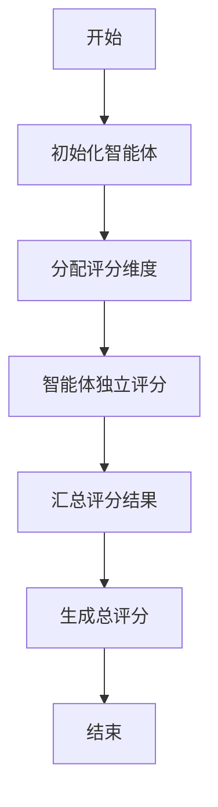
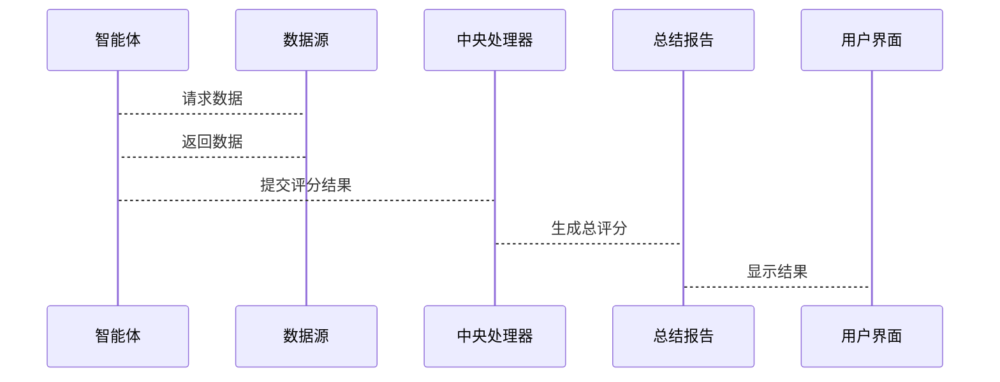

                 


# 利用多智能体系统进行全面的公司治理评分

> 关键词：多智能体系统、公司治理评分、协作机制、评分模型、系统架构

> 摘要：本文详细介绍了如何利用多智能体系统进行全面的公司治理评分。通过分析多智能体系统的核心概念、协作机制和评分模型，展示了其在公司治理中的应用优势。文章从背景介绍、核心概念、算法原理、系统架构、项目实战等多方面展开，提供了详细的理论支持和实践指导，为读者理解多智能体系统在公司治理中的作用提供了全面的视角。

---

## 第一部分：多智能体系统与公司治理评分的背景

### 第1章：背景介绍

#### 1.1 问题背景
- **公司治理的传统挑战**：公司治理涉及合规性、透明度、风险管理等多个方面，传统评分方法存在主观性强、难以量化的问题。
- **多智能体系统的优势**：通过多个智能体协作，能够更全面、精准地评估公司治理状况。

#### 1.2 问题描述
- **核心目标**：实现对公司治理的全面、动态评分。
- **应用场景**：适用于企业内部治理、监管机构评估等多种场景。
- **解决方法**：引入多智能体系统，利用其协作能力提升评分的准确性和全面性。

### 第2章：核心概念与关联

#### 2.1 多智能体系统的基本原理
- **定义**：由多个智能体组成的系统，每个智能体负责特定任务。
- **组成要素**：智能体、通信机制、协作规则。
- **协作机制**：通过通信和协调完成任务。

#### 2.2 公司治理评分模型
- **定义**：通过多维度指标评估公司治理状况。
- **核心要素**：合规性、透明度、风险管理、社会责任。
- **构建方法**：基于多智能体协作的动态评分模型。

#### 2.3 多智能体系统与公司治理评分的关联
- **协作性与独立性**：每个智能体负责一个评分维度，协同完成整体评分。
- **动态性与静态性**：评分结果动态更新，反映公司治理的实时状况。

---

## 第二部分：多智能体系统与公司治理评分的核心概念关系

### 第3章：核心概念对比与关系

#### 3.1 多智能体系统与传统评分系统的对比
| 对比维度 | 多智能体系统 | 传统评分系统 |
|----------|--------------|--------------|
| 协作性    | 高           | 低           |
| 灵活性    | 高           | 中           |
| 实时性    | 高           | 低           |

#### 3.2 核心概念的ER实体关系图
```mermaid
erDiagram
    class 智能体 {
        id : int
        功能 : string
        通信接口 : string
    }
    class 评分维度 {
        id : int
        名称 : string
        权重 : float
    }
    class 公司治理评分 {
        id : int
        评分结果 : float
        时间戳 : datetime
    }
    智能体 --> 评分维度 : 负责
    评分维度 --> 公司治理评分 : 组成
```

---

## 第三部分：多智能体系统与公司治理评分的算法原理

### 第4章：算法原理与实现

#### 4.1 算法原理
- **多智能体协作流程**：智能体分别负责不同的评分维度，通过通信接口交换数据，最终汇总生成整体评分。
- **评分计算公式**：
  $$ \text{总评分} = \sum_{i=1}^{n} (\text{权重}_i \times \text{评分}_i) $$

#### 4.2 算法流程图


#### 4.3 核心代码实现
```python
class Agent:
    def __init__(self, dimension):
        self.dimension = dimension
        self评分结果 = 0

def multi_agent_collaboration(dimensions):
    agents = [Agent(d) for d in dimensions]
    for agent in agents:
        agent评分结果 = evaluate(agent.dimension)
    total_score = sum(agent.评分结果 * weight[agent.dimension] for agent in agents)
    return total_score
```

---

## 第四部分：系统架构与设计

### 第5章：系统架构设计

#### 5.1 系统功能设计
- **领域模型**：定义公司治理评分的各个维度和智能体的职责。
- **系统架构**：模块化设计，包括数据采集、评分计算、结果展示。

#### 5.2 系统架构图


#### 5.3 系统交互流程


---

## 第五部分：项目实战与案例分析

### 第6章：项目实战

#### 6.1 环境安装
- **Python 3.8+**
- **依赖库**：numpy, matplotlib, scikit-learn

#### 6.2 核心代码实现
```python
def evaluate_dimension(dimension):
    # 示例：合规性评分计算
    return 0.85

dimensions = ['合规性', '透明度', '风险管理', '社会责任']
weights = {'合规性': 0.4, '透明度': 0.3, '风险管理': 0.2, '社会责任': 0.1}

total_score = sum(weights[d] * evaluate_dimension(d) for d in dimensions)
print(f"总评分: {total_score}")
```

#### 6.3 案例分析
- **案例背景**：某公司治理状况评估。
- **评分结果**：总评分85分，各维度评分分别为85、80、75、90。
- **分析**：透明度和风险管理需要进一步优化。

---

## 第六部分：最佳实践与总结

### 第7章：最佳实践与总结

#### 7.1 最佳实践
- **数据隐私保护**：确保评分数据的安全性。
- **模型可解释性**：提升评分结果的透明度。
- **系统可扩展性**：便于未来增加新的评分维度。

#### 7.2 小结
多智能体系统通过协作机制，显著提升了公司治理评分的全面性和准确性。本文详细介绍了其核心概念、算法原理和系统架构，并通过实际案例展示了其应用效果。

#### 7.3 注意事项
- 定期更新评分模型，以适应新的监管要求和企业环境。
- 确保智能体之间的通信效率，避免系统瓶颈。

#### 7.4 拓展阅读
- 推荐阅读《Multi-Agent Systems in Corporate Governance》和《Advanced Algorithm Design for Corporate Scoring》。

---

## 作者信息

作者：AI天才研究院/AI Genius Institute & 禅与计算机程序设计艺术 /Zen And The Art of Computer Programming

---

通过以上结构，您可以根据实际内容填充每一部分的具体内容，确保逻辑清晰、内容详实。

