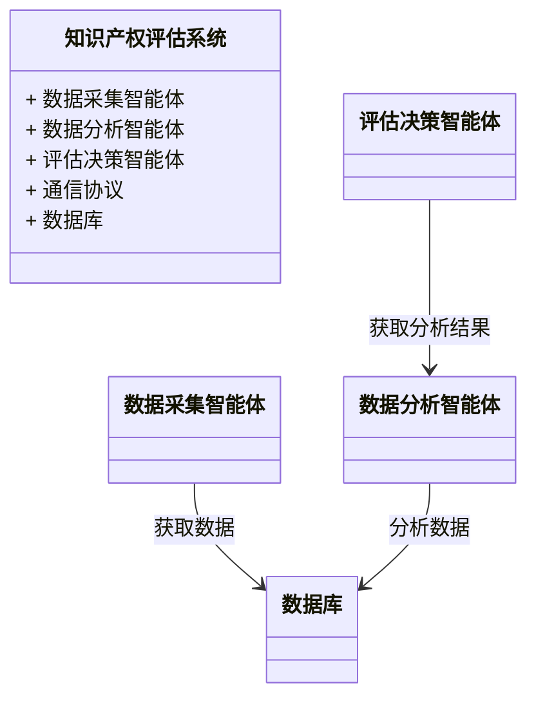

                 


# 利用多智能体系统进行全面的公司知识产权价值评估

## 关键词：多智能体系统，知识产权评估，分布式计算，协商算法，系统架构

## 摘要：本篇文章探讨了利用多智能体系统进行公司知识产权价值评估的方法，分析了传统评估方法的局限性，详细讲解了多智能体系统的原理与优势，通过具体的算法实现和系统架构设计，展示了如何构建一个高效、准确的知识产权评估系统。文章内容包括背景介绍、核心概念、算法原理、系统设计、项目实战等部分，帮助读者全面理解多智能体系统在知识产权评估中的应用。

---

## 第1章：知识产权价值评估的背景与挑战

### 1.1 知识产权的重要性

知识产权（Intellectual Property，简称IP）是指人们对智力劳动成果所享有的权利，主要包括专利权、商标权、著作权、商业秘密等。知识产权在现代企业中扮演着至关重要的角色，是企业的核心竞争力之一。知识产权的价值不仅体现在法律保护上，更体现在其对经济收益的贡献。例如，一项创新的专利技术可以为企业带来巨大的市场优势和利润。

### 1.2 传统知识产权评估方法的局限性

传统的知识产权评估方法主要依赖于人工审核和经验判断，这种方法存在以下问题：

- **主观性过强**：评估结果依赖评估人员的经验和主观判断，容易出现偏差。
- **效率低下**：面对海量的知识产权数据，人工评估效率难以满足需求。
- **信息孤岛**：不同部门或机构的知识产权信息分散，难以形成统一的评估标准。
- **动态性不足**：知识产权的价值会随着时间、市场环境和技术进步而变化，静态评估难以捕捉这些动态因素。

### 1.3 多智能体系统的优势

多智能体系统（Multi-Agent System，简称MAS）是一种分布式人工智能系统，由多个具有自主性、反应性、协作性和学习能力的智能体组成。每个智能体负责特定的任务，通过通信和协作完成复杂的整体目标。多智能体系统在知识产权评估中的优势包括：

- **高效性**：多个智能体可以同时处理不同类型的信息，提高评估效率。
- **准确性**：智能体通过协作和信息共享，能够更全面地分析知识产权的价值。
- **动态适应性**：智能体可以根据市场变化实时调整评估策略，提高评估的动态性。
- **分布式计算**：通过分布式计算，多智能体系统能够处理大规模的数据，提升评估的广度和深度。

---

## 第2章：多智能体系统的原理与特性

### 2.1 多智能体系统的核心概念

#### 2.1.1 智能体的定义与分类

智能体（Agent）是指能够感知环境并采取行动以实现目标的实体。智能体可以分为以下几类：

- **简单反射型智能体**：基于当前感知直接行动，不依赖历史信息。
- **基于模型的反射型智能体**：利用内部模型和历史信息进行决策。
- **目标驱动型智能体**：根据目标选择行动。
- **效用驱动型智能体**：通过最大化效用函数来决策。

#### 2.1.2 智能体的协作机制

多智能体系统的协作机制是实现高效评估的关键。常见的协作机制包括：

- **协商与协调**：智能体通过协商确定各自的角色和任务。
- **任务分配**：根据智能体的能力和当前任务需求，动态分配任务。
- **信息共享**：智能体之间共享信息，避免重复劳动和信息孤岛。

### 2.2 多智能体系统的通信与协调

#### 2.2.1 通信协议的作用

通信协议是智能体之间进行信息交换的规则。有效的通信协议能够确保智能体之间的信息传递准确、及时。例如，智能体A需要向智能体B发送专利信息，可以通过HTTP协议或消息队列（如Kafka）进行通信。

#### 2.2.2 协调算法的实现

协调算法是多智能体系统中实现协作的重要工具。常见的协调算法包括：

- **基于市场的协调**：智能体通过市场机制进行资源分配和任务协调。
- **基于承诺的协调**：智能体通过承诺特定的行为来实现协作。
- **基于规则的协调**：通过预定义的规则进行任务分配和协作。

### 2.3 多智能体系统与知识产权评估的结合

#### 2.3.1 知识产权评估中的多智能体架构

在知识产权评估中，多智能体系统可以分为以下几个部分：

- **数据采集智能体**：负责采集专利、商标等知识产权数据。
- **数据分析智能体**：对采集的数据进行清洗、分析和建模。
- **评估决策智能体**：根据分析结果生成评估报告。

#### 2.3.2 智能体的角色与功能

每个智能体都有特定的角色和功能：

- 数据采集智能体：负责从数据库或互联网获取知识产权数据。
- 数据分析智能体：利用机器学习算法对数据进行分析，识别关键特征。
- 评估决策智能体：根据分析结果，评估知识产权的价值，并生成报告。

---

## 第3章：多智能体系统的算法原理

### 3.1 分布式计算与协商算法

#### 3.1.1 分布式计算的基本原理

分布式计算是多智能体系统的核心技术之一。通过分布式计算，多个智能体可以同时处理不同类型的数据，提高计算效率。例如，在评估专利价值时，可以将专利数据分布到多个智能体中进行分析。

#### 3.1.2 协商算法的实现步骤

协商算法是多智能体系统中实现任务分配的重要工具。以下是协商算法的实现步骤：

1. **初始化**：每个智能体根据自身能力和当前任务需求，提出自己的协商请求。
2. **协商阶段**：智能体之间通过通信协议进行协商，确定各自的任务和角色。
3. **任务分配**：根据协商结果，智能体被分配到不同的任务中。
4. **执行任务**：智能体根据分配的任务执行相应的操作。
5. **反馈与调整**：任务完成后，智能体将反馈信息传递给其他智能体，以便后续任务的调整和优化。

#### 3.2 通信协议与数据交换

通信协议是智能体之间进行信息交换的规则。以下是一个简单的通信协议示例：

```python
class Message:
    def __init__(self, sender, receiver, content):
        self.sender = sender
        self.receiver = receiver
        self.content = content

class Agent:
    def __init__(self, name):
        self.name = name
        self.messages = []

    def send_message(self, receiver, content):
        msg = Message(self.name, receiver, content)
        self.messages.append(msg)

    def receive_message(self):
        received = []
        for msg in self.messages:
            if msg.receiver == self.name:
                received.append(msg)
        return received
```

通过上述代码，智能体可以实现信息的发送和接收。例如，智能体A可以向智能体B发送一条消息，内容为“专利数据”。

---

## 第4章：知识产权评估系统的架构设计

### 4.1 系统功能设计

#### 4.1.1 领域模型设计（Mermaid类图）

以下是知识产权评估系统的领域模型设计：



#### 4.2 系统架构设计（Mermaid架构图）

以下是系统的架构设计：


---

## 第5章：项目实战

### 5.1 环境安装

#### 5.1.1 安装Python和相关库

```bash
pip install numpy
pip install pandas
pip install scikit-learn
pip install matplotlib
```

### 5.2 系统核心实现源代码

#### 5.2.1 数据采集智能体

```python
class DataCollector:
    def __init__(self):
        self.patents = []

    def collect_patents(self):
        # 模拟从数据库获取专利数据
        import sqlite3
        conn = sqlite3.connect('patents.db')
        cursor = conn.cursor()
        cursor.execute('SELECT * FROM patents')
        rows = cursor.fetchall()
        for row in rows:
            self.patents.append(row)
        conn.close()

        return self.patents
```

#### 5.2.2 数据分析智能体

```python
from sklearn.feature_extraction.text import TfidfVectorizer
from sklearn.cluster import KMeans

class DataAnalyzer:
    def __init__(self, patents):
        self.patents = patents

    def analyze(self):
        # 提取关键词
        vectorizer = TfidfVectorizer()
        X = vectorizer.fit_transform([patent.description for patent in self.patents])
        # 聚类分析
        num_clusters = 5
        kmeans = KMeans(n_clusters=num_clusters)
        kmeans.fit(X)
        clusters = kmeans.labels_
        return clusters
```

#### 5.2.3 评估决策智能体

```python
class Evaluator:
    def __init__(self, clusters):
        self.clusters = clusters

    def evaluate(self):
        # 计算每个簇的价值
        import numpy as np
        values = []
        for cluster in self.clusters:
            cluster_patents = [patent for patent, c in zip(patents, cluster) if c == cluster]
            # 计算平均价值
            avg_value = sum(patent.value for patent in cluster_patents) / len(cluster_patents)
            values.append(avg_value)
        return values
```

### 5.3 案例分析与解读

通过上述代码，我们可以实现一个简单的知识产权评估系统。数据采集智能体从数据库获取专利数据，数据分析智能体利用TF-IDF和K-means算法对专利进行聚类分析，评估决策智能体根据聚类结果计算每个簇的价值。最后，评估决策智能体生成评估报告，并发送给客户端。

---

## 第6章：小结

### 6.1 最佳实践 tips

- 在实际应用中，可以根据具体需求扩展多智能体系统的功能。
- 选择合适的通信协议和算法，确保系统的高效性和准确性。
- 定期更新系统，以适应市场和技术的变化。

### 6.2 小结

本文详细讲解了利用多智能体系统进行公司知识产权价值评估的方法，包括背景介绍、核心概念、算法原理、系统架构设计和项目实战。通过多智能体系统的应用，可以显著提高知识产权评估的效率和准确性。

### 6.3 注意事项

- 确保系统的安全性和稳定性，防止数据泄露和系统崩溃。
- 定期对系统进行维护和优化，以提升性能和用户体验。

### 6.4 拓展阅读

- 推荐阅读《Multi-Agent Systems: Complexity and Security》（剑桥大学出版社）。
- 关注多智能体系统在其他领域的应用，如金融、医疗等。

---

作者：AI天才研究院/AI Genius Institute & 禅与计算机程序设计艺术 /Zen And The Art of Computer Programming

