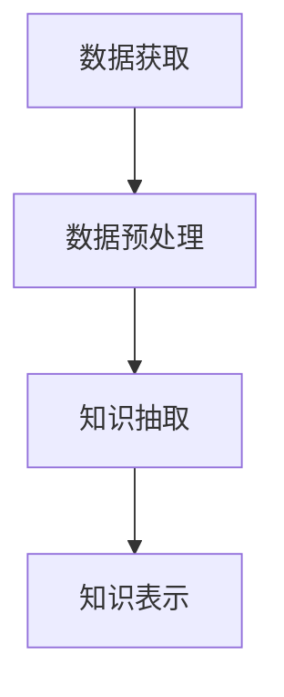
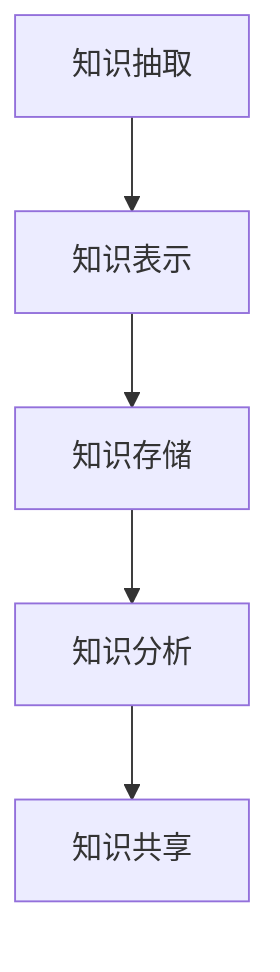
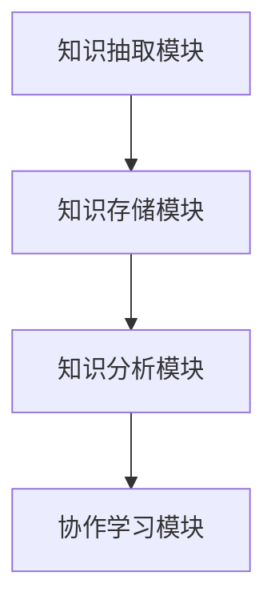
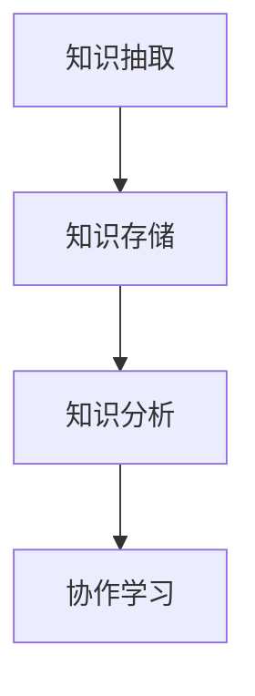
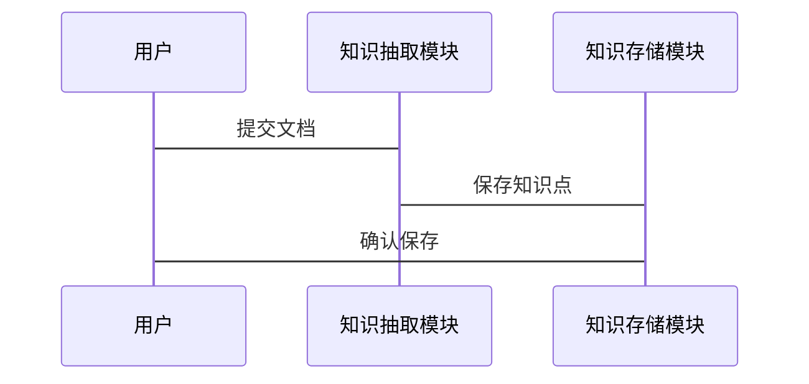

                 


# 利用多智能体系统进行全面的公司知识管理能力分析

## 关键词：多智能体系统，知识管理，协同学习，算法原理，系统架构

## 摘要：  
在当今快速发展的商业环境中，知识管理已成为公司竞争力的重要组成部分。本文将深入探讨如何利用多智能体系统来全面分析和提升公司的知识管理能力。通过结合多智能体系统的核心概念、算法原理和系统架构，本文将详细分析如何实现高效的知识抽取、存储、分析和协同学习，为企业提供智能化的知识管理解决方案。

---

# 第1章: 多智能体系统与知识管理的背景介绍

## 1.1 多智能体系统概述

### 1.1.1 多智能体系统的定义与特点
多智能体系统（Multi-Agent System, MAS）是由多个智能体（Agent）组成的系统，这些智能体能够自主决策、协作完成任务。其特点包括：
- **自主性**：智能体能够自主决策。
- **反应性**：能够实时感知环境并做出反应。
- **协作性**：多个智能体可以协作完成复杂任务。
- **分布性**：系统中多个智能体分布在网络中。

### 1.1.2 多智能体系统的核心要素
- **智能体**：具有感知和行动能力的实体。
- **环境**：智能体所处的物理或数字环境。
- **交互**：智能体之间的通信与协作。
- **任务目标**：智能体需要完成的具体任务。

### 1.1.3 多智能体系统与知识管理的关系
知识管理需要将分散在组织中的显性知识和隐性知识进行整合、存储和应用。多智能体系统能够通过分布式协作的方式，高效地处理和管理这些知识。

## 1.2 公司知识管理能力分析的背景与问题

### 1.2.1 知识管理在公司中的重要性
知识管理是企业核心竞争力的重要组成部分。通过有效管理知识，企业可以提高决策效率、优化流程、降低风险。

### 1.2.2 当前知识管理中的主要问题
- **信息孤岛**：知识分散在各部门，难以共享。
- **知识更新不及时**：知识的更新和传播效率低。
- **知识流失**：员工离职可能导致知识流失。
- **知识利用不足**：知识未被充分应用到实际业务中。

### 1.2.3 多智能体系统在知识管理中的应用潜力
多智能体系统可以通过分布式协作、实时通信和自主学习，有效解决知识管理中的问题，提升知识管理的效率和效果。

---

# 第2章: 多智能体系统与知识管理的核心概念与联系

## 2.1 多智能体系统的概念属性对比表

| **属性**       | **多智能体系统**              | **知识管理**                  |
|-----------------|-----------------------------|-------------------------------|
| **核心目标**    | 协作完成复杂任务             | 整合和利用组织知识             |
| **主要特点**    | 分布式、自主性、协作性       | 集成性、共享性、动态性         |
| **关键能力**    | 知识表示、推理、协作         | 知识存储、检索、分析           |
| **应用场景**    | 智能交通、分布式计算         | 企业信息管理、知识共享         |

## 2.2 知识管理的实体关系图（ER图）

```mermaid
erDiagram
    actor 公司员工 {
        string 员工ID
        string 知识点
        string 知识内容
    }
    actor 知识库 {
        string 知识点
        string 知识内容
        string 更新时间
    }
    company 知识管理平台 {
        integer 项目ID
        string 项目名称
        string 项目描述
    }
    公司员工 --> 知识库 : 提交知识
    知识库 --> 知识管理平台 : 更新知识库
```

---

# 第3章: 多智能体系统知识管理的算法原理

## 3.1 知识抽取与表示算法

### 3.1.1 知识抽取流程
1. **数据获取**：从公司文档、会议记录等来源获取数据。
2. **预处理**：清洗数据，提取关键词和知识点。
3. **知识表示**：将知识点转化为结构化的数据格式。

### 3.1.2 知识表示方法
- **知识图谱**：通过图结构表示知识点及其关系。
- **向量表示**：使用向量空间模型（如Word2Vec）表示知识点。

### 3.1.3 算法实现步骤


### 3.1.4 知识抽取代码示例
```python
def extract Knowledge(documents):
    # 从文档中提取知识点
    knowledge = []
    for doc in documents:
        # 使用自然语言处理技术提取关键词
        keywords = extract_keywords(doc)
        knowledge.extend(keywords)
    return knowledge
```

## 3.2 协作学习算法

### 3.2.1 协作学习机制
多智能体系统通过协作学习算法实现知识的共享和更新。常用算法包括：
- **分布式协同过滤**：基于相似性推荐相关知识。
- **分布式一致性算法**：确保知识库的一致性。

### 3.2.2 算法实现流程


### 3.2.3 算法数学模型
协同过滤算法：
$$ sim(i,j) = \frac{\sum_{k=1}^{n} x_{ik} x_{jk}}{\sqrt{\sum_{k=1}^{n} x_{ik}^2} \cdot \sqrt{\sum_{k=1}^{n} x_{jk}^2}} $$
其中，$sim(i,j)$ 表示知识点 $i$ 和知识点 $j$ 的相似性。

---

# 第4章: 系统分析与架构设计方案

## 4.1 项目背景与目标

### 4.1.1 项目背景介绍
随着企业规模的扩大，知识管理的复杂性增加，亟需一种高效的解决方案。

### 4.1.2 项目目标设定
- 实现公司知识的自动化抽取、存储和分析。
- 提供知识协同学习的平台。

### 4.1.3 项目范围界定
- 知识抽取范围：公司文档、会议记录。
- 知识存储范围：结构化知识库。
- 知识分析范围：知识点关联分析。

## 4.2 系统功能设计

### 4.2.1 知识抽取模块
- 功能：从文档中提取知识点。
- 输入：文档文本。
- 输出：结构化知识点。

### 4.2.2 知识存储模块
- 功能：存储知识点及其关联信息。
- 数据结构：知识图谱。

### 4.2.3 知识分析模块
- 功能：分析知识点之间的关联。
- 输出：知识点关联矩阵。

### 4.2.4 协作学习模块
- 功能：推荐相关知识点。
- 输出：知识点推荐列表。

### 4.2.5 系统架构设计


## 4.3 系统架构设计

### 4.3.1 分层架构设计
- **数据层**：存储知识点。
- **服务层**：提供知识抽取、存储、分析服务。
- **应用层**：用户界面，展示知识。

### 4.3.2 模块交互流程


### 4.3.3 架构优化建议
- 使用分布式存储优化性能。
- 采用事件驱动机制提高实时性。

## 4.4 系统接口设计

### 4.4.1 接口设计
- **知识抽取接口**：`/api/extract`
- **知识存储接口**：`/api/store`
- **知识分析接口**：`/api/analyze`

### 4.4.2 交互流程


---

# 第5章: 项目实战与实现

## 5.1 环境配置与安装

### 5.1.1 开发环境搭建
- 操作系统：Linux/Windows/MacOS
- 开发工具：PyCharm/VS Code

### 5.1.2 第三方库安装
- 使用pip安装所需库：
  ```bash
  pip install numpy
  pip install networkx
  pip install spacy
  ```

## 5.2 核心代码实现

### 5.2.1 知识抽取代码
```python
import spacy

def extract Keywords(doc):
    nlp = spacy.load("en_core_web_sm")
    doc = nlp(doc)
    keywords = []
    for token in doc:
        if token.pos_ in ["NOUN", "PROPN"]:
            keywords.append(token.text)
    return keywords
```

### 5.2.2 知识存储代码
```python
import networkx as nx

def save KnowledgeGraph(edges):
    G = nx.Graph()
    G.add_edges_from(edges)
    nx.write_graphml(G, "knowledge_graph.graphml")
```

### 5.2.3 知识分析代码
```python
import networkx as nx

def analyze KnowledgeGraph():
    G = nx.read_graphml("knowledge_graph.graphml")
    # 计算节点度数
    degrees = nx.degree(G)
    return degrees
```

### 5.2.4 协作学习代码
```python
def collaborative Learning(knowledge_graph):
    # 使用分布式一致性算法更新知识图谱
    pass
```

## 5.3 项目小结
通过实现知识抽取、存储、分析和协作学习模块，我们构建了一个高效的公司知识管理系统。该系统能够实时更新知识库，提供知识点推荐服务，显著提升公司知识管理能力。

---

# 第6章: 最佳实践与未来展望

## 6.1 小结
多智能体系统在知识管理中的应用能够显著提升知识管理的效率和效果。通过分布式协作和实时通信，企业可以更好地整合和利用知识资源。

## 6.2 注意事项
- 确保知识抽取的准确性。
- 保护知识隐私和安全。
- 定期更新知识库。

## 6.3 未来趋势
- **智能化**：结合AI技术进一步提升知识管理能力。
- **分布式计算**：利用区块链等技术实现更安全的知识管理。
- **实时性**：提高知识管理的实时性和响应速度。

## 6.4 扩展阅读
- 《Multi-Agent Systems》
- 《Knowledge Management Handbook》
- 《Distributed Computing》

---

# 作者：AI天才研究院 & 禅与计算机程序设计艺术

通过结合多智能体系统的核心概念、算法原理和系统架构，我们深入分析了公司知识管理能力的提升方法。希望本文能够为读者提供有价值的参考，帮助企业更好地利用多智能体系统实现知识管理的智能化和高效化。

